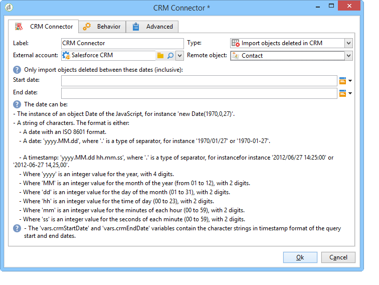

# Sincronización de datos entre Campaign y CRM {#data-synchronization}

La sincronización de datos entre Adobe Campaign y CRM se lleva a cabo mediante una actividad de flujo de trabajo dedicada: [conector de CRM](../../workflow/using/crm-connector.md).

Por ejemplo, para importar los datos de Microsoft Dynamics en Adobe Campaign, cree el siguiente tipo de flujo de trabajo:

Este flujo de trabajo importa los contactos a través de Microsoft Dynamics, los sincroniza con los datos de Adobe Campaign existentes, elimina los contactos duplicados y actualiza la base de datos de Adobe Campaign.

Debe configurarse la actividad **[!UICONTROL CRM Connector]** para sincronizar los datos.

Con esta actividad puede:

* Importar desde CRM: [Más información](#importing-from-the-crm)
* Exportar a CRM: [Más información](#exporting-to-the-crm)
* Importar objetos eliminados en CRM: [Más información](#importing-objects-deleted-in-the-crm)
* Eliminar objetos en CRM: [Más información](#deleting-objects-in-the-crm)

Seleccione la cuenta externa que coincide con el CRM con el que desea configurar la sincronización y, a continuación, seleccione el objeto que se va a sincronizar: cuentas, oportunidades, posibles clientes, contactos, etc.

La configuración de esta actividad depende del proceso que se realice. A continuación se describen varias configuraciones.

## Importación desde CRM {#importing-from-the-crm}

Para importar datos del CRM a Adobe Campaign, debe crear el siguiente tipo de flujo de trabajo:

Para una actividad de importación, los pasos de configuración de la actividad **[!UICONTROL CRM Connector]** son:

1. Seleccione una operación **[!UICONTROL Import from the CRM]**.
1. Ir a la lista desplegable **[!UICONTROL Remote object]** y seleccionar el objeto afectado en el proceso. Este objeto coincide con una de las tablas creadas en Adobe Campaign durante la configuración del conector.
1. Vaya a la sección **[!UICONTROL Remote fields]** e introduzca los campos que desea importar.

   Para agregar un campo, haga clic en el botón **[!UICONTROL Add]** en la barra de herramientas y, a continuación, haga clic en el icono **[!UICONTROL Edit expression]**.

   

   Si es necesario, modifique el formato de los datos mediante la lista desplegable de las columnas de **[!UICONTROL Conversion]**. Los tipos de conversión posibles se encuentran detallados en [Formato de datos](#data-format).

   >[!IMPORTANT]
   >
   >El identificador del registro en CRM es obligatorio para enlazar objetos en CRM y en Adobe Campaign. Se añade automáticamente cuando se aprueba el cuadro.
   >
   >La fecha de modificación del servidor CRM también es obligatoria para las importaciones de datos incrementales.

1. También puede filtrar los datos para importarlos según sus necesidades. Para ello, haga clic en el vínculo **[!UICONTROL Edit the filter...]**.

   En el siguiente ejemplo, Adobe Campaign sólo importa contactos para los que se haya registrado alguna actividad desde el 1 de noviembre de 2012.

   

   >[!IMPORTANT]
   >
   >Las limitaciones vinculadas a los modos de filtrado de datos se describen en [Datos de filtro](#filtering-data).

1. La opción **[!UICONTROL Use automatic index...]** ... permite administrar automáticamente la sincronización de objetos incrementales entre CRM y Adobe Campaign, en función de la fecha y la última modificación.

   Para obtener más información, consulte [Administración variable](#variable-management).

### Administración de variables {#variable-management}

La activación de la opción **[!UICONTROL Automatic index]** solo permite recopilar objetos modificados desde la última importación.

La fecha de la última sincronización se almacena de forma predeterminada en una opción especificada en la ventana de configuración, por defecto: **LASTIMPORT_&lt;%=instance.internalName%>_&lt;%=activityName%>**.

>[!NOTE]
>
>Esta nota solo se aplica a la actividad genérica **[!UICONTROL CRM Connector]**. Para otras actividades CRM, el proceso es automático.
>
>Esta opción debe crearse manualmente y rellenarse en **[!UICONTROL Administration]** > **[!UICONTROL Platform]** > **[!UICONTROL Options]**. Debe ser una opción de texto y su valor debe coincidir con el siguiente formato: **aaaa/MM/dd hh:mm:ss**.
> 
>Debe actualizar manualmente esta opción para una importación posterior.

Puede especificar el campo remoto CRM que desea tener en cuenta para identificar los cambios más recientes.

De forma predeterminada, se utilizan los campos siguientes (en el orden especificado):

* Para Microsoft Dynamics: **modificado**,
* Para Salesforce.com: **LastModifiedDate**, **SystemModstamp**.

La activación de la opción **[!UICONTROL Automatic index]** genera tres variables que se pueden utilizar en el flujo de trabajo de sincronización a través de una actividad de tipo **[!UICONTROL JavaScript code]**. Estas actividades son:

* **vars.crmOptionName**: representa el nombre de la opción que contiene la última fecha de importación.
* **vars.crmStartImport**: representa la fecha de inicio (incluida) de la última recuperación de datos.
* **vars.crmEndDate**: representa la fecha de finalización (excluida) de la última recuperación de datos.

   >[!NOTE]
   >
   >Estas fechas se muestran en el siguiente formato: **aaaa/MM/dd hh:mm:ss**.

### Filtrado de datos {#filtering-data}

Para garantizar una operación eficaz con los distintos CRM, es necesario crear filtros con las siguientes reglas:

* Cada nivel de filtrado solo puede utilizar un tipo de operador.
* No se admite el operador AND NOT.
* Las comparaciones solo pueden tener como resultado valores nulos (“está vacío”/“no está vacío”) o números. Esto significa que el valor (columna derecha) se evalúa y el resultado de esta evaluación debe ser un número. Por lo tanto, no se admiten comparaciones de tipo JOIN.
* El valor contenido en la columna derecha se evalúa en JavaScript.
* No se admiten comparaciones JOIN.
* La expresión de la columna de la izquierda debe ser un campo. No puede ser una combinación de varias expresiones, un número, etc.

Por ejemplo, las siguientes condiciones de filtrado NO serán válidas para una importación de CRM, ya que el operador OR se coloca en el mismo nivel que los operadores AND:

* El operador OR se coloca en el mismo nivel que los operadores AND
* Las comparaciones se llevan a cabo en cadenas de texto

### Ordenar por {#order-by}

En Microsoft Dynamics y Salesforce.com, puede ordenar los campos remotos para que se importen en orden ascendente o descendente.

Para ello, haga clic en el vínculo **[!UICONTROL Order by]** y añada las columnas a la lista.

El orden de las columnas de la lista es el orden de clasificación:

### Identificación de registro {#record-identification}

En lugar de importar elementos incluidos (y posiblemente filtrados) en CRM, puede utilizar una población calculada con anterioridad en el flujo de trabajo.

Para ello, seleccione la opción **[!UICONTROL Use the population calculated upstream]** y especifique el campo que contiene el identificador remoto.

A continuación, seleccione los campos de la población entrante que desea importar, como se muestra a continuación:

## Exportación a CRM {#exporting-to-the-crm}

Exportar los datos de Adobe Campaign en CRM permite copiar todo el contenido en una base de datos de CRM.

Para exportar datos a CRM, debe crear el siguiente tipo de flujo de trabajo:

Para una exportación, aplique la configuración siguiente en la actividad **[!UICONTROL CRM Connector]**:

1. Seleccione una operación **[!UICONTROL Export to CRM]**.
1. Ir a la lista desplegable **[!UICONTROL Remote object]** y seleccionar el objeto afectado en el proceso. Este objeto coincide con una de las tablas creadas en Adobe Campaign durante la configuración del conector.

   >[!IMPORTANT]
   >
   >La función de exportación de la actividad **[!UICONTROL CRM Connector]** puede insertar o actualizar campos en el lado del CRM. Para activar las actualizaciones de campo en el CRM, debe especificar la clave principal de la tabla remota. Si falta la clave, se insertan los datos (en lugar de actualizarse).

1. En la sección **[!UICONTROL Mapping]**, especifique los campos que se exportan y su asignación en CRM.

   

   Para agregar un campo, haga clic en el botón **[!UICONTROL Add]** en la barra de herramientas y, a continuación, haga clic en el icono **[!UICONTROL Edit expression]**.

   >[!NOTE]
   >
   >En un campo determinado, si no hay ninguna coincidencia definida en el lado del CRM, los valores no se pueden actualizar: se insertan directamente en el CRM.

   Si es necesario, modifique el formato de los datos mediante la lista desplegable de las columnas de **[!UICONTROL Conversion]**. Los tipos de conversión posibles se encuentran detallados en [Formato de datos](#data-format).

   >[!NOTE]
   >
   >La lista de registros que se van a exportar y el resultado de la exportación se guardan en un archivo temporal que permanece accesible hasta que el flujo de trabajo termina o se reinicia. Esto le permite volver a iniciar el proceso en caso de errores sin correr el riesgo de exportar el mismo registro varias veces o perder datos.

## Configuraciones adicionales {#additional-configurations}

### Formato de datos {#data-format}

Puede convertir el formato de los datos sobre la marcha al importarlos desde o hacia CRM.

Para ello, seleccione la conversión que se aplica en la columna correspondiente.

El modo **[!UICONTROL Default]** aplica la conversión automática de datos, que en la mayoría de los casos es igual a una copia o pegado de los datos. Sin embargo, se aplica la administración de zona horaria.

Otras conversiones posibles son:

* **[!UICONTROL Date only]**: este modo elimina los campos de tipo Fecha + Hora.
* **[!UICONTROL Without time offset]**: este modo cancela la administración de zona horaria aplicada en el modo predeterminado.
* **[!UICONTROL Copy/Paste]**: este modo utiliza datos sin procesar como cadenas (sin conversión).

### Error de procesamiento {#error-processing}

Dentro del marco de las importaciones o exportaciones de datos, puede aplicar un proceso específico a errores y rechazos. Para ello, en la pestaña **[!UICONTROL Behavior]** , seleccione la opción **[!UICONTROL Process rejects]** y **[!UICONTROL Process errors]**.

Estas opciones colocan las transiciones de salida coincidentes.

A continuación, coloque las actividades relevantes para los procesos que desee aplicar.

Por ejemplo, para procesar errores puede añadir un cuadro de espera y planificar los reintentos.

Los rechazos se recopilan junto con el código de error y el mensaje relacionado, lo que significa que puede configurar el seguimiento de rechazos para optimizar el proceso de sincronización.

>[!NOTE]
>
>Incluso cuando la opción **[!UICONTROL Process rejects]** no está activada, se genera una advertencia para cada columna rechazada con un código de error y un mensaje.

La transición de salida **[!UICONTROL Reject]** permite acceder al esquema de salida que contiene las columnas específicas de los mensajes de error y los códigos. Para Salesforce.com, esta columna es **errorSymbol** (símbolo de error, distinto del código de error), **errorMessage** (descripción del contexto del error).

## Importación de objetos eliminados en CRM {#importing-objects-deleted-in-the-crm}

Para habilitar la configuración de un proceso de sincronización de datos extenso, puede importar los objetos eliminados en el CRM a Adobe Campaign.

Para ello, siga los siguientes pasos:

1. Seleccione una operación **[!UICONTROL Import objects deleted in the CRM]**.
1. Ir a la lista desplegable **[!UICONTROL Remote object]** y seleccionar el objeto afectado en el proceso. Este objeto coincide con una de las tablas creadas en Adobe Campaign durante la configuración del conector.
1. Especifique el período de eliminación a tener en cuenta en los campos **[!UICONTROL Start date]** y **[!UICONTROL End date]**. Estas fechas se incluyen en el periodo.

   

   >[!IMPORTANT]
   >
   >El periodo de eliminación de elementos debe coincidir con las limitaciones específicas del CRM. Esto significa que para Salesforce.com, por ejemplo, los elementos eliminados hace más de 30 días no se pueden recuperar.

## Eliminación de objetos del CRM {#deleting-objects-in-the-crm}

Para eliminar objetos del CRM, debe especificar la clave primaria de los elementos remotos que desea eliminar.

La pestaña **[!UICONTROL Behavior]** permite activar el procesamiento de los rechazos. Esta opción genera una segunda transición de salida para la actividad **[!UICONTROL CRM connector]**. Para obtener más información, consulte [Error de procesamiento](#error-processing).

>[!NOTE]
>
>Incluso cuando la opción **[!UICONTROL Process rejects]** está desactivada, se genera una advertencia para cada columna rechazada.

