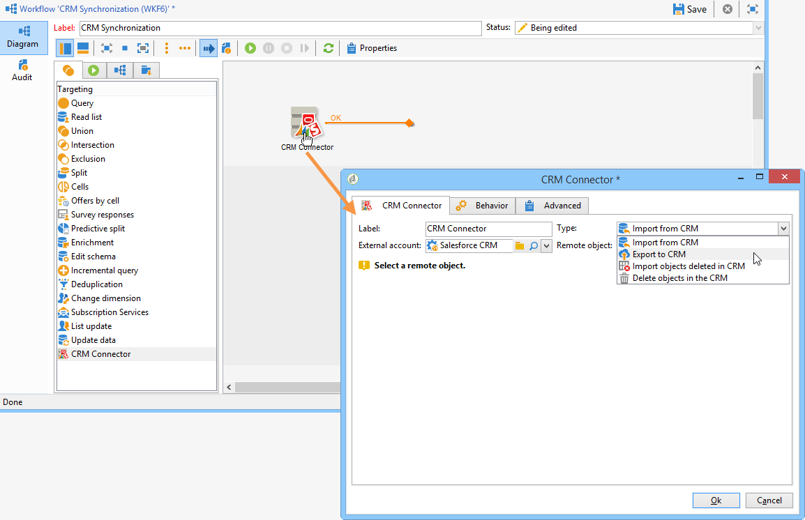

# Conectar Campaign y Salesforce.com{#connect-to-sfdc}

En esta página, aprenderá a conectar Campaign Classic a **Salesforce**.

La sincronización de datos se realiza mediante una actividad de flujo de trabajo dedicada. [Más información](../../platform/using/crm-data-sync.md).

La cuenta externa le permite importar y exportar datos de Salesforce a Adobe Campaign.
Para configurar el conector CRM para Salesforce, siga los pasos a continuación:

1. Cree una nueva cuenta externa a través del nodo **[!UICONTROL Administration > Platform > External accounts]** del árbol de Adobe Campaign.
1. Seleccione **[!UICONTROL Salesforce.com]**.
1. Introduzca la configuración para activar la conexión.

   

   Para configurar la cuenta externa de Salesforce CRM para que funcione con Adobe Campaign, proporcione los siguientes detalles:

   * **[!UICONTROL Account]**
Cuenta utilizada para iniciar sesión en Salesforce CRM.

   * **[!UICONTROL Password]**
Contraseña utilizada para iniciar sesión en Salesforce CRM.

   * **[!UICONTROL Client identifier]**
Para saber dónde encontrar el identificador de cliente, consulte esta [página](https://help.salesforce.com/articleView?id=000205876&amp;type=1).

   * **[!UICONTROL Security token]**
Para saber dónde encontrar el token de seguridad, consulte esta [página](https://help.salesforce.com/articleView?id=000205876&amp;type=1).

   * **[!UICONTROL API version]**
Seleccione la versión de la API.
1. Ejecute el asistente de configuración para generar la tabla CRM disponible: el asistente de configuración permite recopilar tablas y crear el esquema correspondiente.

   

   >[!NOTE]
   >
   >Para aprobar la configuración, debe cerrar la sesión y volver a iniciarla en la consola de Adobe Campaign.

1. Compruebe el esquema generado en Adobe Campaign en el nodo **[!UICONTROL Administration > Configuration > Data schemas]**.

   Ejemplo de esquema de **Salesforce**:

   

1. Una vez creado el esquema, puede sincronizar las enumeraciones automáticamente con Adobe Campaign a través de Salesforce.

   Para ello, haga clic en el enlace **[!UICONTROL Synchronizing enumerations...]** y seleccione la lista desglosada de Adobe Campaign que coincida con la de Salesforce.

   

   >[!NOTE]
   >
   >Puede reemplazar todos los valores de una enumeración de Adobe Campaign con los del CRM: para hacerlo, seleccione **[!UICONTROL Yes]** en la columna **[!UICONTROL Replace]**.

   Haga clic en **[!UICONTROL Next]** y a continuación **[!UICONTROL Start]** para iniciar la importación de la lista.

1. Compruebe los valores importados en el menú **[!UICONTROL Administration > Platform > Enumerations]**.

   

   >[!NOTE]
   >
   > No se admiten enumeraciones de varias selecciones.

Campaign y Salesforce.com ya están conectados. Puede configurar la sincronización de datos entre los dos sistemas.

Para sincronizar datos entre los datos de Adobe Campaign y el sistema CRM, debe crear un flujo de trabajo y utilizar la actividad **[!UICONTROL CRM connector]**.

Obtenga más información acerca de la sincronización de datos [en esta página](../../platform/using/crm-data-sync.md).
