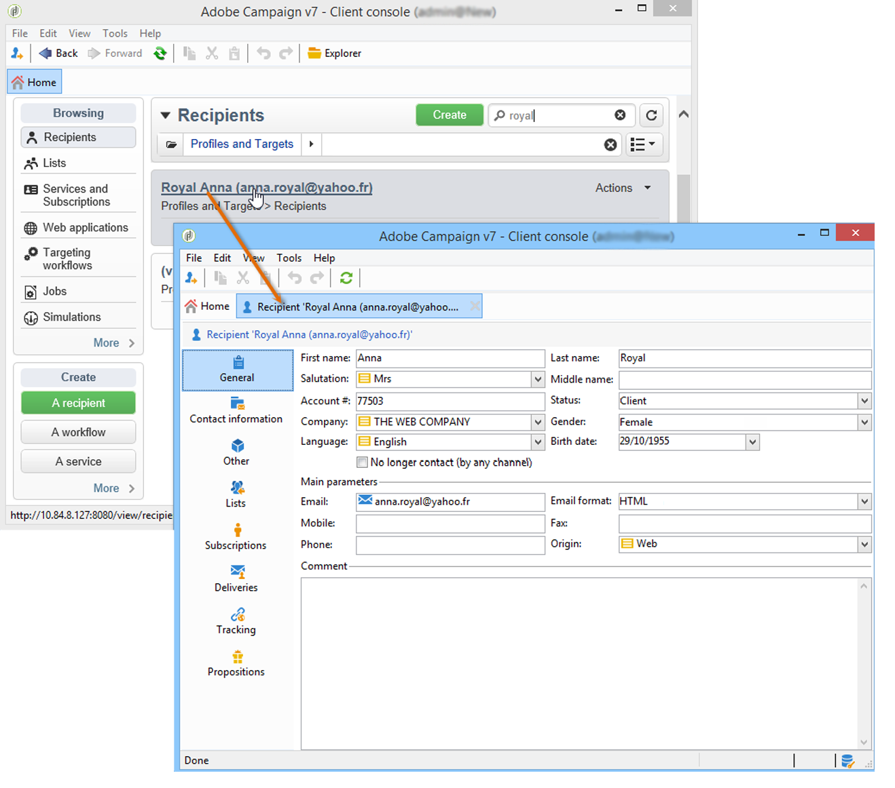
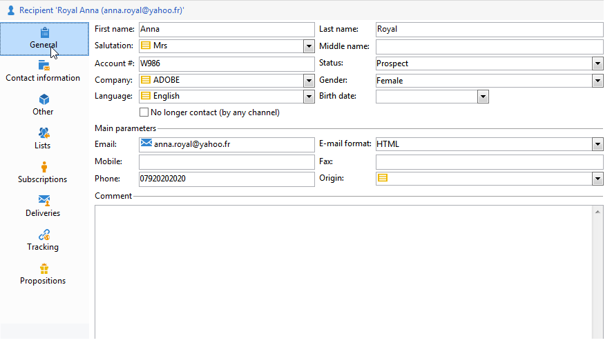

# Edición de un perfil{#editing-a-profile}

Para ver información relacionada con un perfil, haga clic en su nombre en la lista de perfiles.

Los detalles del perfil aparecen en una nueva ficha.

Los datos concernientes a los perfiles se agrupan en fichas.

Las fichas y su contenido dependen de la configuración y de los paquetes instalados.

>[!CAUTION]
>
>Se accede al esquema XML y al formulario pertinente a los campos de la tabla de perfiles mediante el nodo **[!UICONTROL Administration > Configuration > Data schemas]** del árbol de Adobe Campaign. Solo los usuarios expertos pueden realizar cambios en estos esquemas.
>
>Para obtener más información, consulte [esta página](../../configuration/using/about-schema-edition.md).

## Ficha General {#general-tab}

Esta pantalla contiene todos los datos generales sobre el perfil seleccionado. En concreto, contiene los apellidos, el nombre, la dirección de correo electrónico, el formato de recepción de correo electrónico, etc. Tiene el siguiente aspecto:

>[!NOTE]
>
>Una vez seleccionada la opción **[!UICONTROL No longer contact (by any channel)]**, significa que el perfil se encuentra en la lista de bloqueados; es decir, el perfil ha expresado su deseo de no ser contactado (por ejemplo, haciendo clic en un vínculo para dar de baja un boletín informativo). Ya no serán identificados por las entregas de ningún canal (correo electrónico, correo postal, etc.). Para obtener más información, consulte [esta página](../../delivery/using/understanding-quarantine-management.md).

## Ficha Contact information {#contact-information-tab}

Esta pantalla contiene la dirección de correo directa del perfil seleccionado. Tiene el siguiente aspecto:

Esta pantalla muestra el índice de calidad de la dirección, así como la cantidad de errores que contiene la dirección. Esta información la utiliza directamente el transportista de correo en función del número de errores encontrados durante las entregas anteriores y no se puede editar manualmente.

## Ficha Other {#other-tab}

Esta pantalla contiene campos definidos por el usuario que pueden personalizarse según los requisitos. También puede cambiar los nombres de los campos y definir su formato mediante **[!UICONTROL Field properties...]**, como se muestra a continuación:

>[!NOTE]
>
>Para obtener más información sobre las propiedades y adición de campos, consulte [esta página](../../configuration/using/new-field-wizard.md).

## Ficha Lists {#lists-tab}

Esta pantalla muestra los grupos a los que pertenece el perfil seleccionado. Haga clic en **[!UICONTROL Add]** para suscribir el perfil a una lista. Haga clic en **[!UICONTROL Detail]** para mostrar la descripción y la lista de perfiles de la lista seleccionada.

Para obtener más información sobre esto, consulte [Creación y administración de listas](../../platform/using/creating-and-managing-lists.md).

## Ficha Subscriptions {#subscriptions-tab}

Esta pantalla contiene los servicios de información a los que se ha suscrito el perfil.

El botón **[!UICONTROL Detail]** muestra las propiedades de la suscripción seleccionada. El botón **[!UICONTROL Add]** se utiliza para añadir una nueva suscripción manualmente.

Para obtener más información, consulte [esta página](../../delivery/using/managing-subscriptions.md).

## Ficha Deliveries {#deliveries-tab}

Esta pantalla muestra los &quot;logs&quot; de envío del perfil seleccionado. También puede mostrar las etiquetas, las fechas y el estado de las acciones de envío dirigidas al perfil a través de todos los canales.

## Ficha Tracking {#tracking-tab}

Esta pantalla permite ver los &quot;logs&quot; de seguimiento del perfil seleccionado. Esta información se utiliza para rastrear el comportamiento del perfil que sigue a las entregas.

Esta ficha muestra el total acumulado de todas las direcciones URL rastreadas en las entregas.

La lista se puede configurar y normalmente contiene la dirección URL, la fecha y la hora en que se hizo clic, y el documento que contiene la dirección URL.

>[!NOTE]
>
>Para obtener más información sobre la funcionalidad de seguimiento, consulte [esta página](../../delivery/using/delivery-dashboard.md).
