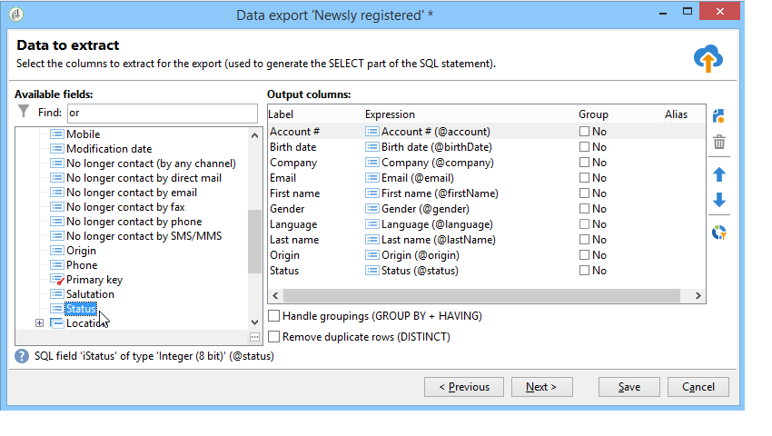

# Configuración de trabajos de exportación {#executing-export-jobs}

Los trabajos de exportación permiten acceder a la base de datos y extraer datos de ella: contactos, clientes, listas, segmentos, etc.

Por ejemplo: puede resultar útil utilizar datos de seguimiento de campañas (historial de seguimiento, etc.) en una hoja de cálculo. Los datos de salida pueden estar en formato txt, CSV, TAB o formato XML.

El asistente de exportación permite configurar una exportación, definir sus opciones e iniciar la ejecución. Es una serie de pantallas cuyo contenido depende del tipo de exportación (simple o múltiple) y de los derechos del operador.

El asistente de exportación se muestra después de crear un nuevo trabajo de exportación (consulte [Creación de trabajos de importación y exportación](../../platform/using/creating-import-export-jobs.md).

## Paso 1: Selección de la plantilla de exportación {#step-1---choosing-the-export-template}

Al iniciar el asistente de exportación, primero debe seleccionar una plantilla. Por ejemplo, para configurar la exportación de destinatarios que se hayan registrado recientemente, siga los pasos a continuación:

1. Seleccione la carpeta **[!UICONTROL Profiles and Targets > Job > Generic imports and exports]**.
1. Haga clic en **Nuevo** y, a continuación, en **Exportar** para crear la plantilla de exportación.

   

1. Haga clic en la flecha a la derecha del campo **[!UICONTROL Export template]** para seleccionar la plantilla o haga clic en **[!UICONTROL Select link]** para explorar el árbol.

   La plantilla original es **[!UICONTROL New text export]**. Esta plantilla no debe modificarse, pero puede duplicarla para configurar una nueva plantilla. De forma predeterminada, las plantillas de exportación se guardan en el nodo **[!UICONTROL Resources > Templates > Job templates]**.

1. Introduzca un nombre para la exportación en el campo **[!UICONTROL Label]**. Puede añadir una descripción.
1. Seleccione el tipo de exportación. Existen dos tipos posibles de exportación: **[!UICONTROL Simple export]** para exportar solo un archivo y **[!UICONTROL Multiple export]** para exportar varios archivos en una sola ejecución, desde uno o varios tipos de documento de origen.

## Paso 2: Tipo de archivo de exportación {#step-2---type-of-file-to-export}

Seleccione el tipo de documento que desea exportar, por ejemplo, el esquema de los datos que desea exportar.

De forma predeterminada, cuando se inicia la exportación desde el nodo **[!UICONTROL Jobs]**, los datos proceden de la tabla de destinatarios. Cuando se inicia la exportación desde una lista de datos (desde el menú **[!UICONTROL right click > Export]**), la tabla a la que pertenecen los datos se rellena automáticamente en el campo **[!UICONTROL Document type]**.

* La opción **[!UICONTROL Download the file generated on the server after the export]** está seleccionada de forma predeterminada. En el campo **[!UICONTROL Local file]**, indique el nombre y la ruta del archivo que va a crear o busque el disco local haciendo clic en la carpeta a la derecha del campo. Puede desmarcar esta opción para introducir la ruta de acceso y el nombre del archivo de salida del servidor.

   >[!NOTE]
   >
   >Los trabajos de importación y exportación automáticos siempre se realizan en el servidor.
   >
   >Para exportar solo algunos datos, haga clic en **[!UICONTROL Advanced parameters]** e introduzca en el campo correspondiente el número de líneas que desea exportar.

* Puede crear una exportación diferencial para exportar solo los registros que se han modificado desde la última ejecución. Para ello, haga clic en el vínculo **[!UICONTROL Advanced parameters]**, luego en la pestaña **[!UICONTROL Differential export]** y seleccione **[!UICONTROL Activate differential export]**.

   

   Debe especificar la fecha de la última modificación. Puede recuperarla de un campo o calcularla.

## Paso 3: Definición del formato de salida {#step-3---defining-the-output-format}

Seleccione un formato de salida para el archivo de exportación. Se pueden utilizar los siguientes formatos: texto, texto de ancho fijo, csv y xml.

* En el caso de los archivos de formato **[!UICONTROL Text]**, seleccione los delimitadores para separar las columnas (tabulaciones, comas, punto y coma o personalizado) y las cadenas (comillas simples o dobles, o ninguna).
* Para **[!UICONTROL text]** y **[!UICONTROL CSV]**, puede seleccionar la opción **[!UICONTROL Use first lines as column titles]**.
* Indique el formato de fecha y el formato de número. Para hacer esto, haga clic en el botón **[!UICONTROL Edit]** en el campo correspondiente y use el editor.
* En los campos que contienen valores numéricos, puede seleccionar **[!UICONTROL Export labels instead of internal values of enumerations]**. Por ejemplo, el título se puede almacenar en el formulario **1=Mr.**, **2=Miss** y **3=Mrs.**. Si se selecciona esta opción, se exportan **Mr.**, **Miss** y **Mrs.**

## Paso 4: Selección de datos {#step-4---data-selection}

Seleccione los campos que desea exportar. Para ello:

1. Haga doble clic en los campos deseados en la lista **[!UICONTROL Available fields]** para añadirlos a la sección **[!UICONTROL Output columns]**.
1. Utilice las flechas de la derecha de la lista para definir el orden de los campos en el archivo de salida.

   

1. Haga clic en el botón **[!UICONTROL Add]** para llamar a las funciones. Para obtener más información, consulte [Lista de funciones](../../platform/using/defining-filter-conditions.md#list-of-functions).

## Paso 5: Orden de las columnas {#step-5---sorting-columns}

Seleccione el orden de las columnas.

## Paso 6: Condiciones de filtro {#step-6---filter-conditions-}

Puede añadir condiciones de filtro para evitar la exportación de todos los datos. La configuración de este filtro es la misma que la segmentación de destinatarios en el asistente de envíos. Consulte [esta página](../../delivery/using/steps-defining-the-target-population.md).

## Paso 7: Formato de datos {#step-7---data-formatting}

Puede modificar el orden y las etiquetas de los campos del archivo de salida y aplicar transformaciones a los datos de origen.

* Para cambiar el orden de las columnas que desea exportar, seleccione la columna y utilice las flechas azules a la derecha de la tabla.
* Para cambiar la etiqueta de un campo, haga clic en la celda de la columna **[!UICONTROL Label]** que corresponda con el campo que desea modificar e introduzca la etiqueta nueva. Pulse Enter en el teclado para confirmar.
* Para aplicar una transformación al contenido de un campo, selecciónelo en la columna **[!UICONTROL Transformation]**. Puede seleccionar:

   * Cambiar a minúsculas
   * Cambiar a mayúsculas
   * Primera letra en mayúsculas

   

* Haga clic en **[!UICONTROL Add a calculated field]** si desea crear un nuevo campo calculado (por ejemplo, una columna que contenga apellidos y nombre). Para obtener más información, consulte [Campos calculados](../../platform/using/executing-import-jobs.md#calculated-fields).

Si desea exportar una recopilación de elementos (por ejemplo, suscripciones de destinatarios, listas a las que pertenecen, etc.), debe especificar el número de elementos de la recopilación que desea exportar.

## Paso 8: Previsualización de datos {#step-8---data-preview}

Haga clic en **[!UICONTROL Start the preview of the data]** para obtener una previsualización del resultado de la exportación. De forma predeterminada, se muestran las 200 primeras líneas. Para cambiar este valor, haga clic en las flechas a la derecha del campo **[!UICONTROL Lines to display]**.

Haga clic en las pestañas en la parte inferior del asistente para cambiar de la vista previa de los resultados en columnas a los resultados en xml. También puede ver las consultas SQL generadas.

## Paso 9: Inicio de la exportación {#step-9---launching-the-export}

Haga clic en **[!UICONTROL Start]** para iniciar la exportación de datos.

A continuación, puede monitorizar la ejecución del trabajo de importación (consulte [Supervisión de la ejecución de trabajos](../../platform/using/monitoring-jobs-execution.md).
