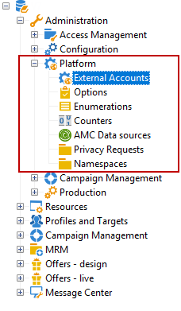
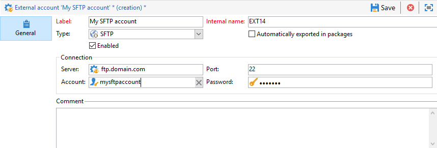
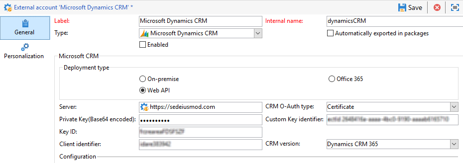

# Cuentas externas{#external-accounts}

Una cuenta externa es una configuración que permite
            configurar y probar el acceso a un servidor que sea externo a Adobe Campaign. Estas 
            cuentas externas se pueden utilizar en flujos de trabajo de Campaign para acceder y administrar datos.

Puede configurar los siguientes tipos de cuentas
            externas:

* [Enrutamiento de cuenta externa](#routing-external-account)
* [Cuenta externa de FTP](#ftp-external-account)
* [Cuenta externa de la base de datos externa](#external-database-external-account)
* [Cuenta externa de Web Analytics](#web-analytics-external-account)
* [Facebook conecta una cuenta externa](#facebook-connect-external-account)
* [Cuenta externa de instancia de ejecución](#execution-instance-external-account)
* [Configuración de una cuenta externa de Adobe Experience Cloud](#adobe-experience-cloud-external-account)
* [Cuenta externa SFTP](#sftp-external-account)
* [Cuenta externa de Adobe Experience Manager](#adobe-experience-manager-external-account)
* [Cuenta externa de Amazon Storage Service (S3)](#amazon-simple-storage-service--s3--external-account)
* [Cuenta externa de Azure](#azure-external-account)
* [Cuenta externa de Hadoop](#hadoop-external-account)
* [Cuenta externa de Microsoft Dynamics CRM](#microsoft-dynamics-crm-external-account)
* [Oracle en cuenta externa bajo demanda](#oracle-on-demand-external-account)
* [Cuenta externa de Salesforce CRM](#salesforce-crm-external-account)

## Creación de una cuenta externa {#creating-an-external-account}

Adobe Campaign viene con un conjunto de cuentas externas 
                   predefinidas. Para configurar conexiones con sistemas externos como servidores FTP 
                 utilizados para transferencias de archivos, puede crear cuentas externas propias.

Los procesos técnicos utilizan las cuentas externas 
                 como flujos de trabajo técnicos o flujos de trabajo de campaña. Al configurar una transferencia de archivos 
                 en un flujo de trabajo o un intercambio de datos con cualquier otra aplicación (Adobe Target, Experience
                 Manager, etc.), debe seleccionar una cuenta externa.

1. En el **[!UICONTROL Explorer]**, despliegue el **[!UICONTROL Administration]** menú.
1. Abra el **[!UICONTROL Platform]** menú y haga clic en **[!UICONTROL External accounts]**.

   

1. Haga clic en el botón **[!UICONTROL New]**.

   

1. Introduzca un **[!UICONTROL Label]** y **[!UICONTROL Internal Name]**. Se utilizarán cuando se seleccionen
                        cuentas externas en flujos de trabajo.
1. Check **[!UICONTROL Enabled]** if you want your connection to be enabled.
1. Select your external account **[!UICONTROL Type]** which one you want to create.
1. Configure el acceso a la cuenta
                        especificando las credenciales según el tipo de cuenta externa elegida.

   La información necesaria suele ser proporcionada por 
                       el proveedor del servidor al que está conectándose.

1. Haga clic **[!UICONTROL Save]**.

La cuenta externa se crea y se agrega 
                       a la lista de cuentas externas. Ahora está disponible para las transferencias de datos y archivos o las configuraciones
                de enrutamiento en las actividades de flujo de trabajo y propiedades de entrega.

## Cuenta externa de rebote de correos electrónicos {#bounce-mails-external-account}

La cuenta externa **Rebote de correos electrónicos**
                especifica la cuenta POP3 externa que se utilizará para conectar con el
                servicio de correo electrónico. Para obtener más información, consulte esta [página](../../workflow/using/inbound-emails.md).

Todos los servidores configurados para el acceso POP3 pueden utilizarse para
                recibir el correo electrónico devuelto.


To configure the **[!UICONTROL Bounce mails (defaultPopAccount)]** external account:

* **[!UICONTROL Server]**

   URL del servidor POP3.

* **[!UICONTROL Port]**

   Número de puerto de conexión POP3. El puerto predeterminado es 110.

* **[!UICONTROL Account]**

   Nombre del usuario.

* **[!UICONTROL Password]**

   Contraseña de la cuenta de usuario.

* **[!UICONTROL Encryption]**

   Type of chosen encryption between **[!UICONTROL By default]**, **[!UICONTROL POP3 + STARTTLS]**, **[!UICONTROL POP3]** or **[!UICONTROL POP3S]**.

## Enrutamiento de cuenta externa {#routing-external-account}

The **[!UICONTROL Routing]** external account allows you to configure each channel available in Adobe Campaign depending on the packages installed.


Se pueden configurar los siguientes canales:

* [Correo electrónico](../../installation/using/deploying-an-instance.md#email-channel-parameters)
* [Móvil
                            (SMS)](../../delivery/using/sms-channel.md#activating-an-external-account).
* [Teléfono](../../delivery/using/other-channels.md)
* [Correo postal](../../delivery/using/about-direct-mail-channel.md)
* [Agencia](../../delivery/using/other-channels.md)
* [Facebook](../../social/using/publishing-on-facebook-walls.md#delegating-write-access-to-adobe-campaign)
* [Twitter](../../social/using/configuring-publishing-on-twitter.md)
* [Canal de
                            iOS](../../delivery/using/setting-up-mobile-app-channel.md#ios-connectors)
* [Canal de Android](../../delivery/using/setting-up-mobile-app-channel.md#android-connectors)

## Cuenta externa de FTP {#ftp-external-account}

La cuenta externa de FTP permite configurar y probar 
                el acceso a un servidor fuera de Adobe Campaign. Para configurar conexiones con sistemas 
                externos como servidores FTP 898 utilizados para transferencias de archivos, puede crear sus propias 
               cuentas externas. Para obtener más información, consulte [esta página](../../workflow/using/file-transfer.md).

Especifique en esta cuenta externa la dirección 
                y las credenciales utilizadas para establecer la conexión con el servidor FTP.


* **[!UICONTROL Server]**

   Nombre del servidor FTP.

* **[!UICONTROL Port]**

   Número de puerto de conexión FTP. El puerto predeterminado es
                        21.

* **[!UICONTROL Account]**

   Nombre del usuario.

* **[!UICONTROL Password]**

   Contraseña de la cuenta de usuario.

* **[!UICONTROL Encryption]**

   Type of chosen encryption between **[!UICONTROL None]** or **[!UICONTROL SSL]**.

Para saber dónde ubicar estas credenciales, consulte esta
                    [página](https://help.dreamhost.com/hc/en-us/articles/115000675027-FTP-overview-and-credentials).

## Cuenta externa de la base de datos externa {#external-database-external-account}

Adobe Campaign proporciona varios conectores que permiten comunicarse con aplicaciones externas y conectarse a motores de base de datos.


Se pueden configurar los siguientes tipos de conexión:

* Oracle. Para obtener más información, consulte esta [página](../../platform/using/accessing-an-external-database.md#configure-access-to-oracle).
* MySQL. Para configurar el acceso a MYSQL, consulte esta [página](../../platform/using/accessing-an-external-database.md#configure-access-to-mysql).
* Netezza. Para obtener más información, consulte esta [página](../../platform/using/accessing-an-external-database.md#configure-access-to-netezza).
* SAP HANA. Para obtener más información, consulte esta [página](../../platform/using/accessing-an-external-database.md#configure-access-to-sap-hanaa).
* InfiniDB
* Servidor Microsoft SQL
* AsterData
* PostgreSQL
* Teradata
* DB2
* Amazon Redshift
* ODBC (Sybase ASE, Sybase IQ)
* Transmisión HTTP a una instancia remota

### Cuenta externa Teradata {#teradata-external-account}

La cuenta externa **Teradata** permite conectar la instancia de Campaign a la base de datos externa Teradata. For more information on how to configure Campaign Classic with Teradata, refer to this [page](https://helpx.adobe.com/campaign/kb/campaign_fda_teradata.html) or this [section](../../platform/using/accessing-an-external-database.md#configure-access-to-teradata).


Para configurar la cuenta externa para que funcione con Adobe Campaign, debe proporcionar los siguientes detalles:

* **[!UICONTROL Type]**

   Elija el **[!UICONTROL Teradata]** tipo.

* **[!UICONTROL Server]**

   URL o nombre del servidor Teradata.

* **[!UICONTROL Account]**

   Nombre de la cuenta utilizada para acceder a la base de datos Teradata.

* **[!UICONTROL Password]**

   Contraseña utilizada para conectarse a la base de datos Teradata.

* **[!UICONTROL Database]**

   Este campo puede dejarse vacío.

* **[!UICONTROL Options]**

   Opciones que pasan por Teradata

* **[!UICONTROL Timezone]**

   Zona horaria definida en Teradata


When multiple Adobe Campaign users connect to the same FDA Teradata external account, the **[!UICONTROL Query banding]** tab allows you to set a query band, i.e. a set of key/value pairs, on a session.

Cada vez que un usuario de Campaign realiza una consulta en la base de datos Teradata, Adobe Campaign envía metadatos que consisten en una lista de claves asociada a ese usuario. Los administradores de Teradata pueden utilizar estos datos para fines de auditoría o para administrar los derechos de acceso.

Check the **[!UICONTROL Active]** box to activate this feature

The **[!UICONTROL Default]** field lets you enter a default query band that will be used if a user has no associated query band. Si este campo se deja vacío, los usuarios sin banda de consulta no podrán utilizar Teradata.

The **[!UICONTROL Users]** field allows you to specify a query band for each user. Puede agregar todos los pares clave/valor que necesite, por ejemplo, priority=1;workload=high. If the user has no query band assigned, the **[!UICONTROL Default]** field will be applied.

For more information on **[!UICONTROL Query banding]**, refer to the [Teradata documentation](https://docs.teradata.com/reader/cY5B~oeEUFWjgN2kBnH3Vw/a5G1iz~ve68yTMa24kVjVw).

## Cuenta externa de Web Analytics {#web-analytics-external-account}

The **[!UICONTROL Web Analytics (Adobe Analytics - Data connector)]** external account allows you to forward data from Adobe Analytics to Adobe Campaign in the form of segments. Por el contrario, envía indicadores y atributos de las campañas de correo electrónico que envía Adobe Campaign a Adobe Analytics: conector de datos.


Para esta cuenta externa, la fórmula de cálculo para 
                URL rastreadas debe ser enriquecida y la conexión entre las dos soluciones debe ser 
                aprobada. Para obtener más información, consulte [esta página](../../platform/using/adobe-analytics-data-connector.md#step-2--create-the-external-account-in-campaign).

## Facebook conecta una cuenta externa {#facebook-connect-external-account}

The **[!UICONTROL Facebook Connect]** external account lets you display personalized content in your Facebook applications, making it easier to acquire prospects via this social network.

For each Facebook application, you need to create a **[!UICONTROL Facebook Connect]** type external account. Para 
                obtener más información, consulte [esta página](../../social/using/creating-a-facebook-application.md#configuring-external-accounts).


* **[!UICONTROL Hosting mode]**

   Modo de alojamiento de la aplicación entre **[!UICONTROL hosted by a partner]** o **[!UICONTROL hosted by this instance]**.

* **[!UICONTROL Application ID]**

   ID de aplicación de Facebook.

* **[!UICONTROL Application secret]**

   Secreto de aplicación de Facebook

Si elige el alojamiento mediante este modo de instancia,
                   será necesario pegar Secure Canvas URL en el campo de Facebook **Juegos
                    de Facebook Web (https)**

Para saber dónde ubicar estas credenciales, consulte esta
                    [página](https://developers.facebook.com/docs/facebook-login/access-tokens).

## Cuenta externa de instancia de ejecución {#execution-instance-external-account}

Si tiene una arquitectura desglosada, es necesario 
                 especificar las instancias de ejecución vinculadas a la instancia de control y conectarlas. Las plantillas de mensajes transaccionales se implementan en las instancias de ejecución.


* **[!UICONTROL URL]**

   URL del servidor en el que está instalada la instancia
                        de ejecución.

* **[!UICONTROL Account]**

   El nombre de la cuenta debe coincidir con el Agente
                        del centro de mensajes definido en la carpeta del operador.

* **[!UICONTROL Password]**

   Introduzca la contraseña de la cuenta tal como se define en la
                        carpeta del operador.

Para obtener más información sobre esta configuración, consulte
                esta [página](../../message-center/using/creating-a-shared-connection.md#control-instance).

## Configuración de una cuenta externa de Adobe Experience Cloud {#adobe-experience-cloud-external-account}

To connect to the Adobe Campaign console using an Adobe ID, you must configure the **[!UICONTROL Adobe Experience Cloud (MAC)]** external account.


* **[!UICONTROL IMS server]**

   URL del servidor IMS. Asegúrese de que las instancias de ensayo y de producción indiquen el mismo punto final de producción IMS.

* **[!UICONTROL IMS scope]**

   Los ámbitos definidos aquí deben ser un subconjunto de los que proporciona IMS.

* **[!UICONTROL IMS client identifier]**

   ID de su cliente IMS.

* **[!UICONTROL IMS client secret]**

   Credencial del secreto de su cliente IMS

* **[!UICONTROL Callback server]**

   Acceso URL de su instancia de 
                        Adobe Campaign

* **[!UICONTROL IMS organization ID]**

   ID de la organización IMS Para encontrar su 
                        ID de la organización, consulte [esta página](https://marketing.adobe.com/resources/help/en_US/mcloud/faq.html) (**¿Dónde puedo encontrar mi ID de organización
                             IMS?**).

* **[!UICONTROL Association mask]**

   Sintaxis que permitirá nombres de configuración en
                        Enterprise Dashboard para sincronizar con los grupos en Adobe Campaign.

* **[!UICONTROL Server]**

   URL de su instancia de 
                        Adobe Experience Cloud.

* **[!UICONTROL Tenant]**

   Nombre su inquilino de
                        Adobe Experience Cloud.

Para obtener más información sobre esta configuración, consulte
                esta [página](../../integrations/using/configuring-ims.md).

## Cuenta externa SFTP {#sftp-external-account}

La cuenta externa SFTP permite configurar y probar
                 el acceso a un servidor fuera de Adobe Campaign. Para configurar conexiones con sistemas 
                 externos como SFTP utilizados para transferencias de archivos, puede crear cuentas externas 
                 propias. Para obtener más información, consulte [esta página](../../workflow/using/file-transfer.md).



* **[!UICONTROL Server]**

   URL del servidor SFTP.

* **[!UICONTROL Port]**

   Número de puerto de conexión FTP. El puerto predeterminado es
                        22.

* **[!UICONTROL Account]**

   Nombre de cuenta utilizado para conectarse al servidor
                        SFTP.

* **[!UICONTROL Password]**

   Contraseña utilizada para conectarse al servidor
                        SFTP.

## Cuenta externa de Adobe Experience Manager {#adobe-experience-manager-external-account}

The **[!UICONTROL AEM (AEM instance)]** external account allows you to manage the content of your email deliveries as well as your forms directly in Adobe Experience Manager.


* **[!UICONTROL Server]**

   URL del servidor 
                        de Adobe Experience Manager.

* **[!UICONTROL Port]**

   Nombre de la cuenta que se utiliza para conectarse a la instancia de creación de Adobe
                        Experience Manager.

* **[!UICONTROL Password]**

   La contraseña utilizada para conectarse a la instancia de autor de Adobe Experience 
                        Manager.

Para obtener más información, consulte [esta sección](../../integrations/using/about-adobe-experience-manager.md).

## Cuenta externa de Amazon Storage Service (S3){#amazon-simple-storage-service--s3--external-account}

El conector de Amazon Simple Storage Service (S3) 
                se puede utilizar para importar o exportar datos a Adobe Campaign. Se puede configurar en una actividad 
                de flujo de trabajo. Para obtener más información, consulte [esta página](../../workflow/using/file-transfer.md).


Al configurar esta nueva cuenta externa, 
                debe proporcionar los siguientes detalles:

* **[!UICONTROL AWS S3 Account Server]**

   La URL del servidor debe completarse 
                de la siguiente manera:

   ```
   <S3bucket name>.s3.amazonaws.com/<s3object path>
   ```

* **[!UICONTROL AWS access key ID]**

   Para saber dónde encontrar el ID de clave de acceso de AWS, consulte [esta página](https://docs.aws.amazon.com/general/latest/gr/aws-sec-cred-types.html#access-keys-and-secret-access-keys) .

* **[!UICONTROL Secret access key to AWS]**

   Para saber dónde encontrar la clave de acceso secreta a AWS, consulte [esta página](https://aws.amazon.com/fr/blogs/security/wheres-my-secret-access-key/).

* **[!UICONTROL AWS Region]**

   Para obtener más información sobre la región de AWS, consulte esta [página](https://aws.amazon.com/about-aws/global-infrastructure/regions_az/).

* The **[!UICONTROL Use server side encryption]** checkbox allows you to store your file in S3 encrypted mode.

Para saber dónde encontrar el ID de clave de acceso y la clave
                de acceso secreta, consulte la [documentación](https://docs.aws.amazon.com/general/latest/gr/aws-sec-cred-types.html#access-keys-and-secret-access-keys)de los servicios web de Amazon .

## Cuenta externa de Azure {#azure-external-account}

The **[!UICONTROL Azure]** external account enables a connection to a shared external database, as long as this connection is active, the database can be accessed via Adobe Campaign.


* **[!UICONTROL Server]**

   URL del servidor Azure.

* **[!UICONTROL Encryption]**

   Type of chosen encryption between **[!UICONTROL None]** or **[!UICONTROL SSL]**.

* **[!UICONTROL Access key]**

   Para saber dónde encontrar su clave de acceso, consulte
                        esta [página](https://docs.microsoft.com/en-us/azure/storage/common/storage-account-manage) (sección **Ver y copiar claves de 
                        acceso**).

## Cuenta externa de Hadoop {#hadoop-external-account}

The **[!UICONTROL Hadoop]** external account enables a connection to a shared external database, as long as this connection is active, the database can be accessed via Adobe Campaign. Para obtener más información sobre cómo configurar el acceso a Hadoop, consulte esta [sección](../../platform/using/accessing-an-external-database.md#configure-access-to-hadoop).


* **[!UICONTROL Server]**

   URL del servidor Hadoop.

* **[!UICONTROL User account name]**

   Nombre de la cuenta utilizada para acceder a
                       Hadoop.

## Cuenta externa de Microsoft Dynamics CRM {#microsoft-dynamics-crm-external-account}

The **[!UICONTROL Microsoft Dynamics CRM]** external account allows you to import and export Microsoft Dynamics data into Adobe Campaign.

La configuración del conector de Microsoft Dynamics para que funcione con Adobe Campaign depende del tipo de implementación.
Con **[!UICONTROL On-premise]** los tipos de implementación y **[!UICONTROL Office 365]** , debe proporcionar los siguientes detalles:


* **[!UICONTROL Account]**

   Cuenta utilizada para iniciar sesión en Microsoft CRM.

* **[!UICONTROL Server]**

   URL del servidor Microsoft CRM.

* **[!UICONTROL Password]**

   Contraseña utilizada para iniciar sesión en Microsoft 
                CRM.

* **[!UICONTROL Company name]** para la implementación local y de Office 365

   Nombre de la empresa.

* **[!UICONTROL Organization name]** para la implementación in situ

   Nombre de la organización.
Nombre de la organización que se puede encontrar en el panel de recursos de desarrolladores del campo Microsoft Dynamics **[!UICONTROL Unique Name]** .

* **[!UICONTROL CRM version]** in situ

   Versión de CRM entre **[!UICONTROL Dynamics CRM 2007]**, **[!UICONTROL Dynamics CRM 2015]** o **[!UICONTROL Dynamics CRM 2016]**.

Con **[!UICONTROL Web API]** el tipo de implementación y la autenticación **[!UICONTROL Password credentials]** , debe proporcionar los siguientes detalles:


* **[!UICONTROL Account]**

   Cuenta utilizada para iniciar sesión en Microsoft CRM.

* **[!UICONTROL Server]**

   URL del servidor Microsoft CRM.

* **[!UICONTROL Client identifier]**

   Client ID which can be found from Microsoft Azure management portal in the **[!UICONTROL Update your code]** category, **[!UICONTROL Client ID]** field.

* **[!UICONTROL CRM version]**

   Versión de CRM entre **[!UICONTROL Dynamics CRM 2007]**, **[!UICONTROL Dynamics CRM 2015]** o **[!UICONTROL Dynamics CRM 2016]**.

Con **[!UICONTROL Web API]** el tipo de implementación y la autenticación **[!UICONTROL Certificate]** , debe proporcionar los siguientes detalles:



* **[!UICONTROL Server]**

   URL del servidor Microsoft CRM.

* **[!UICONTROL Private Key (Base64 encoded)]**

   Clave privada codificada en Base64

* **[!UICONTROL Custom Key identifier]**


* **[!UICONTROL Key ID]**

* **[!UICONTROL Client identifier]**

   Client ID which can be found from Microsoft Azure management portal in the **[!UICONTROL Update your code]** category, **[!UICONTROL Client ID]** field.

* **[!UICONTROL CRM version]**

   Versión de CRM entre **[!UICONTROL Dynamics CRM 2007]**, **[!UICONTROL Dynamics CRM 2015]** o **[!UICONTROL Dynamics CRM 2016]**.

Para obtener más información sobre esta configuración, consulte
                esta [página](../../platform/using/crm-connectors.md#example-for-microsoft-dynamics).

## Oracle en cuenta externa bajo demanda {#oracle-on-demand-external-account}

The **[!UICONTROL Oracle on demand]** external account allows you to import and export Oracle data into Adobe Campaign.


Para configurar la cuenta externa bajo demanda de Oracle 
                para que funcione con Adobe Campaign, proporcione los siguientes detalles:

* **[!UICONTROL Account]**

   Cuenta utilizada para iniciar sesión en Oracle CRM 
                        bajo demanda.

* **[!UICONTROL Server]**

   Dirección URL del servidor Oracle CRM bajo demanda.

* **[!UICONTROL Password]**

   La contraseña utilizada para iniciar sesión en Oracle CRM
                        bajo demanda.

Para obtener más información sobre esta configuración, consulte
                esta [página](../../platform/using/crm-connectors.md#example-for-oracle-on-demand).

## Cuenta externa de Salesforce CRM {#salesforce-crm-external-account}

The **[!UICONTROL Salesforce CRM]** external account allows you to import and export Salesforce data into Adobe Campaign.


Para configurar la cuenta externa de Salesforce CRM para que funcione
                con Adobe Campaign, proporcione los siguientes detalles:

* **[!UICONTROL Account]**

   Cuenta utilizada para iniciar sesión en Salesforce
                        CRM.

* **[!UICONTROL Password]**

   Contraseña utilizada para iniciar sesión en Salesforce
                        CRM.

* **[!UICONTROL Client identifier]**

   Para saber dónde encontrar el identificador de cliente,
                        consulte esta [página](https://help.salesforce.com/articleView?id=000205876&type=1).

* **[!UICONTROL Security token]**

   Para saber dónde encontrar el token de seguridad, consulte
                        esta [página](https://help.salesforce.com/articleView?id=000205876&type=1).

* **[!UICONTROL API version]**

   Versión de la API entre **[!UICONTROL Version 37]**, **[!UICONTROL Version 21]** o **[!UICONTROL Version 15]**.

Para esta cuenta externa, debe configurar 
                 Salesforce CRM con el asistente para configuración.

Para obtener más información sobre esta configuración, consulte
                esta [página](../../platform/using/crm-connectors.md#example-for-salesforce-com).
