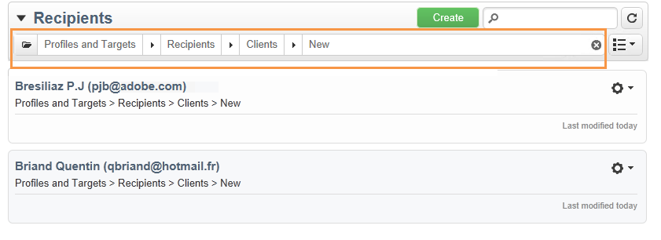

# Filtrado de opciones{#filtering-options}

## Acerca del filtrado {#about-filtering}

De forma predeterminada, Adobe Campaign muestra todos los datos de la base de datos para los cuales el operador respectivo tiene derechos de lectura.

Estos datos se pueden filtrar mediante las opciones ubicadas en la sección superior de la ventana del explorador.

Existen varias maneras de filtrar los datos que se van a mostrar. Si es necesario, se pueden combinar:

* Filtrar por carpetas, consulte [Filtrar por carpeta](#filter-by-folder),
* Filtrar por estado, consulte [Filtrar por estado](#filter-by-status),
* Ordenación de datos, consulte [Ordenar por](#order-by),
* Buscar, consulte [Búsqueda rápida](#quick-search).

## Filtrar por carpeta {#filter-by-folder}

Haga clic en el icono **[!UICONTROL Folder]** para seleccionar la carpeta que contiene los datos que se van a mostrar.

Solo se muestran los perfiles de la carpeta:

Utilice la cruz a la derecha del campo de selección de carpetas para volver al modo de visualización predeterminado.

## Filtrar por estado {#filter-by-status}

Según el tipo de información que se muestre, puede aplicar un filtro por estatus o por estado. Por ejemplo, para las entregas, puede elegir mostrar solo las entregas finalizados como se muestra a continuación:

## Ordenar por {#order-by}

Puede seleccionar el orden de los datos ofrecidos en las páginas mediante la lista desplegable a la derecha del campo de filtro “por carpeta”. El contenido de este campo depende del tipo de datos de la página.

Por ejemplo, puede ordenar las tareas por prioridad, fecha de creación u orden alfabético.

## Búsqueda rápida {#quick-search}

Utilice el campo de búsqueda para acceder rápidamente al elemento que está buscando: introduzca los caracteres incluidos en la etiqueta o el nombre interno del elemento que desea mostrar y, a continuación, confirme la aplicación de un filtro automático a los datos de la página.

Para volver a mostrar todos los elementos, haga clic en la cruz para eliminar el contenido del campo de búsqueda.
