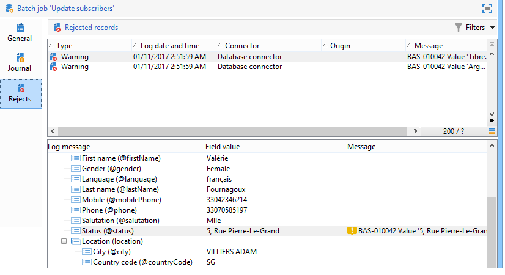
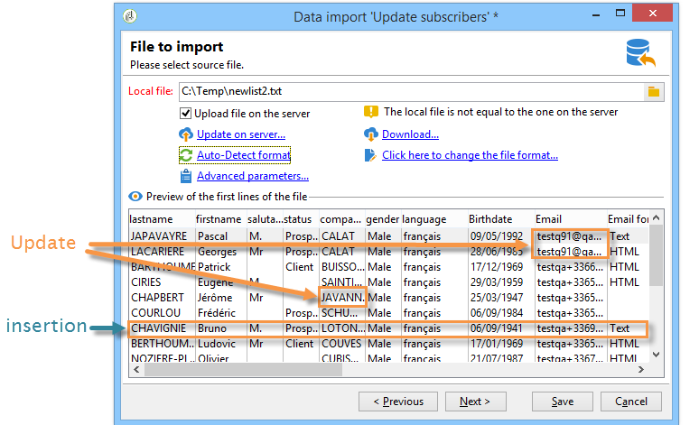
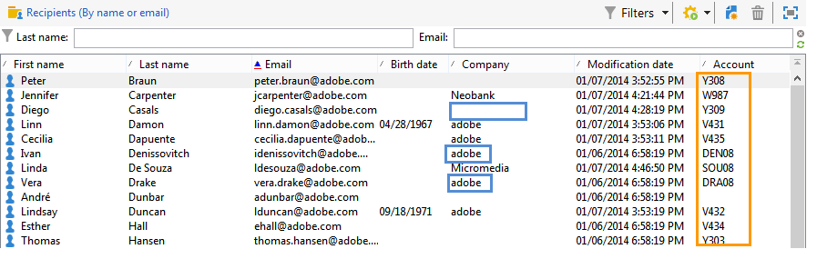

# Muestras de importación genéricas {#import-operations-samples}

## Importación desde una lista de destinatarios {#example--import-from-a-list-of-recipients}

Para crear y ofrecer una lista de destinatarios de la descripción general de las listas, siga los siguientes pasos:

1. Creación de la lista

   * En el menú **[!UICONTROL Lists]** de la página de inicio de Adobe Campaign, haga clic en el enlace **[!UICONTROL Profiles and targets]**.
   * Haga clic en **[!UICONTROL Create]** y luego en el botón **[!UICONTROL Import a list]**.

1. Selección del archivo a importar

   Haga clic en la carpeta a la derecha del campo **[!UICONTROL Local file]** y seleccione el archivo que contiene la lista que desea importar.

   

1. Nombre de lista y almacenamiento

   Introduzca el nombre de la lista y seleccione el directorio en el que debe guardarse.

   

1. Inicio de la importación

   Haga clic en **[!UICONTROL Next]** y a continuación **[!UICONTROL Start]** para iniciar la importación de la lista.

   

## Importación de registros nuevos desde un archivo de texto {#example--import-new-records-from-a-text-file-}

Para importar nuevos perfiles de destinatario almacenados en un archivo de texto en la base de datos de Adobe Campaign, aplique los pasos siguientes:

1. Elección de una plantilla

   * En la página de inicio de la Adobe Campaign, haga clic en el enlace **[!UICONTROL Profiles and targets]** y luego en **[!UICONTROL Jobs]**. Sobre la lista de trabajos, haga clic en **[!UICONTROL New import]**.
   * Mantenga la plantilla **[!UICONTROL New text import]** seleccionada de forma predeterminada.
   * Cambie la etiqueta y la descripción.
   * Seleccione **[!UICONTROL Simple import]**.
   * Mantenga la carpeta de trabajo predeterminada.
   * Haga clic en **[!UICONTROL Advanced parameters]** y seleccione la opción **[!UICONTROL Tracking mode]** para ver los detalles de la importación durante la ejecución.

1. Selección del archivo a importar

   Haga clic en la carpeta a la derecha del campo **[!UICONTROL Local file]** y seleccione el archivo que desea importar.

   

1. Asociación de campos

   Haga clic en el icono **[!UICONTROL Guess the destination fields]** para asignar automáticamente los esquemas de origen y destino. Compruebe la información de esta ventana antes de hacer clic en **[!UICONTROL Next]**.

   

1. Reconciliación

   * Diríjase a la tabla **Destinatarios (nms:recipient)**.
   * Seleccione la operación **[!UICONTROL Insertion]** y mantenga los valores predeterminados de los demás campos.

      

1. Importación de destinatarios

   * Si es necesario, especifique la carpeta en la que se deben importar los registros.

      

1. Inicio de la importación

   * Haga clic en **[!UICONTROL Start]**.

      En el área central del editor, puede comprobar que la operación de importación se haya realizado correctamente y ver el número de registros procesados.

      

      El modo **[!UICONTROL Tracking]** permite realizar un seguimiento de los detalles de la importación para cada registro del archivo de origen. Para ello, en la página de inicio, haga clic en **[!UICONTROL Profiles and Targets]**, luego en **[!UICONTROL Processes]**, seleccione la importación correspondiente y, por último, busque las pestañas **[!UICONTROL General]**, **[!UICONTROL Journal]** y **[!UICONTROL Rejects]**.

      * Comprobación del progreso de importación.

         

      * Visualización de procesos de cada registro.

         

## Actualización e inserción de destinatarios {#example--update-and-insert-recipients}

Queremos actualizar los registros existentes en la base de datos y crear nuevos registros de un archivo de texto. A continuación se muestra un ejemplo del procedimiento:

1. Elección de una plantilla

   Repita los pasos descritos anteriormente en el ejemplo 2.

1. Archivo a importar

   Seleccione el archivo que desea importar.

   En nuestro ejemplo, la descripción general de las primeras líneas del archivo muestra que el archivo contiene actualizaciones para tres registros y la creación de un registro.

   

1. Asociación de campos

   Aplique el procedimiento mostrado en el ejemplo 2 anterior.

1. Reconciliación

   * Mantenga **[!UICONTROL Update or insert]** seleccionado de forma predeterminada.
   * Mantenga la opción **[!UICONTROL Management of duplicates]** en modo **[!UICONTROL Update]** para que los registros existentes en la base de datos se actualicen con los datos del archivo de texto.
   * Seleccione los campos **[!UICONTROL Birth date]**, **[!UICONTROL Name]** y **[!UICONTROL Company]** y asígneles una clave de reconciliación.

      

1. Inicio de la importación

   * Haga clic en **[!UICONTROL Start]**.

      En la ventana de seguimiento, puede comprobar que la importación se haya realizado correctamente y ver el número de registros procesados.

      

   * Busque en la tabla de destinatarios para comprobar que esta operación ha modificado correctamente los registros.

      

## Mejore los valores con los de un archivo externo {#example--enrich-the-values-with-those-of-an-external-file}

Queremos modificar ciertos campos de una tabla de la base de datos desde un archivo de texto, dando prioridad a los valores contenidos en la base de datos.

En este ejemplo, puede ver que ciertos campos del archivo de texto tienen un valor, mientras que los campos correspondientes de la base de datos están vacíos. Otros campos contienen un valor diferente del que contiene la base de datos.

* Contenido del archivo de texto que desea importar.

   

* Estado de la base de datos antes de la importación.

   

Siga estos pasos:

1. Elección de una plantilla

   Aplique el procedimiento mostrado en el ejemplo 2 anterior.

1. Archivo a importar

   Seleccione el archivo que desea importar.

1. Asociación de campos

   Aplique el procedimiento mostrado en el ejemplo 2 anterior.

   En la previsualización de las primeras líneas del archivo, puede ver que el archivo contiene actualizaciones para determinados registros.

1. Reconciliación

   * Vaya a la tabla y seleccione la operación **[!UICONTROL Update]**.
   * Seleccione la opción **[!UICONTROL Reject entity]** en el campo **[!UICONTROL Management of doubles]**.
   * Mantenga la opción **[!UICONTROL Management of duplicates]** en modo **[!UICONTROL Update]** para que los registros existentes en la base de datos se actualicen con los datos del archivo de texto.
   * Coloque el cursor en el nodo **[!UICONTROL Last name (@lastName)]** seleccione la opción **[!UICONTROL Update only if destination is empty]**.
   * Repita esta operación para el nodo **[!UICONTROL Company (@company)]**.
   * Asigne una clave de reconciliación a los campos **[!UICONTROL Birth date]**, **[!UICONTROL E-mail]** y **[!UICONTROL First name]**.

      

1. Inicio de la importación

   Haga clic en **[!UICONTROL Start]**.

   Busque en la tabla de destinatarios para comprobar que la importación ha modificado los registros.

   

   Solo se han reemplazado los valores que estaban vacíos por los valores del archivo de texto, pero el valor del archivo de importación no ha sobreescrito el valor existente en la base de datos.

## Actualización y enriquecimiento de los valores mediante los valores de un archivo externo {#example--update-and-enrich-the-values-from-those-in-an-external-file}

Queremos modificar ciertos campos de una tabla de la base de datos desde un archivo de texto, dando prioridad a los valores contenidos en el archivo de texto.

En este ejemplo puede comprobar que ciertos campos del archivo de texto tienen un valor vacío, mientras que los campos correspondientes de la base de datos no están vacíos. Otros campos contienen un valor diferente del de la base de datos.

* Contenido del archivo de texto que desea importar.

   

* Estado de la base de datos antes de la importación.

   

1. Elección de una plantilla

   Aplique el procedimiento mostrado en el ejemplo 2 anterior.

1. Archivo a importar

   Seleccione el archivo que desea importar.

   En la previsualización de las primeras líneas del archivo, puede ver que el archivo contiene campos y actualizaciones vacíos para determinados registros.

1. Asociación de campos

   Aplique el procedimiento mostrado en el ejemplo 2 anterior.

1. Reconciliación

   * Vaya a la tabla y seleccione **[!UICONTROL Update]**.
   * Seleccione la opción **[!UICONTROL Reject entity]** en el campo **[!UICONTROL Management of doubles]**.
   * Deje la opción **[!UICONTROL Management of duplicates]** en modo **[!UICONTROL Update]** para que los registros existentes de la base de datos se modifiquen con los datos del archivo de texto.
   * Coloque el cursor en el nodo **[!UICONTROL Account number (@account)]** seleccione la opción **[!UICONTROL Take empty values into account]**.
   * Seleccione los campos **[!UICONTROL Birth date]**, **[!UICONTROL E-mail]** y **[!UICONTROL First name]** y asígneles una clave de reconciliación.

      

1. Inicio de la importación

   * Haga clic en **[!UICONTROL Start]**.
   * Compruebe en la tabla de destinatarios que la operación ha modificado correctamente los registros.

      

      Los valores del archivo de texto que estaban vacíos se sobreescriben en la base de datos. Los valores existentes de la base de datos se actualizaron con los del archivo de importación conforme a la opción **[!UICONTROL Update]** seleccionada en el paso 4, en relación con los duplicados.
