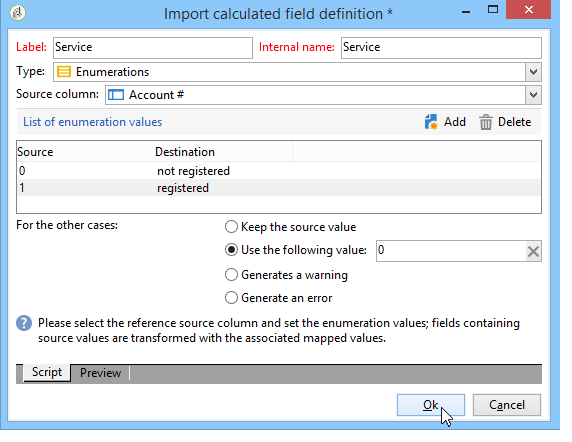
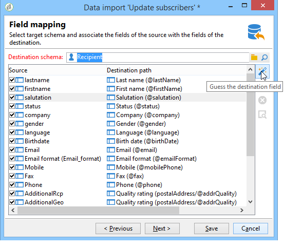
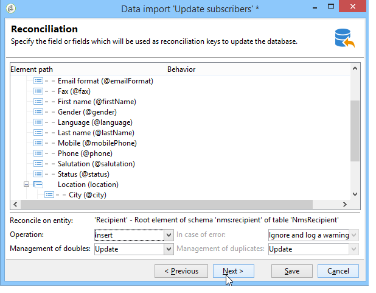

# Importación de datos{#importing-data}

Adobe Campaign permite importar datos a la base de datos desde uno o varios archivos de texto, csv, tab o xml. Estos archivos están asociados a una tabla (principal o vinculada) y cada campo del archivo de origen se asocia a un campo de la base de datos. La configuración de importación se puede guardar para reutilizarla y poder programar tareas de importación que automatizan sus operaciones de replicación.

>[!NOTE]
>
>Puede importar datos sin asignarlos con los datos de la base de datos mediante la función **[!UICONTROL Import a list]**.
>
>Posteriormente, los datos se pueden utilizar exclusivamente en flujos de trabajo mediante el objeto **[!UICONTROL Read list]**. Para obtener más información, consulte [esta página](../../workflow/using/read-list.md).

 [Descubra esta función en vídeo](https://docs.adobe.com/content/help/en/campaign-classic-learn/tutorials/profile-management/importing-profiles.html)

## Estructura de los datos de importación {#structure-of-the-data-to-import}

En el archivo de origen, cada línea coincide con un registro. Los datos de los registros están separados por delimitadores (espacio, tabulación, carácter, etc.). Esto significa que los datos se recuperan en forma de columnas y cada columna está asociada a un campo de la base de datos.

## Asistente de importación {#import-wizard}

El asistente de importación permite configurar la importación, definir sus opciones (como la transformación de datos) e iniciar la ejecución. Es una serie de pantallas cuyo contenido depende del tipo de importación (simple o múltiple) y de los derechos del operador.

>[!NOTE]
>
>Si utiliza un servidor Web IIS, puede requerir una configuración para autorizar la carga de archivos grandes (superiores a 28 MB).
>
>Para obtener más información, consulte [esta sección](../../installation/using/integration-into-a-web-server-for-windows.md#changing-the-upload-file-size-limit).

### Paso 1: Selección de la plantilla de importación {#step-1---choosing-the-import-template}

Al iniciar el asistente para importar, primero debe seleccionar una plantilla. Por ejemplo, para configurar la importación de destinatarios que recibieron un boletín, siga los pasos a continuación:

1. Seleccione la carpeta **[!UICONTROL Profiles and Targets > Job > Generic imports and exports]**.
1. Haga clic en **Nuevo** y, a continuación, en **Importar** para crear la plantilla de importación.

   

1. Haga clic en la flecha a la derecha del campo **[!UICONTROL Import template]** para seleccionar la plantilla o haga clic en **[!UICONTROL Select link]** para explorar el árbol.

   La plantilla original es **[!UICONTROL New text import]**. Esta plantilla no debe modificarse, pero puede duplicarse para configurar una nueva plantilla según sus necesidades. By default, import templates are saved in the **[!UICONTROL Profiles and targets > Templates > Job templates]** node.

1. Introduzca un nombre para esta importación en el campo **[!UICONTROL Label]**. Puede añadir una descripción.
1. Seleccione el tipo de importación en el campo apropiado. Existen dos tipos de importación posibles: **[!UICONTROL Simple import]** para importar solo un archivo y **[!UICONTROL Multiple import]** para importar varios archivos en una sola ejecución.

   For a multiple import, select **[!UICONTROL Multiple import]** from the **[!UICONTROL Import type]** drop-down list in the first screen of the import wizard.

   

1. Especifique los campos que desea importar haciendo clic en **[!UICONTROL Add]**.

   

   Cada vez que se añade un archivo, se muestra la pantalla del asistente **[!UICONTROL File to import]**. Consulte la sección [Paso 2: Selección del archivo de origen](#step-2---source-file-selection) y siga los pasos del asistente para definir las opciones de importación como para una importación simple.

   >[!NOTE]
   >
   >Las importaciones múltiples solo deben abordar necesidades específicas y no se recomienda usarlas.

#### Parámetros avanzados {#advanced-parameters}

El enlace **[!UICONTROL Advanced parameters]** permite acceder a las siguientes opciones:

* **[!UICONTROL General]** ficha

   * **[!UICONTROL Stop execution if there are too many rejects]**

      Esta opción está seleccionada de forma predeterminada. Puede desmarcarlo si desea continuar ejecutando la importación independientemente del número de rechazos. De forma predeterminada, la ejecución se detiene si se rechazan las primeras 100 líneas.

   * **[!UICONTROL Trace mode]**

      Seleccione esta opción para supervisar la ejecución de la importación para cada línea.

   * **[!UICONTROL Start the job in a detached process]**

      Esta opción está seleccionada de forma predeterminada. Permite separar la ejecución de la importación para que no afecte a otros trabajos en curso en la base de datos.

   * **[!UICONTROL Do not update enumerations]**

      Seleccione esta opción para evitar enriquecer la lista de valores numéricos en la base de datos. Consulte [Administración de enumeraciones](../../platform/using/managing-enumerations.md).

* **[!UICONTROL Variables]** ficha

   Puede definir variables asociadas con el trabajo a las que pueden acceder los editores de consultas y los campos calculados. Para crear una variable, haga clic en **[!UICONTROL Add]** y utilice el editor de variables.

   >[!CAUTION]
   >
   >La pestaña **[!UICONTROL Variables]** solo se utiliza para la programación relacionada con los flujos de trabajo, y por tanto solo deben configurarla usuarios expertos.

### Paso 2: Selección de archivos de origen {#step-2---source-file-selection}

El archivo de origen puede estar en formato de texto (txt, csv, ficha, ancho fijo) o xml.

By default, **[!UICONTROL Upload file on the server]** is selected. Haga clic en la carpeta situada a la derecha del campo **[!UICONTROL Local file]** para buscar en el disco local y seleccione el archivo que desea importar. Puede desmarcar esta opción para introducir la ruta de acceso y el nombre del archivo que desea importar si se encuentra en el servidor.

Cuando haya especificado el archivo, puede ver sus datos en la sección inferior de la ventana haciendo clic en **[!UICONTROL Auto-detect format]**. Esta previsualización muestra las 200 primeras líneas del archivo de origen.

Utilice las opciones que se ofrecen en la parte superior de esta vista para configurar la importación. Los parámetros definidos a través de estas opciones se transfieren a la previsualización. Estas son las opciones disponibles:

* **[!UICONTROL Click here to change the file format...]** le permite comprobar el formato de archivo y ajustar la configuración.
* **[!UICONTROL Update on server...]** permite transferir el archivo local al servidor. This option is available only if **[!UICONTROL Upload file on the server]** is selected.
* **[!UICONTROL Download]** está disponible solo si el archivo se ha cargado en el servidor.
* **[!UICONTROL Auto-detect format]** se utiliza para reiniciar el formato del origen de datos. This option lets you reapply the original formats to data that has been formatted via the **[!UICONTROL Click here to change the file format...]** option.
* El enlace **[!UICONTROL Advanced parameters]** permite filtrar los datos de origen y acceder a las opciones avanzadas. Desde esta pantalla, puede elegir importar solo parte del archivo. También puede definir un filtro, por ejemplo, para importar únicamente los usuarios de tipo “Candidato” o “Cliente”, según el valor de la línea correspondiente. Estas opciones solo deben utilizarlas usuarios expertos en JavaScript.

#### Cambio del formato de archivo {#changing-the-file-format}

The **[!UICONTROL Click here to change the file format...]** option lets you format the data of the source file, and in particular to specify the column separator and the type of data for each field. Esta configuración se realiza a través de la siguiente ventana:

Este paso permite describir cómo se deben leer los valores de los campos del archivo. Por ejemplo, en el caso de una fecha, los datos Fecha o Fecha y Hora pueden asociarse a un formato (dd/mm/aaaa, dd/mm/aa, etc.). Si los datos de entrada no coinciden con el formato esperado, se producen rechazos durante la importación.

Puede ver el resultado de la configuración en la zona de previsualización en la parte inferior de la ventana.

Haga clic en **[!UICONTROL OK]** para guardar el formato y, a continuación, haga clic en **[!UICONTROL Next]** para ir al paso siguiente.

### Paso 3: Asignación de campos {#step-3---field-mapping}

Después, debe seleccionar el esquema de destino y asignar los datos de cada columna a los campos de la base de datos.

* El campo **[!UICONTROL Destination schema]** permite seleccionar el esquema en el que se deben importar los datos. Esta información es obligatoria. Haga clic en el icono **[!UICONTROL Select link]** para seleccionar uno de los esquemas existentes. Haga clic en **[!UICONTROL Edit link]** para mostrar el contenido de la tabla seleccionada.
* La tabla central muestra todos los campos definidos en el archivo de origen. Seleccione los campos que desea importar para asociar a ellos un archivo de destino. Estos campos se pueden asignar manualmente o automáticamente.

   Para asignar un campo manualmente, haga clic en la casilla de verificación para seleccionar el campo de origen y haga clic en la segunda columna para activar la celda correspondiente al campo seleccionado. A continuación, haga clic en el icono **[!UICONTROL Edit expression]** para mostrar todos los campos de la tabla actual. Seleccione el campo de destino y haga clic en **[!UICONTROL OK]** para validar la asignación.

   Para asociar automáticamente los campos de origen y los campos de destino, haga clic en el icono **[!UICONTROL Guess the destination fields]** a la derecha de la lista de campos. Los campos propuestos pueden modificarse si es necesario.

   >[!CAUTION]
   >
   >El resultado de esta operación siempre debe validarse antes de continuar con el paso siguiente.

* Puede aplicar una transformación a los campos importados. Para ello, haga clic en la celda de la columna **[!UICONTROL Transformation]** relacionada con el campo y seleccione la transformación que desee aplicar.

   

   >[!CAUTION]
   >
   >La transformación se aplica al momento de la importación. Sin embargo, si se han definido restricciones en el campo de destino (en el ejemplo anterior, en el campo @nombre), estas restricciones tienen prioridad.

* Puede añadir campos calculados mediante el icono adecuado, situado a la derecha de la tabla central. Los campos calculados permiten realizar transformaciones complejas, agregar columnas virtuales o combinar los datos de varias columnas. Consulte las siguientes secciones para obtener más detalles sobre las distintas posibilidades.

#### Campos calculados {#calculated-fields}

Los campos calculados son columnas nuevas añadidas al archivo de origen y se calculan desde otras columnas. Los campos calculados se pueden asociar a los campos de la base de datos de Adobe Campaign. Sin embargo, las operaciones de reconciliación no son posibles en los campos calculados.

Existen cuatro tipos de campos calculados:

* **[!UICONTROL Fixed string]**: el valor del campo calculado es el mismo para todas las líneas del archivo de origen. Permite establecer el valor de un campo de los registros insertados o actualizados. Por ejemplo, puede establecer un marcador en “sí” para todos los registros importados.
* **[!UICONTROL String with JavaScript tags]**:: el valor del campo calculado es una cadena de caracteres que contiene comandos de JavaScript.
* **[!UICONTROL JavaScript expression]**: el valor del campo calculado es el resultado de la evaluación de una función de JavaScript. El valor devuelto puede ser un número, una fecha, etc.
* **[!UICONTROL Enumeration]**: el valor del campo se atribuye de acuerdo con un valor contenido en el archivo de origen. El editor permite especificar la columna de origen e introducir la lista de valores numéricos, como en el siguiente ejemplo:

   

   La pestaña **[!UICONTROL Preview]** permite ver el resultado de la configuración definida. En este caso, se ha añadido la columna **[!UICONTROL Subscription]**. El valor se calcula desde el campo **Estado**.

   

### Paso 4: Composición {#step-4---reconciliation}

El paso de conciliación del asistente de importación le permite definir el modo de reconciliación de los datos del archivo con los datos existentes en la base de datos, y también establecer las reglas de prioridad entre los datos del archivo y los datos de la base de datos. La ventana de configuración tiene este aspecto:

La sección central de la pantalla contiene un árbol con los campos y las tablas de la base de datos de Adobe Campaign a la que se importan los datos.

Hay opciones especiales disponibles para cada nodo (tabla o campo). Al hacer clic en el nodo correspondiente en la lista, a continuación aparecen sus parámetros y una breve descripción. El comportamiento definido para cada elemento se muestra en la columna **[!UICONTROL Behavior]** correspondiente.

#### Tipos de operación {#types-of-operation}

Debe definir el tipo de operación para cada tabla relacionada con la importación. Las siguientes operaciones están disponibles para el elemento principal de la base de datos:

* **[!UICONTROL Update or insertion]**: actualiza el registro si existe en la base de datos, y lo crea en caso contrario.
* **[!UICONTROL Insertion]**: inserta registros en la base de datos.
* **[!UICONTROL Update]**: actualiza solo los registros existentes (e ignora otros registros).
* **[!UICONTROL Reconciliation only]**: busca el registro en la base de datos, pero no realiza ninguna actualización. Por ejemplo, permite asociar la carpeta de destinatarios para su importación según una columna del archivo sin actualizar los datos de las carpetas.
* **[!UICONTROL Deletion]**: permite eliminar registros en la base de datos.

Las siguientes opciones están disponibles para cada campo de la tabla relacionada con la importación:

* **[!UICONTROL Update (empty) if source value is empty]**:: en el evento de una actualización, el valor del campo eliminará el valor de la base de datos si el campo está vacío en el archivo de origen. De lo contrario, el campo de la base de datos se mantiene.
* **[!UICONTROL Update only if destination is empty]**:: el valor del archivo de origen no sobrescribe el valor en el campo de base de datos a menos que el campo de base de datos esté vacío. En ese caso, toma el valor del archivo de origen.
* **[!UICONTROL Update the field only when the record is inserted]**:: durante una operación de actualización o inserción, solo se importarán los registros de archivos de origen nuevos.

>[!NOTE]
>
>La definición de una clave de reconciliación siempre es **obligatoria**, excepto en el caso de la inserción sin deduplicación.

#### Claves de reconciliación {#reconciliation-keys}

Se debe completar por lo menos una clave de conciliación para administrar la deduplicación.

Una clave de reconciliación es un conjunto de campos utilizados para identificar un registro. Por ejemplo, para importar destinatarios, la clave de la reconciliación puede ser el número de cuenta, el campo “correo electrónico” o los campos “apellidos, nombre, empresa”, etc.

En este caso, para averiguar si una línea de un archivo coincide con un destinatario existente en la base de datos, el motor de importación compara los valores del archivo con los de la base de datos para todos los campos de la clave. Cuando los campos son específicos de un registro, se puede realizar una comparación aproximada entre los datos de origen y destino, garantizando la integridad de los datos tras la importación. Se puede rellenar una segunda clave de reconciliación para la misma tabla; se utiliza para las líneas cuya primera clave está vacía.

Evite elegir un campo que pueda modificarse durante la importación; si esto ocurre, el motor podría crear registros adicionales.

>[!NOTE]
>
>Para una importación de destinatario, el identificador de la carpeta seleccionada se añade implícitamente a la clave.
>
>Por lo tanto, la reconciliación solo se realiza en esta carpeta (a no ser que no se haya seleccionado ninguna carpeta).

#### Deduplicación {#deduplication}

>[!NOTE]
>
>Un “doble” es un elemento que existe dos o más veces en el archivo que desea importar.
>
>Un “duplicado” es un elemento que existe tanto en el archivo que desea importar como en la base de datos.

The **[!UICONTROL Management of doubles]** field lets you configure the deduplication of data. La deduplicación se aplica a los registros que aparecen varias veces **en el archivo de origen** (o archivos de origen en el caso de una importación de varios archivos), es decir, líneas en las que los campos de la clave de reconciliación son idénticos.

* La administración de duplicados en el modo **[!UICONTROL Update]** (modo predeterminado) no ejecuta la anulación de duplicación. Por tanto, el último registro tiene prioridad (porque actualiza los datos de los registros anteriores). En este modo no se realiza un recuento de duplicados.
* Duplicate management in **[!UICONTROL Ignore]** mode or **[!UICONTROL Reject entity]** excludes duplicates from the import. En este caso, no se importa ningún registro.
* En el modo **[!UICONTROL Reject entity]**, el elemento no se importa y se genera un error en los registros de importación.
* En el modo **[!UICONTROL Ignore]**, el elemento no se importa, pero no se conserva un registro del error. Este modo permite optimizar el rendimiento.

>[!CAUTION]
>
>La deduplicación se realiza únicamente en la memoria. Por lo tanto, el tamaño de una importación con deduplicación es limitado. El límite depende de varios parámetros (capacidad del servidor de aplicaciones, actividad, cantidad de campos en la clave, etc.). El tamaño máximo de deduplicación es del orden de 1 000 000 de líneas.

La deduplicación afecta a un registro que está presente tanto en el archivo de origen como en la base de datos. It concerns operations with update only (i.e. **[!UICONTROL Update and insertion]** or **[!UICONTROL Update]**). La opción **[!UICONTROL Duplicate management]** permite actualizar o ignorar el registro si se encuentra en el archivo de origen y en la base de datos. The **[!UICONTROL Update or insert based on origin]** option belongs to the optional module and cannot be used in a standard context.

The options **[!UICONTROL Reject]** and **[!UICONTROL Ignore]** operate as presented above.

#### Comportamiento en caso de error {#behavior-in-the-event-of-an-error}

La mayoría de las operaciones de transferencia de datos generan varios tipos de errores (formato de línea incoherente, dirección de correo electrónico no válida, etc.). Todos los errores y todas las advertencias generadas por el motor de importación se almacenan y vinculan a la instancia de importación.

Los detalles de estos rechazos se pueden comprobar a través de la pestaña **[!UICONTROL Rejects]**.

Hay dos tipos de rechazos (el tipo se muestra en la columna **[!UICONTROL Connector]**):

* Los rechazos del conector de texto se refieren a errores que ocurren mientras se procesa la línea del archivo (campo calculado, análisis de datos, etc.). En este caso, en caso de error se rechaza siempre la línea entera.
* Los rechazos del conector de la base de datos se refieren a errores que ocurren durante la reconciliación de datos o la escritura en la base de datos. En el caso de una importación a varias tablas, el rechazo solo puede afectar a una parte del registro (por ejemplo, para una importación de destinatarios y eventos asociados, un error puede impedir la actualización de un evento sin rechazar el destinatario).

En la página de reconciliación de datos, puede definir el tipo de gestión de error deseado de forma individual para cada campo y para cada tabla.

* **[!UICONTROL Ignore and log a warning]**:: todos los campos se importan en la base de datos, excepto el que generó un error.
* **[!UICONTROL Reject parent element]**: se rechaza toda la línea del registro, no solo el campo que provocó un error.
* **[!UICONTROL Reject all elements]**:: la importación se detiene y se rechazan todos los elementos del registro.

   

El árbol de la pantalla de rechazo de una instancia de importación indica qué campos se rechazaron y dónde se produjeron los errores.

Puede generar un archivo que contenga estos registros mediante el icono **[!UICONTROL Export rejects]**:

### Paso 5: Paso adicional al importar destinatarios.{#step-5---additional-step-when-importing-recipients}

El siguiente paso del asistente para importar le permite seleccionar o crear la carpeta en la que se importan los datos, asignar automáticamente los destinatarios importados con una lista (nueva o existente) y suscribir destinatarios a un servicio.

>[!NOTE]
>
>Este paso aparece solo cuando se importan destinatarios y cuando se utiliza la tabla de destinatarios predeterminada de Adobe Campaign (**nms:destinatario**).

* Haga clic en los enlaces **[!UICONTROL Edit]** para seleccionar la carpeta, la lista o el servicio al que desee asociar o suscribir a los destinatarios.

   1. Importación en una carpeta.

      The **[!UICONTROL Edit...]** link of the **[!UICONTROL Import into a folder]** section lets you select or create the folder into which the recipients will be imported. De forma predeterminada, si no se define ninguna partición, los datos se importan a la carpeta predeterminada del operador.

      >[!NOTE]
      >
      >La carpeta predeterminada de un operador es la primera carpeta para la que el operador tiene acceso de escritura. Consulte [Administración de acceso a carpetas](../../platform/using/access-management.md#folder-access-management).

      Para seleccionar la carpeta de importación, haga clic en la flecha a la derecha del campo **[!UICONTROL Folder]** y seleccione la carpeta correspondiente. También puede utilizar el icono **[!UICONTROL Select link]** para mostrar el árbol en una nueva ventana o crear una carpeta nueva.

      

      Para crear una carpeta nueva, seleccione el nodo del que desea añadir una carpeta y haga clic con el botón derecho del ratón. Seleccione **[!UICONTROL Create a new 'Recipients' folder]**.

      

      La carpeta se crea debajo del nodo actual. Introduzca el nombre de la nueva carpeta, pulse Enter para confirmar y haga clic en **[!UICONTROL OK]**.

      

   1. Asociación con una lista.

      The **[!UICONTROL Edit...]** link in the **[!UICONTROL Add recipients to a list]** section lets you select or create a list into which the recipients will be imported.

      

      You can create a new list for these recipients by clicking **[!UICONTROL Select link]**, then **[!UICONTROL Create]**. La creación y administración de listas se presentan en [Creación y administración de listas](../../platform/using/creating-and-managing-lists.md).

      

      Puede decidir añadir los destinatarios a los que ya están presentes en una lista o volver a crear la lista con los nuevos destinatarios. En este caso, si la lista ya contiene destinatarios, estos se eliminan y reemplazan por los destinatarios importados.

   1. Suscripción a un servicio

      To subscribe all imported recipients to an information service, click the **[!UICONTROL Edit...]** link of the **[!UICONTROL Subscribe recipients to a service]** section in order to select or create the information service which the recipients will be subscribed to. Puede seleccionar la opción **[!UICONTROL Send a confirmation message]** de confirmación: El contenido de este mensaje se define en la plantilla de entrega asociada al servicio de suscripción.

      

      Puede crear un nuevo servicio para estos destinatarios haciendo clic en **[!UICONTROL Select link]** y, luego, en el icono **[!UICONTROL Create]**. La administración de los servicios de información se presenta en [esta sección](../../delivery/using/managing-subscriptions.md).

* Utilice el campo **[!UICONTROL Origin]** para añadir información sobre el origen de los destinatarios a sus perfiles. Esta información es especialmente útil en el marco de una importación múltiple.

Haga clic en **[!UICONTROL Next]** para validar este paso y mostrar el siguiente paso.

### Paso 6: Inicio de la importación {#step-6---launching-the-import}

El último paso del asistente le permite iniciar la importación de datos. To do this, click the **[!UICONTROL Start]** button.

### Estados de trabajo {#job-statuses}

El estado del trabajo indica el estado actual de un trabajo. Cada estado aparece representado mediante un icono especial y una etiqueta. Esta información se muestra en la lista de trabajos. Los estados y sus iconos se enumeran a continuación:

* **Edición en curso**

   Se está creando el trabajo.

* **Ejecución en curso**

   Se está ejecutando el trabajo.

* **Cancelar**

   Haga clic en el botón **[!UICONTROL Cancel]**: el trabajo en curso se cancela.

* **Cancelación en curso**

   El comando de cancelación se ha ejecutado y el trabajo se está cancelando.

* **Pausa en curso**

   Haga clic en **[!UICONTROL Pause]**: el trabajo se suspende.

* **En pausa**

   Haga clic en **[!UICONTROL Pause]**: el trabajo está suspendido. Se puede reiniciar haciendo clic en **[!UICONTROL Start]**.

* **Finalizado**

   La ejecución del trabajo ha finalizado.

* **Finalizado con error**

   No se ha ejecutado el trabajo debido a un error técnico.

* **Apagado del servidor en progreso**

   El trabajo se ha interrumpido porque el servidor de Adobe Campaign se ha cerrado.

## Muestras de importación genéricas {#generic-import-samples}

### Ejemplo: Importación desde una lista de destinatarios {#example--import-from-a-list-of-recipients}

Para crear y ofrecer una lista de destinatarios de la descripción general de las listas, siga los siguientes pasos:

1. Creación de la lista

   * Click the **[!UICONTROL Lists]** link in the **[!UICONTROL Profiles and targets]** menu of the Adobe Campaign home page.
   * Click the **[!UICONTROL Create]** and then the **[!UICONTROL Import a list]** button.

1. Selección del archivo a importar

   Haga clic en la carpeta a la derecha del campo **[!UICONTROL Local file]** y seleccione el archivo que contiene la lista que desea importar.

   

1. Nombre de lista y almacenamiento

   Introduzca el nombre de la lista y seleccione el directorio en el que debe guardarse.

   

1. Inicio de la importación

   Haga clic en **[!UICONTROL Next]** y a continuación **[!UICONTROL Start]** para iniciar la importación de la lista.

   

### Ejemplo: Importación de registros nuevos desde un archivo de texto.{#example--import-new-records-from-a-text-file-}

Para importar nuevos perfiles de destinatario almacenados en un archivo de texto en la base de datos de Adobe Campaign, aplique los pasos siguientes:

1. Elección de una plantilla

   * From the Adobe Campaign home page, click the **[!UICONTROL Profiles and targets]** link, then **[!UICONTROL Jobs]**. Above the list of jobs, click **[!UICONTROL New import]**.
   * Keep the **[!UICONTROL New text import]** template selected by default.
   * Cambie la etiqueta y la descripción.
   * Seleccione **[!UICONTROL Simple import]**.
   * Mantenga la carpeta de trabajo predeterminada.
   * Click **[!UICONTROL Advanced parameters]** and select the **[!UICONTROL Tracking mode]** option to view the details of your import during execution.

1. Selección del archivo a importar

   Haga clic en la carpeta a la derecha del campo **[!UICONTROL Local file]** y seleccione el archivo que desea importar.

   

1. Asociación de campos

   Click the **[!UICONTROL Guess the destination fields]** icon to map the source and destination schemas automatically. Compruebe la información de esta ventana antes de hacer clic en **[!UICONTROL Next]**.

   

1. Reconciliación

   * Diríjase a la tabla **Destinatarios (nms:recipient)**.
   * Seleccione la operación **[!UICONTROL Insertion]** y mantenga los valores predeterminados de los demás campos.

      

1. Importación de destinatarios

   * Si es necesario, especifique la carpeta en la que se deben importar los registros.

      

1. Inicio de la importación

   * Haga clic en **[!UICONTROL Start]**.

      En el área central del editor, puede comprobar que la operación de importación se haya realizado correctamente y ver el número de registros procesados.

      

      El modo **[!UICONTROL Tracking]** permite realizar un seguimiento de los detalles de la importación para cada registro del archivo de origen. To do this, from the home page click **[!UICONTROL Profiles and Targets]** then **[!UICONTROL Processes]**, select the relevant import, and look up the **[!UICONTROL General]**, **[!UICONTROL Journal]** and **[!UICONTROL Rejects]** tabs.

      * Comprobación del progreso de importación.

         

      * Visualización de procesos de cada registro.

         

### Ejemplo: Actualización e inserción de destinatarios {#example--update-and-insert-recipients}

Queremos actualizar los registros existentes en la base de datos y crear nuevos registros de un archivo de texto. A continuación se muestra un ejemplo del procedimiento:

1. Elección de una plantilla

   Repita los pasos descritos anteriormente en el ejemplo 2.

1. Archivo a importar

   Seleccione el archivo que desea importar.

   En nuestro ejemplo, la descripción general de las primeras líneas del archivo muestra que el archivo contiene actualizaciones para tres registros y la creación de un registro.

   

1. Asociación de campos

   Aplique el procedimiento mostrado en el ejemplo 2 anterior.

1. Reconciliación

   * Keep **[!UICONTROL Update or insert]** selected by default.
   * Mantenga la opción **[!UICONTROL Management of duplicates]** en modo **[!UICONTROL Update]** para que los registros existentes en la base de datos se actualicen con los datos del archivo de texto.
   * Select the fields **[!UICONTROL Birth date]**, **[!UICONTROL Name]** and **[!UICONTROL Company]** and assign a reconciliation key to them.

      

1. Inicio de la importación

   * Haga clic en **[!UICONTROL Start]**.

      En la ventana de seguimiento, puede comprobar que la importación se haya realizado correctamente y ver el número de registros procesados.

      

   * Busque en la tabla de destinatarios para comprobar que esta operación ha modificado correctamente los registros.

      

### Ejemplo: Enriquecimiento de los valores con los de un archivo externo {#example--enrich-the-values-with-those-of-an-external-file}

Queremos modificar ciertos campos de una tabla de la base de datos desde un archivo de texto, dando prioridad a los valores contenidos en la base de datos.

En este ejemplo, puede ver que ciertos campos del archivo de texto tienen un valor, mientras que los campos correspondientes de la base de datos están vacíos. Otros campos contienen un valor diferente del que contiene la base de datos.

* Contenido del archivo de texto que desea importar.

   

* Estado de la base de datos antes de la importación.

   

Siga estos pasos:

1. Elección de una plantilla

   Aplique el procedimiento mostrado en el ejemplo 2 anterior.

1. Archivo a importar

   Seleccione el archivo que desea importar.

1. Asociación de campos

   Aplique el procedimiento mostrado en el ejemplo 2 anterior.

   En la previsualización de las primeras líneas del archivo, puede ver que el archivo contiene actualizaciones para determinados registros.

1. Reconciliación

   * Vaya a la tabla y seleccione la operación **[!UICONTROL Update]**.
   * Select the option **[!UICONTROL Reject entity]** for the **[!UICONTROL Management of doubles]** field.
   * Mantenga la opción **[!UICONTROL Management of duplicates]** en modo **[!UICONTROL Update]** para que los registros existentes en la base de datos se actualicen con los datos del archivo de texto.
   * Place the cursor on the **[!UICONTROL Last name (@lastName)]** node and select the **[!UICONTROL Update only if destination is empty]** option.
   * Repeat this operation for the **[!UICONTROL Company (@company)]** node.
   * Assign a reconciliation key to the fields **[!UICONTROL Birth date]**, **[!UICONTROL E-mail]** and **[!UICONTROL First name]**.

      

1. Inicio de la importación

   Haga clic en **[!UICONTROL Start]**.

   Busque en la tabla de destinatarios para comprobar que la importación ha modificado los registros.

   

   Solo se han reemplazado los valores que estaban vacíos por los valores del archivo de texto, pero el valor del archivo de importación no ha sobreescrito el valor existente en la base de datos.

### Ejemplo: Actualización y enriquecimiento de los valores mediante los valores de un archivo externo {#example--update-and-enrich-the-values-from-those-in-an-external-file}

Queremos modificar ciertos campos de una tabla de la base de datos desde un archivo de texto, dando prioridad a los valores contenidos en el archivo de texto.

En este ejemplo puede comprobar que ciertos campos del archivo de texto tienen un valor vacío, mientras que los campos correspondientes de la base de datos no están vacíos. Otros campos contienen un valor diferente del de la base de datos.

* Contenido del archivo de texto que desea importar.

   

* Estado de la base de datos antes de la importación.

   

1. Elección de una plantilla

   Aplique el procedimiento mostrado en el ejemplo 2 anterior.

1. Archivo a importar

   Seleccione el archivo que desea importar.

   En la previsualización de las primeras líneas del archivo, puede ver que el archivo contiene campos y actualizaciones vacíos para determinados registros.

1. Asociación de campos

   Aplique el procedimiento mostrado en el ejemplo 2 anterior.

1. Reconciliación

   * Vaya a la tabla y seleccione **[!UICONTROL Update]**.
   * Select the option **[!UICONTROL Reject entity]** for the **[!UICONTROL Management of doubles]** field.
   * Deje la opción **[!UICONTROL Management of duplicates]** en modo **[!UICONTROL Update]** para que los registros existentes de la base de datos se modifiquen con los datos del archivo de texto.
   * Place the cursor on the **[!UICONTROL Account number (@account)]** node and select the option **[!UICONTROL Take empty values into account]**.
   * Select the fields **[!UICONTROL Birth date]**, **[!UICONTROL E-mail]** and **[!UICONTROL First name]** and assign a reconciliation key to them.

      

1. Inicio de la importación

   * Haga clic en **[!UICONTROL Start]**.
   * Compruebe en la tabla de destinatarios que la operación ha modificado correctamente los registros.

      

      Los valores del archivo de texto que estaban vacíos se sobreescriben en la base de datos. Los valores existentes de la base de datos se actualizaron con los del archivo de importación conforme a la opción **[!UICONTROL Update]** seleccionada en el paso 4, en relación con los duplicados.

## Importación de datos de un flujo de trabajo {#importing-data-from-a-workflow}

Los flujos de trabajo pueden ser una forma útil de automatizar algunos de los procesos de importación. Tanto si se importan datos desde un archivo local como desde un SFTP, puede utilizar flujos de trabajo para estandarizar los procedimientos de gestión de datos.

Para obtener más información sobre la importación de datos desde un flujo de trabajo, consulte [esta sección](../../workflow/using/importing-data.md).
