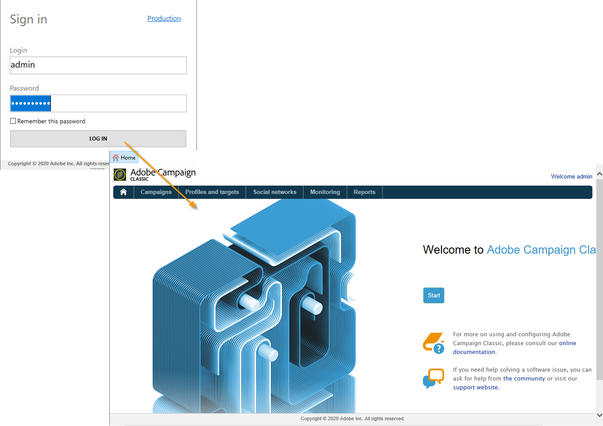
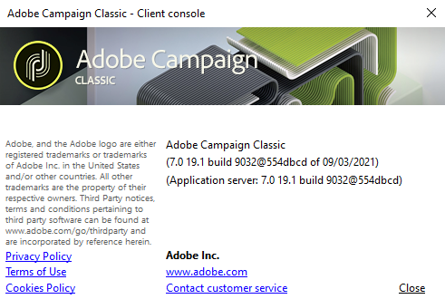

# Inicio de Adobe Campaign{#launching-adobe-campaign}

La consola del cliente de Campaign es un cliente enriquecido que le permite conectarse a sus servidores de aplicaciones de Campaign. Obtenga información sobre cómo descargar y configurar la consola del cliente en [esta página](../../installation/using/installing-the-client-console.md).

>[!CAUTION]
>
>Compruebe la compatibilidad del sistema y las herramientas con la consola del cliente de Adobe Campaign en la [Matriz de compatibilidad](../../rn/using/compatibility-matrix.md#ClientConsoleoperatingsystems)

## Inicio de Adobe Campaign {#starting-adobe-campaign}

Puede iniciar Adobes Campaign seleccionando **[!UICONTROL Start / All Programs / Adobe Campaign v.X / Adobe Campaign client console]**.

La ventana de conexión de la consola del cliente le permite seleccionar o configurar bases de datos existentes y conectarse con un nombre de usuario y una contraseña:

## Conexión a Adobe Campaign {#connecting-to-adobe-campaign}

Puede conectarse a Adobe Campaign con su Adobe ID. Para obtener más información, consulte [esta página](../../integrations/using/about-adobe-id.md).

También puede conectarse con un nombre de usuario y contraseña específicos:

1. Introduzca el identificador de la cuenta del operador en el campo de **[!UICONTROL Login]**.

   El administrador de la plataforma Adobe Campaign proporciona su identificador.

1. Introduzca su contraseña en el campo **[!UICONTROL Password]**.

   La primera vez que acceda a la base de datos, la contraseña es la que le proporciona el administrador. Una vez que esté conectado, puede cambiar la contraseña mediante el menú **[!UICONTROL Tools > Change password...]**. Los detalles sobre operadores y conexiones están disponibles en [Administración de acceso](../../platform/using/access-management.md).

1. Haga clic en **[!UICONTROL LOG IN]** para confirmar.<!--You can also press the **Enter** key to launch connection.-->

Ahora puede acceder al [espacio de trabajo de Adobe Campaign](../../platform/using/adobe-campaign-workspace.md).

Algunos métodos abreviados de teclado están disponibles en **[!UICONTROL Sign in screen]**:
* Todos los elementos procesables se pueden seleccionar mediante las teclas **Tab** (de arriba abajo) o **Tab** + **Mayús** (de abajo arriba).
* Para iniciar la conexión, también puede presionar la tecla **Intro**.
* Puede utilizar la tecla **Escape** para restablecer los campos **[!UICONTROL Login]** y **[!UICONTROL Password]** a los últimos valores de conexión correctos.

## Configuración de conexiones {#setting-up-connections}

Puede acceder a la configuración de conexión del servidor a través del vínculo situado encima del área de entrada.

En la ventana **[!UICONTROL Connections]**, haga clic en **[!UICONTROL Add > Connection]**.

A continuación, debe definir la configuración de conexión. Para ello:

1. Introduzca una **[!UICONTROL Label]** para asignar un nombre a la conexión de base de datos.

1. Añada la dirección del servidor de aplicaciones en el campo **[!UICONTROL URL]**. Si no conoce la dirección URL de conexión, póngase en contacto con el administrador.

1. Consulte **[!UICONTROL Connect with an Adobe ID]** para que los operadores se conecten a la consola con su Adobe ID. Para obtener más información, consulte [esta página](../../integrations/using/about-adobe-id.md).

1. Haga clic en **[!UICONTROL OK]** para validar.

## Operadores y permisos {#operators-and-permissions}

Los identificadores y contraseñas de operadores con acceso al software y sus respectivos permisos se definen mediante el administrador del sistema de Adobe Campaign en el nodo **[!UICONTROL Administration > Access management > Operators]**.

Esta funcionalidad se detalla en la sección [Administración de acceso](../../platform/using/access-management.md).

## Desconexión de Adobe Campaign {#disconnecting-from-adobe-campaign}

Para desconectarse de Adobe Campaign, utilice el primer icono de la barra de iconos.

>[!NOTE]
>
>También puede cerrar la aplicación sin cerrar sesión primero.

## Averiguar su versión de Adobe Campaign {#getting-your-campaign-version}

El menú **[!UICONTROL Help > About...]** le permite acceder a la siguiente información:

* **número de versión** de la consola de cliente de Campaign y del servidor de aplicaciones
* número de **compilación** para la consola de cliente y el servidor de aplicaciones de Campaign
* un vínculo para ponerse en contacto con el Servicio de atención al cliente de Adobe
* vínculos a la Política de privacidad de Adobe, a las Condiciones de uso y a la Política de cookies

Cuando contacte con el equipo de atención al cliente de Adobe, debe proporcionar el número de versión y el número de compilación de la consola del cliente de Adobe Campaign y del servidor de aplicaciones.

Si está ejecutando la versión de [ [!DNL Gold Standard] Campaign ](../../rn/using/gold-standard.md) también debe compartir los caracteres SHA/1 que se muestran en la casilla **[!UICONTROL About]**. Como ejemplo, para la versión Gold **Standard 10**, el número de compilación mostrará la **compilación 9032@efd8a94**, como se muestra a continuación:

Para obtener más información acerca de [!DNL Gold Standard], consulte [este artículo](../../rn/using/gs-overview.md)).

**Temas relacionados**:

* [Opciones de ayuda y asistencia técnica de Adobe Campaign](../../support.md)
* [Distribución de software de Adobe Campaign](https://experience.adobe.com/#/downloads/content/software-distribution/en/campaign.html)
* [Sesiones de expertos y de asistencia de Adobe Experience Cloud](https://helpx.adobe.com/es/enterprise/admin-guide.html/enterprise/using/support-for-experience-cloud.ug.html)
