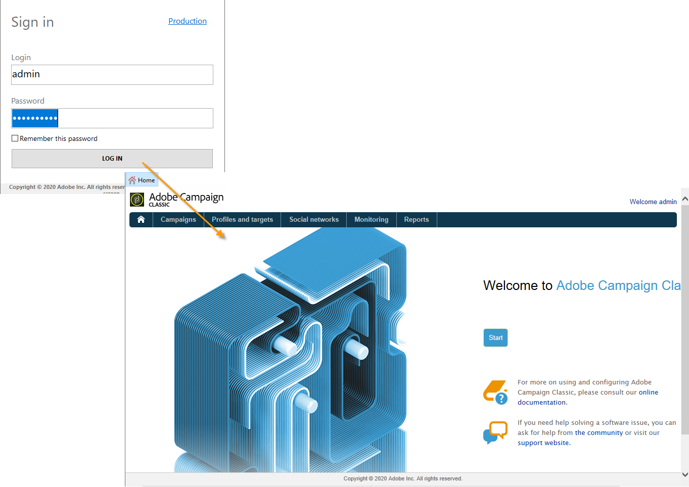

# Lanzamiento de Adobe Campaign {#launching-adobe-campaign}

La consola del cliente de Campaign es un cliente enriquecido que le permite conectarse a sus servidores de aplicaciones de Campaign. Obtenga información sobre cómo descargar y configurar la consola del cliente en [esta página](../../installation/using/installing-the-client-console.md).

>[!CAUTION]
>
>Compruebe la compatibilidad del sistema y las herramientas con la consola del cliente de Adobe Campaign en la [Matriz de compatibilidad](../../rn/using/compatibility-matrix.md#ClientConsoleoperatingsystems)

## Inicio de Adobe Campaign {#starting-adobe-campaign}

Puede iniciar Adobes Campaign seleccionando **[!UICONTROL Start / All Programs / Adobe Campaign v.X / Adobe Campaign client console]**.

La ventana de conexión de la consola del cliente le permite seleccionar o configurar bases de datos existentes y conectarse con un nombre de usuario y una contraseña:

## Conexión a Adobe Campaign {#connecting-to-adobe-campaign}

### Conexión mediante el Adobe ID

Los usuarios de Campaign se conectan a la consola de Adobe Campaign mediante su Adobe ID a través del sistema de administración de identidades (IMS) de Adobe. Pueden utilizar el mismo ID en todas las soluciones de Adobe. Cada conexión se guarda cuando se utiliza Adobe Campaign con otras soluciones. Obtenga más información sobre Adobe IMS en [esta página](https://helpx.adobe.com/es/enterprise/using/identity.html).

Para configurar la conexión de Campaign Classic v7 con el servicio de administración de identidades (IMS) de Adobe, consulte [esta página](../../integrations/using/about-adobe-id.md).

Una vez completada la configuración, aprenda a conectarse a Campaign con su Adobe ID en la [documentación de Campaign v8 (consola)](https://experienceleague.adobe.com/es/docs/campaign/campaign-v8/new/connect){target=_blank}.

### Conexión con un inicio de sesión o una contraseña

También puede conectarse con un nombre de usuario y contraseña específicos. Esta conexión se conoce como &#39;Autenticación nativa&#39; de Campaign:

1. Introduzca el identificador de la cuenta del operador en el campo de **[!UICONTROL Login]**.

   El administrador de la plataforma Adobe Campaign proporciona su identificador.

1. Introduzca su contraseña en el campo **[!UICONTROL Password]**.

   La primera vez que acceda a la base de datos, la contraseña es la que le proporciona el administrador. Una vez que esté conectado, puede cambiar la contraseña mediante el menú **[!UICONTROL Tools > Change password...]**. Los detalles sobre operadores y conexiones están disponibles en [Administración de acceso](../../platform/using/access-management.md).

1. Haga clic en **[!UICONTROL LOG IN]** para confirmar.

Ahora puede acceder al [espacio de trabajo de Adobe Campaign](../../platform/using/adobe-campaign-workspace.md).

## Configuración de conexiones {#setting-up-connections}

Puede acceder a la configuración de conexión del servidor a través del vínculo situado encima del área de entrada.

Aprenda a configurar conexiones en la [documentación de Campaign v8 (consola)](https://experienceleague.adobe.com/es/docs/campaign/campaign-v8/new/connect#create-your-connection){target=_blank}.

## Operadores y permisos {#operators-and-permissions}

Los identificadores y contraseñas de operadores con acceso al software y sus respectivos permisos se definen mediante el administrador del sistema de Adobe Campaign en el nodo **[!UICONTROL Administration > Access management > Operators]**.

Esta funcionalidad se detalla en la sección [Administración de acceso](../../platform/using/access-management.md).

## Obtención de la versión de Adobe Campaign {#getting-your-campaign-version}

El menú **[!UICONTROL Help > About...]** le permite acceder a la siguiente información:

* **número de versión** de la consola de cliente de Campaign y del servidor de aplicaciones
* número de **compilación** para la consola de cliente y el servidor de aplicaciones de Campaign
* un vínculo para ponerse en contacto con el Servicio de atención al cliente de Adobe
* vínculos a la Política de privacidad de Adobe, a las Condiciones de uso y a la Política de cookies

Cuando contacte con el equipo de atención al cliente de Adobe, debe proporcionar el número de versión y el número de compilación de la consola del cliente de Adobe Campaign y del servidor de aplicaciones.

