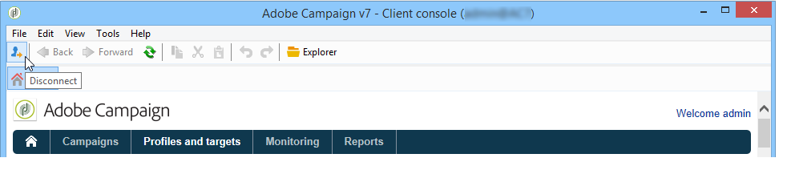

# Ejecutar Adobe Campaign{#launching-adobe-campaign}

La consola del cliente de Campaña es un cliente enriquecido que le permite conectarse a los servidores de aplicaciones de Campaña. Obtenga información sobre cómo descargar y configurar la consola de cliente en [esta página](../../installation/using/installing-the-client-console.md).

## Iniciar Adobe Campaign {#starting-adobe-campaign}

Puede inicio de Adobes Campaign seleccionando **[!UICONTROL Start / All Programs / Adobe Campaign v.X / Adobe Campaign client console]**.

La ventana de conexión de la consola del cliente le permite seleccionar o configurar bases de datos existentes y conectarse con un nombre de usuario y una contraseña:

## Conexión a Adobe Campaign {#connecting-to-adobe-campaign}

Puede conectarse a Adobe Campaign con su Adobe ID. Para obtener más información, consulte [esta página](../../integrations/using/about-adobe-id.md).

También puede conectarse con un nombre de usuario y contraseña específicos:

1. Introduzca el identificador de la cuenta del operador en el campo de **[!UICONTROL login]**.

   El administrador de la plataforma Adobe Campaign proporciona su identificador.

1. Introduzca su contraseña en el campo **[!UICONTROL Password]**.

   La primera vez que acceda a la base de datos, la contraseña es la que le proporciona el administrador. Once you are connected, you can change your password via the **[!UICONTROL Tools > Change password...]** menu. Los detalles sobre operadores y conexiones están disponibles en [Administración de acceso](../../platform/using/access-management.md).

1. Haga clic en **[!UICONTROL Log in]** para confirmar.

Ahora puede acceder al [espacio de trabajo de Adobe Campaign](../../platform/using/adobe-campaign-workspace.md).

## Configuración de las conexiones {#setting-up-connections}

Puede acceder a la configuración de conexión del servidor a través del vínculo situado encima del área de entrada.

In the **[!UICONTROL Connections]** window, click **[!UICONTROL Add > Connection]**.

A continuación, debe definir la configuración de conexión. Para ello:

1. Introduzca una **[!UICONTROL Label]** para asignar un nombre a la conexión de base de datos.

1. Añada la dirección del servidor de aplicaciones en el campo **[!UICONTROL URL]**. Si no conoce la dirección URL de conexión, póngase en contacto con el administrador.

1. Check **[!UICONTROL Connect with an Adobe ID]** for the operators to connect to the console using their Adobe ID. Para obtener más información, consulte [esta página](../../integrations/using/about-adobe-id.md).

1. Haga clic en **[!UICONTROL OK]** para validar.

## Operadores y permisos {#operators-and-permissions}

Los identificadores y contraseñas de operadores con acceso al software y sus respectivos permisos se definen mediante el administrador del sistema de Adobe Campaign en el nodo **[!UICONTROL Administration > Access management > Operators]**.

Esta funcionalidad se detalla en la sección [Administración de acceso](../../platform/using/access-management.md).

## Desconexión de Adobe Campaign {#disconnecting-from-adobe-campaign}

Para desconectarse de Adobe Campaign, utilice el primer icono de la barra de iconos.

>[!NOTE]
>
>También puede cerrar la aplicación sin cerrar sesión primero.

## Su versión de Adobe Campaign {#getting-your-campaign-version}

The **[!UICONTROL Help > About...]** menu lets you access the following information:

* número de **versión**,
* número de **registro**,
* un vínculo para ponerse en contacto con el servicio de asistencia de Adobe Campaign.

   >[!CAUTION]
   >
   >Cuando contacte con el equipo de asistencia de Adobe, debe proporcionar el número de versión y el número de registro de la consola del cliente de Campaign y del servidor de aplicaciones.

