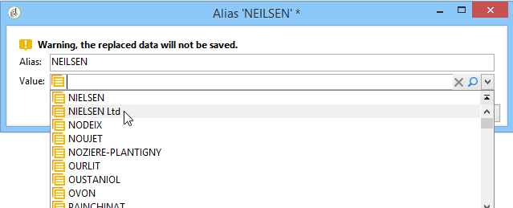

# Administración de enumeraciones{#managing-enumerations}

Una enumeración (también conocida como “lista desglosada”) es una lista de valores sugeridos por el sistema para llenar ciertos campos. Las enumeraciones permiten estandarizar los valores de estos campos y ayudar con la entrada o el uso de los datos en las consultas.

La lista de valores aparece como una lista desplegable desde la que puede seleccionar el valor que se va a introducir en el campo. La lista desplegable también permite la entrada predictiva, en la que el operador introduce las primeras letras y la aplicación rellena el resto.

Algunos de los campos de la consola se han definido con este tipo de enumeraciones. Las enumeraciones se denominan “abiertas” si se pueden agregar valores mediante entrada directa en el campo correspondiente.

## Acceso a valores {#access-to-values}

Los valores de este tipo de campo se definen y la administración general de estos campos (adición o eliminación de un valor) se realiza a través del nodo **[!UICONTROL Administration > Platform > Enumerations]** del árbol.

* La sección superior ofrece una lista de campos para los que se ha definido una lista detallada.
* En la sección inferior se enumeran los valores propuestos. Estos valores se repiten en los editores que utilicen este campo.

   

   Para crear un nuevo valor de enumeración, haga clic en **[!UICONTROL Add]**.

   

   Si se selecciona la opción **[!UICONTROL Open]** el usuario puede añadir un nuevo valor de lista desglosada directamente en el campo correspondiente. Un mensaje de confirmación le permite crear este valor.

   

* Si se selecciona la opción **[!UICONTROL Closed]**, los usuarios no pueden crear nuevos valores, sino que solo pueden elegir entre los valores disponibles.

## Estandarización de datos {#standardizing-data}

### Acerca de la limpieza de alias {#about-alias-cleansing}

En los campos de lista desglosada se pueden introducir valores distintos a los valores de enumeración. Pueden almacenarse tal cual o se puede ejecutar una limpieza.

>[!CAUTION]
>
>La limpieza de datos es un proceso esencial que afecta a los datos de la base de datos. Adobe Campaign realiza actualizaciones de datos masivas que pueden dar lugar a la eliminación de algunos valores. Por lo tanto, esta operación queda reservada para usuarios expertos.

Por tanto, el valor introducido:

* Se agrega a los valores de lista desglosada: en este caso se debe seleccionar la opción **[!UICONTROL Open]**,
* o sustituido automáticamente por su correspondiente: En este caso, este caso debe definirse en la ficha **[!UICONTROL Alias]** Alias de la lista de elementos.
* o se debe almacenar en la lista de alias: se le asigna un alias más adelante.

   >[!NOTE]
   >
   >Si necesita utilizar las funciones de limpieza de datos, seleccione la opción **[!UICONTROL Alias cleansing]** en la lista desglosada.

### Uso de alias {#using-aliases}

La opción **[!UICONTROL Alias cleansing]** permite utilizar un alias para la lista desglosada seleccionada. Cuando se selecciona esta opción, la pestaña **[!UICONTROL Alias]** aparece en la parte inferior de la ventana.

#### Creación de un alias {#creating-an-alias}

Para crear un alias, haga clic en **[!UICONTROL Add]**.

Introduzca el alias que desea convertir y el valor que se va a aplicar y haga clic en **[!UICONTROL Ok]**.

Compruebe los parámetros antes de confirmar esta operación.

>[!CAUTION]
>
>Una vez confirmado este paso, es posible que los valores introducidos anteriormente no se puedan recuperar: se han sustituido.

Por lo tanto, cuando un usuario introduce el valor **NEILSEN** en un campo “empresa” (en la consola de Adobe Campaign o en un formulario), este se sustituye automáticamente por el valor **NIELSEN Ltd**. El flujo de trabajo de **Limpieza de alias** lleva a cabo el reemplazo del valor. Consulte [Ejecución de la limpieza de datos](#running-data-cleansing).

#### Conversión de valores en alias {#converting-values-into-aliases}

Para convertir un valor de enumeración en un alias, haga clic con el botón derecho en la lista de valores y seleccione **[!UICONTROL Convert values into aliases...]**.

Seleccione los valores que desea convertir y haga clic en **[!UICONTROL Next]**.

Haga clic en **[!UICONTROL Start]** para ejecutar la conversión.

Una vez finalizada la ejecución, el alias se añade a la lista de alias.

#### Recuperación de visitas de alias {#retrieving-alias-hits}

Los valores introducidos por los usuarios se pueden convertir en alias. De hecho, cuando el usuario introduce un valor que no está incluido en la lista desglosada, el valor se almacena en la pestaña **[!UICONTROL Alias]**.

El flujo de trabajo técnico de **Limpieza de alias** recupera estos valores cada noche a fin de actualizar la lista desglosada. Consulte [Ejecución de la limpieza de datos](#running-data-cleansing)

Si es necesario, la columna **[!UICONTROL Hits]** puede mostrar el número de veces que se introdujo este valor. El cálculo de este valor puede consumir tiempo y memoria. Para obtener más información, consulte [Cálculo de ocurrencias de entrada](#calculating-entry-occurrences).

### Ejecución de limpieza de datos {#running-data-cleansing}

La limpieza de datos se realiza mediante el flujo de trabajo técnico **[!UICONTROL Alias cleansing]**. Las configuraciones definidas para las enumeraciones se aplican durante la ejecución. Consulte [Flujo de trabajo de limpieza de alias](#alias-cleansing-workflow).

La limpieza se puede activar mediante el vínculo **[!UICONTROL Cleanse values...]**.

El vínculo **[!UICONTROL Advanced parameters...]** permite establecer la fecha de comienzo a partir de la que se tienen en cuenta los valores recopilados.

Haga clic en el botón **[!UICONTROL Start]** para ejecutar la limpieza de datos.

#### Cálculo de las ocurrencias de entrada {#calculating-entry-occurrences}

La subpestaña **[!UICONTROL Alias]** de una lista desglosada puede mostrar el número de apariciones de un alias entre todos los valores introducidos. Esta información es una estimación y se muestra en la columna **[!UICONTROL Hits]**.

>[!CAUTION]
>
>El cálculo de las apariciones de las entradas de un alias puede llevar mucho tiempo. Por eso se debe tener precaución al utilizar esta función.

Se puede ejecutar el cálculo de visitas manualmente mediante el vínculo **[!UICONTROL Cleanse values...]**. Para ello, haga clic en el vínculo **[!UICONTROL Advanced parameters...]** y seleccione las opciones deseadas.

* **[!UICONTROL Update the number of alias hits]**: esto permite actualizar las visitas que ya se han calculado, en función de la fecha ingresada.
* **[!UICONTROL Recalculate the number of alias hits from the start]**: permite ejecutar el cálculo en toda la plataforma de Adobe Campaign.

Asimismo, se puede crear un flujo de trabajo dedicado para que el cálculo se ejecute automáticamente durante un periodo determinado, por ejemplo, una vez por semana.

Para ello, cree una copia del flujo de trabajo **[!UICONTROL Alias cleansing]**, cambie el planificador y utilice la siguiente configuración en la actividad **[!UICONTROL Enumeration value cleansing]**:

* **-updateHits** para actualizar el número de visitas de alias,
* **-updateHits:full** para volver a calcular todas las visitas de alias.

#### Flujo de trabajo de limpieza de alias {#alias-cleansing-workflow}

El flujo de trabajo de **Limpieza de alias** ejecuta la limpieza de los valores de las enumeraciones. Se ejecuta a diario de forma predeterminada.

Se accede a través del nodo **[!UICONTROL Administration > Production > Technical workflows]**.

