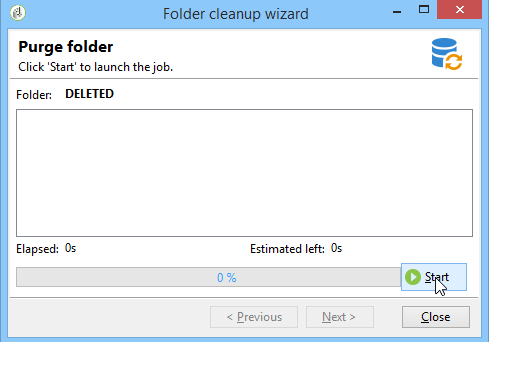

# Administración de perfiles{#managing-profiles}

## Árbol de destinatario {#recipient-tree}

Para acceder a las funcionalidades avanzadas de administración de destinatarios, debe editar el árbol de Adobe Campaign. Para ello, haga clic en el botón **[!UICONTROL Explorer]** de la barra de herramientas.

De forma predeterminada, los destinatarios se almacenan en el nodo **[!UICONTROL Profiles and targets]** del árbol de Adobe Campaign. En el mismo nodo, puede crear una o varias carpetas y subcarpetas para almacenar perfiles de destinatario.

Cada nodo coincide con una carpeta. Los datos de cada carpeta deben considerarse separados entre ellos. Esto significa que la administración de duplicación será más complicada para varias carpetas de destinatarios.

>[!NOTE]
>
> * Para mostrar la lista de todos los destinatarios de la base de datos, debe crear una vista. Obtenga más información en la [documentación de la versión 8 de Campaign (consola)](https://experienceleague.adobe.com/es/docs/campaign/campaign-v8/config/configuration/folders-and-views){target=_blank}.
>
> * Para obtener más información sobre cómo administrar los perfiles, consulte la [documentación de Campaign v8](https://experienceleague.adobe.com/es/docs/campaign/campaign-v8/config/configuration/folders-and-views){target=_blank}.

<!--
## Move recipients {#moving-recipients}

You can select one or more recipients, drag them from the recipient list, and drop them in the desired folder. A warning message asks you to confirm this action.

## Copy a recipient {#copying-a-recipient}

You can copy a recipient in the same folder by right-clicking the desired recipient and selecting **[!UICONTROL Copy]**.

## Delete recipients {#deleting-recipients}

To delete recipients, move them to a specific folder and then purge the content of this folder. It is **strongly recommended not to use** the **[!UICONTROL Delete]** option in this case.

To purge a folder, use the **[!UICONTROL Actions > Purge folder]** menu, accessed by right-clicking the desired folder.

Click **[!UICONTROL Start]** to launch the operation. The middle section of the window displays the progress status, as shown below:

-->