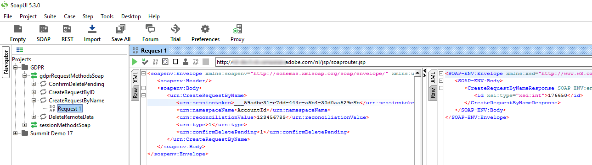

<?xml version="1.0" encoding="UTF-8"?>
<xliff xmlns="urn:oasis:names:tc:xliff:document:1.2" xmlns:okp="okapi-framework:xliff-extensions" xmlns:its="http://www.w3.org/2005/11/its" xmlns:itsxlf="http://www.w3.org/ns/its-xliff/" version="1.2" its:version="2.0">
<file original="help/platform/using/privacy-requests-api.md.mdnouisc" source-language="en-US" target-language="en-XX" datatype="x-text/markdown">
<body>
<trans-unit id="tu17" xml:space="preserve">
<source xml:lang="en-US">https://experienceleague.adobe.com/es/tools/campaign-api</source>
<target xml:lang="en-XX">https://experienceleague.adobe.com/es/tools/campaign-api</target>
</trans-unit>
<trans-unit id="tu1" restype="x-YAML_METADATA_HEADER_VALUE" xml:space="preserve">
<source xml:lang="en-US">Automatic Privacy request process</source>
<target xml:lang="en-XX">Proceso de solicitud de privacidad automática</target>
</trans-unit>
<trans-unit id="tu2" restype="x-YAML_METADATA_HEADER_VALUE" xml:space="preserve">
<source xml:lang="en-US">Learn how to setup an automatic Privacy request process</source>
<target xml:lang="en-XX">Obtenga información sobre cómo configurar un proceso de solicitud de privacidad automática</target>
</trans-unit>
<trans-unit id="tu3" xml:space="preserve">
<source xml:lang="en-US">Automatic Privacy request process</source>
<target xml:lang="en-XX">Proceso de solicitud de privacidad automática</target>
</trans-unit>
<trans-unit id="tu4" xml:space="preserve">
<source xml:lang="en-US">Adobe Campaign provides an <ph id="1" ctype="x-STRONG_EMPHASIS">**</ph>API<ph id="2" ctype="x-STRONG_EMPHASIS">**</ph> which allows you to setup an automatic Privacy request process.</source>
<target xml:lang="en-XX">Adobe Campaign proporciona una <ph id="1" ctype="x-STRONG_EMPHASIS">**</ph>API<ph id="2" ctype="x-STRONG_EMPHASIS">**</ph> que le permite configurar un proceso automático de solicitud de privacidad.</target>
</trans-unit>
<trans-unit id="tu5" xml:space="preserve">
<source xml:lang="en-US">With the API, the general Privacy process is the same as <ph id="1" ctype="x-LINK">[</ph>using the interface<ph id="2" ctype="x-LINK">](privacy-requests-ui.md)</ph>. The only difference is the creation of the Privacy request. Instead of creating the request in Adobe Campaign, a POST containing the request information is sent to Campaign. For every request, a new entry is added in the <ph id="3" ctype="x-STRONG_EMPHASIS">**[!UICONTROL Privacy Requests]**</ph> screen. The Privacy technical workflows then process the request, the same way as for a request added using the interface.</source>
<target xml:lang="en-XX">Con la API, el proceso de privacidad general es el mismo que <ph id="1" ctype="x-LINK">[</ph>usar la interfaz<ph id="2" ctype="x-LINK">](privacy-requests-ui.md)</ph>. La única diferencia es la creación de la solicitud de privacidad. En lugar de crear la solicitud en Adobe Campaign, se envía a Campaign un POST que la contiene. Para cada solicitud, se agrega una nueva entrada en la pantalla <ph id="3" ctype="x-STRONG_EMPHASIS">**[!UICONTROL Privacy Requests]**</ph>. Los flujos de trabajo técnicos de privacidad procesan entonces la solicitud, tal como lo harían con una solicitud añadida mediante la interfaz.</target>
</trans-unit>
<trans-unit id="tu6" xml:space="preserve">
<source xml:lang="en-US">If you're using the API to submit Privacy requests, we recommend that you leave the <ph id="1" ctype="x-STRONG_EMPHASIS">**</ph>2-step process<ph id="2" ctype="x-STRONG_EMPHASIS">**</ph> activated for the first Delete requests, in order to test the returned data. When your tests are finished, you can deactivate the 2-step process so that the Delete request process can run automatically.</source>
<target xml:lang="en-XX">Si utiliza la API para enviar solicitudes de privacidad, recomendamos que deje activado el <ph id="1" ctype="x-STRONG_EMPHASIS">**</ph>proceso de 2 pasos<ph id="2" ctype="x-STRONG_EMPHASIS">**</ph> para las primeras solicitudes de eliminación para probar los datos devueltos. Cuando haya terminado las pruebas, puede desactivar el procesamiento en 2 pasos para que el proceso de eliminación de solicitudes se pueda ejecutar automáticamente.</target>
</trans-unit>
<trans-unit id="tu7" xml:space="preserve">
<source xml:lang="en-US">The <ph id="1" ctype="x-STRONG_EMPHASIS">**[!UICONTROL CreateRequestByName]**</ph> JS API is defined as follows.</source>
<target xml:lang="en-XX">La API de JS <ph id="1" ctype="x-STRONG_EMPHASIS">**[!UICONTROL CreateRequestByName]**</ph> se define de la siguiente manera.</target>
</trans-unit>
<trans-unit id="tu8" xml:space="preserve">
<source xml:lang="en-US"><ph id="1" ctype="x-regxph" equiv-text="&lbrack;!NOTE">[!NOTE]</ph></source>
<target xml:lang="en-XX"><ph id="1" ctype="x-regxph" equiv-text="&lbrack;!NOTE">[!NOTE]</ph></target>
</trans-unit>
<trans-unit id="tu9" xml:space="preserve">
<source xml:lang="en-US">If you were using the <ph id="1" ctype="x-STRONG_EMPHASIS">**</ph>gdprRequest<ph id="2" ctype="x-STRONG_EMPHASIS">**</ph> API, you can still use it but it is recommended to use the new <ph id="3" ctype="x-STRONG_EMPHASIS">**</ph>privacyRequest<ph id="4" ctype="x-STRONG_EMPHASIS">**</ph> API.</source>
<target xml:lang="en-XX">Si estaba utilizando la API <ph id="1" ctype="x-STRONG_EMPHASIS">**</ph>gdprRequest<ph id="2" ctype="x-STRONG_EMPHASIS">**</ph>, puede hacerlo, pero se recomienda utilizar la nueva API <ph id="3" ctype="x-STRONG_EMPHASIS">**</ph>privacyRequest<ph id="4" ctype="x-STRONG_EMPHASIS">**</ph>.</target>
</trans-unit>
<trans-unit id="tu10" xml:space="preserve">
<source xml:lang="en-US"><ph id="1" ctype="x-regxph" equiv-text="&lbrack;!IMPORTANT">[!IMPORTANT]</ph></source>
<target xml:lang="en-XX"><ph id="1" ctype="x-regxph" equiv-text="&lbrack;!IMPORTANT">[!IMPORTANT]</ph></target>
</trans-unit>
<trans-unit id="tu11" xml:space="preserve">
<source xml:lang="en-US">The <ph id="1" ctype="x-STRONG_EMPHASIS">**[!UICONTROL Privacy Data Right]**</ph> named right is required to use the API.</source>
<target xml:lang="en-XX">Se requiere el <ph id="1" ctype="x-STRONG_EMPHASIS">**[!UICONTROL Privacy Data Right]**</ph> nombrado para utilizar la API.</target>
</trans-unit>
<trans-unit id="tu12" xml:space="preserve">
<source xml:lang="en-US"><ph id="1" ctype="x-regxph" equiv-text="&lbrack;!NOTE">[!NOTE]</ph></source>
<target xml:lang="en-XX"><ph id="1" ctype="x-regxph" equiv-text="&lbrack;!NOTE">[!NOTE]</ph></target>
</trans-unit>
<trans-unit id="tu13" xml:space="preserve">
<source xml:lang="en-US">The 'regulation' field is only available if you are using Campaign Classic 20.2 (build 9178+).</source>
<target xml:lang="en-XX">El campo "Regulación" solo está disponible si utiliza Campaign Classic 20.2 (versión 9178+).</target>
</trans-unit>
<trans-unit id="tu14" xml:space="preserve">
<source xml:lang="en-US">If you are migrating to 20.2 and if you were already using the API, you must add the ‘regulation’ field as shown above. If you are using a previous build, you can continue to use the API without the ‘regulation’ field.</source>
<target xml:lang="en-XX">Si migra a 20.2 y ya estaba utilizando la API, debe añadir el campo "Regulación" como se muestra arriba. Si está utilizando una versión anterior, puede seguir utilizando la API sin el campo "regulación".</target>
</trans-unit>
<trans-unit id="tu15" xml:space="preserve">
<source xml:lang="en-US">Invoking the API externally</source>
<target xml:lang="en-XX">Llamada a la API externamente</target>
</trans-unit>
<trans-unit id="tu16" xml:space="preserve">
<source xml:lang="en-US">Here is an example of how you can invoke the API externally (authentication via the API and details about the Privacy API specifically). For more information on the Privacy API, consult the <ph id="1" ctype="x-LINK">&lbrack;</ph>API documentation<ph id="2" ctype="x-LINK">[#$tu17]</ph>. You can also consult the <ph id="3" ctype="x-LINK">[</ph>Web service calls documentation<ph id="4" ctype="x-LINK">](../../configuration/using/web-service-calls.md)</ph>.</source>
<target xml:lang="en-XX">Aquí se muestra un ejemplo de cómo puede invocar la API externamente (autenticación mediante la API y detalles específicos sobre la API de privacidad). Para obtener más información sobre la API de privacidad, consulte la <ph id="1" ctype="x-LINK">&lbrack;</ph>documentación de la API<ph id="2" ctype="x-LINK">[#$tu17]</ph>. También puede consultar la <ph id="3" ctype="x-LINK">[</ph>documentación de llamadas al servicio web<ph id="4" ctype="x-LINK">](../../configuration/using/web-service-calls.md)</ph>.</target>
</trans-unit>
<trans-unit id="tu18" xml:space="preserve">
<source xml:lang="en-US">First of all, you need to perform the authentication via the API:</source>
<target xml:lang="en-XX">En primer lugar, debe realizar la autenticación mediante la API:</target>
</trans-unit>
<trans-unit id="tu19" xml:space="preserve">
<source xml:lang="en-US">Download the <ph id="1" ctype="x-STRONG_EMPHASIS">**</ph>xtk<ph id="2" ctype="x-inline-directive">:session**</ph> WSDL via this url: <ph id="4" ctype="x-STRONG_EMPHASIS">**`&lt;server url>`</ph>/nl/jsp/schemawsdl.jsp?schema=xtk<ph id="6" ctype="x-inline-directive">:session**</ph>.</source>
<target xml:lang="en-XX">Descargue el WSDL <ph id="1" ctype="x-STRONG_EMPHASIS">**</ph>xtk<ph id="2" ctype="x-inline-directive">:session**</ph> mediante esta dirección URL: <ph id="4" ctype="x-STRONG_EMPHASIS">**`&lt;server url>`</ph>/nl/jsp/schemawsdl.jsp?schema=xtk<ph id="6" ctype="x-inline-directive">:session**</ph>.</target>
</trans-unit>
<trans-unit id="tu20" xml:space="preserve">
<source xml:lang="en-US">Use the "Logon" method and pass in a username and password as parameters in the request. You will get a response containing a session token. Here is an example using SoapUI.</source>
<target xml:lang="en-XX">Utilice el método "Logon" y pase un nombre de usuario y una contraseña como parámetros en la solicitud. Recibirá una respuesta que contenga un token de sesión. A continuación, se muestra un ejemplo con SoapUI.</target>
</trans-unit>
<trans-unit id="tu21" xml:space="preserve">
<source xml:lang="en-US"><ph id="1" ctype="x-IMAGE"></ph></source>
<target xml:lang="en-XX"><ph id="1" ctype="x-IMAGE"></ph></target>
</trans-unit>
<trans-unit id="tu22" xml:space="preserve">
<source xml:lang="en-US">Use the returned Session Token as the authentication for all subsequence API calls. It expires after 24 hours.</source>
<target xml:lang="en-XX">Utilice el token de sesión devuelto como autenticación para todas las llamadas de API posteriores. Caduca a las 24 horas.</target>
</trans-unit>
<trans-unit id="tu23" xml:space="preserve">
<source xml:lang="en-US">Then invoke the Privacy API:</source>
<target xml:lang="en-XX">A continuación, invoque la API de privacidad:</target>
</trans-unit>
<trans-unit id="tu24" xml:space="preserve">
<source xml:lang="en-US">Download the WSDL from this URL: <ph id="1" ctype="x-STRONG_EMPHASIS">**`&lt;server url>`</ph>/nl/jsp/schemawsdl.jsp?schema=nms<ph id="3" ctype="x-inline-directive">:privacyRequest**</ph>.</source>
<target xml:lang="en-XX">Descargue el WSDL a través de esta dirección URL: <ph id="1" ctype="x-STRONG_EMPHASIS">**`&lt;server url>`</ph>/nl/jsp/schemawsdl.jsp?schema=nms<ph id="3" ctype="x-inline-directive">:privacyRequest**</ph>.</target>
</trans-unit>
<trans-unit id="tu25" xml:space="preserve">
<source xml:lang="en-US">Use <ph id="1" ctype="x-STRONG_EMPHASIS">**[!UICONTROL CreateRequestByName]**</ph> to create a specific Privacy request.</source>
<target xml:lang="en-XX">Utilice <ph id="1" ctype="x-STRONG_EMPHASIS">**[!UICONTROL CreateRequestByName]**</ph> para crear una solicitud de privacidad específica.</target>
</trans-unit>
<trans-unit id="tu26" xml:space="preserve">
<source xml:lang="en-US">Here is an example using the <ph id="1" ctype="x-STRONG_EMPHASIS">**[!UICONTROL CreateRequestByName]**</ph>. Note how we use the session token provided above as authentication. The response is the ID of the created request.</source>
<target xml:lang="en-XX">A continuación, se muestra un ejemplo con <ph id="1" ctype="x-STRONG_EMPHASIS">**[!UICONTROL CreateRequestByName]**</ph>. Observe cómo se utiliza el token de sesión proporcionado arriba como autenticación. La respuesta es el ID de la solicitud creada.</target>
</trans-unit>
<trans-unit id="tu27" xml:space="preserve">
<source xml:lang="en-US"><ph id="1" ctype="x-IMAGE"></ph></source>
<target xml:lang="en-XX"><ph id="1" ctype="x-IMAGE"></ph></target>
</trans-unit>
<trans-unit id="tu28" xml:space="preserve">
<source xml:lang="en-US">To help you perform the steps above, consider the following:</source>
<target xml:lang="en-XX">Para que pueda realizar los pasos anteriores, tenga en cuenta lo siguiente:</target>
</trans-unit>
<trans-unit id="tu29" xml:space="preserve">
<source xml:lang="en-US">You can use a <ph id="1" ctype="x-STRONG_EMPHASIS">**</ph>queryDef<ph id="2" ctype="x-STRONG_EMPHASIS">**</ph> on the <ph id="3" ctype="x-STRONG_EMPHASIS">**</ph>nms<ph id="4" ctype="x-inline-directive">:gdprRequest**</ph> schema to check the status of the Access request.</source>
<target xml:lang="en-XX">Puede utilizar un <ph id="1" ctype="x-STRONG_EMPHASIS">**</ph>queryDef<ph id="2" ctype="x-STRONG_EMPHASIS">**</ph> en el esquema <ph id="3" ctype="x-STRONG_EMPHASIS">**</ph>nms<ph id="4" ctype="x-inline-directive">:gdprRequest**</ph> para comprobar el estado de la solicitud de acceso.</target>
</trans-unit>
<trans-unit id="tu30" xml:space="preserve">
<source xml:lang="en-US">You can use a <ph id="1" ctype="x-STRONG_EMPHASIS">**</ph>queryDef<ph id="2" ctype="x-STRONG_EMPHASIS">**</ph> on the <ph id="3" ctype="x-STRONG_EMPHASIS">**</ph>nms<ph id="4" ctype="x-inline-directive">:gdprRequestData**</ph> schema to get the result of the Access request.</source>
<target xml:lang="en-XX">Puede utilizar un <ph id="1" ctype="x-STRONG_EMPHASIS">**</ph>queryDef<ph id="2" ctype="x-STRONG_EMPHASIS">**</ph> en el esquema <ph id="3" ctype="x-STRONG_EMPHASIS">**</ph>nms<ph id="4" ctype="x-inline-directive">:gdprRequestData**</ph> para obtener el resultado de la solicitud de acceso.</target>
</trans-unit>
<trans-unit id="tu31" xml:space="preserve">
<source xml:lang="en-US">To be able to download the XML file from <ph id="1" ctype="x-STRONG_EMPHASIS">**</ph>"$(serverUrl)'/nms/gdpr.jssp?id='@id"<ph id="2" ctype="x-STRONG_EMPHASIS">**</ph>, you must be logged in and accessing it from an IP that is included in the allowlist. To do this, create a web application allowing you to access the file generated by the JSSP.</source>
<target xml:lang="en-XX">Para poder descargar el archivo XML desde <ph id="1" ctype="x-STRONG_EMPHASIS">**</ph>"$(serverUrl)'/nms/gdpr.jssp?id='@id"<ph id="2" ctype="x-STRONG_EMPHASIS">**</ph>, debe iniciar sesión y acceder desde una IP incluida en la lista de permitidos. Para ello, cree una aplicación web que le permita acceder al archivo generado por JSSP.</target>
</trans-unit>
<trans-unit id="tu32" xml:space="preserve">
<source xml:lang="en-US">Invoking the API from a JS</source>
<target xml:lang="en-XX">Invocación de la API desde un JS</target>
</trans-unit>
<trans-unit id="tu33" xml:space="preserve">
<source xml:lang="en-US">Here is an example of how you can invoke the API from a JS within Campaign Classic.</source>
<target xml:lang="en-XX">Aquí se muestra un ejemplo de cómo puede invocar la API desde un JS dentro de Campaign Classic.</target>
</trans-unit>
<trans-unit id="tu34" xml:space="preserve">
<source xml:lang="en-US"><ph id="1" ctype="x-regxph" equiv-text="&lbrack;!NOTE">[!NOTE]</ph></source>
<target xml:lang="en-XX"><ph id="1" ctype="x-regxph" equiv-text="&lbrack;!NOTE">[!NOTE]</ph></target>
</trans-unit>
<trans-unit id="tu35" xml:space="preserve">
<source xml:lang="en-US">The 'regulation' field is only available if you are using Campaign Classic 20.2 (build 9178+).</source>
<target xml:lang="en-XX">El campo "Regulación" solo está disponible si utiliza Campaign Classic 20.2 (versión 9178+).</target>
</trans-unit>
<trans-unit id="tu36" xml:space="preserve">
<source xml:lang="en-US">If you are migrating to 20.2 and if you were already using the API, you must add the ‘regulation’ field. If you are using a previous build, you can continue to use the API without the ‘regulation’ field.</source>
<target xml:lang="en-XX">Si migra a 20.2 y ya estaba utilizando la API, debe añadir el campo "Regulación". Si está utilizando una versión anterior, puede seguir utilizando la API sin el campo "regulación".</target>
</trans-unit>
<trans-unit id="tu37" xml:space="preserve">
<source xml:lang="en-US">If you are <ph id="1" ctype="x-STRONG_EMPHASIS">**</ph>using a previous build (with GDPR package)<ph id="2" ctype="x-STRONG_EMPHASIS">**</ph>, you can continue to use the API without the ‘regulation’ field as shown below:</source>
<target xml:lang="en-XX">Si está utilizando <ph id="1" ctype="x-STRONG_EMPHASIS">**</ph>una versión anterior (con el paquete RGPD)<ph id="2" ctype="x-STRONG_EMPHASIS">**</ph>, puede seguir utilizando la API sin el campo Regulación como se muestra a continuación:</target>
</trans-unit>
<trans-unit id="tu38" xml:space="preserve">
<source xml:lang="en-US">If you are <ph id="1" ctype="x-STRONG_EMPHASIS">**</ph>migrating to 20.2<ph id="2" ctype="x-STRONG_EMPHASIS">**</ph> and if you were already using the API, you must add the ‘regulation’ field as shown below:</source>
<target xml:lang="en-XX">Si <ph id="1" ctype="x-STRONG_EMPHASIS">**</ph>migra a 20.2<ph id="2" ctype="x-STRONG_EMPHASIS">**</ph> y ya estaba utilizando la API, debe añadir el campo Regulación como se muestra a continuación:</target>
</trans-unit>
<trans-unit id="tu39" xml:space="preserve">
<source xml:lang="en-US">If you are <ph id="1" ctype="x-STRONG_EMPHASIS">**</ph>using Campaign Classic 20.2 (build 9178+) or above<ph id="2" ctype="x-STRONG_EMPHASIS">**</ph>, the 'regulation' field is optional, as shown below:</source>
<target xml:lang="en-XX">Si <ph id="1" ctype="x-STRONG_EMPHASIS">**</ph>utiliza Campaign Classic 20.2 (versión superior a 9178)<ph id="2" ctype="x-STRONG_EMPHASIS">**</ph>, el campo Regulación es opcional, como se muestra a continuación:</target>
</trans-unit>
</body>
</file>
</xliff>