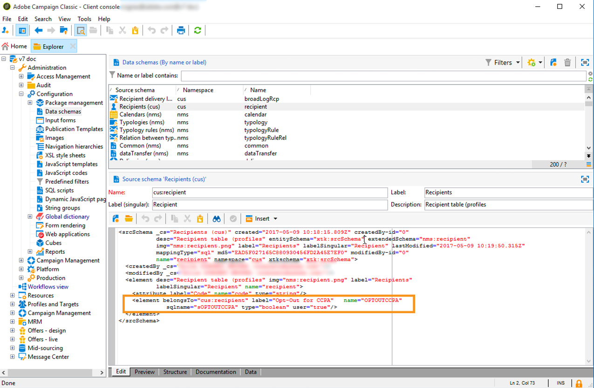

# Exclusión para la venta de información personal (CCPA) {#sale-of-personal-information-ccpa}


La **CCPA** (Ley de Privacidad del Consumidor de California) proporciona a los residentes de California nuevos derechos respecto a su información personal e impone responsabilidades de protección de datos para las entidades que operen en California.

La configuración y el uso de las solicitudes de Acceso y Eliminación son comunes para el RGPD, la y la CCPA. Esta sección presenta la exclusión de la venta de datos personales, que es específica de la CCPA.

Además de las herramientas de [administración de consentimientos](privacy-management.md#consent-management) proporcionadas por Adobe Campaign, puede realizar un seguimiento si el consumidor se ha excluido de la venta de Información personal.

Los contactos pueden decidir, a través de su sistema, no permitir que su información personal se venda a terceros. En Adobe Campaign, podrá almacenar y rastrear esta información.

Para que esto funcione, debe ampliar la tabla Perfiles y agregar un campo de **[!UICONTROL Opt-Out for CCPA]**.

>[!IMPORTANT]
>
>Como controlador de datos, es su responsabilidad recibir la solicitud del sujeto de datos y realizar un seguimiento de las fechas de solicitud para CCPA. Como proveedor de tecnología, solo ofrecemos una manera de optar por la exclusión. Para obtener más información sobre su función como controlador de datos, consulte Datos [personales y Personas](privacy-and-recommendations.md#personal-data).

## Requisito previo {#ccpa-prerequisite}

Para aprovechar esta información, debe crear este campo en Adobe Campaign Classic. Para ello, agregará un campo booleano a la tabla **[!UICONTROL Recipient]**. Cuando se crea un nuevo campo, se vuelve compatible con la API de Campaign de forma automática.

Si utiliza una tabla de destinatarios personalizada, también deberá realizar esta operación.

Para más información sobre cómo crear un campo nuevo, consulte la [documentación de edición de esquema](../../configuration/using/about-schema-edition.md).

>[!IMPORTANT]
>
>La modificación de esquemas es una operación delicada que solo deben realizar los usuarios expertos.

1. Vaya a **[!UICONTROL Tools]** > **[!UICONTROL Advanced]** > **[!UICONTROL Add new fields]**, seleccione **[!UICONTROL Recipients]** como **[!UICONTROL Document type]** y haga clic en **[!UICONTROL Next]**. Para obtener más información sobre cómo añadir campos a una tabla, consulte [esta sección](../../configuration/using/new-field-wizard.md).

   

1. Para **[!UICONTROL Field type]**, seleccione **[!UICONTROL SQL field]**. Para la etiqueta, utilice **[!UICONTROL Opt-Out for CCPA]**. Seleccione el tipo **[!UICONTROL 8-bit integer (boolean)]** y defina la siguiente variable única **[!UICONTROL Relative path]**: @OPTOUTCCPA. Haga clic en **[!UICONTROL Finish]**.

   

   Esto ampliará o creará el esquema **[!UICONTROL Recipient (cus)]**. Haga clic en él para comprobar que el campo se ha agregado correctamente.

   

1. Haga clic en el nodo **[!UICONTROL Configuration]** > **[!UICONTROL Input forms]** del explorador. En **[!UICONTROL Recipient (nms)]**, en Paquete general, añada un elemento `<input>` y use la ruta relativa definida en el paso 2 para el valor xpath. Para obtener más información sobre la identificación de un formulario, consulte [esta sección](../../configuration/using/identifying-a-form.md).

   ```
   <input  colspan="2" type="checkbox" xpath="@OPTOUTCCPA"/>
   ```

   

1. Desconecte y vuelva a conectar. Siga los pasos descritos en la sección siguiente para comprobar que el campo está disponible en los detalles de un destinatario.

## Uso {#usage}

Rellenar el valor del campo y seguir las reglas y directrices de la CCPA relacionadas con la venta de datos es responsabilidad del cliente.

Para rellenar estos valores, se pueden usar varios métodos:

* Uso de la interfaz de Campaign para editar los detalles del destinatario
* Utilización de la API
* a través de un flujo de trabajo de importación de datos.

A continuación, debe asegurarse de que nunca vende a terceros la información personal de los perfiles que han optado por la exclusión.

1. Para cambiar el estado de exclusión, vaya a **[!UICONTROL Profiles and Target]** > **[!UICONTROL Recipients]** y seleccione un destinatario. En la pestaña **[!UICONTROL General]**, verá el campo configurado en la sección anterior.

   

1. Configure la lista destinatarios para que muestre la columna de exclusión Para obtener información sobre cómo configurar listas, consulte la [documentación detallada](../../platform/using/adobe-campaign-workspace.md#configuring-lists).

   

1. Puede hacer clic en la columna para ordenar los destinatarios según la información de exclusión. También puede crear un filtro para mostrar solo los destinatarios que han optado por excluirse. Para obtener más información sobre la creación de filtros, consulte [esta sección](../../platform/using/creating-filters.md).

   
