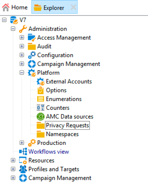

# Creación y administración de solicitudes de privacidad {#privacy-request-ui}


Esta sección describe cómo se pueden crear solicitudes de Acceso y Eliminación, y también cómo las procesa Adobe Campaign.

## Creación de una solicitud de privacidad {#create-privacy-request-ui}

La interfaz de **Adobe Campaign** le permite crear sus solicitudes de privacidad y rastrear su evolución. Para crear una nueva solicitud de privacidad, siga estas instrucciones:

1. Acceda a la carpeta de solicitud de privacidad en **[!UICONTROL Administration]** > **[!UICONTROL Platform]** > **[!UICONTROL Privacy Requests]**.

   

1. Esta pantalla le permite ver todas las solicitudes de privacidad actuales, su estado y los registros. Haga clic en **[!UICONTROL New]** para crear una solicitud de privacidad.

   

1. Seleccione **[!UICONTROL Regulation]** (GDPR, CCPA, PDPA o LGPD), **[!UICONTROL Request type]** (Acceso o Eliminar), seleccione un **[!UICONTROL Namespace]** e introduzca la **[!UICONTROL Reconciliation value]**. Si utiliza el correo electrónico como área de nombres, escriba el correo electrónico del sujeto de datos.

   

Los flujos de trabajo técnicos de privacidad se ejecutan una vez al día y procesan cada nueva solicitud:

* Eliminar solicitud: se borran los datos del destinatario almacenados en Adobe Campaign.
* Solicitudes de acceso: los datos del destinatario almacenados en Adobe Campaign se generan y se ponen a disposición como archivo XML en la parte izquierda de la pantalla de solicitud.


## Lista de tablas {#list-of-tables}

Al realizar una solicitud de privacidad de eliminación o acceso, Adobe Campaign busca todos los datos del sujeto de datos en función de los datos **[!UICONTROL Reconciliation value]** en todas las tablas que tienen un vínculo a la tabla de destinatario (tipo propio).

Esta es la lista de tablas integradas que se tienen en cuenta al realizar solicitudes de privacidad:

* Destinatarios (destinatario)
* Registro de envíos de destinatario (broadLogRcp)
* Registro de seguimiento de destinatario (trackingLogRcp)
* Registro de envíos de evento archivado (broadLogEventHisto)
* Contenido de lista de destinatario (rcpGrpRel)
* Propuesta de oferta de visitante (propositionVisitor)
* Visitantes (visitante)
* Historial de suscripciones (subHisto)
* Suscripciones (suscripción)
* Propuesta de oferta de destinatario (propositionRcp)

Si ha creado tablas personalizadas que tienen un vínculo a la tabla de destinatario (tipo propio), también se tendrán en cuenta. Por ejemplo, si tiene una tabla de transacciones vinculada a la tabla de destinatarios y una tabla de detalles de transacciones vinculada a la tabla de transacciones, ambas se tendrán en cuenta.

>[!IMPORTANT]
>
>Si realiza solicitudes por lotes de privacidad utilizando flujos de trabajo de eliminación de perfiles, tenga en cuenta las siguientes observaciones:
>* La eliminación de perfiles mediante flujos de trabajo no procesa las tablas secundarias.
>* Debe gestionar la eliminación de todas las tablas secundarias.
>* Adobe recomienda crear un flujo de trabajo de ETL que agregue las líneas que se eliminarán en la tabla Acceso a privacidad y que permita que el flujo de trabajo **[!UICONTROL Delete privacy requests data]** realice la eliminación. Sugerimos limitar a 200 perfiles por día para eliminarlos por motivos de rendimiento.

## Estados de solicitud de privacidad {#privacy-request-statuses}

Estos son los distintos estados de las solicitudes de privacidad:

* **[!UICONTROL New]** / **[!UICONTROL Retry pending]**: en curso, el flujo de trabajo aún no ha procesado la solicitud.
* **[!UICONTROL Processing]**/**[!UICONTROL Retry in progress]**: el flujo de trabajo está procesando la solicitud.
* **[!UICONTROL Delete pending]**: el flujo de trabajo ha identificado todos los datos de destinatario que se van a eliminar.
* **[!UICONTROL Delete in progress]**: el flujo de trabajo está procesando la eliminación.
* **[!UICONTROL Delete Confirmation Pending]**(Modo de procesamiento de solicitud de eliminación en 2 pasos): el flujo de trabajo ha procesado la solicitud de acceso. Se solicita confirmación manual para realizar la eliminación. El botón está disponible durante 15 días.
* **[!UICONTROL Complete]**: el procesamiento de la solicitud ha finalizado sin error.
* **[!UICONTROL Error]**: el flujo de trabajo ha encontrado un error. La causa aparece en la lista de solicitudes de privacidad en la columna **[!UICONTROL Request status]**. Por ejemplo, **[!UICONTROL Error data not found]** significa que en la base de datos no se han encontrado datos de destinatario que coincidan con los del sujeto de datos **[!UICONTROL Reconciliation value]** .

## Proceso de dos pasos {#two-step-process}

El **procesamiento en 2 pasos** está activado de forma predeterminada. Cuando se crea una nueva solicitud de eliminación con este modo, Adobe Campaign siempre realiza primero una solicitud de acceso. Esto le permite comprobar los datos antes de confirmar la eliminación.

Puede cambiar este modo desde la pantalla de edición de solicitud de privacidad. Haga clic en **[!UICONTROL Advanced settings]**.


Con el modo de 2 pasos activado, el estado de una nueva solicitud de eliminación cambia a **[!UICONTROL Confirm Delete Pending]**. Descargue el archivo XML generado desde la pantalla de solicitud de privacidad y compruebe los datos. Para confirmar la eliminación de datos, haga clic en el botón **[!UICONTROL Confirm delete data]**.


## URL de JSSP {#jspp-url}

Al procesar solicitudes de acceso, Adobe Campaign genera un JSSP que recupera los datos del destinatario de la base de datos y los exporta a un archivo XML almacenado en el equipo local. La dirección URL de JSSP se define de la siguiente manera:

```
"$(serverUrl)+'/nms/gdpr.jssp?id='+@id"
```

donde @id es el ID de solicitud de privacidad.

Esta URL se almacena en el campo **[!UICONTROL "File location" (@urlFile)]** del esquema **[!UICONTROL Privacy Requests (gdprRequest)]**.

La información está disponible en la base de datos durante 90 días. Una vez que el flujo de trabajo técnico ha limpiado la solicitud, la información se elimina de la base de datos y la dirección URL queda obsoleta. Verifique que la dirección URL siga siendo válida antes de descargar los datos de una página web.

Este es un ejemplo del archivo de datos de un sujeto de datos:


Los controladores de datos pueden crear fácilmente una aplicación web que incluya la URL de JSSP correspondiente para que el archivo de datos del sujeto de datos esté disponible desde una página web.


Este es un fragmento de código que puede utilizar como ejemplo en la actividad **[!UICONTROL Page]** de la aplicación web.


```
<!DOCTYPE html PUBLIC "-//W3C//DTD XHTML 1.0 Transitional//EN" "http://www.w3.org/TR/xhtml1/DTD/xhtml1-transitional.dtd"> <html xmlns="http://www.w3.org/1999/xhtml"> <head> <meta http-equiv="Content-Language" content="en"> <meta http-equiv="Content-Type" content="text/html; charset=utf-8" /> <link rel="stylesheet" type="text/css" href="/nl/webForms/landingPage.css"/> <title>Clickthrough</title> <style type="text/css" media="all"> /* override formulary area */ .formulary { top: 200px; position: absolute; left: 0; } </style> </head> <body style="" class="">
<center>
<div id="wrap">
<div id="header">
<div class="header-title center-title">DOWNLOAD GDPR DATA</div>
<div class="formulary center-formulary"><form>
<div class="button large-button"><a href=[SERVER_URL]/nms/gdpr.jssp?id=13000" data-nl-type="externalLink">CLICK TO DOWNLOAD</a></div>
</form></div>
</div>
<div id="content">
<div class="row">
<div class="info">
<div class="desc">
<div class="title">EFFICIENCY</div>
<div class="desc">Our service is guaranteed to improve your efficiency. Increase performance and use our high-technology service to implement even the most ambitious of projects.</div>
</div>
</div>
</div>
</div>
<div id="footer">
<div style="text-align: center;">
<div style="float: left;"><a href="#">Contact us</a></div>
<div style="float: right;">&copy; Copyrights</div>
<div><a href="#"></a> <a href="#"></a> <a href="#"></a> <a href="#"></a></div>
</div>
</div>
</div>
</center>
</body> </html>
```

Dado que el acceso al archivo de datos del sujeto de datos está restringido, el acceso anónimo a la página web debe deshabilitarse. Solo el operador con el **[!UICONTROL Privacy Data Right]** denominado puede iniciar sesión en la página y descargar los datos.
