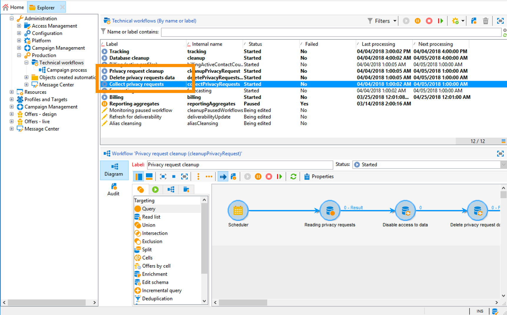

# Administración de solicitudes de privacidad {#privacy-requests}

Para una presentación general sobre la Administración de la privacidad, consulte [esta sección](../../platform/using/privacy-management.md).

Esta información se aplica al RGPD, la CCPA, la PDPA y la LGPD. Para obtener más información sobre estas normativas, consulte [esta sección](../../platform/using/privacy-management.md#privacy-management-regulations).

La opción de exclusión de la Venta de información personal, que es específica de la CCPA, se explica en esta [sección](#sale-of-personal-information-ccpa).

<!--Installation procedures described in this document are applicable starting Campaign Classic 18.4 (build 8931+). If you are running on a previous version, refer to this [technote](https://helpx.adobe.com/campaign/kb/how-to-install-gdpr-package-on-legacy-versions.html).-->

## Acerca de las solicitudes de privacidad {#about-privacy-requests}

Para facilitarle la preparación de la privacidad, Adobe Campaign le permite gestionar solicitudes de acceso y eliminación. El **derecho al acceso** y el **derecho a ser olvidado** (solicitud de eliminación) se describen en [esta sección](../../platform/using/privacy-management.md#right-access-forgotten).

Veamos cómo se pueden crear solicitudes de Acceso y Eliminación, y también cómo las procesa Adobe Campaign.

### Principios {#principles}

Adobe Campaign ofrece a los controladores de datos dos posibilidades para realizar solicitudes de Acceso y Eliminación de privacidad:

* A través de **la interfaz de Adobe Campaign**: por cada solicitud de privacidad, el controlador de datos crea una nueva solicitud de privacidad en Adobe Campaign. Consulte [esta sección](#create-privacy-request-ui).
* A través de la **API**: Adobe Campaign proporciona una API que permite el procesamiento automático de solicitudes de privacidad mediante SOAP. Consulte [esta sección](#automatic-privacy-request-api).

>[!NOTE]
>
>Para obtener más información sobre los datos personales y las distintas entidades que administran los datos (controlador de datos, procesador de datos y sujeto de datos), consulte [Datos personales y personas](../../platform/using/privacy-and-recommendations.md#personal-data).

### Requisitos previos {#prerequesites}

Adobe Campaign oferta las herramientas de los controladores de datos para crear y procesar solicitudes de privacidad de datos almacenados en Adobe Campaign. Sin embargo, es responsabilidad del controlador de datos administrar la relación con el sujeto de datos (correo electrónico, atención al cliente o un portal web).

Por ello, es responsabilidad del controlador de datos confirmar la identidad del sujeto de datos que realiza la solicitud y confirmar que la información devuelta al solicitante sea sobre el sujeto de datos.

### Instalación del paquete de privacidad {#install-privacy-package}

Para utilizar esta funcionalidad, debe instalar el **[!UICONTROL Privacy Data Protection Regulation]** paquete mediante el menú **[!UICONTROL Tools]** > **[!UICONTROL Advanced]** > **[!UICONTROL Import package]** > **[!UICONTROL Adobe Campaign Package]**. Para obtener más información sobre cómo instalar paquetes, consulte la [documentación detallada](../../installation/using/installing-campaign-standard-packages.md).

Dos carpetas nuevas, específicas de Privacidad, en **[!UICONTROL Administration]** > **[!UICONTROL Platform]**:

* **[!UICONTROL Privacy Requests]**: aquí es donde creará sus solicitudes de privacidad y rastreará su evolución.
* **[!UICONTROL Namespaces]**: aquí es donde definirá el campo que se utilizará para identificar el sujeto de datos en la base de datos de Adobe Campaign.


En **[!UICONTROL Administration]** > **[!UICONTROL Production]** > **[!UICONTROL Technical workflows]**, se ejecutan tres flujos de trabajo técnicos cada día para procesar las solicitudes de privacidad.



* **[!UICONTROL Collect privacy requests]**: este flujo de trabajo genera los datos del destinatario almacenados en Adobe Campaign y lo hace disponibles para su descarga en la pantalla de la solicitud de privacidad.
* **[!UICONTROL Delete privacy requests data]**: este flujo de trabajo elimina los datos del destinatario almacenados en Adobe Campaign.
* **[!UICONTROL Privacy request cleanup]**: este flujo de trabajo borra los archivos de solicitud de acceso anteriores a 90 días.

En **[!UICONTROL Administration]** > **[!UICONTROL Access Management]** > **[!UICONTROL Named rights]**, se ha añadido el **[!UICONTROL Privacy Data Right]** asignado. Se requiere este derecho asignado para que los controladores de datos puedan utilizar las herramientas de privacidad. Esto les permite crear nuevas solicitudes, rastrear su evolución, utilizar la API, etc.


### Áreas de nombres {#namesspaces}

Antes de crear solicitudes de privacidad, debe definir el área de nombres que utilizará. Esta es la clave que se utiliza para identificar el sujeto de datos en la base de datos de Adobe Campaign.

Hay tres áreas de nombres predeterminadas disponibles: correo electrónico, teléfono y teléfono móvil. Si necesita un área de nombres diferente (por ejemplo, un campo personalizado de destinatario), puede crear una nueva desde **[!UICONTROL Administration]** > **[!UICONTROL Platform]** > **[!UICONTROL Namespaces]**.

## Creación de una solicitud de privacidad {#create-privacy-request-ui}

La interfaz de **Adobe Campaign** le permite crear sus solicitudes de privacidad y rastrear su evolución. Para crear una nueva solicitud de privacidad, siga estas instrucciones:

1. Acceda a la carpeta de solicitud de privacidad en **[!UICONTROL Administration]** > **[!UICONTROL Platform]** > **[!UICONTROL Privacy Requests]**.

   

1. Esta pantalla le permite ver todas las solicitudes de privacidad actuales, su estado y los registros. Haga clic en **[!UICONTROL New]** para crear una solicitud de privacidad.

   

1. Seleccione **[!UICONTROL Regulation]** (GDPR, CCPA, PDPA o LGPD), **[!UICONTROL Request type]** (Acceso o Eliminar), seleccione un **[!UICONTROL Namespace]** e introduzca la **[!UICONTROL Reconciliation value]**. Si utiliza el correo electrónico como área de nombres, escriba el correo electrónico del sujeto de datos.

   

Los flujos de trabajo técnicos de privacidad se ejecutan una vez al día y procesan cada nueva solicitud:

* Eliminar solicitud: se borran los datos del destinatario almacenados en Adobe Campaign.
* Solicitudes de acceso: los datos del destinatario almacenados en Adobe Campaign se generan y se ponen a disposición como archivo XML en la parte izquierda de la pantalla de solicitud.


### Lista de tablas {#list-of-tables}

Al realizar una solicitud de privacidad de eliminación o acceso, Adobe Campaign busca todos los datos del sujeto de datos en función de los datos **[!UICONTROL Reconciliation value]** en todas las tablas que tienen un vínculo a la tabla de destinatario (tipo propio).

Esta es la lista de tablas integradas que se tienen en cuenta al realizar solicitudes de privacidad:

* Destinatarios (destinatario)
* Registro de envíos de destinatario (broadLogRcp)
* Registro de seguimiento de destinatario (trackingLogRcp)
* Registro de envíos de evento archivado (broadLogEventHisto)
* Contenido de lista de destinatario (rcpGrpRel)
* Propuesta de oferta de visitante (propositionVisitor)
* Visitantes (visitante)
* Historial de suscripciones (subHisto)
* Suscripciones (suscripción)
* Propuesta de oferta de destinatario (propositionRcp)

Si ha creado tablas personalizadas que tienen un vínculo a la tabla de destinatario (tipo propio), también se tendrán en cuenta. Por ejemplo, si tiene una tabla de transacciones vinculada a la tabla de destinatarios y una tabla de detalles de transacciones vinculada a la tabla de transacciones, ambas se tendrán en cuenta.

>[!IMPORTANT]
>
>Si realiza solicitudes por lotes de privacidad utilizando flujos de trabajo de eliminación de perfiles, tenga en cuenta las siguientes observaciones:
>* La eliminación de perfiles mediante flujos de trabajo no procesa las tablas secundarias.
>* Debe gestionar la eliminación de todas las tablas secundarias.
>* Adobe recomienda crear un flujo de trabajo de ETL que agregue las líneas que se eliminarán en la tabla Acceso a privacidad y que permita que el flujo de trabajo **[!UICONTROL Delete privacy requests data]** realice la eliminación. Sugerimos limitar a 200 perfiles por día para eliminarlos por motivos de rendimiento.


### Estados de solicitud de privacidad {#privacy-request-statuses}

Estos son los distintos estados de las solicitudes de privacidad:

* **[!UICONTROL New]** / **[!UICONTROL Retry pending]**: en curso, el flujo de trabajo aún no ha procesado la solicitud.
* **[!UICONTROL Processing]**/**[!UICONTROL Retry in progress]**: el flujo de trabajo está procesando la solicitud.
* **[!UICONTROL Delete pending]**: el flujo de trabajo ha identificado todos los datos de destinatario que se van a eliminar.
* **[!UICONTROL Delete in progress]**: el flujo de trabajo está procesando la eliminación.
* **[!UICONTROL Delete Confirmation Pending]**(Modo de procesamiento de solicitud de eliminación en 2 pasos): el flujo de trabajo ha procesado la solicitud de acceso. Se solicita confirmación manual para realizar la eliminación. El botón está disponible durante 15 días.
* **[!UICONTROL Complete]**: el procesamiento de la solicitud ha finalizado sin error.
* **[!UICONTROL Error]**: el flujo de trabajo ha encontrado un error. La causa aparece en la lista de solicitudes de privacidad en la columna **[!UICONTROL Request status]**. Por ejemplo, **[!UICONTROL Error data not found]** significa que en la base de datos no se han encontrado datos de destinatario que coincidan con los del sujeto de datos **[!UICONTROL Reconciliation value]** .

### Proceso de 2 pasos {#two-step-process}

El **procesamiento en 2 pasos** está activado de forma predeterminada. Cuando se crea una nueva solicitud de eliminación con este modo, Adobe Campaign siempre realiza primero una solicitud de acceso. Esto le permite comprobar los datos antes de confirmar la eliminación.

Puede cambiar este modo desde la pantalla de edición de solicitud de privacidad. Haga clic en **[!UICONTROL Advanced settings]**.


Con el modo de 2 pasos activado, el estado de una nueva solicitud de eliminación cambia a **[!UICONTROL Confirm Delete Pending]**. Descargue el archivo XML generado desde la pantalla de solicitud de privacidad y compruebe los datos. Para confirmar la eliminación de datos, haga clic en el botón **[!UICONTROL Confirm delete data]**.


### URL de JSSP {#jspp-url}

Al procesar solicitudes de acceso, Adobe Campaign genera un JSSP que recupera los datos del destinatario de la base de datos y los exporta a un archivo XML almacenado en el equipo local. La dirección URL de JSSP se define de la siguiente manera:

```
"$(serverUrl)+'/nms/gdpr.jssp?id='+@id"
```

donde @id es el ID de solicitud de privacidad.

Esta URL se almacena en el campo **[!UICONTROL "File location" (@urlFile)]** del esquema **[!UICONTROL Privacy Requests (gdprRequest)]**.

La información está disponible en la base de datos durante 90 días. Una vez que el flujo de trabajo técnico ha limpiado la solicitud, la información se elimina de la base de datos y la dirección URL queda obsoleta. Verifique que la dirección URL siga siendo válida antes de descargar los datos de una página web.

Este es un ejemplo del archivo de datos de un sujeto de datos:


Los controladores de datos pueden crear fácilmente una aplicación web que incluya la URL de JSSP correspondiente para que el archivo de datos del sujeto de datos esté disponible desde una página web.


Este es un fragmento de código que puede utilizar como ejemplo en la actividad **[!UICONTROL Page]** de la aplicación web.


```
<!DOCTYPE html PUBLIC "-//W3C//DTD XHTML 1.0 Transitional//EN" "http://www.w3.org/TR/xhtml1/DTD/xhtml1-transitional.dtd"> <html xmlns="http://www.w3.org/1999/xhtml"> <head> <meta http-equiv="Content-Language" content="en"> <meta http-equiv="Content-Type" content="text/html; charset=utf-8" /> <link rel="stylesheet" type="text/css" href="/nl/webForms/landingPage.css"/> <title>Clickthrough</title> <style type="text/css" media="all"> /* override formulary area */ .formulary { top: 200px; position: absolute; left: 0; } </style> </head> <body style="" class="">
<center>
<div id="wrap">
<div id="header">
<div class="header-title center-title">DOWNLOAD GDPR DATA</div>
<div class="formulary center-formulary"><form>
<div class="button large-button"><a href=[SERVER_URL]/nms/gdpr.jssp?id=13000" data-nl-type="externalLink">CLICK TO DOWNLOAD</a></div>
</form></div>
</div>
<div id="content">
<div class="row">
<div class="info">
<div class="desc">
<div class="title">EFFICIENCY</div>
<div class="desc">Our service is guaranteed to improve your efficiency. Increase performance and use our high-technology service to implement even the most ambitious of projects.</div>
</div>
</div>
</div>
</div>
<div id="footer">
<div style="text-align: center;">
<div style="float: left;"><a href="#">Contact us</a></div>
<div style="float: right;">&copy; Copyrights</div>
<div><a href="#"></a> <a href="#"></a> <a href="#"></a> <a href="#"></a></div>
</div>
</div>
</div>
</center>
</body> </html>
```

Dado que el acceso al archivo de datos del sujeto de datos está restringido, el acceso anónimo a la página web debe deshabilitarse. Solo el operador con el **[!UICONTROL Privacy Data Right]** denominado puede iniciar sesión en la página y descargar los datos.

## Proceso de solicitud de privacidad automática {#automatic-privacy-request-api}

Adobe Campaign proporciona una **API** que le permite configurar un proceso automático de solicitud de privacidad.

Con la API, el proceso de privacidad general es el mismo que [usar la interfaz](#create-privacy-request-ui). La única diferencia es la creación de la solicitud de privacidad. En lugar de crear la solicitud en Adobe Campaign, se envía a Campaign un POST que la contiene. Para cada solicitud, se agrega una nueva entrada en la pantalla **[!UICONTROL Privacy Requests]**. Los flujos de trabajo técnicos de privacidad procesan entonces la solicitud, tal como lo harían con una solicitud añadida mediante la interfaz.

Si utiliza la API para enviar solicitudes de privacidad, recomendamos que deje activado el **proceso de 2 pasos** para las primeras solicitudes de eliminación para probar los datos devueltos. Cuando haya terminado las pruebas, puede desactivar el procesamiento en 2 pasos para que el proceso de eliminación de solicitudes se pueda ejecutar automáticamente.

La API de JS **[!UICONTROL CreateRequestByName]** se define de la siguiente manera.

>[!NOTE]
>
>Si estaba utilizando la API **gdprRequest**, puede hacerlo, pero se recomienda utilizar la nueva API **privacyRequest**.

>[!IMPORTANT]
>
>Se requiere el **[!UICONTROL Privacy Data Right]** nombrado para utilizar la API.

```
<method library="nms:gdpr.js" name="CreateRequestByName" static="true">
 <help>Create a new GDPR Request using namespace internal name</help>
 <parameters>
  <param name="namespaceName" type="string" desc="Namespace internal name"/>
  <param name="reconciliationValue" type="string" desc="Reconciliation value"/>
  <param name="type" type="long" desc="Reconciliation value"/>
  <param name="confirmDeletePending" type="boolean" desc="Request confirm before deleting data"/>
  <param name="regulation" type="long" desc="regulation of newly created request"/>
  <param name="id" type="long" inout="out" desc="ID of newly created request"/>
 </parameters>
</method>
```

>[!NOTE]
>
>El campo &quot;Regulación&quot; solo está disponible si utiliza Campaign Classic 20.2 (versión 9178+).
>
>Si migra a 20.2 y ya estaba utilizando la API, debe añadir el campo &quot;Regulación&quot; como se muestra arriba. Si está utilizando una versión anterior, puede seguir utilizando la API sin el campo &quot;regulación&quot;.

### Llamada a la API externamente   {#invoking-api-externally}

Aquí se muestra un ejemplo de cómo puede invocar la API externamente (autenticación mediante la API y detalles específicos sobre la API de privacidad). Para obtener más información sobre la API de privacidad, consulte la [documentación de la API](https://docs.adobe.com/content/help/en/campaign-classic/technicalresources/api/s-nms-privacyRequest.html). También puede consultar la [documentación de llamadas al servicio web](../../configuration/using/web-service-calls.md).

En primer lugar, debe realizar la autenticación mediante la API:

1. Descargue el WSDL **xtk:session** mediante esta dirección URL: **`<server url>`/nl/jsp/schemawsdl.jsp?schema=xtk:session**.

1. Utilice el método &quot;Logon&quot; y pase un nombre de usuario y una contraseña como parámetros en la solicitud. Recibirá una respuesta que contenga un token de sesión. A continuación, se muestra un ejemplo con SoapUI.

   

1. Utilice el token de sesión devuelto como autenticación para todas las llamadas de API posteriores. Caduca a las 24 horas.

A continuación, invoque la API de privacidad:

1. Descargue el WSDL a través de esta URL: **`<server url>`/nl/jsp/schemawsdl.jsp?schema=nms:privacyRequest**.

1. Utilice **[!UICONTROL CreateRequestByName]** para crear una solicitud de privacidad específica.

   A continuación, se muestra un ejemplo con **[!UICONTROL CreateRequestByName]**. Observe cómo se utiliza el token de sesión proporcionado arriba como autenticación. La respuesta es el ID de la solicitud creada.

   

   Para que pueda realizar los pasos anteriores, tenga en cuenta lo siguiente:

   * Puede utilizar **queryDef** en el esquema **nms:gdprRequest** para comprobar el estado de la solicitud de acceso.
   * Puede utilizar **queryDef** en el esquema **nms:gdprRequestData** para obtener el resultado de la solicitud de acceso.
   * Para poder descargar el archivo XML desde **&quot;$(serverUrl)&#39;/nms/gdpr.jssp?id=&#39;@id&quot;**, debe iniciar sesión y acceder desde una IP incluida en la lista de permitidos. Para ello, cree una aplicación web que le permita acceder al archivo generado por JSSP.

### Invocación de la API desde un JS {#invoking-api-from-js}

Aquí se muestra un ejemplo de cómo puede invocar la API desde un JS dentro de Campaign Classic.

>[!NOTE]
>
>El campo &quot;Regulación&quot; solo está disponible si utiliza Campaign Classic 20.2 (versión 9178+).
>
>Si migra a 20.2 y ya estaba utilizando la API, debe añadir el campo &quot;Regulación&quot;. Si está utilizando una versión anterior, puede seguir utilizando la API sin el campo &quot;regulación&quot;.

* Si está utilizando **una versión anterior (con el paquete RGPD)**, puede seguir utilizando la API sin el campo Regulación como se muestra a continuación:

   ```
   loadLibrary("nms:gdpr.js");
   /**************************** 
   This code calls an API to create new Privay request on the DB.
   It requires 4 parameters below.
   Feel free to change parameter values.
   ****************************/
   // 1. Namespace internal name
   var namespaceName = "defaultNamespace1";
   // 2. Reconciliation value for privacy request
   var reconciliationValue = "example@adobe.com";
   // 3. Privacy request type
   // GDPR_REQUEST_TYPE_ACCESS = 1;
   // GDPR_REQUEST_TYPE_DELETE = 2;
   var requestType = GDPR_REQUEST_TYPE_ACCESS;
   // 4. Confirm deleting data required.
   // value : true or false
   var ConfirmDeletePending = true;
   // BEGIN
   var requestId = nms.privacyRequest.CreateRequestByName(namespaceName, reconciliationValue, requestType, ConfirmDeletePending);
   // User can use a simple queryDef with requestID as a parameter to check request status.
   ```

* Si **migra a 20.2** y ya estaba utilizando la API, debe añadir el campo Regulación como se muestra a continuación:

   ```
   loadLibrary("nms:gdpr.js");
   /**************************** 
   This code calls an API to create new Privay request on the DB.
   It requires 5 parameters below.
   Feel free to change parameter values.
   ****************************/
   // 1. Namespace internal name
   var namespaceName = "defaultNamespace1";
   // 2. Reconciliation value for privacy request
   var reconciliationValue = "example@adobe.com";
   // 3. Privacy request type
   // PRIVACY_REQUEST_TYPE_ACCESS = 1;
   // PRIVACY_REQUEST_TYPE_DELETE = 2;
   var requestType = PRIVACY_REQUEST_TYPE_ACCESS;
   // 4. Confirm deleting data required.
   // value : true or false
   var ConfirmDeletePending = true;
   // 5. Specify which regulation applies to newly created request. This is mandatory parameter.
   // GDPR = 1
   // CCPA = 2
   // PDPA = 3
   // LGPD = 4
   var regulation = 1;
   // BEGIN
   var requestId = nms.privacyRequest.CreateRequestByName(namespaceName, reconciliationValue, requestType, ConfirmDeletePending, regulation);
   // User can use a simple queryDef with requestID as a parameter to check request status.
   ```

* Si **utiliza Campaign Classic 20.2 (versión superior a 9178)**, el campo Regulación es opcional, como se muestra a continuación:

   ```
   loadLibrary("nms:gdpr.js");
   /**************************** 
   This code calls an API to create new Privay request on the DB.
   It requires 5 parameters below.
   Feel free to change parameter values 
   ****************************/
   // 1. Namespace internal name
   var namespaceName = "defaultNamespace1";
   // 2. Reconciliation value for privacy request
   var reconciliationValue = "example@adobe.com";
   // 3. Privacy request type
   // PRIVACY_REQUEST_TYPE_ACCESS = 1;
   // PRIVACY_REQUEST_TYPE_DELETE = 2;
   var requestType = PRIVACY_REQUEST_TYPE_ACCESS;
   // 4. Confirm deleting data required.
   // value : true or false
   var ConfirmDeletePending = true;
   // 5. Specify which regulation applies to newly created request. This is optional parameter.
   // GDPR = 1
   // CCPA = 2
   // PDPA = 3
   // LGPD = 4
   var regulation = 1;
   // BEGIN
   var requestId = nms.privacyRequest.CreateRequestByName(namespaceName, reconciliationValue, requestType, ConfirmDeletePending, regulation);
   // User can use a simple queryDef with requestID as a parameter to check request status.
   ```

## Exclusión para la venta de información personal (CCPA) {#sale-of-personal-information-ccpa}

La **CCPA** (Ley de Privacidad del Consumidor de California) proporciona a los residentes de California nuevos derechos respecto a su información personal e impone responsabilidades de protección de datos para las entidades que operen en California.

La configuración y el uso de las solicitudes de Acceso y Eliminación son comunes para el RGPD, la y la CCPA. Esta sección presenta la exclusión de la venta de datos personales, que es específica de la CCPA.

Además de las herramientas de [administración de consentimientos](../../platform/using/privacy-management.md#consent-management) proporcionadas por Adobe Campaign, puede realizar un seguimiento si el consumidor se ha excluido de la venta de Información personal.

Un consumidor decide, a través de su sistema, que no permite que su información personal se venda a un tercero. En Adobe Campaign, podrá almacenar y rastrear esta información.

Para que esto funcione, debe ampliar la tabla Perfiles y agregar un campo de **[!UICONTROL Opt-Out for CCPA]**.

>[!IMPORTANT]
>
>Como controlador de datos, es su responsabilidad recibir la solicitud del sujeto de datos y realizar un seguimiento de las fechas de solicitud para CCPA. Como proveedor de tecnología, solo ofrecemos una manera de optar por la exclusión. Para obtener más información sobre su función como controlador de datos, consulte [Datos personales y Personas](../../platform/using/privacy-and-recommendations.md#personal-data).

### Requisito previo {#ccpa-prerequisite}

Para aprovechar esta información, debe crear este campo en Adobe Campaign Classic. Para ello, agregará un campo booleano a la tabla **[!UICONTROL Recipient]**. Cuando se crea un nuevo campo, se vuelve compatible con la API de Campaign de forma automática.

Si utiliza una tabla de destinatarios personalizada, también deberá realizar esta operación.

Para más información sobre cómo crear un campo nuevo, consulte la [documentación de edición de esquema](../../configuration/using/about-schema-edition.md).

>[!IMPORTANT]
>
>La modificación de esquemas es una operación delicada que solo deben realizar los usuarios expertos.

1. Vaya a **[!UICONTROL Tools]** > **[!UICONTROL Advanced]** > **[!UICONTROL Add new fields]**, seleccione **[!UICONTROL Recipients]** como **[!UICONTROL Document type]** y haga clic en **[!UICONTROL Next]**. Para obtener más información sobre cómo añadir campos a una tabla, consulte [esta sección](../../configuration/using/new-field-wizard.md).

   

1. Para **[!UICONTROL Field type]**, seleccione **[!UICONTROL SQL field]**. Para la etiqueta, utilice **[!UICONTROL Opt-Out for CCPA]**. Seleccione el tipo **[!UICONTROL 8-bit integer (boolean)]** y defina la siguiente variable única **[!UICONTROL Relative path]**: @OPTOUTCCPA. Haga clic en **[!UICONTROL Finish]**.

   

   Esto ampliará o creará el esquema **[!UICONTROL Recipient (cus)]**. Haga clic en él para comprobar que el campo se ha agregado correctamente.

   

1. Haga clic en el nodo **[!UICONTROL Configuration]** > **[!UICONTROL Input forms]** del explorador. En **[!UICONTROL Recipient (nms)]**, en Paquete general, añada un elemento `<input>` y use la ruta relativa definida en el paso 2 para el valor xpath. Para obtener más información sobre la identificación de un formulario, consulte [esta sección](../../configuration/using/identifying-a-form.md).

   ```
   <input  colspan="2" type="checkbox" xpath="@OPTOUTCCPA"/>
   ```

   

1. Desconecte y vuelva a conectar. Siga los pasos descritos en la sección siguiente para comprobar que el campo está disponible en los detalles de un destinatario.

### Uso {#usage}

Rellenar el valor del campo y seguir las reglas y directrices de la CCPA relacionadas con la venta de datos es responsabilidad del cliente.

Para rellenar estos valores, se pueden usar varios métodos:

* Uso de la interfaz de Campaign para editar los detalles del destinatario
* Utilización de la API
* a través de un flujo de trabajo de importación de datos.

A continuación, debe asegurarse de que nunca vende a terceros la información personal de los perfiles que han optado por la exclusión.

1. Para cambiar el estado de exclusión, vaya a **[!UICONTROL Profiles and Target]** > **[!UICONTROL Recipients]** y seleccione un destinatario. En la pestaña **[!UICONTROL General]**, verá el campo configurado en la sección anterior.

   

1. Configure la lista destinatarios para que muestre la columna de exclusión Para obtener información sobre cómo configurar listas, consulte la [documentación detallada](../../platform/using/adobe-campaign-workspace.md#configuring-lists).

   

1. Puede hacer clic en la columna para ordenar los destinatarios según la información de exclusión. También puede crear un filtro para mostrar solo los destinatarios que han optado por excluirse. Para obtener más información sobre la creación de filtros, consulte [esta sección](../../platform/using/creating-filters.md).

   
