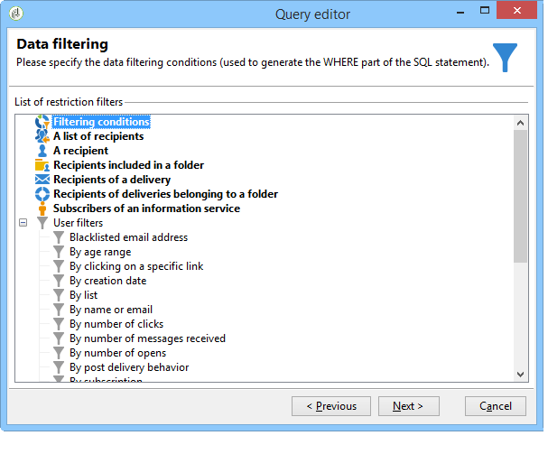

# Pasos para crear una consulta{#steps-to-create-a-query}

Los pasos para crear una consulta en Adobe Campaign son los siguientes:

1. Seleccione la tabla de trabajo. Consulte [Paso 1: Elija una tabla](#step-1---choose-a-table).
1. Seleccionar los datos que desea extraer. Consulte [Paso 2: Elija los datos que desea extraer](#step-2---choose-data-to-extract).
1. Definir la secuencia de ordenación de datos. Consulte [Paso 3 - Ordenar datos](#step-3---sort-data).
1. Filtrar los datos. Consulte [Paso 4 - Filtrar datos](#step-4---filter-data).
1. Formatear los datos. Consulte [Paso 5: Formato de datos](#step-5---format-data).
1. Mostrar el resultado. Consulte [Paso 6 - Vista previa de datos](#step-6---preview-data).

>[!NOTE]
>
>Todos estos pasos están disponibles en el editor de consultas genérico. Cuando se crea una consulta en otro contexto, se pueden obviar algunos pasos.\
>The Query activity is presented in [this section](../../workflow/using/query.md).

## Paso 1: Selección de una tabla {#step-1---choose-a-table}

Select the table containing the data you want to query in the **[!UICONTROL Document type]** window. If necessary, filter the data using the filter field or the **[!UICONTROL Filters]** button.

## Paso 2: Selección de los datos que desea extraer {#step-2---choose-data-to-extract}

In the **[!UICONTROL Data to extract]** window, select the data to display: these fields will make up the output columns.

Por ejemplo, seleccione **[!UICONTROL Age]**, **[!UICONTROL Primary key]** y **[!UICONTROL Email domain]****[!UICONTROL City]**. Los resultados se organizan en función de esta selección. Utilice las flechas azules a la derecha de la ventana para cambiar el orden de las columnas.

Puede editar una expresión insertando una fórmula en ella o ejecutando un proceso en una función de acumulación. Para ello, haga clic en el campo de la **[!UICONTROL Expression]** columna y, a continuación, seleccione **[!UICONTROL Edit expression]**.

It is possible to group output column data: to do this, check **[!UICONTROL Yes]** in the **[!UICONTROL Group]** column of the **[!UICONTROL Data to extract]** window. Esta función genera un resultado en torno al eje de agrupación activado. En [esta sección](../../workflow/using/querying-delivery-information.md) puede consultar un ejemplo de consulta con agrupación.

* The **[!UICONTROL Handle groupings (GROUP BY + HAVING)]** function lets you &quot;group by&quot; and select what has been grouped (&quot;having&quot;). Esta función se aplica a todos los campos de la columna de salida. Por ejemplo, esta opción permite agrupar todas las opciones de una columna de salida y recuperar un tipo específico de información, como los destinatarios entre 35 y 50.

   Para obtener más información, consulte [esta sección](../../workflow/using/querying-using-grouping-management.md).

* The **[!UICONTROL Remove duplicate rows (DISTINCT)]** function lets you deduplicate identical results obtained in the output column. Por ejemplo, si realiza un censo seleccionando los campos Apellido, Nombre y Correo electrónico en la columna de salida, se eliminan los que tengan datos idénticos, ya que esto significa que el mismo contacto se ha introducido varias veces en la base de datos: solo se tiene en cuenta un resultado.

## Paso 3: Orden de los datos {#step-3---sort-data}

The **[!UICONTROL Sorting]** window lets you sort column content. Utilice las flechas para modificar el orden de la columna:

* The **[!UICONTROL Sorting]** column enables a simple sort and arranges column content from A to Z or in ascending order.
* The **[!UICONTROL Descending sort]** arranges the content from Z to A and in descending order. Esto resulta útil para ver las ventas de registro, por ejemplo: las cifras más altas se muestran en la parte superior de la lista.

En este ejemplo, los datos se ordenan en orden ascendente según la edad del destinatario.

## Paso 4: Filtrado de datos {#step-4---filter-data}

El editor de consultas permite filtrar los datos para restringir la búsqueda.

Los filtros ofrecidos dependen de la tabla en la que se encuentre la consulta.

Once you select the **[!UICONTROL Filtering conditions]** you will access the **[!UICONTROL Target elements]** section: this lets you define how to filter the data to collect.

* Para crear un nuevo filtro, seleccione los campos, operadores y valores necesarios para la creación de la fórmula que se debe comprobar para seleccionar los datos. It&#39;s possible to combine several conditions (for more on this, refer to [Defining filter conditions](../../platform/using/defining-filter-conditions.md)).
* To use previously saved filters, open the drop-down list by clicking the **[!UICONTROL Add]** button, click **[!UICONTROL Predefined filter]** and select the one you want.

   

* The filters created in the **[!UICONTROL Generic query editor]** are available in other query applications and vice versa. To save a filter, click the **[!UICONTROL Save]** icon.

   >[!NOTE]
   >
   >For more on creating and using filters, refer to [Filtering options](../../platform/using/filtering-options.md).

Como se muestra en el ejemplo siguiente, para recuperar todos los destinatarios de habla inglesa, seleccione: &quot;idioma del destinatario **igual** a EN&quot;.

>[!NOTE]
>
>You can directly access an option by typing the following formula in the **Value** field: **$(options:OPTION_NAME)**.

Click the **[!UICONTROL Preview]** tab to view the result of the filtering condition. En este caso, todos los destinatarios de habla inglesa se muestran con su nombre, nombre de pila y dirección de correo electrónico.

Users familiar with SQL language can click **[!UICONTROL Generate SQL query]** to view the query in SQL.

## Paso 5: Formato de datos {#step-5---format-data}

Once you have configured the restriction filters, you will access the **[!UICONTROL Data formatting]** window. Esta ventana permite reorganizar las columnas de salida, transformar los datos y cambiar las mayúsculas y minúsculas de las etiquetas de columna. También permite aplicar una fórmula al resultado final mediante un campo calculado.

>[!NOTE]
>
>For more information on the types of calculated fields, refer to [Creating calculated fields](../../platform/using/defining-filter-conditions.md#creating-calculated-fields).

Las columnas no seleccionadas no se muestran en la ventana de previsualización de datos.

The **[!UICONTROL Transformation]** column lets you change a column label to upper or lower case. Select the column and click in the **[!UICONTROL Transformation]** column. Puede elegir:

* **[!UICONTROL Switch to lower case]**,
* **[!UICONTROL Switch to upper case]**,
* **[!UICONTROL First letter in upper case]**.

## Paso 6: Previsualización de datos {#step-6---preview-data}

La **[!UICONTROL Data preview]** ventana es la última etapa. Haga clic **[!UICONTROL Start the preview of the data]** para obtener el resultado de la consulta. Está disponible en columnas o en formato XML. Click the **[!UICONTROL Generated SQL queries]** tab to view the query in SQL format.

En este ejemplo, los datos se ordenan de forma ascendente según la edad del destinatario.

>[!NOTE]
>
>By default, only the first 200 lines are displayed in the **[!UICONTROL Data preview]** window. Para cambiar esto, introduzca un número en el **[!UICONTROL Lines to display]** cuadro y haga clic en **[!UICONTROL Start the preview of the data]**.

