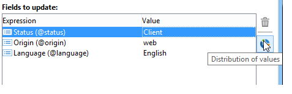
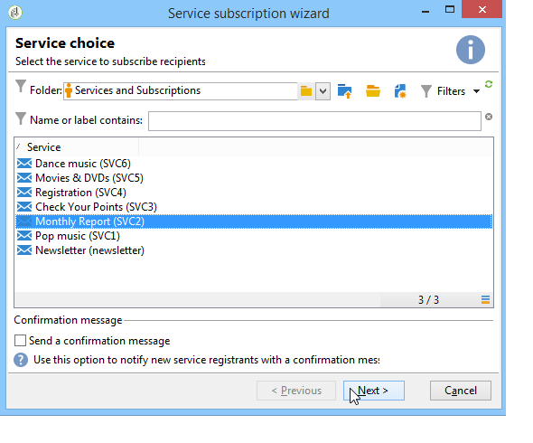

# Actualización de datos{#updating-data}

Los datos vinculados al perfil de un destinatario se pueden actualizar de forma manual o automática.

## Configuración de una actualización automática {#setting-up-an-automatic-update}

Se puede configurar una actualización automática mediante un flujo de trabajo. Para obtener más información, consulte [esta sección](../../workflow/using/update-data.md).

## Realización de una actualización masiva {#performing-a-mass-update}

Para realizar actualizaciones manuales, haga clic con el botón derecho en los destinatarios seleccionados para utilizar el menú de acceso directo **[!UICONTROL Actions]** o utilice el icono **[!UICONTROL Actions]**.

Existen dos tipos de actualizaciones: actualización masiva para un conjunto de destinatarios y combinación de datos entre dos perfiles. Para cada acción, un asistente le permite configurar la actualización.

### Actualización masiva {#mass-update}

Para la actualización masiva, utilice **[!UICONTROL Action > Mass update of selected lines...]**. El asistente le ayuda a configurar y ejecutar la actualización.

El primer paso del asistente es especificar los campos que se actualizarán.

La sección izquierda del asistente muestra la lista de campos disponibles. Utilice el campo **[!UICONTROL Find]** para ejecutar una búsqueda de estos campos. Pulse la tecla **Intro** para examinar la lista. Los nombres de campo que coinciden con su entrada aparecen en negrita, como se muestra a continuación.

Haga doble clic en los campos que desee actualizar para mostrarlos en la sección derecha del asistente.

En caso de error, utilice el botón **[!UICONTROL Delete]** para eliminar un campo de la lista de campos que se va a actualizar.

Seleccione o introduzca los valores que se aplicarán a los perfiles que se van a actualizar.

Puede hacer clic en **[!UICONTROL Distribution of values]** para mostrar la distribución de los valores del campo seleccionado para los destinatarios presentes en la carpeta actual (no solo los destinatarios afectados por la actualización).

Puede definir filtros para mostrar la distribución de los valores de esta ventana o modificar la carpeta actual para mostrar la distribución de valores en otra carpeta. Son acciones de solo lectura; no afectan a la configuración de la actualización que se está definiendo.

Cierre esta ventana y haga clic en **[!UICONTROL Next]** para ver el segundo paso del asistente de actualización. En este paso, puede iniciar la actualización haciendo clic en **[!UICONTROL Start]**.

La información sobre la ejecución de la actualización se muestra en la sección superior del asistente.

La opción **[!UICONTROL Stop]** permite cancelar la actualización, pero es posible que se hayan actualizado ciertos registros y detener el proceso no cancelará estas actualizaciones. La barra de progreso muestra hasta qué punto ha avanzado la operación.

### Combinación de datos {#merge-data}

Seleccione **[!UICONTROL Merge selected lines...]** para iniciar la combinación de dos perfiles de destinatario. Los perfiles que se van a combinar deben seleccionarse antes de escoger la opción. La combinación se configura y se inicia con un asistente.

El asistente muestra los valores que se van a recuperar para cada campo completado en uno u otro de los perfiles de origen. Si uno o varios campos de los perfiles que se van a combinar tienen valores diferentes, estos se muestran en la sección **[!UICONTROL List of conflicts]**. A continuación, puede seleccionar el perfil predeterminado con los botones de opción de la lista, como en el ejemplo siguiente:

Haga clic en **[!UICONTROL Compute]** para mostrar el resultado de su elección.

Compruebe las columnas **[!UICONTROL Result]** de ambas secciones de la ventana y haga clic en **[!UICONTROL Finish]** para ejecutar la combinación.

## Exportación de datos {#exporting-data}

Se puede exportar el contenido de una lista. Para configurar y ejecutar la exportación:

1. Seleccione los registros que desea exportar.
1. Haga clic con el botón derecho y seleccione **[!UICONTROL Export...]**.

   

1. A continuación, seleccione los datos que desee extraer. De forma predeterminada, todas las columnas mostradas se añaden a las columnas de salida.

   

   Para obtener más información sobre cómo configurar el asistente de exportación, consulte [esta sección](../../platform/using/executing-export-jobs.md).

## Suscripción a un servicio {#subscribing-to-a-service}

En la mayoría de los casos, los destinatarios se suscriben a un boletín a través de una página de aterrizaje dedicada, como se explica en [esta sección](../../delivery/using/managing-subscriptions.md). Sin embargo, los perfiles de los destinatarios filtrados se pueden suscribir a un servicio (informativo o viral) manualmente. Para ello:

1. Seleccione los destinatarios que desee suscribir y haga clic con el botón derecho.
1. Seleccione **[!UICONTROL Actions > Subscribe selection to a service]**.

   

1. Seleccione el servicio deseado y haga clic en **[!UICONTROL Next]**:

   

   >[!NOTE]
   >
   >Este editor permite crear un nuevo servicio: haga clic en el botón **[!UICONTROL Create]**.

1. Puede **[!UICONTROL Send a confirmation message]** a los destinatarios. El contenido de este mensaje se puede configurar en el escenario de suscripción vinculado al servicio seleccionado.
1. Haga clic en el botón **[!UICONTROL Start]** para ejecutar el proceso de suscripción.

   

La sección superior de la ventana permite controlar el proceso de ejecución. El botón **[!UICONTROL Stop]** permite detener el proceso. Sin embargo, los destinatarios ya procesados se suscribirán.

Si desactiva la opción **[!UICONTROL Do not keep a trace of this job in the database]**, puede seleccionar (o crear) la carpeta de ejecución en la que se almacenará la información de este proceso.

Para comprobar el proceso, diríjase a la pestaña **[!UICONTROL Subscriptions]** de los perfiles de los destinatarios relacionados con esta operación o a la pestaña **[!UICONTROL Subscriptions]** a través del nodo **[!UICONTROL Profiles and Targets > Services and Subscriptions]**.

>[!NOTE]
>
>Para obtener más información sobre la creación y configuración de los servicios de información, consulte [esta página](../../delivery/using/managing-subscriptions.md).

