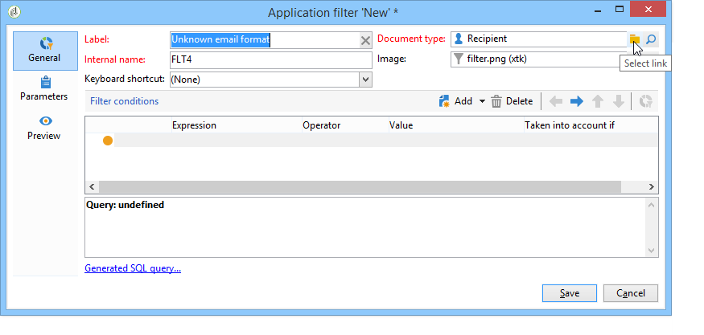
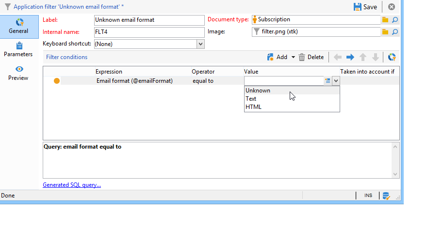

# Ejemplo de uso{#use-case}

## Cree un filtro sobre el formato de correo electrónico de los suscriptores {#creating-a-filter-on-the-email-format-of-subscribers}

Este ejemplo muestra cómo crear un filtro para ordenar suscripciones de boletín basándose en el formato de correo electrónico del destinatario.

Para ello, es necesario utilizar un filtro predefinido: estos filtros están vinculados a un tipo de documento y se accede a ellos a través del nodo **[!UICONTROL Administration > Configuration > Predefined filters]**. Estos filtros de datos se pueden utilizar para cada tipo de editor (o documento) de la aplicación.

Los filtros de datos se crean de la misma manera que los filtros predefinidos, pero hay un campo adicional para seleccionar el tipo de documento al que se aplica el filtro.

Siga estos pasos:

1. Cree un nuevo filtro a través del nodo **[!UICONTROL Administration > Configuration > Predefined filters]**.
1. Haga clic en el icono **[!UICONTROL Select link]** para seleccionar el documento que le interesa:

   

1. Seleccione el esquema de suscripción (nms:subscription) y haga clic en **[!UICONTROL OK]**.

   

1. Haga clic en **[!UICONTROL Edit link]** para ver los campos del documento seleccionado.

   

   A continuación, puede ver el contenido del documento seleccionado:

   

   Puede acceder a estos campos para definir las condiciones de filtro en el cuerpo del editor de filtros. Un filtro de aplicación se define exactamente igual que un filtro avanzado. Consulte [Crear un filtro avanzado](../../platform/using/creating-filters.md#creating-an-advanced-filter).

1. Crear un nuevo filtro en las suscripciones para mostrar solo las suscripciones con un formato de correo electrónico no definido:

   

1. Haga clic en **[!UICONTROL Save]** para añadir un filtro a los filtros predefinidos para este tipo de lista.
1. Ahora puede utilizar este filtro en la pestaña **[!UICONTROL Subscriptions]** del perfil de destinatario; puede acceder al filtro “Formato de correo electrónico desconocido” haciendo clic en el botón **[!UICONTROL Filters]**.

   

   El nombre del filtro actual se muestra encima de la lista. Para cancelar el filtro, haga clic en el icono **[!UICONTROL Delete this filter]**.

   

