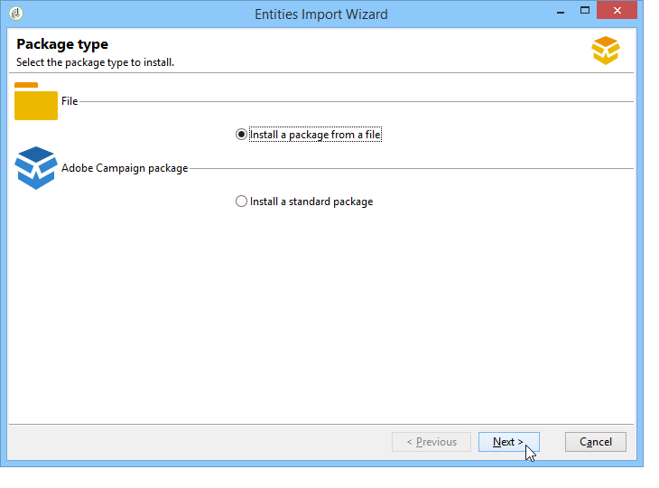

# Trabajo con paquetes de datos{#working-with-data-packages}

## Acerca de los paquetes de datos {#about-data-packages}

Adobe Campaign permite exportar o importar la configuración y los datos de la plataforma a través de un sistema de paquetes. Los paquetes pueden contener diferentes tipos de configuraciones y elementos, filtrados o no.

Los paquetes de datos permiten que las entidades de la base de datos de Adobe Campaign se muestren mediante archivos en formato XML. Cada entidad contenida en un paquete se representa con todos sus datos.

El principio de los **paquetes de datos** es exportar una configuración de datos e integrarla en otro sistema de Adobe Campaign. Aprenda a mantener un conjunto coherente de paquetes de datos en esta [sección](#data-package-best-practices).

### Tipos de paquetes {#types-of-packages}

Existen tres tipos de paquetes exportables: paquetes de usuario, paquetes de plataforma y paquetes de administrador.

* **Paquete de usuario**: permite seleccionar la lista de entidades que se va a exportar. Este tipo de paquete administra dependencias y verifica errores.
* **Paquete de plataforma**: incluye todos los recursos técnicos añadidos (no estándar): esquemas, código JavaScript, etc.

   

* **Paquete de administrador**: incluye todas las plantillas y objetos empresariales añadidos (no estándar): plantillas, bibliotecas, etc.

   

>[!CAUTION]
>
>Los paquetes de tipo **plataforma** y **administrador** contienen una lista predefinida de entidades a exportar. Cada entidad está vinculada a unas condiciones de filtrado que permiten eliminar los recursos utilizables del paquete creado.

## Estructura de datos {#data-structure}

La descripción de un paquete de datos es un documento XML estructurado que se ajusta a la gramática del esquema de datos **xrk:navtree**.

Ejemplo de paquete de datos:

```
<package>
  <entities schema="nms:recipient">
    <recipient email="john.smith@adobe.com" lastName="Smith" firstName="John">      
      <folder _operation="none" name="nmsRootFolder"/>      
      <company _operation="none" name="Adobe"/>
    </recipient>
  </entities>
  <entities schema="sfa:company">
    <company name="Adobe">
      location city="London" zipCode="W11 2BQ"/>
    </company>
  </entities>
</package>
```

El documento XML debe comenzar y terminar con el elemento **`<package>`**. Cualquier elemento **`<entities>`** que siga distribuye los datos por tipo de documento.

Un elemento **`<entities>`** contiene los datos del paquete en el formato del esquema de datos introducido en el atributo **schema**.

Los datos de un paquete no deben contener claves internas que no sean compatibles con las bases, como las claves generadas automáticamente (opción **autopk**).

En nuestro ejemplo, las uniones en los vínculos &quot;carpeta&quot; y &quot;compañía&quot; se han sustituido por teclas de &quot;alto nivel&quot; en las tablas de objetivo:

```
<recipient>
  <folder _operation="none" name="nmsRootFolder"/>
  <company _operation="none" name="Adobe"/>
</recipient>
```

El atributo **`operation`** con el valor &quot;ninguno&quot; define un vínculo de reconciliación.

Un paquete de datos puede crearse manualmente desde cualquier editor de texto. Asegúrese de que la estructura del documento XML cumple con el esquema de datos &quot;xtk:navtree&quot;. La consola de Adobe Campaign tiene un módulo de exportación e importación de paquete de datos.

## Exportación de paquetes {#exporting-packages}

### Acerca de la exportación de paquetes {#about-package-export}

Los paquetes se pueden exportar de tres formas diferentes:

* **[!UICONTROL Package Export Wizard]** permite exportar un conjunto de objetos en un solo paquete. Para obtener más información, consulte [Exportación de un conjunto de objetos en un paquete](#exporting-a-set-of-objects-in-a-package)
* Un **objeto único** se puede exportar en un paquete directamente haciendo clic con el botón derecho en él y seleccionando **[!UICONTROL Actions > Export in a package]**.
* Las **definiciones de paquetes** permiten crear una estructura de paquetes en la que se añaden objetos que se pueden exportar posteriormente en un paquete. Para obtener más información, consulte [Administración de definiciones de paquetes](#managing-package-definitions)

Una vez exportado el paquete, puede importarlo, junto a todas las entidades añadidas, en otra instancia de Campaign.

### Exportación de un conjunto de objetos en un paquete {#exporting-a-set-of-objects-in-a-package}

Se puede acceder al asistente de exportación de paquetes mediante el menú **[!UICONTROL Tools > Advanced > Export package...]** de la consola del cliente de Adobe Campaign.


Para los tres tipos de paquete, el asistente ofrece los siguientes pasos:

1. Lista de entidades a exportar por tipo de documento:

   

   >[!CAUTION]
   >
   >Si exporta una carpeta de tipo **[!UICONTROL Offer category]**, **[!UICONTROL Offer environment]**, **[!UICONTROL Program]** o **[!UICONTROL Plan]**, evite seleccionar la carpeta **xtk:folder**, ya que puede perder algunos datos. Seleccione la entidad que corresponde a la carpeta: **nms:offerCategory** para categorías de ofertas, **nms:offerEnv** para entornos de ofertas, **nms:program** para programas y **nms:plan** para planes.

   La administración de listas permite añadir o eliminar entidades de la exportación en la configuración. Haga clic en **[!UICONTROL Add]** para seleccionar una nueva entidad.

   El botón **[!UICONTROL Detail]** edita la configuración seleccionada.

   >[!NOTE]
   >
   >El mecanismo de dependencia controla la secuencia de exportación de entidades. Para obtener más información, consulte [Administración de dependencias](#managing-dependencies).

1. La pantalla de configuración de la entidad define la consulta de filtro del tipo de documento que se va a extraer.

   Debe configurar la cláusula de filtrado para la extracción de datos.

   

   >[!NOTE]
   >
   >El editor de consultas se muestra en [esta sección](../../platform/using/about-queries-in-campaign.md).

1. Haga clic en **[!UICONTROL Next]** y seleccione las columnas de clasificación para ordenar los datos durante la extracción:

   

1. Previsualice los datos de la extracción antes de ejecutar la exportación.

   

1. La última página del asistente de exportación de paquetes permite iniciar la exportación. Los datos se almacenan en el archivo indicado en el campo **[!UICONTROL File]**.

   

### Administración de dependencias {#managing-dependencies}

El mecanismo de exportación permite que Adobe Campaign rastree los vínculos entre los distintos elementos exportados.

Este mecanismo se define por dos reglas:

* Los objetos unidos a un vínculo con una integridad de tipo **own** u **owncopy** se exportan en el mismo paquete que el objeto exportado.
* Los objetos unidos a un vínculo con una integridad de tipo **neutral** o **define** (vínculo definido) deben exportarse por separado.

>[!NOTE]
>
>En [esta sección ](../../configuration/using/database-mapping.md#links--relation-between-tables)se definen los tipos de integridad vinculados a elementos de esquema.

#### Exportación de una campaña {#exporting-a-campaign}

Aquí se muestra un ejemplo sobre cómo exportar una campaña. La campaña de marketing que se va a exportar contiene una tarea (etiqueta: &quot;MyTask&quot;) y un flujo de trabajo (etiqueta: &quot;CampaignWorkflow&quot;) en una carpeta &quot;MyWorkflow&quot; (nodo: Administration / Production / Technical workflows / Campaign processes / MyWorkflow).

La tarea y el flujo de trabajo se exportan en el mismo paquete que la campaña, ya que los esquemas coincidentes están conectados por vínculos con una integridad de tipo &quot;own&quot;.

Contenido del paquete:

```
<?xml version='1.0'?>
<package author="Administrator (admin)" buildNumber="7974" buildVersion="6.1" img=""
label="" name="" namespace="" vendor="">
 <desc></desc>
 <version buildDate="2013-01-09 10:30:18.954Z"/>
 <entities schema="nms:operation">
  <operation duration="432000" end="2013-01-14" internalName="OP1" label="MyCampaign"
  modelName="opEmpty" start="2013-01-09">
   <controlGroup>
    <where filteringSchema=""/>
   </controlGroup>
   <seedList>
    <where filteringSchema="nms:seedMember"></where>
    <seedMember internalName="SDM1"></seedMember>
   </seedList>
   <parameter useAsset="1" useBudget="1" useControlGroup="1" useDeliveryOutline="1"
   useDocument="1" useFCPValidation="0" useSeedMember="1" useTask="1"
   useValidation="1" useWorkflow="1"></parameter>
   <fcpSeed>
    <where filteringSchema="nms:seedMember"></where>
   </fcpSeed>
   <owner _operation="none" name="admin" type="0"/>
   <program _operation="none" name="nmsOperations"/>
   <task end="2013-01-17 10:07:51.000Z" label="MyTask" name="TSK2" start="2013-01-16 10:07:51.000Z"
   status="1">
    <owner _operation="none" name="admin" type="0"/>
    <operation _operation="none" internalName="OP1"/>
    <folder _operation="none" name="nmsTask"/>
   </task>
   <workflow internalName="WKF12" label="CampaignWorkflow" modelName="newOpEmpty"
   order="8982" scenario-cs="Notification of the workflow supervisor (notifySupervisor)"
   schema="nms:recipient">
    <scenario internalName="notifySupervisor"/>
    <desc></desc>
    <folder _operation="none" name="Folder4"/>
    <operation _operation="none" internalName="OP1"/>
   </workflow>
  </operation>
 </entities>
</package>   
```

La afiliación a un tipo de paquete se define en un esquema con el atributo **@pkgAdmin y @pkgPlatform.** Ambos atributos reciben una expresión XTK que define las condiciones de afiliación del paquete.

```
<element name="offerEnv" img="nms:offerEnv.png" 
template="xtk:folder" pkgAdmin="@id != 0">
```

Finalmente, el atributo **@pkgStatus** permite definir las reglas de exportación para estos elementos o atributos. En función del valor del atributo, el elemento o atributo se encuentra en el paquete exportado. Los tres valores posibles de este atributo son:

* **never**: no exporta el campo/vínculo
* **always**: fuerza la exportación de este campo
* **preCreate**: autoriza la creación de la entidad vinculada

>[!NOTE]
>
>El valor **preCreate** solo se admite para eventos de tipo vínculo. Permite crear o señalar una entidad que no se ha cargado todavía en el paquete exportado.

## Administración de definiciones de paquetes {#managing-package-definitions}

Las definiciones de paquete permiten crear una estructura de paquetes en la que se añaden entidades que se exportan posteriormente en un solo paquete. Después puede importar este paquete y todas las entidades añadidas en otra instancia de Campaign.

**Temas relacionados:**

* [Creación de una definición de paquete](#creating-a-package-definition)
* [Adición de entidades a una definición de paquete](#adding-entities-to-a-package-definition)
* [Configuración de la generación de definiciones de paquetes](#configuring-package-definitions-generation)
* [Exportación de paquetes desde una definición de paquete](#exporting-packages-from-a-package-definition)

### Creación de una definición de paquete {#creating-a-package-definition}

Se puede acceder a las definiciones de paquetes desde el menú **[!UICONTROL Administration > Configuration > Package management > Package definitions]**.

Para crear una definición de paquete, haga clic en el botón **[!UICONTROL New]** y complete la información general de la definición del paquete.


A continuación, se pueden añadir entidades a la definición del paquete y exportarla a un paquete de archivos XML.

**Temas relacionados:**

* [Adición de entidades a una definición de paquete](#adding-entities-to-a-package-definition)
* [Configuración de la generación de definiciones de paquetes](#configuring-package-definitions-generation)
* [Exportación de paquetes desde una definición de paquete](#exporting-packages-from-a-package-definition)

### Adición de entidades a una definición de paquete {#adding-entities-to-a-package-definition}

En la pestaña **[!UICONTROL Content]**, haga clic en el botón **[!UICONTROL Add]** para seleccionar las entidades que desea exportar con el paquete. Las prácticas recomendadas al seleccionar entidades se presentan en [esta sección](#exporting-a-set-of-objects-in-a-package)


Las entidades se pueden añadir a una definición de paquete directamente desde su ubicación en la instancia. Para realizar esto, siga los pasos a continuación:

1. Haga clic con el botón derecho en la entidad deseada y luego seleccione **[!UICONTROL Actions > Export in a package]**.

   

1. Seleccione **[!UICONTROL Add to a package definition]** y luego seleccione la definición del paquete a la que desea añadir la entidad.

   

1. La entidad se añade a la definición del paquete y se exporta con el paquete (consulte [esta sección](#exporting-packages-from-a-package-definition)).

   

### Configuración de la generación de definiciones de paquetes {#configuring-package-definitions-generation}

La generación de paquetes se puede configurar desde la pestaña de **[!UICONTROL Content]** de definición del paquete. Para ello, haga clic en el vínculo **[!UICONTROL Generation parameters]**.


* **[!UICONTROL Include the definition]**: incluye la definición utilizada actualmente en la definición del paquete.
* **[!UICONTROL Include an installation script]**: permite añadir una secuencia de comandos de javascript para ejecutarla en la importación del paquete. Al seleccionarlo, se añade una pestaña **[!UICONTROL Script]** en la pantalla de definición del paquete.
* **[!UICONTROL Include default values]**: añade al paquete los valores de todos los atributos de las entidades.

   Esta opción no está seleccionada de forma predeterminada para evitar exportaciones largas. Esto significa que los atributos de las entidades con valores predeterminados (“cadena vacía”, “0” y “falso” si no se definen en el esquema) no se añaden al paquete y, por lo tanto, no se exportan.

   >[!CAUTION]
   >
   >Desmarcar esta opción puede dar como resultado una combinación de versiones locales e importadas.
   >
   >Si la instancia en la que se importa el paquete contiene entidades idénticas a las del paquete (por ejemplo, con la misma ID externa), sus atributos no se actualizan. Esto puede ocurrir si los atributos de la instancia anterior tienen valores predeterminados, ya que no se incluyen en el paquete.
   >
   >En ese caso, la selección de la opción **[!UICONTROL Include default values]** impide que las versiones se fusionen, ya que todos los atributos de la instancia anterior se exportan con el paquete.

### Exportación de paquetes desde una definición de paquete {#exporting-packages-from-a-package-definition}

Para exportar un paquete desde una definición de paquete, siga los pasos siguientes:

1. Seleccione la definición del paquete que desea exportar, haga clic en el botón **[!UICONTROL Actions]** y seleccione **[!UICONTROL Export the package]**.
1. De forma predeterminada, se selecciona un archivo XML correspondiente al paquete exportado. Se le asigna un nombre en función del área de nombres y el nombre de la definición del paquete.
1. Una vez que haya definido el nombre y la ubicación del paquete, haga clic en el botón **[!UICONTROL Start]** para iniciar la exportación.

   

## Importar paquetes {#importing-packages}

Se puede acceder al asistente de importación de paquetes a través del menú principal **[!UICONTROL Tools > Advanced > Package import...]** de la consola del cliente de Adobe Campaign.

Se puede importar un paquete desde una exportación realizada anteriormente, por ejemplo, desde otra instancia de Adobe Campaign o un [paquete integrado](../../installation/using/installing-campaign-standard-packages.md), en función de los términos de la licencia.



### Instalación de un paquete desde un archivo {#installing-a-package-from-a-file}

Para importar un paquete de datos existente, seleccione el archivo XML y haga clic en **[!UICONTROL Open]**.


El contenido del paquete que se va a importar se muestra en la sección central del editor.

Haga clic en **[!UICONTROL Next]** y después en **[!UICONTROL Start]** para iniciar la importación.


### Instalación de un paquete integrado {#installing-a-standard-package}

Los paquetes estándar son paquetes integrados y se instalan cuando se configura Adobe Campaign. Dependiendo de los permisos y del modelo de implementación, puede importar nuevos paquetes estándar si adquiere nuevas opciones o complementos, o si actualiza a una oferta nueva.

Consulte el acuerdo de licencia para comprobar qué paquetes puede instalar.

Para obtener más información sobre paquetes integrados, consulte [esta sección](../../installation/using/installing-campaign-standard-packages.md).

## Prácticas recomendadas de paquete de datos {#data-package-best-practices}

En esta sección se describe cómo organizar los paquetes de datos de forma coherente durante toda la duración del proyecto.

Los paquetes pueden contener diferentes tipos de configuraciones y elementos, filtrados o no. Si se pierden algunos elementos o no se importan los elementos o paquetes en el orden correcto, la configuración de la plataforma puede romperse.

Además, con varias personas trabajando en la misma plataforma con muchas características diferentes, la carpeta de especificaciones del paquete puede volverse compleja rápidamente.

Aunque no es obligatorio hacerlo, esta sección ofrece una solución para ayudar a organizar y utilizar paquetes en Adobe Campaign para proyectos a gran escala.

Las restricciones principales son las siguientes:
* Organice los paquetes y haga un seguimiento de los cambios y las fechas.
* Si se actualiza una configuración, minimice el riesgo de que se rompa algo que no esté directamente relacionado con la actualización.

>[!NOTE]
>
>Para obtener más información sobre la configuración de un flujo de trabajo para exportar paquetes automáticamente, consulte [esta página](https://helpx.adobe.com/es/campaign/kb/export-packages-automatically.html).

### Recomendaciones {#data-package-recommendations}

Siempre importe en la misma versión de la plataforma. Debe comprobar que implementa los paquetes entre dos instancias que tienen la misma compilación. Evite forzar la importación y siempre actualice primero la plataforma (si la compilación es diferente).

>[!IMPORTANT]
>
>Adobe no admite la importación entre distintas versiones.
<!--This is not allowed. Importing from 6.02 to 6.1, for example, is prohibited. If you do so, R&D won’t be able to help you resolve any issues you encounter.-->

Preste atención a la estructura del esquema y de la base de datos. La importación de paquete con esquema debe ir seguida de la generación de esquemas.

### Solución {#data-package-solution}

#### Tipos de paquetes {#package-types}

Empiece por definir diferentes tipos de paquetes. Solo se utilizan cuatro tipos:

**Entidades**
* Todos los elementos específicos de “xtk” y de “nms” en Adobe Campaign como esquemas, formularios, carpetas, plantillas de envíos, etc.
* Puede considerar una entidad como elemento “admin” y “platform”.
* Evite incluir más de una entidad en un paquete al cargarlo en una instancia de Campaign.

<!--Nothing “works” alone. An entity package does not have a specific role or objective.-->

Si necesita implementar la configuración en una instancia nueva, puede importar todos los paquetes de entidades.

**Funciones**

Este tipo de paquete:
* Responde a un requisito o especificación del cliente.
* Contiene una o varias funcionalidades.
* Debe contener todas las dependencias para poder ejecutar la funcionalidad sin ningún otro paquete.

**Campañas**

Este paquete no es obligatorio. A veces resulta útil crear un tipo específico para todas las campañas, incluso si una campaña se puede ver como una función.

**Actualizaciones**

Una vez configurada, una función se puede exportar a otro entorno. Por ejemplo, el paquete se puede exportar de un entorno de desarrollo a un entorno de prueba. En esta prueba, se muestra un defecto. Primero, debe corregirse en el entorno de desarrollo. A continuación, el parche debe aplicarse a la plataforma de prueba.

La primera solución sería volver a exportar toda la función. Sin embargo, para evitar cualquier riesgo (actualizar elementos no deseados), es más seguro tener un paquete que contenga solamente la corrección.

Por este motivo, recomendamos crear un paquete “actualización” que contenga solo un tipo de entidad de la función.

Una actualización no solo podría ser una corrección, sino también un nuevo elemento del paquete de campaña, función o entidad. Para evitar implementar todo el paquete, puede exportar un paquete de actualización.

### Convenciones de nomenclatura {#data-package-naming}

Ahora que los tipos están definidos, debemos especificar una convención de nombres. Adobe Campaign no permite crear subcarpetas para las especificaciones del paquete, lo que significa que los números son la mejor solución para mantenerse organizados. Los números prefijan los nombres de paquetes. También puede usar la siguiente convención:

* Entidad: de 1 a 99
* Función: de 100 a 199
* Campaña: de 200 a 299
* Actualización: de 5000 a 5999

### Paquetes {#data-packages}

>[!NOTE]
>
>Es mejor configurar reglas para definir el número correcto de paquetes.

#### Orden de paquetes de entidades {#entity-packages-order}

Para ayudar a la importación, los paquetes de entidades deben ordenarse a medida que se vayan importando. Por ejemplo:
* 001 - Esquema
* 002 - Formulario
* 003 - Imágenes
* Etc.

>[!NOTE]
>
>Los formularios solo se deben importar después de actualizar el esquema.

#### Paquete 200 {#package-200}

El número de paquete “200” no debe utilizarse para una campaña específica: este número se utiliza para actualizar algo que concierne a todas las campañas.

#### Actualizar paquete {#update-package}

El último punto se refiere a la numeración del paquete de actualización. Es su número de paquete (entidad, función o campaña) con un “5” como prefijo. Por ejemplo:
* 5001 para actualizar un esquema
* 5200 para actualizar todas las campañas
* 5101 para actualizar la función 101

El paquete de actualización solo debe contener una entidad específica para que pueda reutilizarse fácilmente. Para dividirlas, añada un nuevo número (empiece desde 1). No existen reglas específicas para ordenar estos paquetes. Para entender mejor, imaginemos que tenemos una función 101, una aplicación social:
* Contiene una aplicación web y una cuenta externa.
   * La etiqueta del paquete es: 101 - Aplicación social (socialApplication).
* Hay un defecto en la aplicación web.
   * Se corrigió la aplicación web.
   * Es necesario crear un paquete de correcciones con el siguiente nombre: 5101 - 1 - Aplicación social webApp (socialApplication_webApp).
* Es necesario añadir una nueva cuenta externa para la función social.
   * Se crea una cuenta externa.
   * El nuevo paquete es: 5101 - 2 - Cuenta externa de la aplicación de social (socialApplication_extAccount).
   * Al mismo tiempo, el paquete 101 se actualiza para añadirse a la cuenta externa, pero no se implementa.
      

#### Documentación del paquete {#package-documentation}

Al actualizar un paquete, siempre debe colocar un comentario en el campo de descripción para detallar las modificaciones y motivos (por ejemplo, &quot;añadir un nuevo esquema&quot; o &quot;corregir un defecto&quot;).


También debe indicar la fecha del comentario. Siempre informe su comentario en un paquete de actualización al “principal” (paquete sin el prefijo 5).

>[!IMPORTANT]
>
>El campo de descripción solo puede contener hasta 2000 caracteres.
