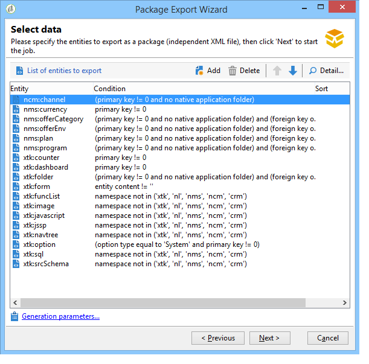

# Trabajo con paquetes de datos{#working-with-data-packages}

## Acerca de los paquetes de datos {#about-data-packages}

Adobe Campaign permite exportar o importar la configuración y los datos de la plataforma a través de un sistema de paquetes. Los paquetes pueden contener diferentes tipos de configuraciones y elementos, filtrados o no.

Los paquetes de datos permiten que las entidades de la base de datos de Adobe Campaign se muestren mediante archivos en formato XML. Cada entidad contenida en un paquete se representa con todos sus datos.

La base de los **paquetes de datos** es exportar una configuración de datos e integrarla en otro sistema de Adobe Campaign. Para más información sobre cómo mantener un conjunto coherente de paquetes de datos, consulte esta [nota técnica](https://docs.campaign.adobe.com/doc/AC/en/technicalResources/Technotes/AdobeCampaign_How_to_maintain_a_consistent_set_of_data_packages.pdf).

### Tipos de paquetes {#types-of-packages}

Existen tres tipos de paquetes exportables: paquetes de usuario, paquetes de plataforma y paquetes de administrador.

* **Paquete de usuario**: permite seleccionar la lista de entidades que se va a exportar. Este tipo de paquete administra dependencias y verifica errores.
* **Paquete de plataforma**: incluye todos los recursos técnicos añadidos (no estándar): esquemas, código JavaScript, etc.

   

* **Paquete de administrador**: incluye todas las plantillas y objetos empresariales añadidos (no estándar): plantillas, bibliotecas, etc.

   

>[!CAUTION]
>
>Los paquetes de tipo **plataforma** y **administrador** contienen una lista predefinida de entidades a exportar. Cada entidad está vinculada a unas condiciones de filtrado que permiten eliminar los recursos utilizables del paquete creado.

## Estructura de datos {#data-structure}

La descripción de un paquete de datos es un documento XML estructurado que se ajusta a la gramática del esquema de datos **xrk:navtree** .

Ejemplo de paquete de datos:

```
<package>
  <entities schema="nms:recipient">
    <recipient email="john.smith@adobe.com" lastName="Smith" firstName="John">      
      <folder _operation="none" name="nmsRootFolder"/>      
      <company _operation="none" name="Adobe"/>
    </recipient>
  </entities>
  <entities schema="sfa:company">
    <company name="Adobe">
      location city="London" zipCode="W11 2BQ"/>
    </company>
  </entities>
</package>
```

The XML document must begin and end with the **`<package>`** element. Any **`<entities>`** elements that follow distribute the data by document type.

An **`<entities>`** element contains the data of the package in the format of the data schema entered in the **schema** attribute.

Los datos de un paquete no deben contener claves internas que no sean compatibles con las bases, como las claves generadas automáticamente (opción **autopk** ).

En nuestro ejemplo, las uniones en los vínculos “carpeta” y “compañía” se han sustituido por teclas de “alto nivel” en las tablas de objetivo:

```
<recipient>
  <folder _operation="none" name="nmsRootFolder"/>
  <company _operation="none" name="Adobe"/>
</recipient>
```

The **`operation`** attribute with the value &quot;none&quot; defines a reconciliation link.

Un paquete de datos puede crearse manualmente desde cualquier editor de texto. Asegúrese de que la estructura del documento XML cumple con el esquema de datos “xtk:navtree”. La consola de Adobe Campaign tiene un módulo de exportación e importación de paquete de datos.

## Exportación de paquetes {#exporting-packages}

### Acerca de la exportación de paquetes {#about-package-export}

Los paquetes se pueden exportar de tres formas diferentes:

* The **[!UICONTROL Package Export Wizard]** enables you to export a set of objects in a single package. Para obtener más información sobre esto, consulte [Exportación de un conjunto de objetos en un paquete](#exporting-a-set-of-objects-in-a-package)
* A **single object** can be exported in a package directly by right-clicking on it and selecting **[!UICONTROL Actions > Export in a package]**.
* Las **definiciones de paquetes** permiten crear una estructura de paquetes en la que se añaden objetos que se pueden exportar posteriormente en un paquete. Para obtener más información sobre esto, consulte [Administración de definiciones de paquetes](#managing-package-definitions)

Una vez exportado el paquete, puede importarlo, junto a todas las entidades añadidas, en otra instancia de campaña.

### Exportación de un conjunto de objetos en un paquete {#exporting-a-set-of-objects-in-a-package}

The package export wizard is accessible via the **[!UICONTROL Tools > Advanced > Export package...]** menu of the Adobe Campaign client console.


Para los tres tipos de paquete, el asistente ofrece los siguientes pasos:

1. Lista de entidades a exportar por tipo de documento:

   

   >[!CAUTION]
   >
   >Si exporta una carpeta **[!UICONTROL Offer category]**, **[!UICONTROL Offer environment]**, **[!UICONTROL Program]** o **[!UICONTROL Plan]** de tipo, no seleccione nunca la carpeta **xtk:folder** , ya que podría perder algunos datos. Seleccione la entidad que corresponde a la carpeta: **nms:offerCategory** para categorías de ofertas, **nms:offerEnv** para entornos de ofertas, **nms:programa** para programas y **nms:plan** para planes.

   La administración de listas permite añadir o eliminar entidades de la exportación en la configuración. Click **[!UICONTROL Add]** to select a new entity.

   The **[!UICONTROL Detail]** button edits the selected configuration.

   >[!NOTE]
   >
   >El mecanismo de dependencia controla la secuencia de exportación de entidades. For more on this, refer to [Managing dependencies](#managing-dependencies).

1. La pantalla de configuración de la entidad define la consulta de filtro del tipo de documento que se va a extraer.

   Debe configurar la cláusula de filtrado para la extracción de datos.

   

   >[!NOTE]
   >
   >El editor de consultas se muestra en [esta sección](../../platform/using/about-queries-in-campaign.md).

1. Click **[!UICONTROL Next]** and select the sorting columns to order the data during extraction:

   

1. Previsualice los datos de la extracción antes de ejecutar la exportación.

   

1. La última página del asistente para la exportación de paquetes permite iniciar la exportación. The data will be stored in the file indicated in the **[!UICONTROL File]** field.

   

### Administración de dependencias {#managing-dependencies}

El mecanismo de exportación permite que Adobe Campaign rastree los enlaces entre los distintos elementos exportados.

Este mecanismo se define por dos reglas:

* Los objetos vinculados a un enlace con una integridad de tipo **own** u **owncopy** se exportan en el mismo paquete que el objeto exportado.
* los objetos vinculados a un enlace con una integridad de tipo **neutral** o **define** (enlace definido) deben exportarse por separado.

>[!NOTE]
>
>En [esta sección ](../../configuration/using/database-mapping.md#links--relation-between-tables)se definen los tipos de integridad vinculados a elementos de esquema.

#### Exportación de una campaña {#exporting-a-campaign}

Aquí se muestra un ejemplo sobre cómo exportar una campaña. La campaña de mercadotecnia que se va a exportar contiene una tarea (etiqueta: &quot;MyTask&quot;) y un flujo de trabajo (label: &quot;CampaignWorkflow&quot;) en una carpeta &quot;MyWorkflow&quot; (nodo: Administración / Producción / Flujos de trabajo técnicos / Procesos de campaña / MyWorkflow).

La tarea y el flujo de trabajo se exportan en el mismo paquete que la campaña, ya que los esquemas coincidentes están conectados por enlaces con una integridad de tipo “own”.

Contenido del paquete:

```
<?xml version='1.0'?>
<package author="Administrator (admin)" buildNumber="7974" buildVersion="6.1" img=""
label="" name="" namespace="" vendor="">
 <desc></desc>
 <version buildDate="2013-01-09 10:30:18.954Z"/>
 <entities schema="nms:operation">
  <operation duration="432000" end="2013-01-14" internalName="OP1" label="MyCampaign"
  modelName="opEmpty" start="2013-01-09">
   <controlGroup>
    <where filteringSchema=""/>
   </controlGroup>
   <seedList>
    <where filteringSchema="nms:seedMember"></where>
    <seedMember internalName="SDM1"></seedMember>
   </seedList>
   <parameter useAsset="1" useBudget="1" useControlGroup="1" useDeliveryOutline="1"
   useDocument="1" useFCPValidation="0" useSeedMember="1" useTask="1"
   useValidation="1" useWorkflow="1"></parameter>
   <fcpSeed>
    <where filteringSchema="nms:seedMember"></where>
   </fcpSeed>
   <owner _operation="none" name="admin" type="0"/>
   <program _operation="none" name="nmsOperations"/>
   <task end="2013-01-17 10:07:51.000Z" label="MyTask" name="TSK2" start="2013-01-16 10:07:51.000Z"
   status="1">
    <owner _operation="none" name="admin" type="0"/>
    <operation _operation="none" internalName="OP1"/>
    <folder _operation="none" name="nmsTask"/>
   </task>
   <workflow internalName="WKF12" label="CampaignWorkflow" modelName="newOpEmpty"
   order="8982" scenario-cs="Notification of the workflow supervisor (notifySupervisor)"
   schema="nms:recipient">
    <scenario internalName="notifySupervisor"/>
    <desc></desc>
    <folder _operation="none" name="Folder4"/>
    <operation _operation="none" internalName="OP1"/>
   </workflow>
  </operation>
 </entities>
</package>   
```

La afiliación a un tipo de paquete se define en un esquema con el atributo **@pkgAdmin y @pkgPlatform.** Ambos atributos reciben una expresión XTK que define las condiciones de afiliación del paquete.

```
<element name="offerEnv" img="nms:offerEnv.png" 
template="xtk:folder" pkgAdmin="@id != 0">
```

Finalmente, el atributo **@pkgStatus** permite definir las reglas de exportación para estos elementos o atributos. En función del valor del atributo, el elemento o atributo se encuentra en el paquete exportado. Los tres valores posibles de este atributo son:

* **never**: no exporta el campo/enlace
* **always**: fuerza la exportación de este campo
* **preCreate**: autoriza la creación de la entidad vinculada

>[!NOTE]
>
>El valor **preCreate** solo se admite para eventos de tipo enlace. Permite crear o señalar una entidad que no se ha cargado todavía en el paquete exportado.

## Administración de definiciones de paquetes {#managing-package-definitions}

### Acerca de las definiciones de paquetes {#about-package-definitions}

Las definiciones de paquete permiten crear una estructura de paquetes en la que se añaden entidades que se exportan posteriormente en un solo paquete. Después puede importar este paquete y todas las entidades añadidas en otra instancia de Campaign.

**Temas relacionados:**

* [Creación de una definición de paquete](#creating-a-package-definition)
* [Adición de entidades a una definición de paquete](#adding-entities-to-a-package-definition)
* [Configuración de la generación de definiciones de paquetes](#configuring-package-definitions-generation)
* [Exportación de paquetes desde una definición de paquete](#exporting-packages-from-a-package-definition)

### Creación de una definición de paquete {#creating-a-package-definition}

Se puede acceder a las definiciones de los paquetes desde el **[!UICONTROL Administration > Configuration > Package management > Package definitions]** menú.

To create a package definition, click the **[!UICONTROL New]** button, then fill in the package definition general information.


A continuación, se pueden añadir entidades a la definición del paquete y exportarla a un paquete de archivos XML.

**Temas relacionados:**

* [Adición de entidades a una definición de paquete](#adding-entities-to-a-package-definition)
* [Configuración de la generación de definiciones de paquetes](#configuring-package-definitions-generation)
* [Exportación de paquetes desde una definición de paquete](#exporting-packages-from-a-package-definition)

### Adición de entidades a una definición de paquete {#adding-entities-to-a-package-definition}

In the **[!UICONTROL Content]** tab, click the **[!UICONTROL Add]** button to select the entities to export with the package. Las prácticas recomendadas al seleccionar entidades se presentan en la sección [Exportación de un conjunto de objetos de un paquete](#exporting-a-set-of-objects-in-a-package) .


Las entidades se pueden añadir a una definición de paquete directamente desde su ubicación en la instancia. Para realizar esto, siga los pasos a continuación:

1. Haga clic con el botón derecho en la entidad que desee y seleccione **[!UICONTROL Actions > Export in a package]**.

   

1. Select **[!UICONTROL Add to a package definition]**, then select the package definition to which you want to add the entity.

   

1. La entidad se agrega a la definición del paquete, se exportará con el paquete (consulte [Exportación de paquetes desde una definición](#exporting-packages-from-a-package-definition)de paquete).

   

### Configuración de la generación de definiciones de paquetes {#configuring-package-definitions-generation}

Package generation can be configured from the package definition **[!UICONTROL Content]** tab. Para ello, haga clic en el **[!UICONTROL Generation parameters]** vínculo.


* **[!UICONTROL Include the definition]**:: incluye la definición utilizada actualmente en la definición del paquete.
* **[!UICONTROL Include an installation script]**:: permite agregar una secuencia de comandos de javascript para ejecutarla en la importación del paquete. When selected, a **[!UICONTROL Script]** tab is added in the package definition screen.
* **[!UICONTROL Include default values]**:: agrega al paquete los valores de todos los atributos de las entidades.

   Esta opción no está seleccionada de forma predeterminada para evitar exportaciones largas. Esto significa que los atributos de las entidades con valores predeterminados (“cadena vacía”, “0” y “falso” si no se definen en el esquema) no se añaden al paquete y, por lo tanto, no se exportan.

   >[!CAUTION]
   >
   >Desmarcar esta opción puede dar como resultado una combinación de versiones locales e importadas.
   >
   >Si la instancia en la que se importa el paquete contiene entidades idénticas a las del paquete (por ejemplo, con la misma ID externa), sus atributos no se actualizan. Esto puede ocurrir si los atributos de la instancia anterior tienen valores predeterminados, ya que no se incluyen en el paquete.
   >
   >In that case, selecting the **[!UICONTROL Include default values]** option would prevent versions merging, as all attributes from the former instance would be exported with the package.

### Exportación de paquetes desde una definición de paquete {#exporting-packages-from-a-package-definition}

Para exportar un paquete desde una definición de paquete, siga los pasos siguientes:

1. Select the package definition to export, then click the **[!UICONTROL Actions]** button and select **[!UICONTROL Export the package]**.
1. De forma predeterminada, se selecciona un archivo XML correspondiente al paquete exportado. Se le asigna un nombre en función del área de nombre y el nombre de la definición del paquete.
1. Once the package name and location defined, click the **[!UICONTROL Start]** button to launch the export.

   

## Importación de paquetes {#importing-packages}

### Acerca de la importación de paquetes {#about-package-import}

The package import wizard is accessible via the main menu **[!UICONTROL Tools > Advanced > Package import...]** of the Adobe Campaign client console.

Se puede importar un paquete desde una exportación realizada anteriormente, por ejemplo, desde otra instancia de Adobe Campaign o un paquete estándar, en función de los términos de la licencia.


### Instalación de un paquete desde un archivo {#installing-a-package-from-a-file}

To import an existing data package, select the XML file and click **[!UICONTROL Open]**.


El contenido del paquete que se va a importar se muestra en la sección central del editor.

Haga clic **[!UICONTROL Next]** y **[!UICONTROL Start]** para iniciar la importación.


### Instalación de un paquete estándar {#installing-a-standard-package}

Los paquetes estándar se instalan cuando se configura Adobe Campaign. Dependiendo de los permisos y del modelo de implementación, puede importar nuevos paquetes estándar si adquiere nuevas opciones o complementos, o si actualiza a una oferta nueva.

Consulte el acuerdo de licencia para comprobar qué paquetes puede instalar.

Para obtener más información sobre paquetes estándar, consulte [esta sección](../../installation/using/installing-campaign-standard-packages.md).
