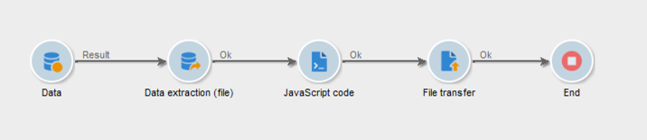
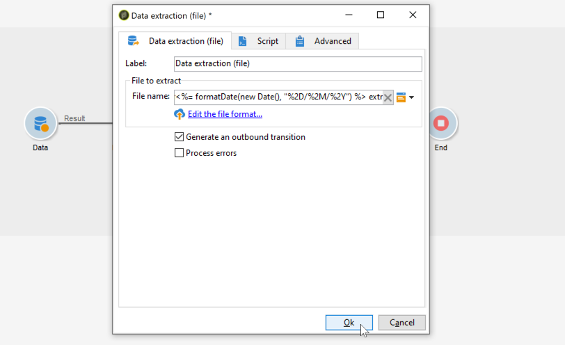
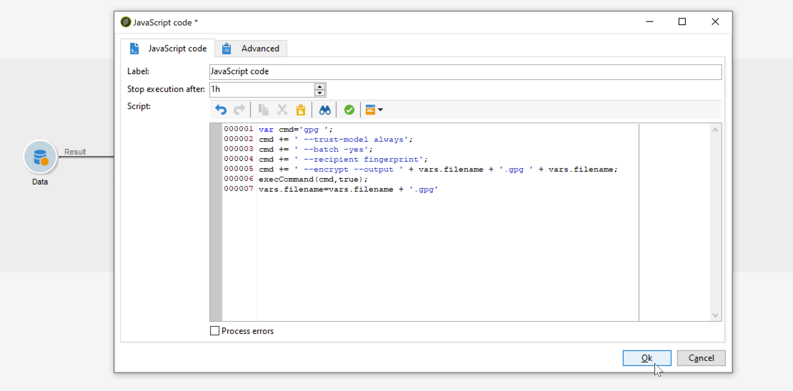
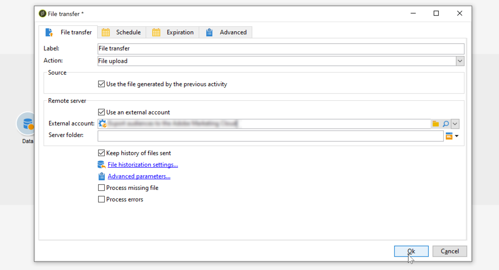

# Compresión o cifrado de un archivo {#zipping-or-encrypting-a-file}

Adobe Campaign permite exportar archivos comprimidos o cifrados. Al definir una exportación a través de una actividad **[!UICONTROL Data extraction (file)]**, puede definir un posprocesamiento para comprimir o cifrar el archivo.

Para poder hacerlo:

1. Instale un par de claves GPG para su instancia mediante el [Panel de control](https://experienceleague.adobe.com/docs/control-panel/using/instances-settings/gpg-keys-management.html?lang=es#encrypting-data).

   >[!NOTE]
   >
   >El Panel de control está restringido a los usuarios administradores y solo está disponible para determinadas versiones de Campaign. [Más información](https://experienceleague.adobe.com/docs/control-panel/using/discover-control-panel/key-features.html?lang=es)
   >

1. Si Adobe aloja la instalación de Adobe Campaign, contacte con el [Servicio de atención al cliente de Adobe](https://helpx.adobe.com/es/enterprise/admin-guide.html/enterprise/using/support-for-experience-cloud.ug.html) para que instalen las herramientas necesarias en el servidor.
1. Si la instalación de Adobe Campaign está in situ: instale la utilidad que desee utilizar (por ejemplo: GPG, GZIP) así como las claves necesarias (clave de cifrado) en el servidor de aplicaciones.

A continuación, puede utilizar comandos o código en la pestaña **[!UICONTROL Script]** de la actividad o en una actividad **[!UICONTROL JavaScript code]** . A continuación se muestra un ejemplo en el caso de uso.

**Temas relacionados:**

* [Descomprimir o descifrar un archivo antes de procesarlo](../../platform/using/unzip-decrypt.md)
* [Actividad de extracción de datos (archivo)](https://experienceleague.adobe.com/docs/campaign/automation/workflows/wf-activities/action-activities/extraction-file.html?lang=es){target="_blank"}

## Caso de uso: cifrado y exportación de datos con una clave instalada en el Panel de control {#use-case-gpg-encrypt}

En este caso de uso, crearemos un flujo de trabajo para cifrar y exportar los datos con una clave instalada en el Panel de control.

 [Descubra esta función en vídeo](#video)

Los pasos para realizar este caso de uso son los siguientes:

1. genere un par de claves GPG (públicas/privadas) utilizando una utilidad GPG, luego instale la clave pública en Panel de control. Encontrará los pasos detallados en la documentación [del](https://experienceleague.adobe.com/docs/control-panel/using/instances-settings/gpg-keys-management.html?lang=es#encrypting-data) Panel de control.

1. En Campaign Classic, genere un flujo de trabajo para exportar los datos y cifrarlos con la clave privada que se ha instalado mediante el Panel de control. Para ello, crearemos un flujo de trabajo de la siguiente manera:

   

   * **[!UICONTROL Query]** actividad: En este ejemplo, queremos ejecutar una consulta para un destinatario de los datos de la base de datos que queremos exportar.
   * **[!UICONTROL Data extraction (file)]** actividad: extrae los datos en un archivo.
   * **[!UICONTROL JavaScript code]** actividad: cifra los datos que se van a extraer.
   * **[!UICONTROL File transfer]** actividad: envía los datos a un origen externo (en este ejemplo, un servidor SFTP).

1. Configure la actividad **[!UICONTROL Query]** para destinatario de los datos deseados de la base de datos. Consulte la [documentación de Campaign v8](https://experienceleague.adobe.com/docs/campaign/automation/workflows/wf-activities/targeting-activities/query.html?lang=es){target="_blank"}.

1. Abra la actividad **[!UICONTROL Data extraction (file)]** y configúrela según sus necesidades. Los conceptos globales sobre cómo configurar la actividad están disponibles en la [documentación de Campaign v8](https://experienceleague.adobe.com/docs/campaign/automation/workflows/wf-activities/action-activities/extraction-file.html?lang=es){target="_blank"}.

   

1. Abra la actividad **[!UICONTROL JavaScript code]** y copie y pegue el comando siguiente para cifrar los datos que desee extraer.

   >[!IMPORTANT]
   >
   >Asegúrese de reemplazar el valor de la **huella** del comando por la huella digital de la clave pública instalada en el Panel de control.

   ```
   var cmd='gpg ';
   cmd += ' --trust-model always';
   cmd += ' --batch --yes';
   cmd += ' --recipient fingerprint';
   cmd += ' --encrypt --output ' + vars.filename + '.gpg ' + vars.filename;
   execCommand(cmd,true);
   vars.filename=vars.filename + '.gpg'
   ```

   

1. Abra la actividad **[!UICONTROL File transfer]** y especifique el servidor SFTP al que desea enviar el archivo. Los conceptos globales sobre cómo configurar la actividad están disponibles en la [documentación de Campaign v8](https://experienceleague.adobe.com/docs/campaign/automation/workflows/wf-activities/event-activities/file-transfer.html?lang=es){target="_blank"}.

   

1. Ahora puede ejecutar el flujo de trabajo. Una vez ejecutado, el destinatario de datos de la consulta se exportará al servidor SFTP en un archivo .gpg cifrado.

## Tutorial en vídeo {#video}

Este vídeo muestra cómo utilizar una clave GPG para cifrar datos y también está disponible en

>[!VIDEO](https://video.tv.adobe.com/v/41330?captions=spa&quality=12)

Hay disponibles más vídeos de procedimientos para Campaign Classic [aquí](https://experienceleague.adobe.com/docs/campaign-classic-learn/tutorials/overview.html?lang=es).
