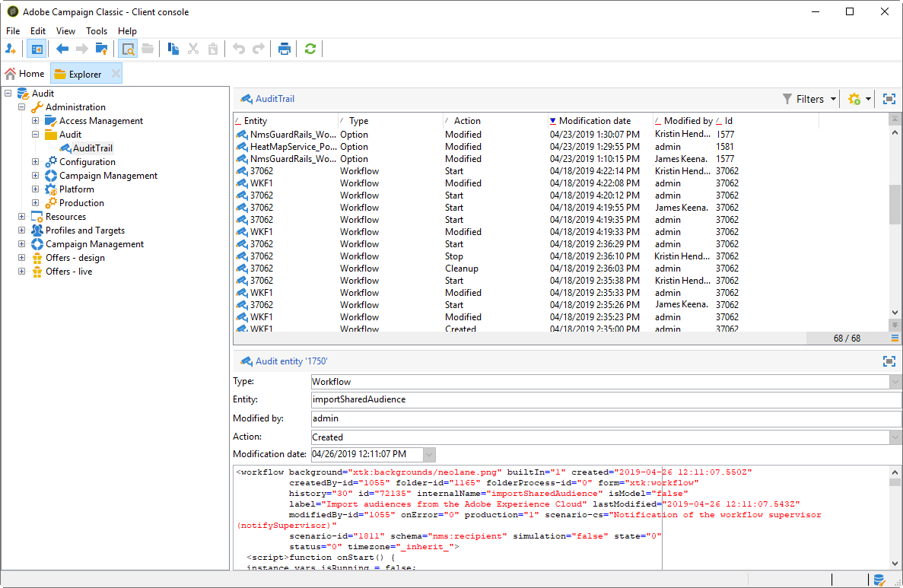

# Pista de auditoría{#audit-trail}

>[!INFO]
>
>Descubra más información sobre la funcionalidad Pista de auditoría en la [documentación de Adobe Campaign v8](https://experienceleague.adobe.com/es/docs/campaign/campaign-v8/analytics/audit-trail).

En Adobe Campaign, **[!UICONTROL Audit trail]** le proporciona acceso al historial completo de cambios realizados dentro de su instancia.

**[!UICONTROL Audit trail]** captura en tiempo real una lista completa de las acciones y eventos que se producen dentro de su instancia de Adobe Campaign. Incluye una forma de autoservicio de acceder a un historial de datos para responder preguntas como: qué ha pasado con sus flujos de trabajo y quién los actualizó por última vez o qué han hecho los usuarios en la instancia.

>[!NOTE]
>
>Adobe Campaign no audita los cambios realizados en los derechos de usuario, las plantillas, la personalización o las campañas.\
>Solo los administradores de la instancia pueden administrar la pista de auditoría.

+++ Más información sobre las Entidades disponibles de pista de auditoría

* **Registro de auditoría de esquemas**: permite explorar los cambios realizados en los esquemas, así como identificar quién realizó estas modificaciones y cuándo se produjeron.

  Para obtener información detallada sobre los esquemas, consulte esta [página](../../configuration/using/data-schemas.md).

* **Registro de auditoría de flujo de trabajo** rastrea todas las acciones relacionadas con sus flujos de trabajo, incluyendo:

   * Start
   * Pause
   * Stop
   * Restart
   * Limpieza igual al historial de purga de acciones
   * Simular, que es igual a la acción Iniciar en modo de simulación
   * Activación igual a la acción Ejecutar tareas pendientes ahora
   * Interrupción incondicional

  Para obtener más información sobre los flujos de trabajo, consulte esta [página](../../workflow/using/about-workflows.md).

  Para obtener más información sobre cómo monitorizar los flujos de trabajo, consulte la [documentación de Campaign v8](https://experienceleague.adobe.com/docs/campaign/automation/workflows/monitoring-workflows/monitor-workflow-execution.html?lang=es){target="_blank"}.

* **Seguimiento de auditoría de opciones** le permite comprobar las actividades y las últimas modificaciones realizadas en sus opciones.

  Para obtener más información sobre las opciones, consulte esta [página](../../installation/using/configuring-campaign-options.md).

* **Registro de auditoría de envíos** le permite comprobar las actividades y las últimas modificaciones realizadas en los envíos.

  Para obtener más información sobre las entregas, consulte esta [página](../../delivery/using/communication-channels.md).

* **Cuenta externa** le permite comprobar las modificaciones realizadas en cuentas externas, utilizadas por procesos técnicos como flujos de trabajo técnicos o flujos de trabajo de campañas.

  Para obtener más información sobre la cuenta externa, consulte esta [página](../../installation/using/external-accounts.md).

* **Asignación de entregas** le permite supervisar las actividades y las modificaciones recientes realizadas en sus Asignaciones de entregas.

  Para obtener más información sobre la asignación de envíos, consulte esta [página](../../configuration/using/target-mapping.md).

* **Aplicación web** le permite comprobar las modificaciones realizadas en los formularios web de Campaign V8 que se usan para crear páginas con campos de entrada y selección, y que pueden incluir datos de la base de datos.

  Para obtener más información sobre la aplicación web, consulte esta [página](../../web/using/about-web-applications.md).

* **Oferta** le permite comprobar las actividades y las últimas modificaciones realizadas en sus ofertas.

  Para obtener más información sobre la oferta, consulte esta [página](../../interaction/using/interaction-and-offer-management.md).

* **Operador** le permite supervisar las actividades y las modificaciones recientes realizadas en sus Operadores.

  Para obtener más información sobre los operadores, consulte esta [página](../../platform/using/access-management-operators.md).

+++
