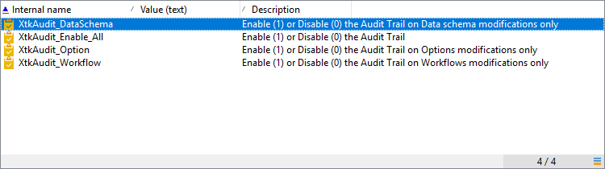

# Pista de auditoría{#audit-trail}

En Adobe Campaign, **[!UICONTROL Audit trail]** le permite acceder al historial completo de los cambios realizados dentro de su instancia.

**[!UICONTROL Audit trail]** captura, en tiempo real, una lista completa de las acciones y eventos que se producen dentro de la instancia de Adobe Campaign. Incluye una forma de autoservicio de acceder a un historial de datos para responder preguntas como: qué ha pasado con sus flujos de trabajo y quién los actualizó por última vez o qué han hecho los usuarios en la instancia.

>[!NOTE]
>
>Adobe Campaign no audita los cambios realizados dentro de los derechos de usuario, las plantillas, la personalización o las campañas.\
>La pista de auditoría solo la pueden administrar los administradores de la instancia.

La pista de auditoría consta de tres componentes:

* **Pista** de auditoría de esquema: Compruebe las actividades y las últimas modificaciones realizadas en los esquemas.

   Para obtener más información sobre los esquemas, consulte esta [página](../../configuration/using/data-schemas.md).

* **Pista** de auditoría del flujo de trabajo: Compruebe las actividades y las últimas modificaciones realizadas en los flujos de trabajo, así como el estado de los flujos de trabajo, como:

   * Start
   * Pause
   * Stop
   * Restart
   * Cleanup que es igual a la acción Purge history
   * Simular qué es igual a la acción Start in simulation mode
   * Despertar igual a la acción Ejecutar tareas pendientes ahora
   * Interrupción incondicional

   Para obtener más información sobre los flujos de trabajo, consulte esta [página](../../workflow/using/about-workflows.md).

   Para obtener más información sobre cómo monitorizar los flujos de trabajo, consulte la [sección dedicada](../../workflow/using/monitoring-workflow-execution.md).

* **Pista** de auditoría de opciones: Compruebe las actividades y las últimas modificaciones realizadas en sus opciones.

   Para obtener más información sobre las opciones, consulte esta [página](../../installation/using/configuring-campaign-options.md).

## Acceso a la pista de auditoría {#accessing-audit-trail}

Para acceder a la instancia **[!UICONTROL Audit trail]** :

1. Acceda al menú **[!UICONTROL Explorer]** de la instancia.
1. En el menú **[!UICONTROL Administration]**, seleccione **[!UICONTROL Audit]** .

   

1. La ventana **[!UICONTROL Audit trail]** se abre con la lista de las entidades. Adobe Campaign auditará las acciones de creación, edición y eliminación de flujos de trabajo, opciones y esquemas.

   Seleccione una de las entidades para obtener más información sobre las últimas modificaciones.

   

1. La ventana **[!UICONTROL Audit entity]** le proporciona información más detallada sobre la entidad elegida, como:

   * **[!UICONTROL Type]** : Flujo de trabajo, opciones o esquemas.
   * **[!UICONTROL Entity]** : Nombre interno de las actividades.
   * **[!UICONTROL Modified by]** : Nombre de usuario de la última persona que modificó esta entidad por última vez.
   * **[!UICONTROL Action]** : Última acción realizada en esta entidad, ya sea Creada, Editada o Eliminada.
   * **[!UICONTROL Modification date]** : Fecha de la última acción realizada en esta entidad.

   El bloque de código proporciona más información sobre qué se ha cambiado exactamente en la entidad.

   

>[!NOTE]
>
>De forma predeterminada, el período de retención se establece en 180 días para **[!UICONTROL Audit logs]** . Para obtener más información sobre cómo cambiar el período de retención, consulte esta [página](../../production/using/database-cleanup-workflow.md#deployment-wizard).

## Habilitar/deshabilitar pista de auditoría {#enable-disable-audit-trail}

La pista de auditoría se puede activar o desactivar fácilmente para una actividad específica si, por ejemplo, desea ahorrar espacio en la base de datos.

Para ello:

1. Acceda al menú **[!UICONTROL Explorer]** de la instancia.
1. En el menú **[!UICONTROL Administration]**, seleccione **[!UICONTROL Platform]** y luego **[!UICONTROL Options]** .

   

1. Seleccione una de las siguientes opciones en función de la entidad que desee activar o desactivar:

   * Para el flujo de trabajo: **[!UICONTROL XtkAudit_Workflows]**
   * Para Esquemas: **[!UICONTROL XtkAudit_DataSchema]**
   * Para opciones: **[!UICONTROL XtkAudit_Option]**
   * Para cada entidad: **[!UICONTROL XtkAudit_Enable_All]**

   

1. Cambie **[!UICONTROL Value]** a 1 si desea habilitar la entidad o a 0 si desea deshabilitarla.

   

1. Haga clic en **[!UICONTROL Save]** .
