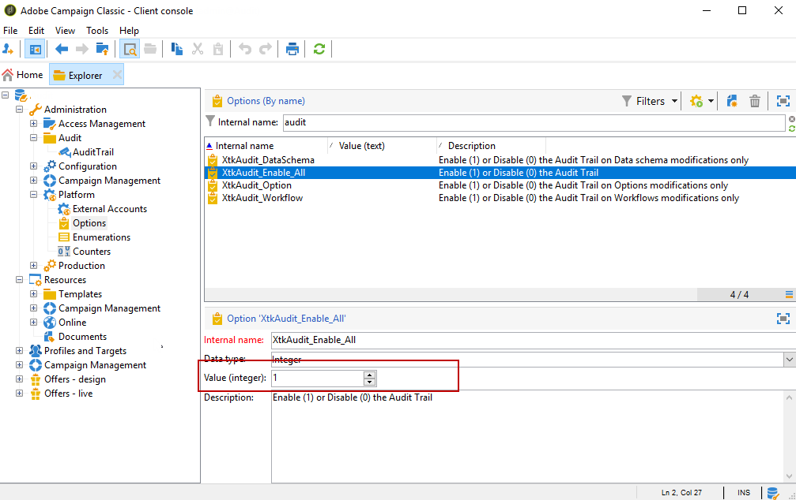

# Pista de auditoría{#audit-trail}

En Adobe Campaign, **[!UICONTROL Audit trail]** le proporciona acceso al historial completo de cambios realizados dentro de su instancia.

**[!UICONTROL Audit trail]** captura en tiempo real una lista completa de las acciones y eventos que se producen dentro de su instancia de Adobe Campaign. Incluye una forma de autoservicio de acceder a un historial de datos para responder preguntas como: qué ha pasado con sus flujos de trabajo y quién los actualizó por última vez o qué han hecho los usuarios en la instancia.

>[!NOTE]
>
>Adobe Campaign no audita los cambios realizados en los derechos de usuario, las plantillas, la personalización o las campañas.\
>Solo los administradores de la instancia pueden administrar la pista de auditoría.

La pista de auditoría consta de tres componentes:

* **Pista de auditoría de esquemas**: Compruebe las actividades y las últimas modificaciones realizadas en los esquemas.

  Para obtener más información sobre esquemas, consulte esta [página](../../configuration/using/data-schemas.md).

* **Registro de auditoría de flujo de trabajo**: compruebe las actividades y las últimas modificaciones realizadas en los flujos de trabajo y, además, el estado de los mismos, como por ejemplo:

   * Start
   * Pause
   * Stop
   * Restart
   * Limpieza igual al historial de purga de acciones
   * Simular, que es igual a la acción Iniciar en modo de simulación
   * Activación igual a la acción Ejecutar tareas pendientes ahora
   * Interrupción incondicional

  Para obtener más información sobre los flujos de trabajo, consulte esta [página](../../workflow/using/about-workflows.md).

  Para obtener más información sobre cómo monitorizar los flujos de trabajo, consulte la [sección dedicada](../../workflow/using/monitoring-workflow-execution.md).

* **Pista de auditoría de opciones**: Compruebe las actividades y las últimas modificaciones realizadas en sus opciones.

  Para obtener más información sobre las opciones, consulte esta [página](../../installation/using/configuring-campaign-options.md).

## Acceso a Pista de auditoría {#accessing-audit-trail}

Para acceder a **[!UICONTROL Audit trail]** de su instancia:

1. Acceda al menú **[!UICONTROL Explorer]** de su instancia.
1. En el menú **[!UICONTROL Administration]**, seleccione **[!UICONTROL Audit]**

   

1. La ventana **[!UICONTROL Audit trail]** se abre con la lista de sus entidades. Adobe Campaign auditará las acciones de creación, edición y eliminación para flujos de trabajo, opciones y esquemas.

   Seleccione una de las entidades para obtener más información sobre las últimas modificaciones.

   

1. La ventana **[!UICONTROL Audit entity]** le proporciona información más detallada sobre la entidad elegida, como:

   * **[!UICONTROL Type]** : flujo de trabajo, opciones o esquemas.
   * **[!UICONTROL Entity]** : nombre interno de sus actividades.
   * **[!UICONTROL Modified by]** : nombre de usuario de la última persona que modificó esta entidad por última vez.
   * **[!UICONTROL Action]** : última acción realizada en esta entidad, ya sea Creada, Editada o Eliminada.
   * **[!UICONTROL Modification date]** : fecha de la última acción realizada en esta entidad.

   El bloque de código proporciona más información sobre lo que se ha cambiado exactamente en la entidad.

   

>[!NOTE]
>
>De manera predeterminada, el período de retención se establece en 180 días para **[!UICONTROL Audit logs]** Para obtener más información sobre cómo cambiar el período de retención, consulte esta [página](../../production/using/database-cleanup-workflow.md#deployment-assistant).

## Habilitar/deshabilitar pista de auditoría {#enable-disable-audit-trail}

La pista de auditoría se puede activar o desactivar fácilmente para una actividad específica si, por ejemplo, desea ahorrar espacio en la base de datos.

Para ello:

1. Acceda al menú **[!UICONTROL Explorer]** de su instancia.
1. En el menú **[!UICONTROL Administration]**, seleccione **[!UICONTROL Platform]** y luego **[!UICONTROL Options]**

   

1. Seleccione una de las siguientes opciones en función de la entidad que desee activar/desactivar:

   * Para el flujo de trabajo: **[!UICONTROL XtkAudit_Workflows]**
   * Para esquemas: **[!UICONTROL XtkAudit_DataSchema]**
   * Para las opciones: **[!UICONTROL XtkAudit_Option]**
   * Para cada entidad: **[!UICONTROL XtkAudit_Enable_All]**

   

1. Cambie **[!UICONTROL Value]** a 1 si desea habilitar la entidad o a 0 si desea deshabilitarla.

   

1. Haga clic en **[!UICONTROL Save]**.
