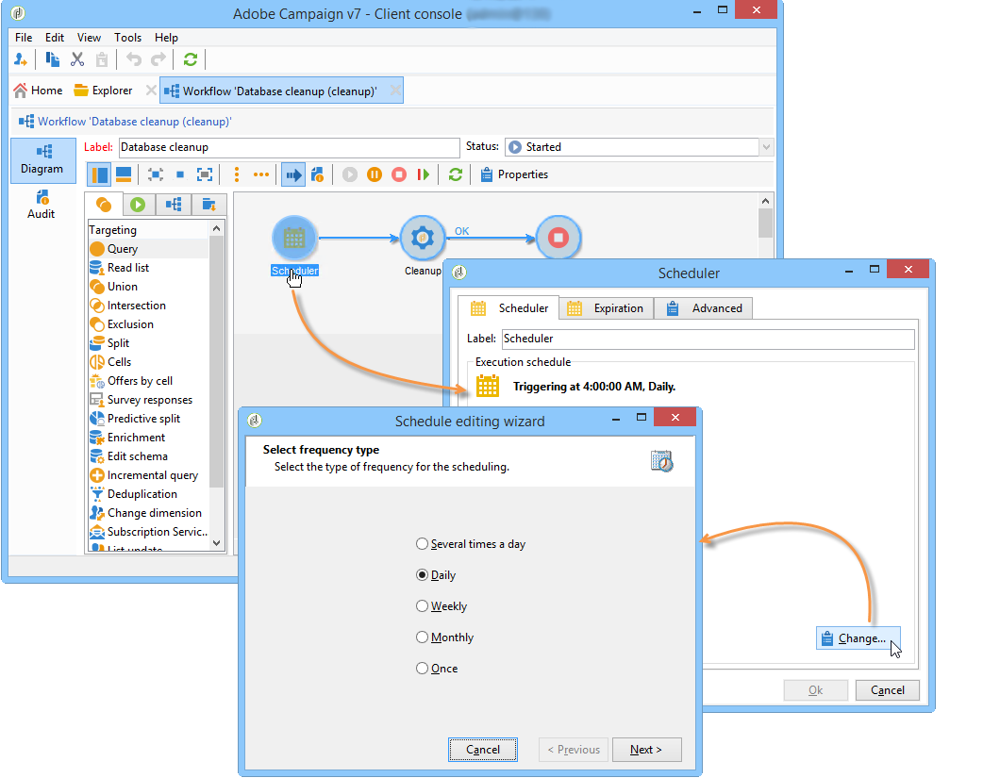

# Flujo de trabajo para limpieza de bases de datos{#database-cleanup-workflow}

## Introducción {#introduction}

El flujo de trabajo **[!UICONTROL Database cleanup]** accesible a través del nodo **[!UICONTROL Administration > Production > Technical workflows]** le permite eliminar datos obsoletos para evitar el crecimiento exponencial de la base de datos. El flujo de trabajo se activa automáticamente sin intervención del usuario.


## Configuración {#configuration}

La limpieza de la base de datos está configurada en dos niveles: en el Planificador de flujo de trabajo y en el asistente de implementación.

### Planificador de flujo de trabajo {#the-scheduler}

>[!NOTE]
>
>Para obtener más información sobre el planificador, consulte [esta sección](../../workflow/using/scheduler.md).

De forma predeterminada, el flujo de trabajo **[!UICONTROL Database cleanup]** se configura en inicio diario a las 4 de la madrugada. El Planificador le permite cambiar la frecuencia de activación del flujo de trabajo. Están disponibles las siguientes frecuencias:

* **[!UICONTROL Several times a day]**
* **[!UICONTROL Daily]**
* **[!UICONTROL Weekly]**
* **[!UICONTROL Once]**



>[!IMPORTANT]
>
>Para que el flujo de trabajo **[!UICONTROL Database cleanup]** se inicio en la fecha y hora definidas en el Planificador, se debe iniciar el motor de flujos de trabajo (wfserver). Si este no es el caso, la limpieza de la base de datos no tendrá lugar hasta la próxima vez que se inicie el motor de flujos de trabajo.

### Asistente de implementación {#deployment-wizard}

El **[!UICONTROL Deployment wizard]**, al que se accede a través del menú **[!UICONTROL Tools > Advanced]**, le permite configurar durante cuánto tiempo se guardan los datos. Los valores se expresan en días. Si estos valores no se modifican, el flujo de trabajo utilizará los valores predeterminados.


Los campos de la ventana **[!UICONTROL Purge of data]** coinciden con las siguientes opciones. Algunas de las tareas ejecutadas por el flujo de trabajo **[!UICONTROL Database cleanup]** las utilizan:

* Seguimiento consolidado: **NmsCleanup_TrackingStatPurgeDelay** (consulte [Limpieza de registros de seguimiento](#cleanup-of-tracking-logs))
* Registros de envío: **NmsCleanup_BroadLogPurgeDelay** (consulte [Limpieza de registros de envío](#cleanup-of-delivery-logs))
* Registros de seguimiento: **NmsCleanup_TrackingLogPurgeDelay** (consulte [Limpieza de registros de seguimiento](#cleanup-of-tracking-logs))
* Envíos eliminados: **NmsCleanup_RecycledDeliveryPurgeDelay** (consulte [Limpieza de envíos para eliminar o reciclar](#cleanup-of-deliveries-to-be-deleted-or-recycled))
* Importar rechazos: **NmsCleanup_RejectPurgeDelay** (consulte [Limpieza de rechazos generados por importaciones](#cleanup-of-rejects-generated-by-imports-))
* Perfiles de visitante: **NmsCleanup_VisitorPurgeDelay** (consulte [Limpieza de visitantes](#cleanup-of-visitors))
* Propuestas de oferta: **NmsCleanup_PropositionPurgeDelay** (consulte [Limpieza de propuestas](#cleanup-of-propositions))

   >[!NOTE]
   >
   >El campo **[!UICONTROL Offer propositions]** sólo está disponible cuando se instala el módulo **Interacción**.

* Eventos: **NmsCleanup_EventPurgeDelay** (consulte [eventos caducados de Limpieza](#cleansing-expired-events))
* Eventos archivados: **NmsCleanup_EventHistoPurgeDelay** (consulte [eventos caducados de Limpieza](#cleansing-expired-events))

   >[!NOTE]
   >
   >Los campos **[!UICONTROL Events]** y **[!UICONTROL Archived events]** sólo están disponibles si está instalado el módulo **Centro de mensajes**.

* Pista de auditoría: **XtkCleanup_AuditTrailPurgeDelay** (consulte [Limpieza de pista de auditoría](#cleanup-of-audit-trail))

Todas las tareas ejecutadas por el flujo de trabajo **[!UICONTROL Database cleanup]** se describen en la siguiente sección.

## Tareas realizadas por el flujo de trabajo de limpieza de la base de datos {#tasks-carried-out-by-the-database-cleanup-workflow}

En la fecha y hora definidas en el Planificador de flujo de trabajo (consulte [El Planificador](#the-scheduler)), el motor de flujos de trabajo inicio el proceso de limpieza de la base de datos. La limpieza de la base de datos se conecta a la base de datos y ejecuta las tareas en la secuencia que se muestra a continuación.

>[!IMPORTANT]
>
>Si falla una de estas tareas, no se ejecutarán las siguientes.\
>Las consultas SQL con un atributo **LIMIT** se ejecutarán repetidamente hasta que se procese toda la información.

>[!NOTE]
>
>Las secciones siguientes, que describen las tareas realizadas por el flujo de trabajo de limpieza de bases de datos, están reservadas para administradores de bases de datos o usuarios familiarizados con el lenguaje SQL.

### Listas para eliminar la limpieza {#lists-to-delete-cleanup}

La primera tarea ejecutada por el flujo de trabajo **[!UICONTROL Database cleanup]** elimina todos los grupos con **deleteStatus != 0** atributo de **NmsGroup**. También se eliminan los registros vinculados a estos grupos y que existen en otras tablas.

1. Las listas que se deben eliminar se recuperan mediante la siguiente consulta SQL:

   ```
   SELECT iGroupId, sLabel, iType FROM NmsGroup WHERE iDeleteStatus <> 0 OR tsExpirationDate <= GetDate() 
   ```

1. Cada lista tiene varios vínculos a otras tablas. Todos estos vínculos se eliminan de forma masiva mediante la siguiente consulta:

   ```
   DELETE FROM $(relatedTable) WHERE iGroupId=$(l) IN (SELECT iGroupId FROM $(relatedTable) WHERE iGroupId=$(l) LIMIT 5000) 
   ```

   donde **$(relatedTable)** es una tabla relacionada con **NmsGroup** y **$(l)** es el identificador de lista.

1. Cuando la lista es una lista de tipo &quot;Lista&quot;, la tabla asociada se elimina con la siguiente consulta:

   ```
   DROP TABLE grp$(l)
   ```

1. Cada lista de tipo **Select** recuperada por la operación se elimina con la siguiente consulta:

   ```
   DELETE FROM NmsGroup WHERE iGroupId=$(l) 
   ```

   donde **$(l)** es el identificador de lista

### Limpieza de envíos para eliminar o reciclar {#cleanup-of-deliveries-to-be-deleted-or-recycled}

Esta tarea purga todos los envíos para eliminarlos o reciclarlos.

1. El flujo de trabajo **[!UICONTROL Database cleanup]** selecciona todos los envíos para los que el campo **deleteStatus** tiene el valor **[!UICONTROL Yes]** o **[!UICONTROL Recycled]** y cuya fecha de eliminación es anterior al período definido en el campo **[!UICONTROL Deleted deliveries]** (**NmsCleanup_RecycledDeliveryPurgeDelay**) del asistente de implementación. Para obtener más información sobre esto, consulte [Asistente para implementación](#deployment-wizard). Este período se calcula en relación con la fecha del servidor actual.
1. Para cada servidor intermediaria, la tarea selecciona la lista de envíos que se van a eliminar.
1. El flujo de trabajo **[!UICONTROL Database cleanup]** elimina registros de envío, archivos adjuntos, información de página espejo y todos los demás datos relacionados.
1. Antes de eliminar definitivamente el envío, el flujo de trabajo purga la información vinculada de las siguientes tablas:

   * En la tabla de exclusión de envío (**NmsDlvExclusion**), se utiliza la siguiente consulta:

      ```
      DELETE FROM NmsDlvExclusion WHERE iDeliveryId=$(l)
      ```

      donde **$(l)** es el identificador del envío.

   * En la tabla de cupones (**NmsCouponValue**), se utiliza la siguiente consulta (con eliminaciones masivas):

      ```
      DELETE FROM NmsCouponValue WHERE iMessageId IN (SELECT iMessageId FROM NmsCouponValue WHERE EXISTS (SELECT B.iBroadLogId FROM $(BroadLogTableName) B WHERE B.iDeliveryId = $(l) AND B.iBroadLogId = iMessageId ) LIMIT 5000)
      ```

      donde **$(l)** es el identificador del envío.

   * En las tablas del registro de envíos (**NmsBroadlogXxx**), las eliminaciones masivas se ejecutan en lotes de 20.000 registros.
   * En las tablas de propuesta de oferta (**NmsPropositionXxx**), las eliminaciones masivas se ejecutan en lotes de 20.000 registros.
   * En las tablas del registro de seguimiento (**NmsTrackinglogXxx**), las eliminaciones masivas se ejecutan en lotes de 20.000 registros.
   * En la tabla de fragmentos de envío (**NmsDeliveryPart**), las eliminaciones masivas se ejecutan en lotes de 500.000 registros. Esta tabla contiene información de personalización sobre los mensajes restantes que se van a entregar.
   * En la tabla de fragmentos de datos de página espejo (**NmsMirrorPageInfo**), las eliminaciones masivas se ejecutan en lotes de 20.000 registros para piezas de envío caducadas y para las piezas finalizadas o canceladas. Esta tabla contiene información de personalización de todos los mensajes utilizados para generar páginas espejo.
   * En la tabla de búsqueda de páginas espejo (**NmsMirrorPageSearch**), las eliminaciones masivas se ejecutan en lotes de 20.000 registros. Esta tabla es un índice de búsqueda que proporciona acceso a la información de personalización almacenada en la tabla **NmsMirrorPageInfo**.
   * En la tabla de registro de procesos por lotes (**XtkJobLog**), las eliminaciones masivas se ejecutan en lotes de 20.000 registros. Esta tabla contiene el registro de envíos que deben eliminarse.
   * En la tabla de seguimiento de URL de envío (**NmsTrackingUrl**), se utiliza la siguiente consulta:

      ```
      DELETE FROM NmsTrackingUrl WHERE iDeliveryId=$(l)
      ```

      donde **$(l)** es el identificador del envío.

      Esta tabla contiene las direcciones URL encontradas en los envíos que se van a eliminar para habilitar su seguimiento.

1. El envío se elimina de la tabla de envíos (**NmsDelivery**):

   ```
   DELETE FROM NmsDelivery WHERE iDeliveryId = $(l)
   ```

   donde **$(l)** es el identificador del envío.

#### Envíos que utilizan intermediaria {#deliveries-using-mid-sourcing}

El flujo de trabajo **[!UICONTROL Database cleanup]** también elimina envíos en los servidores intermediarias.

1. Para ello, el flujo de trabajo comprueba que cada envío está inactivo (según su estado). Si un envío está activo, se detendrá antes de eliminarse. El control se realiza mediante la ejecución de la siguiente consulta:

   ```
   SELECT iState FROM NmsDelivery WHERE iDeliveryId = $(l) AND iState <> 100;
   ```

   donde **$(l)** es el identificador del envío.

1. Si el valor del estado es **[!UICONTROL Start pending]** , **[!UICONTROL In progress]** , **[!UICONTROL Recovery pending]** , **[!UICONTROL Recovery in progress]** , **[!UICONTROL Pause requested]** , **[!UICONTROL Pause in progress]** o **[!UICONTROL Paused]** (valores 51, 55, 61, 62, 71, 72, 75), el envío se detiene y la tarea purga la información vinculada.

### Limpieza de envíos caducados {#cleanup-of-expired-deliveries}

Esta tarea detiene envíos cuyo período de validez ha caducado.

1. El flujo de trabajo **[!UICONTROL Database cleanup]** crea la lista de envíos que han caducado. Esta lista incluye todos los envíos caducados con un estado distinto a **[!UICONTROL Finished]**, así como los envíos detenidos recientemente con más de 10.000 mensajes no procesados. Se utiliza la siguiente consulta:

   ```
   SELECT iDeliveryId, iState FROM NmsDelivery WHERE iDeleteStatus=0 AND iIsModel=0 AND iDeliveryMode=1 AND ( (iState >= 51 AND iState < 85 AND tsValidity IS NOT NULL AND tsValidity < $(currentDate) ) OR (iState = 85 AND DateMinusDays(15) < tsLastModified AND iToDeliver - iProcessed >= 10000 ))
   ```

   donde **el modo de envío 1** coincide con el modo **[!UICONTROL Mass delivery]**, **state 51** coincide con el estado **[!UICONTROL Start pending]**, **state 85** coincide con el estado **[!UICONTROL Stopped]** y el mayor número de registros de envío actualizados masivamente en el servidor de envío es igual a 10.0000000000.

1. A continuación, el flujo de trabajo incluye la lista de envíos caducados recientemente que utilizan intermediaria. Se excluyen los envíos para los que aún no se han recuperado registros de envío a través del servidor intermediaria.

   Se utiliza la siguiente consulta:

   ```
   SELECT iDeliveryId, tsValidity, iMidRemoteId, mData FROM NmsDelivery WHERE (iDeliveryMode = 4 AND (iState = 85 OR iState = 95) AND tsValidity IS NOT NULL AND (tsValidity < SubDays(GetDate() , 15) OR tsValidity < $(DateOfLastLogPullUp)) AND tsLastModified > SubDays(GetDate() , 15))
   ```

1. La siguiente consulta se utiliza para detectar si la cuenta externa sigue activa o no, para filtrar envíos por fecha:

   ```
   SELECT iExtAccountId FROM NmsExtAccount WHERE iActive<>0 AND sName=$(providerName)
   ```

1. En lista de envíos caducados, los registros de envío cuyo estado es **[!UICONTROL Pending]** , cambiarán a **[!UICONTROL Delivery cancelled]** y todos los envíos de esta lista cambiarán a **[!UICONTROL Finished]**.

   Se utilizan las siguientes consultas:

   ```
   UPDATE $(BroadLogTableName) SET tsLastModified=$(curdate), iStatus=7, iMsgId=$(bl) WHERE iDeliveryId=$(dl) AND iStatus=6
   ```

   donde **$(curdate)** es la fecha actual del servidor de base de datos, **$(bl)** es el identificador del mensaje de registros de envío, **$(dl)** es el identificador de envío, **estado de envío 6** coincide con el estado **[!UICONTROL Pending]** y **estado de envío 7** coincide con el estado **[!UICONTROL Delivery cancelled]**.

   ```
   UPDATE NmsDelivery SET iState = 95, tsLastModified = $(curdate), tsBroadEnd = tsValidity WHERE iDeliveryId = $(dl)
   ```

   donde **estado de envío 95** coincide con el estado **[!UICONTROL Finished]** y **$(dl)** es el identificador del envío.

1. Se eliminan todos los fragmentos (**deliveryParts**) de envíos obsoletos y se eliminan todos los fragmentos obsoletos de envíos de notificación en curso. La eliminación masiva se utiliza para ambas tareas.

   Se utilizan las siguientes consultas:

   ```
   DELETE FROM NmsDeliveryPart WHERE iDeliveryPartId IN (SELECT iDeliveryPartId FROM NmsDeliveryPart WHERE iDeliveryId IN (SELECT iDeliveryId FROM NmsDelivery WHERE iState=95 OR iState=85) LIMIT 5000)
   ```

   ```
   DELETE FROM NmsDeliveryPart WHERE iDeliveryPartId IN (SELECT iDeliveryPartId FROM NmsDeliveryPart WHERE tsValidity < $(curDate) LIMIT 500000)
   ```

   donde **estado de envío 95** coincide con el estado **[!UICONTROL Finished]**, **estado de envío 85** coincide con el estado **[!UICONTROL Stopped]** y **$(curDate)** es la fecha del servidor actual.

### Limpieza de páginas espejo {#cleanup-of-mirror-pages}

Esta tarea elimina los recursos web (páginas espejo) que utilizan los envíos.

1. En primer lugar, la lista de envíos que se van a purgar se recupera con la siguiente consulta:

   ```
   SELECT iDeliveryId, iNeedMirrorPage FROM NmsDelivery WHERE iWebResPurged = 0 AND tsWebValidity IS NOT NULL AND tsWebValidity < $(curdate)"
   ```

   donde **$(curDate)** es la fecha del servidor actual.

1. A continuación, se purga la tabla **NmsMirrorPageInfo**, si es necesario utilizando el identificador del envío recuperado anteriormente. La eliminación masiva se utiliza para generar las siguientes consultas:

   ```
   DELETE FROM NmsMirrorPageInfo WHERE iMirrorPageInfoId IN (SELECT iMirrorPageInfoId FROM NmsMirrorPageInfo WHERE iDeliveryId = $(dl)) LIMIT 5000)
   ```

   ```
   DELETE FROM NmsMirrorPageSearch WHERE iMessageId IN (SELECT iMessageId FROM NmsMirrorPageSearch WHERE iDeliveryId = $(dl)) LIMIT 5000)
   ```

   donde **$(dl)** es el identificador del envío.

1. A continuación, se agrega una entrada al registro de envíos.
1. Luego se identifican los envíos purgados para evitar tener que volver a procesarlos más tarde. Se ejecuta la siguiente consulta:

   ```
   UPDATE NmsDelivery SET iWebResPurged = 1 WHERE iDeliveryId IN ($(strIn))
   ```

   donde **$(strIn)** es la lista de identificadores de envío.

### Limpieza de los cuadros de trabajo {#cleanup-of-work-tables}

Esta tarea elimina de la base de datos todas las tablas de trabajo que coinciden con envíos cuyo estado es **[!UICONTROL Being edited]** , **[!UICONTROL Stopped]** o **[!UICONTROL Deleted]**.

1. La lista de tablas con nombres que comienzan por **wkDlv_** se recupera primero con la siguiente consulta (postgresql):

   ```
   SELECT relname FROM pg_class WHERE relname LIKE Lower('wkDlv_') ESCAPE E'\\' AND relkind IN ('r','v') AND pg_get_userbyid(relowner)<>'postgres'
   ```

1. A continuación se excluyen las tablas utilizadas por los flujos de trabajo en curso. Para ello, la lista de envíos en curso se recupera con la siguiente consulta:

   ```
   SELECT iDeliveryId FROM NmsDelivery WHERE iDeliveryId<>0 AND iDeleteStatus=0 AND iState NOT IN (0,85,100);
   ```

   donde 0 es el valor que coincide con el estado del envío **[!UICONTROL Being edited]**, 85 coincide con el estado **[!UICONTROL Stopped]** y 100 con el estado **[!UICONTROL Deleted]**.

1. Las tablas que ya no se utilicen se eliminarán con la siguiente consulta:

   ```
   DROP TABLE wkDlv_15487_1;
   ```

### Limpieza de los rechazos generados por las importaciones {#cleanup-of-rejects-generated-by-imports-}

Este paso permite eliminar registros para los que no se procesaron todos los datos durante la importación.

1. La eliminación masiva se realiza en la tabla **XtkReject** con la siguiente consulta:

   ```
   DELETE FROM XtkReject WHERE iRejectId IN (SELECT iRejectId FROM XtkReject WHERE tsLog < $(curDate)) LIMIT $(l))
   ```

   donde **$(curDate)** es la fecha del servidor actual desde la cual restamos el período definido para la opción **NmsCleanup_RevalsPurgeDelay** (consulte [Asistente para implementación](#deployment-wizard)) y **$(l)** es el número máximo de registros que se eliminarán masivamente ...

1. Todos los rechazos huérfanos se eliminan con la siguiente consulta:

   ```
   DELETE FROM XtkReject WHERE iJobId NOT IN (SELECT iJobId FROM XtkJob)
   ```

### Limpieza de instancias de flujo de trabajo {#cleanup-of-workflow-instances}

Esta tarea purga cada instancia de flujo de trabajo utilizando su identificador (**lWorkflowId**) e historial (**Historial**). Elimina las tablas inactivas ejecutando de nuevo la tarea de limpieza de la tabla de trabajo. La limpieza también elimina todas las tablas de trabajo huérfanas (wkf% y wkfhisto%) de los flujos de trabajo eliminados.

>[!NOTE]
>
>La frecuencia de purga del historial se especifica para cada flujo de trabajo en el campo **Historial en días** (valor predeterminado 30 días). Este campo se encuentra en la ficha **Ejecución** de las propiedades del flujo de trabajo. Para obtener más información, consulte [esta sección](../../workflow/using/workflow-properties.md#execution).

1. Para recuperar la lista de flujos de trabajo que deben eliminarse, se utiliza la siguiente consulta:

   ```
   SELECT iWorkflowId, iHistory FROM XtkWorkflow WHERE iWorkflowId<>0
   ```

1. Esta consulta genera la lista de flujos de trabajo que se utilizarán para eliminar todos los registros vinculados, las tareas finalizadas y los eventos terminados, utilizando las siguientes consultas:

   ```
   DELETE FROM XtkWorkflowLog WHERE iWorkflowId=$(lworkflow) AND tsLog < DateMinusDays($(lhistory))
   ```

   ```
   DELETE FROM XtkWorkflowTask WHERE iWorkflowId=$(lworkflow) AND iStatus<>0 AND tsCompletion < DateMinusDays($(lhistory)) 
   ```

   ```
   DELETE FROM XtkWorkflowEvent WHERE iWorkflowId=$(l) AND iStatus>2 AND tsProcessing < DateMinusDays($(lHistory))
   ```

   donde **$(lworkflow)** es el identificador del flujo de trabajo y **$(lhistory)** es el identificador del historial.

1. Se eliminan todas las tablas no utilizadas. Para ello, todas las tablas se recopilan gracias a una máscara de tipo **wkf%** con la siguiente consulta (postgresql):

   ```
   SELECT relname FROM pg_class WHERE relname LIKE Lower('wkf%') ESCAPE E'\\' AND relkind IN ('r','v') AND pg_get_userbyid(relowner)<>'postgres'
   ```

1. A continuación, se excluyen todas las tablas utilizadas por una instancia de flujo de trabajo pendiente. La lista de flujos de trabajo activos se recupera utilizando la siguiente consulta:

   ```
   SELECT iWorkflowId FROM XtkWorkflow WHERE iWorkflowId<>0 AND iState<>20
   ```

1. A continuación, se recupera cada identificador de flujo de trabajo para encontrar el nombre de las tablas utilizadas por los flujos de trabajo en curso. Estos nombres se excluyen de la lista de tablas recuperadas anteriormente.
1. Las tablas del historial de actividades de tipo &quot;consulta incremental&quot; se excluyen mediante las siguientes consultas:

   ```
   SELECT relname FROM pg_class WHERE relname LIKE Lower('wkfhisto%') ESCAPE E'\\' AND relkind IN ('r','v') AND pg_get_userbyid(relowner)<>'postgres'
   ```

   ```
   SELECT iWorkflowId FROM XtkWorkflow WHERE iWorkflowId IN ($(strCondition))
   ```

   donde **$(strcondition)** es la lista de tablas que coinciden con la máscara **wkfhisto%**.

1. Las tablas restantes se eliminan con la siguiente consulta:

   ```
   DROP TABLE wkf15487_12;
   ```

### Limpieza de inicios de sesión de flujo de trabajo {#cleanup-of-workflow-logins}

Esta tarea elimina los inicios de sesión del flujo de trabajo mediante la siguiente consulta:

```
DELETE FROM XtkWorkflowLogin WHERE iWorkflowId NOT IN (SELECT iWorkflowId FROM XtkWorkflow)
```

### Limpieza de tablas de trabajo huérfanas {#cleanup-of-orphan-work-tables}

Esta tarea elimina las tablas de trabajo huérfanas vinculadas a los grupos. La tabla **NmsGroup** almacena los grupos que se van a limpiar (con un tipo diferente de 0). El prefijo de los nombres de tabla es **grp**. Para identificar los grupos que se van a limpiar, se utiliza la siguiente consulta:

```
SELECT iGroupId FROM NmsGroup WHERE iType>0"
```

### Limpieza de visitantes {#cleanup-of-visitors}

Esta tarea elimina los registros obsoletos de la tabla de visitantes mediante eliminación masiva. Los registros obsoletos son aquellos para los que la última modificación es anterior al período de conservación definido en el asistente de implementación (consulte [Asistente de implementación](#deployment-wizard)). Se utiliza la siguiente consulta:

```
DELETE FROM NmsVisitor WHERE iVisitorId IN (SELECT iVisitorId FROM NmsVisitor WHERE iRecipientId = 0 AND tsLastModified < AddDays(GetDate(), -30) AND iOrigin = 0 LIMIT 20000)
```

donde **$(tsDate)** es la fecha del servidor actual, desde la cual restamos el período definido para la opción **NmsCleanup_VisitorPurgeDelay**.

### Limpieza de NPAI {#cleanup-of-npai}

Esta tarea permite eliminar registros que coinciden con direcciones válidas de la tabla **NmsAddress**. La siguiente consulta se utiliza para realizar la eliminación masiva:

```
DELETE FROM NmsAddress WHERE iAddressId IN (SELECT iAddressId FROM NmsAddress WHERE iStatus=2 AND tsLastModified < $(tsDate1) AND tsLastModified >= $(tsDate2) LIMIT 5000)
```

donde **status 2** coincide con el estado **[!UICONTROL Valid]**, **$(tsDate1)** es la fecha del servidor actual y **$(tsDate2)** coincide con la opción **NmsCleanup_LastCleanup**.

### Limpieza de suscripciones {#cleanup-of-subscriptions-}

Esta tarea purga todas las suscripciones eliminadas por el usuario de la tabla **NmsSubscription** mediante eliminación masiva. Se utiliza la siguiente consulta:

```
DELETE FROM NmsSubscription WHERE iDeleteStatus <>0
```

### Limpieza de registros de seguimiento {#cleanup-of-tracking-logs}

Esta tarea elimina los registros obsoletos de las tablas de seguimiento y registro de seguimiento web. Los registros obsoletos son aquellos que son anteriores al período de conservación definido en el asistente de implementación (consulte [Asistente de implementación](#deployment-wizard)).

1. En primer lugar, la lista de las tablas de registro de seguimiento se recupera con la siguiente consulta:

   ```
   SELECT distinct(sTrackingLogSchema) FROM NmsDeliveryMapping WHERE sTrackingLogSchema IS NOT NULL;
   ```

1. La eliminación masiva se utiliza para purgar todas las tablas en la lista de tablas previamente recuperadas. Se utiliza la siguiente consulta:

   ```
   DELETE FROM XtkTrackingLogRcp WHERE iTrackingLogId IN (SELECT iTrackingLogId FROM XtkTrackingLogRcp WHERE tsLog < $(tsDate) LIMIT 5000) 
   ```

   donde **$(tsDate)** es la fecha del servidor actual desde la cual restamos el período definido para la opción **NmsCleanup_TrackingLogPurgeDelay**.

1. La tabla de estadísticas de seguimiento se elimina mediante eliminación masiva. Se utiliza la siguiente consulta:

   ```
   DELETE FROM NmsTrackingStats WHERE iTrackingStatsId IN (SELECT iTrackingStatsId FROM NmsTrackingStats WHERE tsStart < $(tsDate) LIMIT 5000) 
   ```

   donde **$(tsDate)** es la fecha del servidor actual desde la cual restamos el período definido para la opción **NmsCleanup_TrackingStatPurgeDelay**.

### Limpieza de registros de envío {#cleanup-of-delivery-logs}

Esta tarea le permite purgar los registros de envío almacenados en varias tablas.

1. Con este fin, la lista de esquemas de registro de envíos se recupera mediante la siguiente consulta:

   ```
   SELECT distinct(sBroadLogSchema) FROM NmsDeliveryMapping WHERE sBroadLogSchema IS NOT NULL UNION SELECT distinct(sBroadLogExclSchema) FROM NmsDeliveryMapping WHERE sBroadLogExclSchema IS NOT NULL
   ```

1. Al utilizar intermediaria, no se hace referencia a la tabla **NmsBroadLogMid** en las asignaciones de envío. El esquema **nms:wideLogMid** se agrega a la lista recuperada por la consulta anterior.
1. El flujo de trabajo **de limpieza de la base de datos** purga los datos obsoletos de las tablas recuperadas anteriormente. Se utiliza la siguiente consulta:

   ```
   DELETE FROM $(tableName) WHERE iBroadLogId IN (SELECT iBroadLogId FROM $(tableName) WHERE tsLastModified < $(option) LIMIT 5000) 
   ```

   donde **$(tableName)** es el nombre de cada tabla en la lista de esquemas, y **$(option)** es la fecha definida para la opción **NmsCleanup_BroadLogPurgeDelay** (consulte [Asistente para implementación](#deployment-wizard)).

1. Finalmente, el flujo de trabajo comprueba si existe la tabla **NmsProviderMsgId**. En caso afirmativo, todos los datos obsoletos se eliminan con la siguiente consulta:

   ```
   DELETE FROM NmsProviderMsgId WHERE iBroadLogId IN (SELECT iBroadLogId FROM NmsProviderMsgId WHERE tsCreated < $(option) LIMIT 5000)
   ```

   donde **$(option)** coincide con la fecha definida para la opción **NmsCleanup_BroadLogPurgeDelay** (consulte [Asistente para implementación](#deployment-wizard)).

### Limpieza de la tabla NmsEmailErrorStat {#cleanup-of-the-nmsemailerrorstat-table-}

Esta tarea limpia la tabla **NmsEmailErrorStat**. El programa principal (**coalesceErrors**) define dos fechas:

* **Fecha** de inicio: fecha del siguiente proceso que coincide con la  **** opción NmsLastErrorStatCoalesceoption o con la fecha más reciente de la tabla.
* **Fecha** final: fecha actual del servidor.

Si la fecha de inicio es buena o igual a la fecha de finalización, no se realizará ningún proceso. En este caso, aparece el mensaje **coalesceUpToDate**.

Si la fecha de inicio es anterior a la fecha de finalización, se limpia la tabla **NmsEmailErrorStat**.

El número total de errores en la tabla **NmsEmailErrorStat**, entre las fechas de inicio y de finalización, se recupera con la siguiente consulta:

```
"SELECT COUNT(*) FROM NmsEmailErrorStat WHERE tsDate>= $(start) AND tsDate< $(end)"
```

donde **$end** y **$inicio** son las fechas de inicio y finalización definidas previamente.

Si el total es bueno a 0:

1. La siguiente consulta se ejecuta para mantener sólo los errores más allá de un determinado umbral (que es igual a 20):

   ```
   "SELECT iMXIP, iPublicId, SUM(iTotalConnections), SUM(iTotalErrors), SUM(iMessageErrors), SUM(iAbortedConnections), SUM(iFailedConnections), SUM(iRefusedConnections), SUM(iTimeoutConnections) FROM NmsEmailErrorStat WHERE tsDate>=$(start ) AND tsDate<$(end ) GROUP BY iMXIP, iPublicId HAVING SUM(iTotalErrors) >= 20"
   ```

1. Se muestra el mensaje **coalescingErrors**.
1. Se crea una nueva conexión para eliminar todos los errores que se producen entre las fechas de inicio y de finalización. Se utiliza la siguiente consulta:

   ```
   "DELETE FROM NmsEmailErrorStat WHERE tsDate>=$(start) AND tsDate<$(end)"
   ```

1. Cada error se guarda en la tabla **NmsEmailErrorStat** con la siguiente consulta:

   ```
   "INSERT INTO NmsEmailErrorStat(iMXIP, iPublicId, tsDate, iTotalConnections, iTotalErrors, iTimeoutConnections, iRefusedConnections, iAbortedConnections, iFailedConnections, iMessageErrors) VALUES($(lmxip ), $(lpublicId ), $(tsstart ), $(lconnections ), $(lconnectionErrors ),$(ltimeoutConnections ), $(lrefusedConnections ), $(labortedConnections ), $(lfailedConnections ), $(lmessageErrors))"
   ```

   donde cada variable coincide con un valor recuperado por la consulta anterior.

1. La variable **inicio** se actualiza con los valores del proceso anterior para finalizar el bucle.

El bucle y la parada de tarea.

Las depuraciones se ejecutan en las tablas **NmsEmailError** y **clearNmsMxDomain**.

### Limpieza de la tabla NmsEmailError {#cleanup-of-the-nmsemailerror-table-}

Se utiliza la siguiente consulta:

```
DELETE FROM NmsEmailError WHERE iMXIP NOT IN (SELECT DISTINCT iMXIP FROM NmsEmailErrorStat)
```

Esta consulta elimina todas las líneas sin registros vinculados en la tabla **NmsEmailErrorStat** de **NmsEmailError**.

### Limpieza de la tabla NmsMxDomain {#cleanup-of-the-nmsmxdomain-table-}

Se utiliza la siguiente consulta:

```
DELETE FROM NmsMxDomain WHERE iMXIP NOT IN (SELECT DISTINCT iMXIP FROM NmsEmailErrorStat)
```

Esta consulta elimina todas las líneas sin un registro vinculado en la tabla **NmsEmailErrorStat** de la tabla **NmsMxDomain**.

### Limpieza de propuestas {#cleanup-of-propositions}

Si el módulo **Interacción** está instalado, esta tarea se ejecuta para purgar las tablas **NmsPropositionXxx**.

La lista de los cuadros de propuestas se recupera y la eliminación masiva se lleva a cabo en cada uno de ellos, utilizando la siguiente consulta:

```
DELETE FROM NmsPropositionXxx WHERE iPropositionId IN (SELECT iPropositionId FROM NmsPropositionXxx WHERE tsLastModified < $(option) LIMIT 5000) 
```

donde **$(opción)** es la fecha definida para la opción **NmsCleanup_PropositionPurgeDelay** (consulte [Asistente para implementación](#deployment-wizard)).

### Limpieza de tablas de simulación {#cleanup-of-simulation-tables}

Esta tarea limpia las tablas de simulación huérfanas (que ya no están vinculadas a una simulación de oferta o a una simulación de envío).

1. Para recuperar la lista de simulaciones que requieren limpieza, se utiliza la siguiente consulta:

   ```
   SELECT iSimulationId FROM NmsSimulation WHERE iSimulationId<>0
   ```

1. El nombre de las tablas que se eliminarán está formado por el prefijo **wkSimu_** seguido del identificador de la simulación (por ejemplo: **wkSimu_456831_aggr**):

   ```
   DROP TABLE wkSimu_456831_aggr
   ```

### Limpieza de pista de auditoría {#cleanup-of-audit-trail}

Se utiliza la siguiente consulta:

```
DELETE FROM XtkAudit WHERE tsChanged < $(tsDate)
```

donde **$(tsDate)** es la fecha del servidor actual desde la cual se sustrae el período definido para la opción **XtkCleanup_AuditTrailPurgeDelay**.

### Limpieza de Nmsaddress {#cleanup-of-nmsaddress}

Se utiliza la siguiente consulta:

```
DELETE FROM NmsAddress WHERE iAddressId IN (SELECT iAddressId FROM NmsAddress WHERE iStatus=STATUS_QUARANTINE AND tsLastModified < $(NmsCleanup_AppSubscriptionRcpPurgeDelay + 5d) AND iType IN (MESSAGETYPE_IOS, MESSAGETYPE_ANDROID ) LIMIT 5000)
```

Esta consulta elimina todas las entradas relacionadas con iOS y Android.

### Actualización de estadísticas y optimización de almacenamientos {#statistics-update}

La opción **XtkCleanup_NoStats** le permite controlar el comportamiento del paso de optimización de almacenamiento del flujo de trabajo de limpieza.

Si la opción **XtkCleanup_NoStats** no existe o si su valor es 0, se ejecutará la optimización de almacenamiento en modo detallado (VACUUM VERBOSE ANALYZE) en PostgreSQL y se actualizarán las estadísticas de todas las demás bases de datos. Para asegurarse de que este comando se ejecuta, compruebe los registros PostgreSQL. VACUUM generará líneas en formato: `INFO: vacuuming "public.nmsactivecontact"` y ANALYZE generará líneas en formato: `INFO: analyzing "public.nmsactivecontact"`.

Si el valor de la opción es 1, la actualización de estadísticas no se ejecuta en ninguna base de datos. La siguiente línea de registro aparecerá en los registros del flujo de trabajo: `Option 'XtkCleanup_NoStats' is set to '1'`.

Si el valor de la opción es 2, se ejecutará la análisis de almacenamiento en modo detallado (ANALYZE VERBOSE) en PostgreSQL y se actualizarán las estadísticas de todas las demás bases de datos. Para asegurarse de que este comando se ejecuta, compruebe los registros PostgreSQL. ANALYZE generará líneas en el formato: `INFO: analyzing "public.nmsactivecontact"`.

### Limpieza de suscripciones (NMAC) {#subscription-cleanup--nmac-}

Esta tarea elimina cualquier suscripción relacionada con servicios o aplicaciones móviles eliminados.

Para recuperar la lista de los esquemas de logs, se utiliza la siguiente consulta:

```
SELECT distinct(sBroadLogSchema) FROM NmsDeliveryMapping WHERE sBroadLogSchema IS NOT NULL
```

A continuación, la tarea recupera los nombres de las tablas vinculadas al vínculo **appSubscription** y elimina estas tablas.

Este flujo de trabajo de limpieza también elimina todas las entradas en las que idisabled = 1 no se hayan actualizado desde el tiempo establecido en la opción **NmsCleanup_AppSubscriptionRcpPurgeDelay**.

### Información de sesión de limpieza {#cleansing-session-information}

Esta tarea limpia la información de la tabla **sessionInfo**, se utiliza la siguiente consulta:

```
 DELETE FROM XtkSessionInfo WHERE tsexpiration < $(curdate) 
```

### Eventos caducados de limpieza {#cleansing-expired-events}

Esta tarea limpia los eventos recibidos y almacenados en las instancias de ejecución y los eventos archivados en una instancia de control.

### Reacciones de limpieza {#cleansing-reactions}

Esta tarea limpia las reacciones (tabla **NmsRemaMatchRcp**) en las que se han eliminado las hipótesis.
