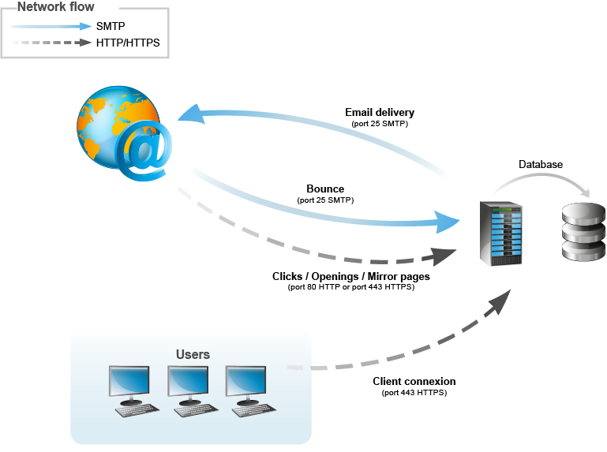

# Arquitectura general{#general-architecture}

## Arquitectura mínima {#minimum-architecture}

En una configuración mínima, Adobe Campaign funciona con:

* el servidor de aplicaciones de Adobe Campaign,
* la base de datos.

  

Este diagrama muestra que el único tráfico involucrado en el contexto de una arquitectura mínima es:

1. Tráfico del protocolo HTTP al servidor de Adobe Campaign a través de Internet,
1. Tráfico de protocolo SMTP desde y hacia el servidor de Adobe Campaign a través de Internet.

## Arquitectura distribuida {#distributed-architecture}

Adobe Campaign está formado por varios módulos que se pueden desglosar en varios equipos. Este modo de funcionamiento tiene varias ventajas:

* equilibrio de carga,
* configuración de la redundancia de módulos,
* creación de una arquitectura desglosada en varios proveedores de servicios (segmentación de los servicios prestados).

La distribución de módulos en varias máquinas ofrece una gran flexibilidad de uso y una adaptabilidad mejorada.

>[!NOTE]
>
>Para obtener más información sobre las distintas arquitecturas, consulte [esta sección](../../installation/using/general-architecture.md).

## Lista de puertos abiertos {#list-of-open-ports}

| Número de puerto | Módulo o aplicación de Adobe Campaign correspondiente | Configurable |
|---|---|---|
| 443/tcp u 80/tcp | Servidores web (Apache/IIS) | SÍ |
| 6666/udp (local) | Adobe Campaign: Syslogd | SÍ |
| 8005/tcp (local) | Adobe Campaign: módulo web | SÍ |
| 8080/tcp | Adobe Campaign: módulo web (tomcat) | SÍ |
| 7777 | Servidor de estadísticas (servidor stat) | SÍ |
