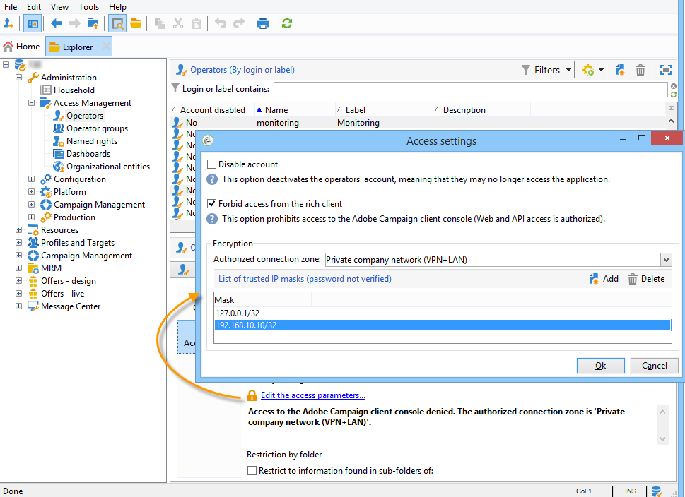

# Monitorización de procesos{#monitoring-processes}

El servidor de aplicaciones y el servidor de redirección (**seguimiento**) se pueden monitorizar de forma manual o automática.

## Monitorización manual {#manual-monitoring}

Vaya a **[!UICONTROL Monitoring]** y haga clic en el enlace **[!UICONTROL Overview]** para mostrar la página de monitorización del proceso de Adobe Campaign.


La página mostrada permite ver el estado de la instancia conectada, es decir:

* información sobre la instancia: versión, nombre, motor de base de datos, paquetes instalados, indicadores del sistema del servidor,
* la lista de procesos e información de ejecución que faltan (fecha de inicio, PID, etc.),
* una vista de los flujos de trabajo y los envíos.

En [esta página](../../production/using/monitoring-guidelines.md) se presentan formas adicionales de monitorizar los diferentes procesos de Campaign.

### Registro del diario {#log-journal}

Es posible mostrar el diario de registro relacionado con un proceso. Para ello, haga clic en el proceso, **mta** por ejemplo, y luego haga clic en **[!UICONTROL Open the log journal]** .


### Indicadores del sistema {#system-indicators}

La lista de indicadores del sistema permite mostrar información sobre la máquina, como su memoria física y virtual, los procesos activos y el espacio disponible en disco. Los indicadores son diferentes para los sistemas operativos Linux y Windows. Vaya a la página **[!UICONTROL Instance Monitoring]** y haga clic en el enlace **[!UICONTROL Display]** para abrir la lista de indicadores

#### Windows {#in-windows}

* **[!UICONTROL Pending events queued]** : indicador específico del  **centro de mensajes**. Consulte [esta sección](../../message-center/using/additional-configurations.md#monitoring-thresholds) para obtener más información.

* **[!UICONTROL Memory]** : información sobre la memoria física (RAM).

   **[!UICONTROL Current value]** : consumo real de memoria.

   **[!UICONTROL Max Value]** : cantidad total de memoria instalada.

   **[!UICONTROL Available]** : cantidad de memoria disponible.

   **[!UICONTROL Warning]** : este indicador se muestra cuando el consumo de memoria alcanza el 80% de la cantidad total.

   **[!UICONTROL Alert]** : este indicador se muestra cuando el consumo de memoria alcanza el 90% de la cantidad total.

   Cuando se muestran los indicadores **[!UICONTROL Warning]** y **[!UICONTROL Alert]**, puede resolver el problema añadiendo RAM al equipo en el que está instalado el servidor de Adobe Campaign. También puede decidir instalar el servidor de Adobe Campaign en un equipo dedicado.

* **[!UICONTROL Swap Memory]** : información relacionada con la memoria virtual que coincide con un archivo de paginación: un área del disco duro que Windows usa como si fuera RAM.

   **[!UICONTROL Current value]** : consumo real de memoria.

   **[!UICONTROL Max Value]** : cantidad total de memoria.

   **[!UICONTROL Available]** : cantidad de memoria disponible.

   **[!UICONTROL Warning]** : este indicador se muestra cuando el consumo de memoria alcanza el 80% de la cantidad total.

   **[!UICONTROL Alert]** : este indicador se muestra cuando el consumo de memoria alcanza el 90% de la cantidad total.

   Cuando se muestran los indicadores **[!UICONTROL Warning]** y **[!UICONTROL Alert]**, puede resolver el problema aumentando el tamaño del archivo de intercambio en la configuración avanzada de Windows.

* **[!UICONTROL Disk XXX]** : información sobre lectores de máquinas.

   **[!UICONTROL Current value]** : espacio en disco realmente utilizado.

   **[!UICONTROL Max Value]** : capacidad total del disco.

   **[!UICONTROL Available]** : espacio en disco disponible

   **[!UICONTROL Used]** : porcentaje de disco utilizado.

   **[!UICONTROL Warning]** : este indicador se muestra cuando el espacio disponible en disco alcanza el 80% de la capacidad total.

   **[!UICONTROL Alert]** : este indicador se muestra cuando el espacio disponible en disco alcanza el 90% de la capacidad total.

* **[!UICONTROL Number of processes too old]** : información sobre los procesos de Adobe Campaign que han estado activos durante más de un día.

   **[!UICONTROL Current value]** : número de procesos activos actualmente.

   **[!UICONTROL Max Value]** : número máximo de procesos autorizados (1).

   **[!UICONTROL Alert]** : este indicador se muestra si el número de procesos es igual a 1.

   Cuando se muestra el indicador **[!UICONTROL Alert]**, puede ser que el proceso correspondiente esté bloqueado por el motor de base de datos SQL o que esté atascado en un bucle infinito. El proceso **watchdog** proporcionado por Adobe Campaign reinicia automáticamente todos los procesos todos los días y le permite resolver este problema. Sin embargo, también puede detener el proceso en cuestión usted mismo para forzar el reinicio.

#### Linux {#in-linux}


* **[!UICONTROL Pending events queued]** : indicador específico del  **centro de mensajes**. Consulte [esta sección](../../message-center/using/additional-configurations.md#monitoring-thresholds) para obtener más información.

* **[!UICONTROL Load average (1/5/15 minutes)]** : información sobre la carga, es decir, la velocidad de uso del procesador por los procesos que se ejecutan en el equipo durante el último minuto, cinco minutos o quince minutos

   **[!UICONTROL Current value]** : carga real de la máquina.

   **[!UICONTROL Max value]** : carga máxima de uso de los procesos en el equipo

   **[!UICONTROL Warning]** : este indicador se muestra cuando la carga alcanza el 80% del valor máximo autorizado en el último minuto, cinco minutos o quince minutos.

   **[!UICONTROL Alert]** : este indicador se muestra cuando la carga alcanza el 90 % del valor máximo autorizado del último minuto, cinco minutos o quince minutos.

* **[!UICONTROL Memory]** : información sobre la memoria física (RAM).

   **[!UICONTROL Current value]** : consumo real de memoria.

   **[!UICONTROL Max Value]** : cantidad total de memoria instalada.

   **[!UICONTROL Available]** : cantidad de memoria disponible.

   **[!UICONTROL Warning]** : este indicador se muestra cuando el consumo de memoria alcanza el 80% de la cantidad total.

   **[!UICONTROL Alert]** : este indicador se muestra cuando el consumo de memoria alcanza el 90% de la cantidad total.

   Cuando se muestran los indicadores **[!UICONTROL Warning]** y **[!UICONTROL Alert]**, puede resolver el problema añadiendo RAM al equipo en el que está instalado el servidor de Adobe Campaign. También puede decidir instalar el servidor de Adobe Campaign en un equipo dedicado.

* **[!UICONTROL Swap Memory]** : información relacionada con la memoria virtual que coincide con un archivo de paginación: un área del disco duro que Windows usa como si fuera RAM.

   **[!UICONTROL Current value]** : consumo real de memoria.

   **[!UICONTROL Max Value]** : cantidad total de memoria.

   **[!UICONTROL Available]** : cantidad de memoria disponible.

   **[!UICONTROL Warning]** : este indicador se muestra cuando el consumo de memoria alcanza el 80% de la cantidad total.

   **[!UICONTROL Alert]** : este indicador se muestra cuando el consumo de memoria alcanza el 90% de la cantidad total.

   Cuando se muestran los indicadores **[!UICONTROL Warning]** y **[!UICONTROL Alert]**, puede resolver el problema aumentando el tamaño del archivo de intercambio.

* **[!UICONTROL Core Files]** : información sobre los archivos generados tras el bloqueo de un proceso de Adobe Campaign. Estos archivos permiten diagnosticar las causas del bloqueo.

   **[!UICONTROL Current Value]** : número de archivos existentes.

   **[!UICONTROL Max Value]** : número máximo de archivos autorizados (1).

   **[!UICONTROL Warning]** : este indicador se muestra cuando el número de archivos se acerca a 1.

   **[!UICONTROL Alert]** : este indicador se muestra cuando el número de archivos es igual a 1.

   Cuando falta un proceso debido a un bloqueo, se muestra en rojo en la lista de procesos y se reinicia automáticamente mediante el proceso **watchdog** proporcionado por Adobe Campaign.

* **[!UICONTROL Number of shared memory segments]** : información sobre los segmentos de memoria compartidos por todos los procesos de Adobe Campaign.

   **[!UICONTROL Current value]** : número de segmentos de memoria actualmente en uso.

   **[!UICONTROL Max Value]** : número máximo de segmentos de memoria autorizados (2).

   **[!UICONTROL Warning]** : este indicador se muestra cuando el número de segmentos de memoria alcanza 1.

   **[!UICONTROL Alert]** : este indicador se muestra cuando el número de segmentos de memoria alcanza 2.

* **[!UICONTROL Number of processes too old]** : información sobre los procesos que han estado activos durante más de un día.

   **[!UICONTROL Current value]** : número de procesos activos actualmente.

   **[!UICONTROL Max Value]** : número máximo de procesos autorizados.

   **[!UICONTROL Warning]** : este indicador se muestra cuando el número de procesos alcanza el 80 % del umbral autorizado.

   **[!UICONTROL Alert]** : este indicador se muestra cuando el número de procesos alcanza el 90 % del umbral autorizado.

* **[!UICONTROL File Handles]** : información sobre los descriptores de archivos, es decir, el número de archivos abiertos por proceso.

   **[!UICONTROL Current value]** : número actual de descriptores de archivos.

   **[!UICONTROL Max Value]** : número máximo de descriptores de archivo autorizados por el sistema operativo.

   **[!UICONTROL Warning]** : este indicador se muestra cuando el número de descriptores de archivo autorizados alcanza el umbral del 80 %.

   **[!UICONTROL Alert]** : este indicador se muestra cuando el número de descriptores de archivo autorizados alcanza el umbral del 90 %.

* **[!UICONTROL Processes]** : información sobre los procesos de máquina.

   **[!UICONTROL Current value]** : número de procesos activos actualmente.

   **[!UICONTROL Max Value]** : número máximo de procesos autorizados.

   **[!UICONTROL Active Processes]** : número de procesos activos.

   **[!UICONTROL Inactive Processes]** : número de procesos inactivos.

   **[!UICONTROL Warning]** : este indicador se muestra cuando el número de procesos autorizados alcanza el umbral del 80 %.

   **[!UICONTROL Alert]** : este indicador se muestra cuando el número de procesos autorizados alcanza el umbral del 90 %.

* **[!UICONTROL Zombie Processes]** : información sobre los procesos que se han detenido pero que aún tienen un identificador de proceso (PID) y que siguen visibles en la tabla de proceso.

   **[!UICONTROL Current value]** : número de procesos zombie que están activos actualmente.

   **[!UICONTROL Max Value]** : número máximo de procesos zombie autorizados (2).

   **[!UICONTROL Warning]** : este indicador se muestra cuando el número de procesos zombie se acerca a 2.

   **[!UICONTROL Alert]** este indicador se muestra cuando el número de procesos zombie llega a 2.

#### Indicadores personalizados {#customized-indicators}

Adobe Campaign permite personalizar indicadores. Para ello:

1. Cree un archivo **.sh** y asígnele el nombre **[!UICONTROL cust_indicators.sh]** .
1. Añada los indicadores personalizados a este archivo. Por ejemplo:

   ```
   #!/bin/bash 
   echo "<indicator name='Zombie Processes'>  
   <current label='Current Value' value='0' display=''/>  
   <warning value='2'/>  <alert value='2'/>  
   <max label='Max Value' value='2'/>
   </indicator>"
   ```

   o

   ```
   #!/bin/bash 
   echo "<indicator name='Availability'>  
   <current label='Last update of data' display='2012-09-03 10:00'/>  
   <current label='Availability last month' display='100.00%'/>  
   <current label='Availability this month' display='100.00%'/> 
   <current label='Recent downtime periods' display='2012-07-04 11:10:00 - 11:19:59'/>
   </indicator>"
   ```

1. Coloque el archivo en la carpeta **[!UICONTROL usr/local/neolane/nl6]**.

Adobe Campaign llamará a este archivo.

## Informes SMTP {#smtp-reports}

Los informes de supervisión de envío SMTP están integrados en la plataforma de Adobe Campaign. Se puede acceder a ellas a través de la consola o mediante el acceso a la Web.

Estos informes muestran las estadísticas de envío SMTP y los errores SMTP por dominio.

Para acceder a ellos, el operador debe tener derechos de administración.

Se agrupan en **Monitoring** > &#39;SMTP Monitoring&#39;.


>[!IMPORTANT]
>
>* La información relacionada con la supervisión SMTP solo está disponible si se ha activado el canal de correo electrónico.
>* Los **[!UICONTROL SMTP sending statistics]** solo se ofrecen si el servidor de estadísticas se inicia en la instancia.

>


### Estadísticas de envío SMTP {#smtp-sending-statistics}

El informe **[!UICONTROL SMTP sending statistics]** permite controlar la actividad del servidor. Muestra una síntesis de cada uno de los equipos.


La lista de indicadores para este informe se muestra debajo del gráfico.

1. Número total de mensajes enviados.
1. 
   * Línea azul: mensajes listos para enviar que llegaron al compartidor, es decir, el último paso antes de enviar SMTP (coincide con los datos entrantes).

   * Línea verde: mensajes enviados correctamente (coincide con los datos salientes).

   * Línea roja: mensajes abandonados por el shaper, devueltos al **mta** (coincide con los datos rechazados en esta recuperación).

   Estos valores se expresan en número de mensajes por hora.

1. Representa dos colas del Shaper:

   * Curva azul: cola de mensajes activos. Estos mensajes se enviarán lo antes posible.

   * Curva Kaki: la cola &#39;diferido&#39;. Estos mensajes no se pueden devolver por el momento debido a la limitación o porque no hay conexión disponible con el destino. Los reintentos tendrán lugar cada 5, 10, 20, 40, 2 min, etc. para el tiempo definido **MaxAgeSec** antes de ser abandonado.

1. Estos gráficos muestran un detalle de los mensajes abandonados (curva roja en el segundo gráfico): muestra la proporción de mensajes abandonados sin reintentos (mauve) comparados con los mensajes cuyo envío falló (red). Esto permite ver la proporción de mensajes que no se procesan dentro del periodo concedido debido a limitaciones del servidor de estadísticas (restricción) o debido a la falta de disponibilidad del servidor remoto.
1. Las conexiones SMTP se abren o se están abriendo.
1. Estimación del número de **mtachild**.

>[!NOTE]
>
>Este informe está relacionado con el estado del componente Capturador de tráfico de correo electrónico .

### Errores SMTP por dominio {#smtp-errors-per-domain}

Este informe permite ver los errores de entrega, durante un periodo determinado, desglosados por dominio.

>[!NOTE]
>
>Las opciones **minConnectionsToLog**, **minErrorsToLog** y **minMessagesToLog** del archivo **serverConf.xml** definen los umbrales por encima de los cuales se tienen en cuenta las estadísticas de conexión.


La lista de indicadores para este informe se muestra debajo de la tabla.

* La columna **Domain** contiene el nombre del dominio al que se envían los mensajes (o el nombre de dominio real, yahoo.com para yahoo.fr por ejemplo).
* La columna **Cnx** muestra el número de conexiones SMTP abiertas para este dominio.
* La columna **Sent** corresponde al número de mensajes enviados a este dominio.
* La columna **Volume** muestra el volumen de mensajes que se han intentado enviar a este dominio (valor aproximado),
* La columna **Errors** muestra un indicador de volumen de errores en este dominio durante el periodo,
* La columna **Last response** muestra el último mensaje de respuesta SMTP recibido para este dominio.
* La columna **Date** muestra la fecha de la última respuesta SMTP recibida para este dominio.

>[!NOTE]
>
>Los valores mostrados en las columnas **Cnx**, **Sent** y **Volume** se calculan con respecto al periodo seleccionado en el campo **[!UICONTROL Period]**.

Haga clic en un nombre de dominio para ver sus errores.

Se clasifican por PublicId: este identificador corresponde a una dirección IP compartida por varios mtas de Adobe Campaign detrás de un enrutador. El servidor de estadísticas utiliza este identificador para memorizar las estadísticas de conexión y envío entre este punto de inicio y el servidor de destino.


El campo **[!UICONTROL Owner of domain]** permite agrupar varios nombres de dominio con la misma etiqueta. En la vista del informe inicial, todos los nombres de dominio MX se asociarán a este propietario.

Haga clic en un identificador PublicId para ver más detalles.


>[!NOTE]
>
>El porcentaje de errores se representa mediante dos gráficos. El primero es una barra de progreso horizontal sobre un fondo negro. El segundo gráfico es cronológico. El período seleccionado se divide en doce intervalos de tiempo, cada uno representado por una barra de progreso vertical. En ambas representaciones, si no se ha detectado ningún error, la barra es negra. El color de la barra depende del porcentaje de errores encontrados (amarillo, naranja y, por último, rojo). El color gris significa que no se ha encontrado ningún volumen de datos significativo. Es posible mostrar el porcentaje exacto de errores colocando el cursor en el gráfico.

>[!NOTE]
>
>Para obtener más información sobre los errores de SMTP y su administración en Adobe Campaign, consulte [esta sección](../../installation/using/email-deliverability.md).

## Informe de facturación {#billing-report}

El flujo de trabajo técnico **[!UICONTROL Billing]** envía el informe de actividad del sistema al operador &quot;facturación&quot; por correo electrónico. Se activa de forma predeterminada el día 25 de cada mes en la instancia de Marketing.

El flujo de trabajo técnico se encuentra en una subcarpeta del nodo siguiente: **Administración** > **Producción** > **Flujos de trabajo técnicos**.


Una vez que se inicie el flujo de trabajo cada 25 días del mes, el operador de facturación recibirá el siguiente informe en su bandeja de entrada.


Las siguientes métricas están disponibles para realizar un seguimiento de los envíos:

* **[!UICONTROL Start date]** : Fecha de inicio de la entrega. Tenga en cuenta que puede ser antes de la fecha &quot;desde&quot; del informe.
* **[!UICONTROL Label]** : Etiqueta de la entrega. Los envíos que tienen menos de 100 mensajes para enviar se consideran demasiado pequeños y, por lo tanto, se acumulan antes de la fecha de inicio, en cuyo caso la etiqueta muestra el número de agregados, por ejemplo: [Agregación de 3 envíos pequeños].
* **[!UICONTROL Total volume]** : Volumen total de bytes transferidos para la entrega.
* **[!UICONTROL Avg volume]** : Volumen promedio de bytes transferidos. Este es el resultado de la siguiente fórmula **(volumen total / mensajes)**, que es la base de cálculo de la métrica **[!UICONTROL Multiplier]**.
* **[!UICONTROL Messages]** : Número de mensajes enviados. Esto incluye tanto los mensajes que se enviaron correctamente como los reintentos (tras la recepción de un mensaje de rechazo desde el servidor contactado).
* **[!UICONTROL Multiplier (x)]** : El valor del multiplicador se deduce del volumen promedio de los mensajes.
* **[!UICONTROL Count]** : Resultado de la multiplicación de los mensajes y del multiplicador.

## Supervisión automática {#automatic-monitoring}

Adobe Campaign ofrece varios métodos de monitorización automática, que se presentan a continuación.

### Línea de comandos {#command-line}

Comando

**nlserver monitor**

Permite enumerar un conjunto de indicadores en los módulos Adobe Campaign y en el sistema.

Genera resultados en un formato XML fácilmente procesado.

Este comando también se puede ejecutar con el parámetro **-missing**, que enumera los procesos que faltan en esta instancia cuando los archivos de configuración dicen que deben estar ejecutándose.

```
nlserver monitor -missing
HH:MM:SS > Application server for Adobe Campaign Classic (7.X YY.R build XXX@SHA1) of DD/MM/YYYY
mta@prod
stat@prod
wfserver@prod
```

### Información publicada por el servidor {#information-published-by-the-server}

#### /r/test {#r-test}

La página **http(s)://`<application>`/r/test** se utiliza para probar el servidor de redirección. Se recomienda utilizar este mismo método para probar los servidores frontales utilizados para el seguimiento. Esta página también se puede utilizar para probar un despachante de carga.

Muestra una línea como esta en formato XML:

```
<redir status='OK' date='YYYY-MM-DD HH:MM:SS.112Z' build='XXXX' host='<hostname>' localHost='<servername>'/>
```

**Frecuencia**: esta prueba no utiliza ninguna carga, por lo que se puede ejecutar muy a menudo (por ejemplo, una vez cada segundo).

#### /nl/jsp/ping.jsp {#nl-jsp-ping-jsp}

Esta página **http(s)://`<Application server url>`/nl/jsp/ping.jsp** funciona de la misma manera que su homólogo de red: prueba una consulta completa a través de apache/tomcat/web module/database y carga al cliente. Si todo funciona correctamente, devuelve un valor &quot;OK&quot;. Se recomienda ejecutar esta prueba en equipos con acceso a las bases de datos (mtas y encuestas, por ejemplo).

**Uso**: un token de sesión asociado con el inicio de sesión de un operador debe pasarse como argumento para iniciar sesión de forma remota (consulte la sugerencia en Supervisión  [automática mediante scripts](#automatic-monitoring-via-adobe-campaign-scripts) de Adobe Campaign).

Por ejemplo:


El nombre del operador y el inicio de sesión deben configurarse previamente en la consola del cliente de Adobe Campaign con derechos de base de datos.


**Frecuencia**: esta es una prueba que utiliza muy poco ancho de banda. Por lo tanto, puede ejecutarse con bastante frecuencia, aunque no más de una vez por minuto.

#### /nl/jsp/monitor.jsp {#nl-jsp-monitor-jsp}

Se trata de una prueba para comprobar que un operador puede acceder al servidor de Adobe Campaign a través de una página web; la misma página web a la que se accede a través de los menús de la consola del cliente. Puede llamar a esta página desde sus herramientas de vigilancia (Tivoli, Nagios, etc.).


**Uso**: un token de sesión asociado con un inicio de sesión del operador que le permite conectarse a la instancia debe utilizarse como argumento (consulte la sugerencia en Supervisión  [automática mediante scripts](#automatic-monitoring-via-adobe-campaign-scripts) de Adobe Campaign).

El operador y su inicio de sesión deben configurarse previamente en la consola del cliente de Adobe Campaign con los derechos y restricciones adecuados de la base de datos.

**Frecuencia**: se trata de una prueba completa del servidor y no es necesario ejecutarla con frecuencia (se puede realizar una vez cada diez minutos, por ejemplo).

#### /nl/jsp/soaprouter.jsp {#nl-jsp-soaprouter-jsp}

Este **jsp** representa el punto de entrada de las API de aplicación de Adobe Campaign. Por lo tanto, puede proporcionar un seguimiento detallado de la aplicación. También se puede utilizar para supervisar los servicios web de Adobe Campaign. Se utiliza en nuestros scripts de monitorización, pero tenga en cuenta que es solo para usuarios avanzados.

### Monitorización basada en tipos de implementación {#monitoring-based-on-deployment-types}

Adobe Campaign habilita varias configuraciones de implementación (para obtener más información, consulte [esta sección](../../installation/using/hosting-models.md)). En esta sección se detallan las distintas técnicas de monitorización automática que se deben aplicar en función del tipo de instalación.

<table> 
 <thead> 
  <tr> 
   <th> Tipo de implementación </th> 
   <th> Monitorización </th> 
  </tr> 
 </thead> 
 <tbody> 
  <tr> 
   <td> Independiente </td> 
   <td> 
    <ul> 
     <li><p> <span class="uicontrol">/r/</span> testand  <span class="uicontrol">/nl/jsp/monitor.</span> jspon del servidor Adobe Campaign</p> </li> 
    </ul> </td> 
  </tr> 
  <tr> 
   <td> Estándar </td> 
   <td> 
    <ul> 
     <li><p> <span class="uicontrol">/r/</span> testand  <span class="uicontrol">/nl/jsp/ping.</span> jspon los servidores frontales</p> </li> 
     <li><p> <span class="uicontrol">/nl/jsp/monitor.</span> jspon en el servidor de aplicaciones</p> </li> 
    </ul> </td> 
  </tr> 
  <tr> 
   <td> Empresa </td> 
   <td> 
    <ul> 
     <li><p> <span class="uicontrol">/r/</span> testand  <span class="uicontrol">/nl/jsp/ping.</span> jspon los servidores frontales</p> </li> 
     <li><p> <span class="uicontrol">/r/</span> testand  <span class="uicontrol">/nl/jsp/monitor.</span> jspon en el servidor de aplicaciones</p> </li> 
    </ul> </td> 
  </tr> 
  <tr> 
   <td> Mid-sourcing </td> 
   <td> 
    <ul> 
     <li><p> <span class="uicontrol">/nl/jsp/monitor.</span> jspon en el servidor de aplicaciones</p> </li> 
    </ul> </td> 
  </tr> 
 </tbody> 
</table>

## Monitorización automática mediante scripts de Adobe Campaign {#automatic-monitoring-via-adobe-campaign-scripts}

Adobe Campaign puede proporcionar una herramienta de monitorización de instancias (netreport) que le permita enviar un informe por correo electrónico con respecto a las anomalías detectadas.


>[!IMPORTANT]
>
>Esta herramienta se puede utilizar para supervisar las instancias, pero Adobe Campaign no la admite. Póngase en contacto con el administrador de Campaign para obtener más información.

### Elementos requeridos {#required-elements}

Se requieren las siguientes precauciones previas a la instalación para la monitorización automática:

* Debe tener los archivos **netreport.tgz** (instalación de Linux) o **netreport.zip** (instalación de Windows),
* Le recomendamos encarecidamente que no instale la monitorización en el equipo que se va a monitorizar.
* debe instalarse en un equipo con un JRE o un JDK,
* en Linux, la máquina que se va a monitorizar debe tener el paquete **bc**. Para obtener más información, consulte [esta sección](../../installation/using/installing-packages-with-linux.md#distribution-based-on-rpm--packages).

### Procedimiento de instalación {#installation-procedure}

El procedimiento de instalación es el siguiente:

1. En la consola, cree un operador nuevo si es necesario (el usuario de &quot;monitorización&quot; ya existe), pero no asigne ningún derecho.
1. Ejecute la extracción del archivo.
1. Lea el archivo **readme**.
1. Actualice el archivo de configuración **netconf.xml**.
1. Actualice el archivo **netreport.bat** (Windows) o **netreport.sh** (Linux).

### Configuración del archivo netconf.xml {#configuring-the-netconf-xml-file}

El archivo de configuración XML contiene los siguientes elementos:

* [Elemento &quot;Propiedades&quot;](#properties--element)
* [Elemento &quot;Instancia&quot;](#instance--element)
* [Elemento &quot;Host&quot;](#host--element)
* [Subelementos](#sub-elements)

Este es un ejemplo de configuración:

```
<?xml version="1.0" encoding="ISO-8859-1"?>
<netconf>
  <properties mailServer="mail.adobe.net" mailFrom="mail@adobe.com" recipientList="recipient@adobe.com">
    <nightMode start="00:00 am" end="07:00 am"/>
    <buildRange minimum="7829" maximum="8180"/>
    <buildRange minimum="8300" maximum="8400"/>
    <sla/>
  </properties>

  <instance name="dev" recipientList="mail@mail.com,mail2@mail.com">
                <host name="devrd.domain.com" alias="devrd" sessiontoken="monitoring" criticalLevel="1" filter="wkf;new">
                                <ncs instance="devrd" url="/nl/jsp/soaprouter.jsp" includeDead="false" isSecure="false"/>
                                <redir url="/r/test"/>
                                <http url="/nl/jsp/ping.jsp"/>
                </host>
                <host name="devtrk.domain.com" alias="devtrk" sessiontoken="monitoring" criticalLevel="0" filter="wkf;new">
                                <ncs instance="devrd" url="/nl/jsp/soaprouter.jsp" includeDead="true" isSecure="false"/>
                </host>
  </instance>
  <host name="dev-test" alias="dev-test" sessiontoken="monitoring" criticalLevel="2">
                <ncs instance="dev" url="/nl/jsp/soaprouter.jsp" includeDead="false"/>
  </host>
</netconf>
```

>[!NOTE]
>
>Puede especificar varias configuraciones añadiendo un sufijo al archivo **netconf.xml**, por ejemplo, **netconf-dev.xml**, **netconf-prod.xml**, etc. A continuación, especifique la configuración que desea utilizar para ejecutar netreport en los archivos **netreport.bat** o **netreport.sh** añadiendo **$JAVA_HOME/bin/java netreport dev** o **@%JAVA_HOME%binjava netreport prod** por ejemplo.

>[!IMPORTANT]
>
>Para que funcione el operador **monitoring** , el equipo en el que se ejecuta netreport debe estar en una zona de seguridad en modo **sessionTokenOnly**. Si no se ha especificado ninguna máscara IP de confianza para este operador, la zona de seguridad también debe estar en modo **allowEmptyPassword** y **allowUserPassword**.

#### Elemento &quot;Propiedades&quot; {#properties--element}

Este elemento se utiliza para rellenar la configuración de los correos electrónicos, por ejemplo:

* **mailServer**: Servidor SMTP utilizado para enviar correos electrónicos (por ejemplo: smtp.domain.net).
* **mailFrom**: dirección de correo electrónico del remitente del informe (p. ej.: monitoring@domain.net).
* **recipientList**: la lista de direcciones de correo electrónico de los destinatarios de monitorización. Las direcciones deben separarse con comas (sin espacios).
* El modo &#39;**night**&#39; (opcional) se utiliza para evitar enviar correos electrónicos entre el periodo de tiempo especificado. En su lugar, los datos se consolidan y se envía un correo electrónico relativo a la actividad nocturna después de la hora de finalización (7:00 de forma predeterminada).
* El subelemento **buildRange** (opcional) permite especificar un número de compilación mínimo y máximo. Se generará un error para todas las máquinas cuyo número de compilación no se encuentre dentro de este rango

   ```
   <buildRange minimum="0000" maximum="9999"/>
   ```

* Puede añadir un subelemento **`<sla>`** (opcional) en el elemento **properties** . Se generará un archivo de registro cada vez que se ejecute netreport. El nombre del archivo contiene el nombre de configuración y la fecha y hora, por ejemplo **dev_06_12_13_16_47_05.tmp**. El archivo contiene la siguiente información: nombre de instancia, nombre de máquina, nivel de gravedad, (0 a 3, de menos crítico a más crítico), fecha (formato de marca de tiempo), tiempo transcurrido (en milisegundos) entre la consulta y la respuesta, servicio utilizado (http, ncs, ncsex, redir). Esta información está separada por tabulaciones y saltos de línea al final de cada servicio.

>[!NOTE]
>
>El atributo **persistHtmlFile** con el valor &quot;true&quot; en el elemento **`<property>`** se utiliza para registrar el estado de supervisión más reciente en el archivo **netreport.md**. Este archivo se guarda en el directorio de instalación.

#### Elemento &quot;Instancia&quot; {#instance--element}

Este elemento permite agrupar varios equipos (hosts) en la misma instancia. Los nombres de instancia aparecen en la primera parte del correo electrónico de monitorización. Puede hacer clic en el nombre de una instancia para acceder a los detalles relativos a cada equipo.

```
instance name="instanceName" recipientList="mail@mail.com,mail2@mail.com">
                <host name="devcamp.domain.com" ...>
                       ...
                </host>
                <host name="devtrack.domain.com" ...>
                       ...
                </host>
</instance
```

* **nombre**: nombre de instancia que aparecerá en la primera parte del correo electrónico.
* **recipientList**  (opcional): permite enviar por correo electrónico un informe de monitorización de una instancia en particular.

#### Elemento &quot;Host&quot; {#host--element}

Este elemento configura la supervisión de un servidor determinado en el host, es decir,

* **nombre**: nombre de la máquina a monitorizar.
* **alias**  (opcional): nombre del equipo supervisado tal como aparecerá en el informe.
* **sessionToken**: proporciona autenticación de inicio de sesión mediante un token de sesión autorizado.

   Para configurar el token de sesión, seleccione el operador **monitoring** en la consola de Adobe Campaign. En la pestaña **Access rights**, especifique las direcciones IP de los equipos autorizados para monitorizar esta instancia. A continuación, podrá conectarse a la página de monitorización desde esos equipos utilizando el identificador **monitoring** y sin necesidad de especificar una contraseña.

   

* **criticalLevel**  (opcional): permite ordenar los errores para que se muestren por nivel de gravedad. Los valores posibles son &#39;0&#39; (se muestran todos los niveles), &#39;1&#39; (solo se muestran los errores graves y altos) y &#39;2&#39; (solo se muestran los errores críticos). Si no se proporciona este atributo, se muestran todos los niveles de error.
* **filtro**  (opcional): permite excluir ciertos errores de flujo de trabajo, por ejemplo  **filter=&quot;wkf;wkf1&quot;**. Las etiquetas de flujo de trabajo deben separarse con punto y coma.

#### Subelementos {#sub-elements}

* **tcp**: comprueba si el servidor está activo o inactivo. Debe introducir un número de puerto.
* **http**: comprueba que existe el servidor web (el servidor de aplicaciones está operativo).
* **ncs**: comprueba los procesos de la instancia introducida en el atributo &quot;instancia&quot; (errores de flujo de trabajo, uso de memoria, etc.). El atributo **include** (obligatorio) le da la opción de mostrar los procesos muertos (&quot;true&quot; o &quot;false&quot; valores).
* **redir**: comprueba el seguimiento.

En la mayoría de los casos, solo se pueden conservar los subelementos **ncs** y **redir**.

En cualquier caso, ciertos nodos se pueden sobrecargar en los subelementos (por ejemplo, el nodo **port=75** para sobrecargar el puerto utilizado para la conexión http, ncs o redir):

```
<ncs instance="clap40" url="/nl/jsp/soaprouter.jsp" includeDead="false" port="80"/>
```

En los subelementos **ncs**, **redir** y **http**, puede añadir el atributo **isSecure** (opcional) para elegir si utilizar o no el protocolo https (valores &quot;true&quot; o &quot;false&quot;). Si no se proporciona este atributo, se utiliza el protocolo http.

### Configuración del archivo netreport.bat o netreport.sh {#configuring-the-netreport-bat-or-netreport-sh--file}

Para configurarlo, edite este archivo e indique en qué directorio está instalado JRE o JDK.

### Inicio de la monitorización {#launching-monitoring}

Para iniciar la monitorización, ejecute el archivo **netreport.bat** o **netreport.sh** a intervalos regulares mediante un script. Se envía un informe después de la primera ejecución y, a continuación, solo en caso de que se produzca un cambio de estado.

### Prueba de monitorización {#testing-monitoring}

Para probar la monitorización, ejecute el archivo **netreport.bat** o **netreport.sh**.

Se envía un correo electrónico a los destinatarios especificados en **recipientList** del archivo **netconf.xml**.
