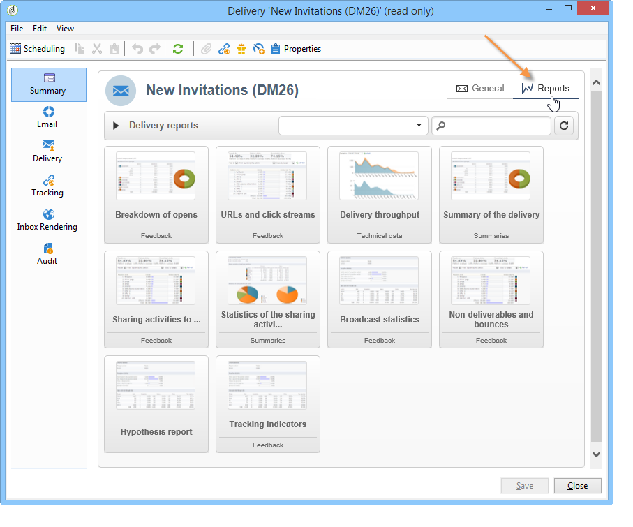

# Acerca de los informes integrados de Campaign{#about-campaign-built-in-reports}

Este capítulo ofrece la lista de informes integrados de Adobe Campaign, así como sus contenidos y sus contextos. La siguiente información le permite evitar crear informes que ya están disponibles en la plataforma.

>[!NOTE]
>
>También puede aprender a añadir sus propios informes a la pestaña **[!UICONTROL Reports]**. Para obtener más información, consulte esta [página](../../reporting/using/configuring-access-to-the-report.md#defining-the-filtering-options).

Estos informes y su contenido se detallan en los documentos relacionados con las funcionalidades a las que hacen referencia.

Adobe Campaign ofrece varios tipos de informes, accesibles a través de la consola del cliente o el navegador de Internet.

Están disponibles los siguientes tipos de informe:

* Informes sobre toda la plataforma, consulte [Informes globales](../../reporting/using/global-reports.md).
* Informes de envíos, consulte [Informes de envíos](../../reporting/using/delivery-reports.md).
* Informes acumulados, consulte [Informes acumulados](../../reporting/using/cumulative-reports.md).

Puede acceder a los informes desde la página principal de la consola del cliente, el panel de informes o la lista de envíos. El modo de visualización de un informe depende de su contexto. La lista de informes principales está disponible en la página principal y le permite acceder rápidamente a los datos de envío. La lista se puede modificar para adaptarla a las necesidades. Consulte [esta sección](../../reporting/using/about-reports-creation-in-campaign.md) para obtener más información.

Para acceder a los informes integrados de Campaign:

1. Seleccione la pestaña **[!UICONTROL Reports]** de la interfaz de Adobe Campaign.

   

1. Utilice los campos de búsqueda para filtrar los informes mostrados.

1. Luego haga clic en el informe que desee mostrar.

   

1. El vínculo **[!UICONTROL Back]** en la parte superior de la pantalla le devuelve a la lista de informes.

   

En [esta sección](../../reporting/using/actions-on-reports.md) se detallan otras posibles acciones que se pueden realizar sobre un informe en proceso de edición.

Se puede acceder a los informes que son específicos de una campaña o una entrega a través de sus respectivos paneles.

El principio es el mismo para listas, servicios, ofertas, etc., como se muestra a continuación:

