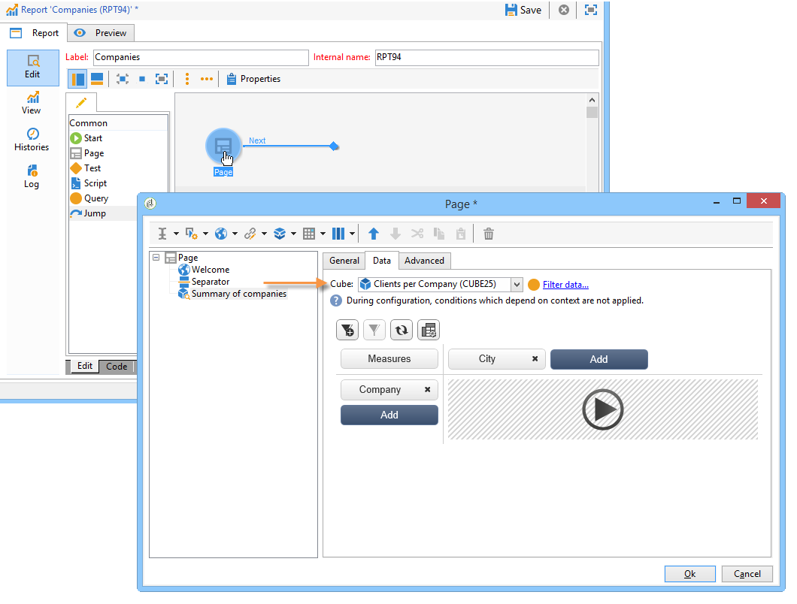

# Introducción a los cubos{#about-cubes}

La exploración de datos en la base de datos se ofrece mediante el módulo **Marketing Analytics.** Permite analizar y medir los datos, calcular las estadísticas y simplificar y optimizar la creación y el cálculo del informe. Además, Marketing Analytics permite crear informes y generar poblaciones de público objetivo. Una vez identificados, se almacenan en listas que se pueden utilizar en Adobe Campaign (establecimiento de objetivos, segmentación, etc.).

Los cubos se utilizan para generar ciertos informes integrados, incluidos informes de envío (seguimiento de envío, clics, aperturas, etc.). Los informes basados en los cubos solo se pueden utilizar como estándar para los volúmenes de datos con menos de 5 millones de líneas de hechos.

Puede ampliar las capacidades de análisis y exploración de base de datos al mismo tiempo que facilita a los usuarios finales la configuración de informes y tablas: estos últimos solo necesitan seleccionar un cubo existente (completamente configurado) al crear su informe o tabla para procesar cálculos, medidas y estadísticas.

Una vez que se han creado y configurado, los cubos se utilizan en las casillas de consulta de los informes y en las aplicaciones web. Se pueden utilizar y manipular dentro de las tablas dinámicas.

>[!CAUTION]
>
>**Marketing Analytics** es un módulo de Adobe Campaign. Se debe instalar en su instancia para poder utilizar las funcionalidades que se describen a continuación.

Con el módulo Marketing Analytics, Campaign permite:

1. Crear cubos con el fin de:

   * acumular datos y almacenarlos en una tabla de trabajo para precalcular los indicadores según las necesidades del usuario,
   * reducir el volumen de datos implicados en los distintos cálculos utilizados para los informes y las consultas, lo que optimiza de manera significativa los tiempos de cálculo del indicador,
   * simplificar el acceso a los datos, permitiendo a los usuarios manipular los datos (independientemente de si se acumularon previamente o no) en función de las distintas dimensiones.

   Para obtener más información, consulte [Crear indicadores](../../reporting/using/creating-indicators.md).

1. Crear tablas dinámicas con el fin de:

   * explorar datos calculados y medidas configuradas,
   * seleccionar los datos que se van a mostrar y su modo de visualización,
   * personalizar las medidas y los indicadores utilizados,
   * ofrecer herramientas interactivas de análisis a los usuarios con un fondo no interactivo.

   Para obtener más información sobre esto, consulte [Uso de cubos para explorar datos](../../reporting/using/using-cubes-to-explore-data.md).

1. Crear una consulta con datos calculados y acumulados en un cubo.
1. Identificar poblaciones y hacerles referencia en listas.

## Terminología {#terminology}

Cuando se trabaja con cubos, se deben conocer los conceptos siguientes:

* Cubo

   Un cubo es una representación de información multidimensional: proporciona a los usuarios finales estructuras diseñadas para el análisis interactivo de los datos.

* Tabla o esquema de hechos

   La tabla de hechos (o esquema de hechos) contiene los datos sin procesar o básicos sobre los que se basan los análisis. Principalmente se trata de tablas de gran volumen (posiblemente con tablas enlazadas) con cálculos potencialmente largos.

   Por ejemplo, una tabla de hechos puede ser: la tabla de broadlog, la tabla de compras, etc.

* Dimensión

   Las dimensiones permiten segmentar los datos en grupos: una vez creadas, las dimensiones actúan como ejes de análisis. En la mayoría de los casos se definen varios niveles para una dimensión determinada. Por ejemplo, para una dimensión temporal, los niveles son meses, días, horas, minutos, etc. Este conjunto de niveles representa la jerarquía de dimensiones y permite varios niveles de análisis de datos.

* Agrupamiento

   En algunos campos, se puede definir un agrupamiento para reunir valores y facilitar la lectura de la información. El agrupamiento se aplica a los niveles.

   Se recomienda definir un agrupamiento cuando pueda haber muchos valores diferentes.

* Medida

   Las medidas más frecuentes son suma, media, máximo, mínimo, desviación típica, etc.

   Las medidas se pueden calcular: por ejemplo, la tasa de aceptación de una oferta es la relación entre el número de veces que se presentó comparada con el número de veces que se aceptó.

## Espacio de trabajo del cubo {#cube-workspace}

Los cubos se almacenan en el nodo **[!UICONTROL Administration > Configuration > Cubes]**.

Los principales contextos de uso de los cubos son los siguientes:

* Las exportaciones de datos se pueden realizar directamente en un informe y diseñar en la pestaña **[!UICONTROL Reports]** de la plataforma de Adobe Campaign.

   Para ello, cree un nuevo informe y seleccione el cubo que desee utilizar.

   

   Los cubos aparecen como plantillas basadas en los informes creados. Una vez que haya elegido una plantilla, haga clic en **[!UICONTROL Create]** para configurar y ver el informe correspondiente.

   Puede adaptar las medidas, cambiar el modo de visualización o configurar la tabla y, a continuación, mostrar el informe usando el botón principal.

   

* Asimismo, puede hacer referencia a un cubo en la casilla **[!UICONTROL Query]** de un informe para utilizar sus indicadores, como se muestra a continuación:

   

* También se puede insertar una tabla dinámica basada en un cubo en cualquier página de un informe. Para ello, haga referencia al cubo que desee utilizar en la pestaña **[!UICONTROL Data]** de la tabla dinámica de la página correspondiente.

   

   Para obtener más información sobre esto, consulte [Explorar los datos en un informe](../../reporting/using/using-cubes-to-explore-data.md#exploring-the-data-in-a-report).
