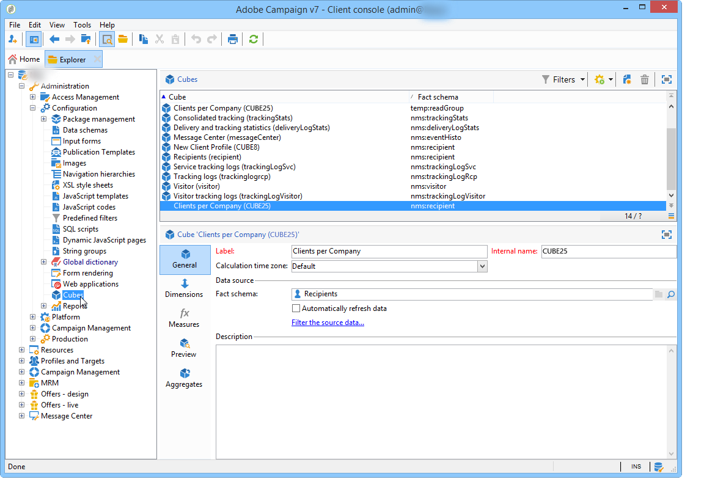
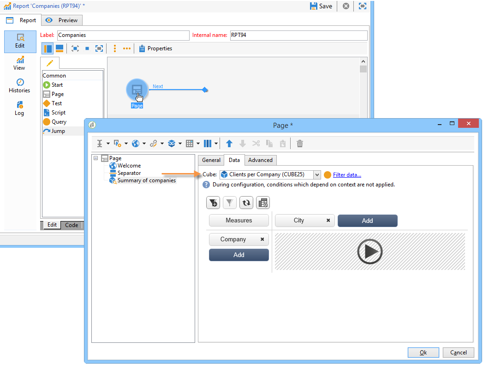

# Introducción a los cubos{#about-cubes}

## Terminología {#terminology}

A continuación se enumeran términos específicos al trabajar con cubos.

* **Cubo**: un cubo es una representación de información multidimensional; proporciona a los usuarios finales estructuras diseñadas para el análisis interactivo de los datos.

* **Tabla/esquema de datos**: contiene los datos (o en una tabla o esquema) sin procesar o datos básicos sobre los que se basan los análisis. Principalmente, se trata de tablas de gran volumen (posiblemente con tablas enlazadas) con cálculos que pueden ser largos. Por ejemplo, una tabla de datos puede ser: la tabla de broadlog, la tabla de compras, etc.

* **Dimensión**: las dimensiones permiten segmentar los datos en grupos: una vez creadas, las dimensiones actúan como ejes de análisis. En la mayoría de los casos se definen varios niveles para una dimensión determinada. Por ejemplo, para una dimensión temporal, los niveles son meses, días, horas, minutos, etc. Este conjunto de niveles representa la jerarquía de dimensiones y permite varios niveles de análisis de datos.

* **Agrupamiento**: en algunos campos, se puede definir un agrupamiento para reunir valores y facilitar la lectura de la información. El agrupamiento se aplica a los niveles. Se recomienda definir un agrupamiento cuando pueda haber muchos valores diferentes.

* **Medir**: las medidas más frecuentes son suma, promedio, máximo, mínimo, desviación estándar, etc. Las medidas se pueden calcular: por ejemplo, la tasa de aceptación de una oferta es la relación entre el número de veces que se presentó comparada con el número de veces que se aceptó.

## Espacio de trabajo de cubos {#cube-workspace}

Los cubos se almacenan en el nodo **[!UICONTROL Administration > Configuration > Cubes]**.

Los principales contextos de uso de los cubos son los siguientes:

* Las exportaciones de datos se pueden realizar directamente en un informe y diseñar en la pestaña **[!UICONTROL Reports]** de la plataforma de Adobe Campaign.

  Para ello, cree un nuevo informe y seleccione el cubo que desee utilizar.

  

  Los cubos aparecen como plantillas basadas en los informes creados. Una vez que haya elegido una plantilla, haga clic en **[!UICONTROL Create]** para configurar y ver el informe correspondiente.

  Puede adaptar las medidas, cambiar el modo de visualización o configurar la tabla y, a continuación, mostrar el informe usando el botón principal.

  

* Asimismo, puede hacer referencia a un cubo en la casilla **[!UICONTROL Query]** de un informe para utilizar sus indicadores, como se muestra a continuación:

  

* También se puede insertar una tabla dinámica basada en un cubo en cualquier página de un informe. Para ello, haga referencia al cubo que desee utilizar en la pestaña **[!UICONTROL Data]** de la tabla dinámica de la página correspondiente.

  

  Para obtener más información sobre esto, consulte [Exploración de los datos en un informe](../../reporting/using/using-cubes-to-explore-data.md#exploring-the-data-in-a-report).
