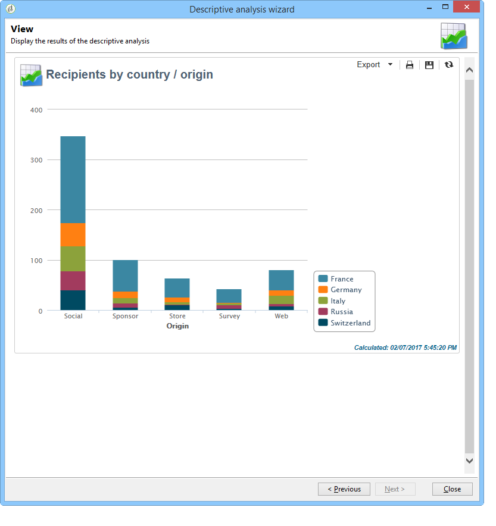

# Introducción al análisis descriptivo{#about-descriptive-analysis}

Para producir estadísticas sobre los datos de la base de datos, cree informes de análisis descriptivo con el asistente dedicado y ajuste su contenido y presentación para adaptarlos a sus necesidades.

Estos informes hacen referencia a las poblaciones y deben utilizarse únicamente para analizar volúmenes de datos pequeños.

Puede generar informes de análisis cuantitativos o cualitativos. Los análisis cualitativos le permiten representar los datos de la siguiente manera:

* Tabla e histograma:

  

* Valores acumulados, sin la tabla:

  

* Desglose por línea de negocios

  

Los análisis cuantitativos proporcionan estadísticas generales sobre los datos numéricos de la selección, como se muestra a continuación:

Estos informes se crean mediante el asistente de análisis descriptivo, que, según diversos pasos, le permite elegir el tipo de informe que desea crear, así como los datos y el diseño. El informe se muestra en el último paso. Si es necesario, el informe se puede publicar y compartir con otros operadores, imprimir o exportar en formato Excel, PDF u OpenDocument.

Los asistentes de análisis descriptivos no son tan potentes como los informes de Adobe Campaign, pero ofrecen una visión general del contenido de la base de datos o una selección de datos.

>[!CAUTION]
>
>Un análisis descriptivo no permite explorar los volúmenes de datos grandes.
