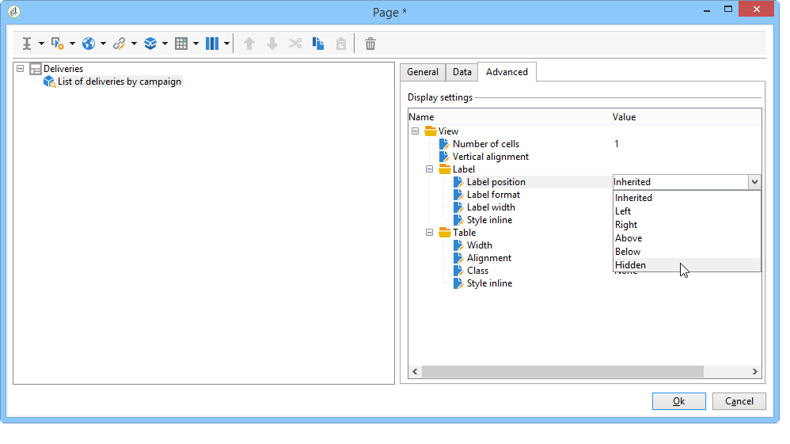

# Acciones sobre los informes{#actions-on-reports}

Al visualizar un informe, la barra de herramientas permite realizar diversas acciones. A continuación se detallan dichas acciones.


Por ejemplo, la barra de herramientas permite exportar, imprimir, archivar o mostrar el informe en un navegador web.


## Exportación de un informe {#exporting-a-report}

Seleccione el formato en el que desee exportar el informe desde la lista desplegable. (.xls, .pdf, .ods).


Cuando un informe contiene varias páginas, se debe repetir la operación con cada página.

Se puede configurar el informe con el fin de exportarlo en formato PDF, Excel u OpenOffice. Abra el explorador de Adobe Campaign y seleccione el informe correspondiente.

En la pestaña **[!UICONTROL Page]**, se accede a las opciones de exportación a través de las actividades **[!UICONTROL Advanced]** del informe.

Cambie la configuración de **[!UICONTROL Paper]** y **[!UICONTROL Margins]** para adaptarla a sus necesidades. También se puede autorizar la exportación de una página solo en formato PDF. Para ello, desmarque la opción **[!UICONTROL Activate OpenOffice/Microsoft Excel export]**.


### Exportación a Microsoft Excel {#exporting-into-microsoft-excel}

Para informes de tipo **[!UICONTROL List with group]** que se van a exportar a Excel, se aplican las siguientes recomendaciones y limitaciones:

* Estos informes no deben contener ninguna línea vacía.

   

* El pie de la lista debe estar oculto.

   

* Los informes no deben utilizar un formato específico definido al nivel de celda. Es preferible utilizar **[!UICONTROL Form rendering]** para definir el formato de las celdas de la tabla. Se puede acceder a **[!UICONTROL Form rendering]** a través de **[!UICONTROL Administration > Configuration > Form rendering]**.
* No se recomienda insertar contenido HTML.
* Si un informe contiene varios elementos de tipo tabla, gráfico, etc., se exportan uno debajo del otro.
* Se puede forzar el retorno de carro en las celdas: esta configuración se conserva en Excel. Para obtener más información, consulte [Definición del formato de celdas](../../reporting/using/creating-a-table.md#defining-cell-format).

### Aplazamiento de la exportación {#postpone-the-export}

Se puede aplazar la exportación de un informe, por ejemplo para esperar las llamadas asíncronas. Para ello, introduzca el siguiente parámetro en la secuencia de comandos de inicialización de la página:

```
document.nl_waitBeforeRender = true;
```

Para activar la exportación e iniciar la conversión en un archivo PDF, utilice la función **document.nl_renderToPdf()** sin ningún parámetro.

### Asignación de memoria {#memory-allocation}

Al exportar ciertos informes de gran tamaño, pueden producirse errores de asignación de memoria.

En algunos casos, el valor predeterminado **maxMB** (**SKMS** para instancias alojadas) de JavaScript indicado en el archivo de configuración **serverConf.xml** se establece en 64 MB. Si se producen errores de memoria insuficiente al exportar un informe, se recomienda aumentar esta cifra a 512 MB:

```
<javaScript maxMB="512" stackSizeKB="8"/>
```

Para aplicar los cambios realizados en la configuración, es necesario reiniciar el servicio **nlserver**.

Para obtener más información sobre el archivo **serverConf.xml**, consulte [esta sección](../../production/using/configuration-principle.md).

Para obtener más información sobre el servicio **nlserver**, consulte [esta sección](../../production/using/administration.md).

## Impresión de informes {#printing-a-report}

Se puede imprimir el informe. Para ello, haga clic en el icono de impresora: esto abre el cuadro de diálogo correspondiente.

Para obtener un mejor resultado, edite las opciones de impresión de Internet Explorer y seleccione **[!UICONTROL Print background colors and images]**.


## Creación de archivos de informes {#creating-report-archives}

El archivado de un informe permite crear una vista del informe en varios periodos, por ejemplo para mostrar las estadísticas de un periodo determinado.

Para crear un archivo, abra el informe correspondiente y haga clic en el icono adecuado.


Para mostrar u ocultar los archivos existentes, haga clic en el icono mostrar/ocultar.


Las fechas de archivo se muestran bajo el icono mostrar/ocultar. Haga clic en el archivo para verlo.


Es posible eliminar un archivo de informes. Para ello, vaya al nodo de Adobe Campaign donde se almacenan los informes. Haga clic en la pestaña **[!UICONTROL Archives]**, seleccione el que desee eliminar y haga clic en **[!UICONTROL Delete]**.


