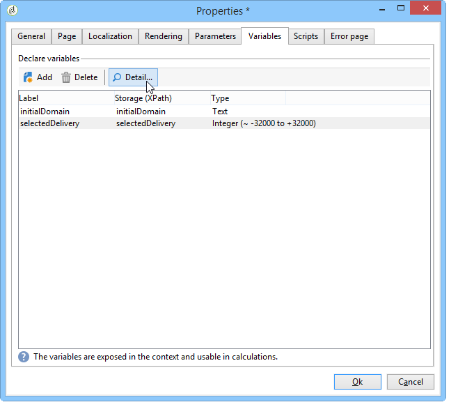

# Funciones avanzadas{#advanced-functionalities}

Como usuario técnico, además de las [propiedades generales](../../reporting/using/properties-of-the-report.md), puede aprovechar las capacidades avanzadas para configurar los informes, como por ejemplo:

* Cree consultas complejas para procesar datos en una actividad de **secuencia de comandos**. [Más información](#script-activity)

* Añada un script externo para ejecutarlo en el servidor o del lado del cliente. [Más información](#external-script)

* Llame a un informe con una actividad de **salto**. [Más información](#calling-up-another-report)

* Añada un parámetro de URL en un informe para que sea más accesible. [Más información](#calling-up-another-report)

* Añada variables que se utilizarán en el contexto del informe. [Más información](#adding-variables)

## Uso de scripts {#adding-a-script}

### Scripts externos de referencia {#external-script}

Puede hacer referencia a los códigos JavaScript que se ejecutan del lado del cliente o del servidor cuando solicita la página del informe.

Para ello:

1. Edite las [propiedades del informe ](../../reporting/using/properties-of-the-report.md) y haga clic en **[!UICONTROL Scripts]**.
1. Haga clic en **[!UICONTROL Add]** y seleccione la secuencia de comandos a la que desea hacer referencia.
1. A continuación, seleccione el modo de ejecución.

   Si añade varias secuencias de comandos, utilice las flechas de la barra de herramientas para definir su secuencia de ejecución.

   

Para la ejecución normal por parte del cliente, las secuencias de comandos a las que se hace referencia deben escribirse en JavaScript y ser compatibles con la mayoría de los exploradores comunes. Para obtener más información, consulte [esta sección](../../web/using/web-forms-answers.md).

### Adición de una actividad de secuencia de comandos {#script-activity}

Al [diseñar el informe](../../reporting/using/creating-a-new-report.md#modelizing-the-chart), utilice la actividad **[!UICONTROL Script]** para procesar los datos y crear fácilmente consultas complejas que no habiliten el lenguaje SQL. Puede introducir directamente la consulta en la ventana del script.

La pestaña **[!UICONTROL Texts]** permite definir cadenas de texto. Pueden utilizarse con la siguiente sintaxis: **$(Identifier)**. Para obtener más información sobre el uso de textos, consulte [Adición de un encabezado y un pie de página](../../reporting/using/element-layout.md#adding-a-header-and-a-footer).

>[!CAUTION]
>
>NO se recomienda el uso del código JavaScript para crear acumulados.

Para crear un historial del informe, añada la línea siguiente a la consulta JavaScript para guardar los datos archivados:

```
if( ctx.@_historyId.toString().length == 0 )
```

De lo contrario, solo se muestran los datos actuales.

## Adición de un parámetro de URL {#defining-additional-settings}

La pestaña **[!UICONTROL Parameters]** de las [propiedades del informe](../../reporting/using/properties-of-the-report.md) permite definir configuraciones adicionales para el informe: esta configuración se pasa a la dirección URL durante la llamada.

>[!CAUTION]
>
>Por motivos de seguridad, estos parámetros deben utilizarse con mucha precaución

Para crear una nueva configuración:

1. Haga clic en el botón **[!UICONTROL Add]** e introduzca el nombre de la configuración.

   

1. Si es necesario, especifique si la configuración es obligatoria o no.

1. Seleccione el tipo de configuración que desea crear: **[!UICONTROL Filter]** o **[!UICONTROL Variable]**.

   La opción **[!UICONTROL Filter entities]** permite utilizar un campo de la base de datos como parámetro.

   

   Los datos se recuperan directamente a nivel de entidad: **ctx/recipient/@account**.

   La opción **[!UICONTROL Variable]** permite crear o seleccionar una variable que se transfiere como parámetro de la dirección URL y se puede utilizar en los filtros.

**[!UICONTROL Response HTTP headers]** permite evitar el secuestro de clics al incluir la página del informe en una página HTML mediante iframe. Para evitar el secuestro de clics, puede elegir el comportamiento **[!UICONTROL X-Frame-options header]**:

* **[!UICONTROL None]**: El informe no tiene **[!UICONTROL X-Frame-options header]**.
* **[!UICONTROL Same as origin]**: Se configura de forma predeterminada para los informes nuevos y republicados. El nombre de host es el mismo que la dirección URL del informe.
* **[!UICONTROL Deny]**: El informe no se puede incluir en una página HTML mediante iframe.


## Adición de variables {#adding-variables}

La pestaña **[!UICONTROL Variables]** contiene la lista de variables configuradas en el informe. Estas variables se exponen en el contexto del informe y se pueden utilizar en cálculos.

Haga clic en el botón **[!UICONTROL Add]** para crear una variable nueva.

Para ver la definición de una variable, selecciónela y haga clic en el botón **[!UICONTROL Detail...]**.



## Caso de uso: usar variables y parámetros en un informe

En el siguiente ejemplo de vídeo, aprenderá a agregar un parámetro &quot;_type&quot; para crear diferentes vistas de un informe, en función del valor de este atributo.

 [Descubra esta función en vídeo](https://helpx.adobe.com/campaign/classic/how-to/add-url-parameter-in-acv6.html?playlist=/ccx/v1/collection/product/campaign/classic/segment/business-practitioners/explevel/intermediate/applaunch/how-to-4/collection.ccx.js&amp;ref=helpx.adobe.com)


## Llamada a otro informe {#calling-up-another-report}

Una actividad de **salto** es como una transición sin una flecha: permite pasar de una actividad a otra u acceder a otro informe.
