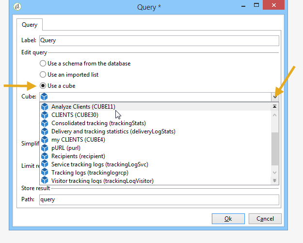

# Recopilación de datos para analizar{#collecting-data-to-analyze}

Los datos que se utilizan para crear el informe pueden seleccionarse directamente en la página del informe (para más información, consulte [) o recopilarse mediante una o más consultas.](../../reporting/using/using-the-context.md)

Esta actividad ofrece tres métodos diferentes:

1. Creación de una consulta utilizando los datos de la base de datos.
1. Procesamiento de los datos contenidos en una lista.
1. Uso de datos contenidos en un cubo existente.

La elección del método depende del tipo de cálculo, el volumen de datos y su durabilidad, etc. Todos estos parámetros deben examinarse con cuidado para evitar sobrecargar la base de datos de Adobe Campaign y para optimizar la generación y manipulación de los informes creados. Para obtener más información, consulte [esta página](../../reporting/using/best-practices.md#optimizing-report-creation).

En todos los casos, los datos se recopilan mediante una actividad de tipo **[!UICONTROL Query]**.

Este modo de selección de datos es adecuado cuando es necesario recopilar o crear los datos del informe utilizando los datos de la base de datos. En algunos casos, también puede seleccionar los datos directamente desde los elementos utilizados en el informe. Por ejemplo, al insertar un gráfico puede seleccionar los datos de origen directamente. Para obtener más información, consulte [Uso del contexto](../../reporting/using/using-the-context.md).

## Uso de los datos de un esquema {#using-the-data-from-a-schema}

Para utilizar datos vinculados a un esquema de base de datos, seleccione la opción adecuada en el editor de consultas y configure la consulta que desea aplicar.

El ejemplo siguiente permite recopilar el número de destinatarios de cada país entre los perfiles de la base de datos. Después se pueden visualizar en un informe en forma de tabla.

## Uso de una lista importada {#using-an-imported-list}

Para crear un informe, puede utilizar datos de una lista de datos importados.

Para ello, seleccione la opción **[!UICONTROL Use an imported list]** en el cuadro de consulta y seleccione la lista correspondiente.

Haga clic en el vínculo **[!UICONTROL Edit query...]** para definir los datos que desea recopilar entre los elementos de esta lista para crear el informe.

## Uso de un cubo {#using-a-cube}

Se puede seleccionar un cubo para definir la consulta.

Los cubos permiten ampliar la capacidad de análisis y exploración de la base de datos al mismo tiempo que facilitan la configuración de los informes y las tablas para los usuarios finales: simplemente seleccione un cubo ya existente y completamente configurado y utilice sus cálculos, medidas y estadísticas. Para obtener más información sobre la creación de cubos, consulte [esta sección](../../reporting/using/about-cubes.md).

Haga clic en el vínculo **[!UICONTROL Edit query...]** y seleccione los indicadores que desee visualizar o utilizar en el informe.

## Opciones de filtrado en las consultas {#filtering-options-in-the-queries}

Para evitar la ejecución de consultas en toda la base de datos, es necesario filtrar los datos.

### Filtro simplificado {#simplified-filter}

Puede seleccionar la opción **[!UICONTROL Filter automatically with the context]** para poder acceder al informe a través de un nodo específico del árbol, como una lista, un destinatario o una entrega.

La opción **[!UICONTROL Filter with the folder]** permite especificar una carpeta y tener en cuenta únicamente su contenido. Esto permite filtrar los datos del informe para mostrar solo los datos de una de las carpetas del árbol, como se muestra a continuación:

### Limitación de la cantidad de datos recopilados {#limiting-the-amount-of-data-collected}

Configure el número de registros que desea que extraiga la consulta a través de las opciones de limitación de resultados:

* **[!UICONTROL Limit to first record]** para extraer un resultado,
* **[!UICONTROL Size]** para extraer un número determinado de registros.

