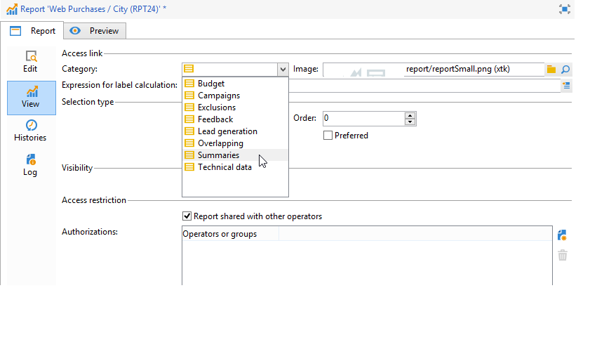

# Configuración del acceso al informe{#configuring-access-to-the-report}

## Contexto de visualización del informe {#report-display-context}

Defina el contexto de visualización del informe en la plataforma de Adobe Campaign utilizando la pestaña **[!UICONTROL Display]**. El acceso a un informe depende de su tipo de selección, de las condiciones de visualización y de las autorizaciones de acceso.

### Tipo de selección {#selection-type}

El acceso al informe se puede limitar a un contexto específico o a un espacio de oferta, por ejemplo una entrega, un destinatario, una selección de destinatarios, etc. Este acceso se configura en la sección **[!UICONTROL Selection type]** de la pestaña **[!UICONTROL Display]**.

* **[!UICONTROL Single selection]** : solo se puede acceder al informe cuando se selecciona una entidad específica.
* **[!UICONTROL Multiple selection]** : se accede al informe cuando se seleccionan varias entidades.
* **[!UICONTROL Global]**: se accede al informe a través de la lista de informes disponibles en la pestaña **[!UICONTROL Reports]**.

### Secuencia de visualización {#display-sequence}

El campo **[!UICONTROL Sequence]** permite introducir un valor numérico que especifica la secuencia de visualización del informe en la lista.

De manera predeterminada, los informes se muestran por relevancia: el valor introducido en este campo permite ordenar los informes desde el más relevante (valor más alto) al menos relevante (valor más bajo).

Puede seleccionar la escala que desee utilizar en función de sus necesidades: 1 a 10, 0 a 100, -10 a 10, etc.

### Condiciones de visualización {#display-conditions}

También puede condicionar la visualización del informe mediante una consulta.

En el siguiente ejemplo, el informe se muestra si el canal de campaña principal es correo electrónico.

Esto significa que si el canal principal de la campaña es correo postal, el informe no aparece disponible en los informes de campaña.

### Autorización de acceso {#access-authorization}

El informe se puede compartir con otros operadores.

Para que el informe sea accesible, seleccione la opción **[!UICONTROL Report shared with other operators]**. Si no se selecciona esta opción, solo el operador que creó el informe puede acceder a él.

El informe también se puede compartir con operadores o grupos de operadores específicos añadidos a través de la ventana de autorizaciones.

### Definición de las opciones de filtrado {#defining-the-filtering-options}

La pestaña **[!UICONTROL Reports]** muestra todos los informes disponibles en la plataforma y para los que el operador conectado cuenta con un derecho de acceso.

De forma predeterminada se clasifican por relevancia, pero puede aplicar otros tipos de filtros: alfabético, por edad, etc.

También puede filtrar la visualización en función de la categoría del informe:

Para definir la categoría de un informe, selecciónela a través de la pestaña **[!UICONTROL Display]** como se muestra a continuación:

Puede introducir una nueva categoría aquí y añadirla a la lista de categorías disponibles. La enumeración correspondiente se actualiza automáticamente.

## Creación de un vínculo a un informe {#creating-a-link-to-a-report-}

Se puede hacer que un informe sea accesible a través de un nodo específico del árbol, como una lista, un destinatario, una entrega, etc. Para hacerlo, simplemente genere un vínculo al informe correspondiente y especifique la entidad donde desea que esté disponible.

Por ejemplo, generemos un vínculo a un informe para que sea accesible a través de una lista de destinatarios.

1. Haga clic en **[!UICONTROL New]** y seleccione **[!UICONTROL Create a link to an existing report]** en el asistente para la creación de informes.

   

1. Seleccione en la lista desplegable el informe al que desee crear un vínculo. En este ejemplo, seleccione el informe **Desglose por país**.

   

1. Introduzca una etiqueta y seleccione el esquema. En este ejemplo, seleccione la tabla de listas de destinatarios.

   

   Esto significa que se puede acceder al informe a través de cualquier lista de destinatarios y que las estadísticas hacen referencia a los destinatarios en la lista seleccionada.

1. Guardar y mostrar el informe.
1. Introduzca la clave del vínculo. En este caso, la clave externa del vínculo “Carpetas”.

   

1. Publique el informe.
1. Vaya a una de las listas de destinatarios y haga clic en el vínculo **[!UICONTROL Reports]**: de este modo, ya se puede acceder al informe recién creado.

   

## Previsualización del informe {#preview-of-the-report}

Antes de publicar el informe, asegúrese de que se muestre correctamente en la pestaña **[!UICONTROL Preview]**.

Para mostrar la previsualización del informe, seleccione la opción **[!UICONTROL Global]** o **[!UICONTROL Selection]**.

Estas dos opciones se seleccionan según la configuración de visualización del informe. Si la configuración de visualización es **[!UICONTROL Global]**, se debe seleccionar la opción de previsualización **[!UICONTROL Global]**. Si la configuración de visualización es **[!UICONTROL Single selection]** o **[!UICONTROL Multiple selection]**, se debe seleccionar la opción de previsualización **[!UICONTROL Selection]**.

Para más información, consulte [Informe de contexto de visualización](#report-display-context).

La configuración específica permite controlar los errores. El parámetro **_uuid** se encuentra en la dirección URL del informe. Se le puede añadir la configuración **&amp;_preview** o **&amp;_debug**.

Para obtener más información sobre esta configuración, consulte la sección de **definición de propiedades de formulario web** del capítulo de [formularios web](../../web/using/about-web-forms.md).

## Publicación del informe {#publishing-the-report}

La publicación del informe es obligatoria para poder compartirlo con otros operadores y mostrarlo en la lista de informes disponibles (también consulte [Informe de contexto de visualización](#report-display-context)). Esta operación debe llevarse a cabo cada vez que se modifica el informe.

1. Abra el asistente de publicación haciendo clic en **[!UICONTROL Publish]**.

   

1. Haga clic en **[!UICONTROL Start]** para publicar.

   

1. Haga clic en el icono **[!UICONTROL Enlarge]** para abrir el informe en un explorador web.
