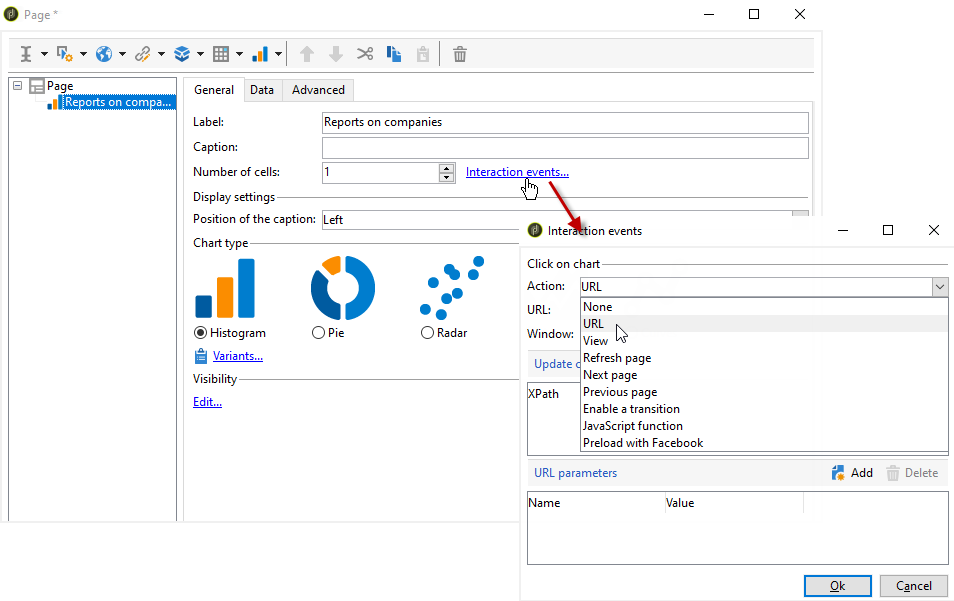

# Creación de un gráfico{#creating-a-chart}

Los datos de la base de datos también se pueden recopilar y mostrar en un gráfico. Adobe Campaign ofrece un conjunto de representaciones gráficas. Su configuración se detalla a continuación.

Los gráficos se insertan directamente en una página de informe mediante el menú contextual o la barra de herramientas.

## Pasos para la creación {#creation-steps}

Para crear un gráfico en un informe, siga los siguientes pasos:

1. Edite la página donde desee mostrar el gráfico y seleccione el tipo de gráfico en la barra de herramientas.

   

1. Introduzca un nombre y un pie de ilustración. Si es necesario, puede cambiar la posición del pie de ilustración mediante la lista desplegable.

   

1. Click the **[!UICONTROL Data]** tab to define the data source and the series to be calculated.

   The statistics to be displayed in the chart can be calculated based on a query or on the context data, i.e. the data provided by the inbound transition of the current page (for more on this, refer to [Using context data](../../reporting/using/using-the-context.md#using-context-data)).

   * Click the **[!UICONTROL Filter data...]** link to define filtering criteria for the data in the database.

      

   * To used contextual data, select this option and click the **[!UICONTROL Advanced settings...]** link. Seleccione los datos a los que corresponden las estadísticas.

      

      A continuación, puede acceder a los datos contextuales para definir los valores que se muestran en el gráfico:

      

## Tipos de gráficos y variantes {#chart-types-and-variants}

Adobe Campaign ofrece distintos tipos de representaciones gráficas. Se encuentran detalladas a continuación.

El tipo de gráfico se selecciona cuando se inserta en la página.

It can also be altered via the **[!UICONTROL Chart type]** section of the **[!UICONTROL General]** tab in the chart.

Las variantes dependen del tipo de gráfico seleccionado. They are selected via the **[!UICONTROL Variants...]** link.

### Desglose: Gráficos circulares {#breakdown--pie-charts}

Este tipo de representación gráfica le permite mostrar una descripción general de los elementos medidos.

Los gráficos circulares solo permiten analizar una variable.

The **[!UICONTROL Variants]** link lets you personalize the overall rendering of the chart.

Los gráficos circulares permiten introducir el valor del radio interior en el campo adecuado.

Por ejemplo:

0,00 traza un círculo completo.

0,40 traza un círculo con un radio del 40 %.

1,00 solo traza el exterior del círculo.

### Evolución: Curvas y áreas {#evolution--curves-and-areas}

Este tipo de representación gráfica le permite comprender la evolución de una o más medidas a lo largo de un tiempo.

### Comparación: Histogramas {#comparison--histograms}

Los histogramas permiten comparar los valores de una o más variables.

For these types of charts, the following options are offered in the **[!UICONTROL Variants]** window:

Check the **[!UICONTROL Display caption]** option to show the caption with the chart and choose its position:

Si procede, puede apilar los valores.

Si es necesario, puede invertir la secuencia de visualización de los valores. Para ello, seleccione la **[!UICONTROL Reverse stacking]** opción.

### Conversión: Embudo {#conversion--funnel}

Este tipo de gráfico le permite realizar un seguimiento de la tasa de conversión de los elementos medidos.

### Progreso: Indicador {#progress--gauge}

Este tipo de gráfico le permite mostrar el progreso de un valor comparado con un objetivo definido. En el siguiente ejemplo, la aguja negra muestra el número de envíos realizados correctamente (76) de un objetivo de 100 envíos. El indicador se divide en tres rangos que corresponden a estados específicos.

Estos elementos se definen al configurar el gráfico.

* The **[!UICONTROL Value]** field is represented by a black dial in the chart. Representa el progreso del elemento que desea calcular. El valor que se va a representar ya debe haberse guardado para poder utilizarse.
* The **[!UICONTROL Goal]** field represents the maximum value to achieve.
* Using the **[!UICONTROL Other mark]** field you can add a second indicator to the chart.
* The **[!UICONTROL Display range]** fields let you specify the values between which the report is calculated.
* The **[!UICONTROL Value ranges]** field lets you attribute statuses (None, Bad, Acceptable, Good) to a set of values to better illustrate the progress.

In the **[!UICONTROL Display settings]** section, the **[!UICONTROL Change appearance...]** lets you configure the way the chart is displayed.

The **[!UICONTROL Display the value below the gauge]** option lets you display the value progress below the chart.

The **[!UICONTROL Aperture ratio]** field, which must be between 0 and 1, lets you edit the report&#39;s aperture in a more or less complete circle. En el ejemplo anterior, el valor 0,50 corresponde a un semicírculo.

The **[!UICONTROL Width]** field lets you edit the chart size.

## Interacción con el gráfico {#interaction-with-the-chart}

Puede definir una acción cuando el usuario haga clic en el gráfico. Open the **[!UICONTROL Interaction events]** window and select the action you want to perform.

En [esta sección](../../web/using/static-elements-in-a-web-form.md#inserting-html-content) se describen los tipos de interacción posibles y sus configuraciones.

## Cálculo de estadísticas {#calculating-statistics}

Los gráficos permiten mostrar las estadísticas de los datos recopilados.

Estas estadísticas se definen a través de la **[!UICONTROL Series parameters]** sección de la **[!UICONTROL Data]** ficha.

To create a new statistic, click the **[!UICONTROL Add]** icon and configure the appropriate window. A continuación se detallan los tipos de cálculos disponibles.

Para obtener más información, consulte [esta sección](../../reporting/using/using-the-descriptive-analysis-wizard.md#statistics-calculation).
