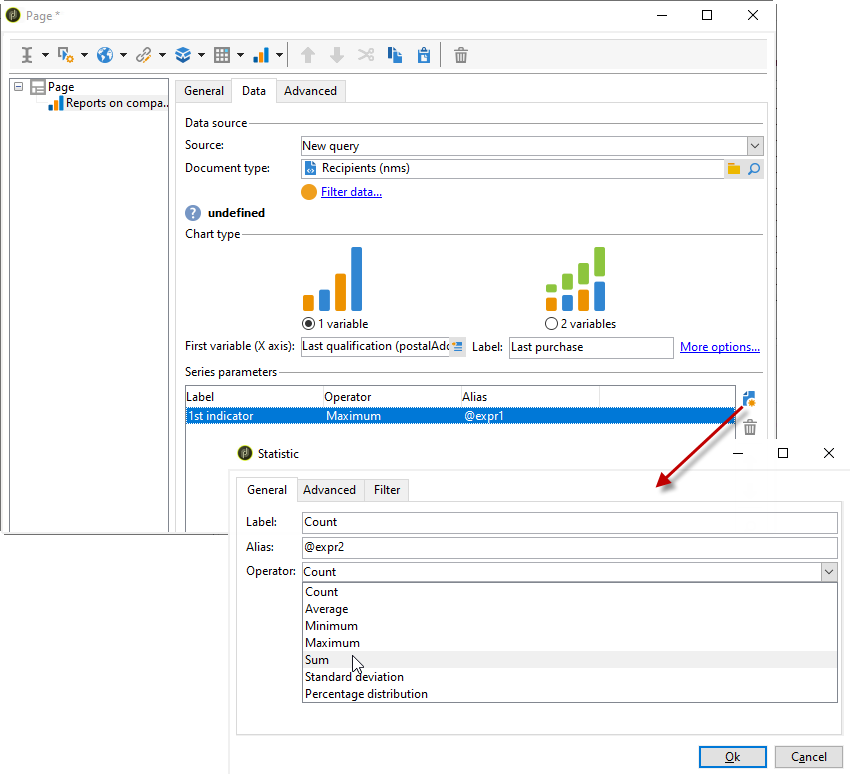

# Creación de un gráfico{#creating-a-chart}

Los datos de la base de datos también se pueden recopilar y mostrar en un gráfico. Adobe Campaign ofrece un conjunto de representaciones gráficas. Su configuración se detalla a continuación.

Los gráficos se insertan directamente en una página de informe mediante el menú contextual o la barra de herramientas.

## Pasos para la creación {#creation-steps}

Para crear un gráfico en un informe, siga los siguientes pasos:

1. Edite la página donde desee mostrar el gráfico y seleccione el tipo de gráfico en la barra de herramientas.

   

1. Introduzca un nombre y un pie de ilustración. Si es necesario, puede cambiar la posición del pie de ilustración mediante la lista desplegable.

   

1. Haga clic en la pestaña **[!UICONTROL Data]** para definir el origen de los datos y la serie que se va a calcular.

   Las estadísticas que se muestran en el gráfico se pueden calcular en función de una consulta o datos de contexto, es decir, los datos proporcionados por la transición entrante de la página actual (para más información, consulte [Uso de datos de contexto](../../reporting/using/using-the-context.md#using-context-data)).

   * Haga clic en el vínculo **[!UICONTROL Filter data...]** para definir los criterios de filtrado de los datos de la base de datos.

      

   * Para utilizar datos contextuales, seleccione esta opción y haga clic en el vínculo **[!UICONTROL Advanced settings...]** Seleccione los datos a los que corresponden las estadísticas.

      

      A continuación, puede acceder a los datos contextuales para definir los valores que se muestran en el gráfico:

      

## Tipos de gráficos y variantes {#chart-types-and-variants}

Adobe Campaign ofrece distintos tipos de representaciones gráficas. Se encuentran detalladas a continuación.

El tipo de gráfico se selecciona cuando se inserta en la página.

También se puede modificar a través de la sección **[!UICONTROL Chart type]** de la pestaña **[!UICONTROL General]** del gráfico.

Las variantes dependen del tipo de gráfico seleccionado. Se seleccionan mediante el vínculo **[!UICONTROL Variants...]**.

### Desglose: Gráficos circulares {#breakdown--pie-charts}

Este tipo de representación gráfica le permite mostrar una descripción general de los elementos medidos.

Los gráficos circulares solo permiten analizar una variable.

El vínculo **[!UICONTROL Variants]** le permite personalizar la renderización general del gráfico.

Los gráficos circulares permiten introducir el valor del radio interior en el campo adecuado.

Por ejemplo:

0,00 traza un círculo completo.

0,40 traza un círculo con un radio del 40 %.

1,00 solo traza el exterior del círculo.

### Evolución: Curvas y áreas {#evolution--curves-and-areas}

Este tipo de representación gráfica le permite comprender la evolución de una o más medidas a lo largo de un tiempo.

### Comparación: Histogramas {#comparison--histograms}

Los histogramas permiten comparar los valores de una o más variables.

Para estos tipos de gráficos, se ofrecen las siguientes opciones en la ventana **[!UICONTROL Variants]**.

Marque la opción **[!UICONTROL Display caption]** para mostrar el pie de ilustración con el gráfico y elegir su posición:

Si procede, puede apilar los valores.

Si es necesario, puede invertir la secuencia de visualización de los valores. Para ello, seleccione la opción **[!UICONTROL Reverse stacking]**.

### Conversión: Embudo {#conversion--funnel}

Este tipo de gráfico le permite realizar un seguimiento de la tasa de conversión de los elementos medidos.

### Progreso: Indicador {#progress--gauge}

Este tipo de gráfico le permite mostrar el progreso de un valor comparado con un objetivo definido. En el siguiente ejemplo, la aguja negra muestra el número de envíos realizados correctamente (76) de un objetivo de 100 envíos. El indicador se divide en tres rangos que corresponden a estados específicos.

Estos elementos se definen al configurar el gráfico.

* El campo **[!UICONTROL Value]** se representa mediante una aguja negra en el gráfico. Representa el progreso del elemento que desea calcular. El valor que se va a representar ya debe haberse guardado para poder utilizarse.
* El campo **[!UICONTROL Goal]** representa el valor máximo que desea alcanzar.
* Con el campo **[!UICONTROL Other mark]** puede añadir un segundo indicador al gráfico.
* Los campos **[!UICONTROL Display range]** permiten especificar los valores entre los cuales se calcula el informe.
* El campo **[!UICONTROL Value ranges]** permite atribuir estados (ninguno, malo, aceptable, bueno) a un conjunto de valores para ilustrar mejor el progreso.

En la sección **[!UICONTROL Display settings]**, el campo **[!UICONTROL Change appearance...]** permite configurar el modo en que se muestra el gráfico.

La opción **[!UICONTROL Display the value below the gauge]** permite mostrar el progreso del valor debajo del gráfico.

El campo **[!UICONTROL Aperture ratio]**, que debe estar entre 0 y 1, permite editar la apertura del informe en un círculo más o menos completo. En el ejemplo anterior, el valor 0,50 corresponde a un semicírculo.

El campo **[!UICONTROL Width]** le permite editar el tamaño del gráfico.

## Interacción con el gráfico {#interaction-with-the-chart}

Puede definir una acción cuando el usuario haga clic en el gráfico. Abra la ventana **[!UICONTROL Interaction events]** y seleccione la acción que desea realizar.

En [esta sección](../../web/using/static-elements-in-a-web-form.md#inserting-html-content) se describen los tipos de interacción posibles y sus configuraciones.

## Cálculo de estadísticas {#calculating-statistics}

Los gráficos permiten mostrar las estadísticas de los datos recopilados.

Estas estadísticas se definen en la sección **[!UICONTROL Series parameters]** de la pestaña **[!UICONTROL Data]**.

Para crear una nueva estadística, haga clic en el icono **[!UICONTROL Add]** y configure la ventana correspondiente. A continuación se detallan los tipos de cálculos disponibles.

Para obtener más información, consulte [esta sección](../../reporting/using/using-the-descriptive-analysis-wizard.md#statistics-calculation).
