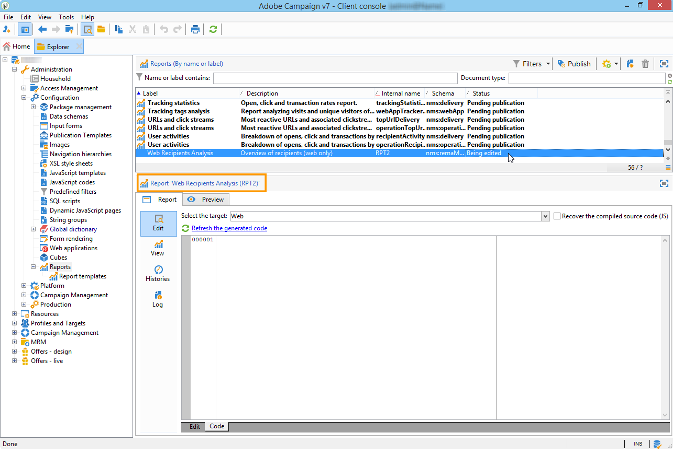
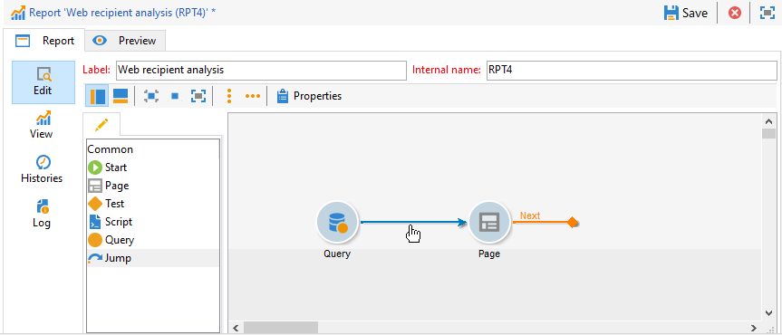
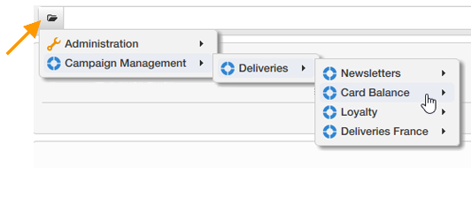

# Creación de un informe nuevo{#creating-a-new-report}

Para crear un informe, siga los pasos siguientes:

1. Abra el explorador de Adobe Campaign y, en el nodo **[!UICONTROL Administration > Configuration]**, seleccione la carpeta **[!UICONTROL Reports]**.
1. Haga clic en el botón **[!UICONTROL New]** situado encima de la lista de informes.
1. Seleccione **[!UICONTROL Create a new report from a template]** y haga clic en **[!UICONTROL Next]**.

   

1. Seleccione la plantilla de informe en la lista desplegable.

   * El **[!UICONTROL Extended report]** permite crear un informe configurado mediante un gráfico.
   * El informe **[!UICONTROL Qualitative distribution]** permite crear estadísticas basadas en todos los tipos de datos (nombre de la empresa, dominio de correo electrónico, etc.).
   * El informe **[!UICONTROL Quantitative distribution]** permite crear estadísticas con los datos que se pueden medir o contar (importe de la factura, edad del destinatario, etc.).

   Para obtener más información sobre estas plantillas de informe, consulte [esta sección](../../reporting/using/about-descriptive-analysis.md).

1. Introduzca el nombre del informe y su descripción en los campos correspondientes. Especifique el **[!UICONTROL schema]** sobre el que desea aplicar el informe.

   

1. Guarde este informe.

## Modelización de un gráfico {#modelizing-the-chart}

Después de guardar el informe, debería mostrarse esto. Ahora puede crear el gráfico del informe.

El gráfico para crear el informe se compone de una sucesión de actividades.

Las actividades están vinculadas mediante transiciones, que aparecen representadas por flechas.

Para crear un informe, según su naturaleza y contexto, debe identificar los elementos útiles y modelizar su secuencia lógica.

1. Utilice la actividad **[!UICONTROL Start]** para que comience el primer proceso que se lleva a cabo para crear el informe. Solo puede utilizar una de estas actividades por informe.

   Es obligatorio si el gráfico incluye un bucle.

1. Añada una o más actividades **[!UICONTROL Query]** para recopilar datos que sean útiles para crear el informe. Los datos se pueden recopilar directamente mediante una consulta en un esquema de la base de datos o mediante una lista importada o un Cubo existente.

   Para obtener más información, consulte [Recopilación de datos para analizar](../../reporting/using/collecting-data-to-analyze.md).

   Estos datos se visualizan (o no) en el informe en función de la configuración de la página.

1. Añada una o más actividades **[!UICONTROL Page]** para definir la representación gráfica de los datos recopilados. Puede insertar tablas, gráficos y campos de entrada y determinar la visualización de una o más páginas o elementos de la página. El contenido visualizado es totalmente configurable.

   Para obtener más información, consulte [Elementos estáticos](#static-elements).

1. Utilice una actividad **[!UICONTROL Test]** para definir las condiciones de visualización o acceso a los datos.

   Para obtener más información, consulte [Determinación de la visualización de la página](../../reporting/using/defining-a-conditional-content.md#conditioning-page-display).

1. Si es necesario, añada secuencias de comandos personalizadas a través de la actividad **[!UICONTROL Script]**, por ejemplo para calcular el nombre de un informe, para filtrar la visualización del resultado dentro de un contexto específico, etc.

   Para obtener más información, consulte [Actividad de los script](../../reporting/using/advanced-functionalities.md#script-activity).

1. Por último, para facilitar la lectura de los informes complejos, puede insertar una o más actividades de tipo **[!UICONTROL Jump]**. Esto permite pasar de una actividad a otra sin materializar la transición en el informe. La actividad **[!UICONTROL Jump]** también puede utilizarse para visualizar otro informe.

   Para obtener más información, consulte [Actividad del salto](../../reporting/using/advanced-functionalities.md#jump-activity).

No se pueden ejecutar varias ramas al mismo tiempo. Esto significa que un informe creado de esta forma no funciona:

Sin embargo, puede incluir varias ramas. Solo se ejecuta una de ellas:

## Creación de una página {#creating-a-page}

El contenido se configura mediante las actividades incluidas en el gráfico. Para obtener más información, consulte [Edición del gráfico](#modelizing-the-chart).

Para configurar una actividad, haga doble clic en su icono.

El contenido visualizado se determina en las actividades de tipo **Página**.

Un informe puede incluir una o más páginas. Las páginas se crean mediante un editor específico que permite insertar, en una estructura de árbol, campos de entrada, campos de selección, elementos estáticos, gráficos o tablas. Los contenedores ayudan a definir el diseño. Para obtener más información, consulte [Diseño del elemento](../../reporting/using/element-layout.md).

Para añadir un componente a la página, utilice los iconos de la sección superior izquierda de la barra de herramientas.

También puede hacer clic con el botón derecho en el nodo en el que desee añadir el componente y seleccionarlo en la lista.

>[!CAUTION]
>
>Si el informe está pensado para su exportación en formato Excel, no se recomienda utilizar un formato HTML complejo. Para obtener más información, consulte [Exportación de un informe](../../reporting/using/actions-on-reports.md#exporting-a-report).

Una **[!UICONTROL Page]** puede incluir los siguientes elementos:

* De barras, circular, curva **[!UICONTROL charts]**, etc.
* Tabla dinámica; Lista con grupo o **[!UICONTROL tables]** con desglose.
* **[!UICONTROL Input controls]** de tipo texto o tipo de número.
* **[!UICONTROL Selection controls]** de tipo lista desplegable, casilla de verificación, botón de opción, opción múltiple, fecha o matriz.
* **[!UICONTROL Advanced controls]** de tipo editor de vínculos, constante o selección de capeta.
* Valor, Vínculo, HTML, Imagen, etc. **[!UICONTROL Static elements]**.
* **[!UICONTROL Containers]** que permiten controlar el diseño del componente.

En [esta sección](../../web/using/about-web-forms.md) se detalla el modo de configuración de una página y sus componentes.

La barra de herramientas permite añadir o eliminar controles y organizar su secuencia en las páginas del informe.

### Elementos estáticos {#static-elements}

Los elementos estáticos permiten visualizar la información en el informe, como los elementos gráficos o secuencias de comandos, con los que el usuario no interactúa. Consulte [esta sección](../../web/using/static-elements-in-a-web-form.md#inserting-html-content) para obtener más información.

### Filtrado de información en un informe {#filtering-information-in-a-report}

Los controles de entrada y selección permiten filtrar la información que se visualiza en el informe. Para obtener más información sobre la implementación de este tipo de filtrado, consulte [Filtrado de opciones en las consultas](../../reporting/using/collecting-data-to-analyze.md#filtering-options-in-the-queries).

Para obtener más información sobre la creación y la configuración de los campos de entrada y los campos de selección, consulte [esta sección](../../web/using/about-web-forms.md).

Puede incorporar uno o más controles de entrada en los informes. Este tipo de control le permite filtrar la información visualizada según un valor introducido.

También puede incorporar uno o más controles de selección en los informes. Este tipo de control le permite filtrar la información que contiene el informe en función de los valores seleccionados, como:

* mediante botones de opción o casillas de verificación:

   

* mediante una lista desplegable:

   

* mediante un calendario:

   

Por último, puede incorporar uno o más controles avanzados en los informes. Este tipo de control le permite insertar un vínculo o una constante o seleccionar una carpeta.

Aquí puede filtrar los datos del informe para visualizar únicamente la información contenida en una de las carpetas del árbol:

