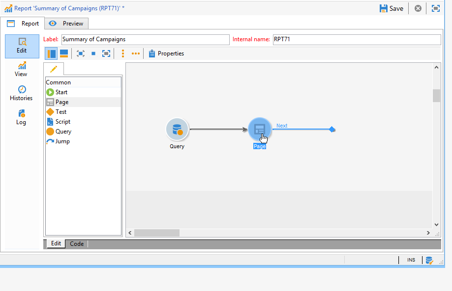
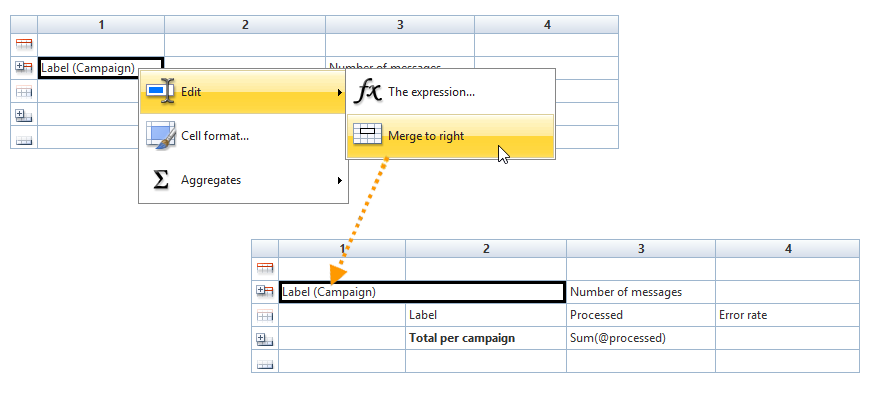

# Creación de una tabla{#creating-a-table}

Puede añadir una tabla a un informe para visualizar los datos. Puede ser una tabla dinámica creada en función de las medidas del cubo, una lista con un grupo o una tabla que contenga un desglose de valores.


## Creación de una lista con grupo {#creating-a-list-with-group}

Una tabla de tipo **[!UICONTROL List with group]** permite agrupar datos en la tabla y generar estadísticas sobre ella. Por ejemplo, puede crear totales y subtotales de los datos. Cada grupo tiene su propio encabezado, detalle y pie de página.

>[!CAUTION]
>
>La actividad **[!UICONTROL Page]** que contiene la tabla debe ir precedida por una actividad **[!UICONTROL Query]** o **[!UICONTROL Script]** para recopilar los datos que desee analizar en el informe. Para obtener más información sobre estas actividades, consulte [Recopilación de datos para analizar](../../reporting/using/collecting-data-to-analyze.md) y [Actividad de secuencia de comandos](../../reporting/using/advanced-functionalities.md#script-activity).

### Principio de funcionamiento {#operating-principle}

Puede que necesite analizar varias categorías de datos a la vez. Una lista con grupo permite combinar datos y crear estadísticas sobre varios grupos de datos dentro de la misma tabla. Para ello, puede crear un grupo en la tabla.

En el siguiente ejemplo, el grupo muestra todas las campañas de la base de datos, las entregas y el número de mensajes enviados por entrega y por campaña.

Permite enumerar las campañas [(**[!UICONTROL Label (Campaign)]**)] y la lista de entregas (**[!UICONTROL Label]**) relacionadas con la campaña y permite contar el número de mensajes enviados por entrega (**[!UICONTROL Processed)]**) antes de añadirlos a cada campaña [(**[!UICONTROL Sum(@processed)]**)].


### Pasos de implementación {#implementation-steps}

Aquí se proporciona un ejemplo completo de implementación: [Caso de uso: Cree un informe con una lista de grupos](#use-case--create-a-report-with-a-group-list).

Tenga en cuenta los siguientes pasos para crear una tabla de tipo “Lista con grupo”:

1. Vaya al gráfico del informe y coloque una actividad **[!UICONTROL Query]**. Consulte [Recopilación de datos para analizar](../../reporting/using/collecting-data-to-analyze.md).
1. Rellene la tabla de origen y seleccione los campos de la tabla que corresponden a las estadísticas.
1. Coloque una actividad **[!UICONTROL Page]** en el gráfico. Para obtener más información, consulte [Elementos estáticos](../../reporting/using/creating-a-new-report.md#static-elements).
1. Inserte una tabla de texto **[!UICONTROL List with group]** en la página.
1. Especifique la ruta de datos o la tabla seleccionada como fuente de datos en la consulta.

   Este paso es obligatorio si desea recuperar los campos de la tabla de origen posteriormente e insertarlos en las celdas de la tabla.

1. Creación de una tabla y su contenido.
1. Visualice el informe terminado en la pestaña **[!UICONTROL Preview]**. Luego puede publicar el informe y exportarlo a un formato diferente en caso necesario. Para obtener más información, consulte [Exportación de un informe](../../reporting/using/actions-on-reports.md#exporting-a-report).

### Adición de líneas y columnas {#adding-lines-and-columns}

De forma predeterminada, una tabla de texto **[!UICONTROL List with group]** incluye un encabezado, una línea de detalle y una línea de pie de página.

El propio grupo incluye líneas de encabezado, detalle y pie de página.

* **Línea de encabezado**: esta línea permite asignar un título a las columnas de la tabla.

   

* **Línea de detalle**: esta línea contiene los valores estadísticos.

   

* **Línea de pie de página**: esta línea permite mostrar los valores totales.

   

Puede añadir líneas y columnas según sus necesidades.

El grupo se puede colocar en cualquier línea de la tabla e incluir su propio encabezado, detalle y líneas de pie de página.


**Línea y columna**: para añadir o eliminar una línea o una columna, vaya a una línea o columna existente y utilice el menú contextual.


El tipo de línea que añada depende de la ubicación del cursor. Por ejemplo, para añadir una línea de encabezado, coloque los cursores en un encabezado y haga clic en **[!UICONTROL Add > A line above/below]**.


El ancho de las columnas se puede modificar mediante el elemento **[!UICONTROL Column format]**.

**Grupo**: para añadir un grupo, vaya a una línea y seleccione el elemento correspondiente del menú desplegable.


### Definición del contenido de la celda {#defining-cell-content}

Para editar una celda de la tabla y definir su contenido y formato, vaya a la celda y utilice el menú contextual.

Utilice la entrada de menú **[!UICONTROL Expression]** para seleccionar los valores que se van a mostrar.


* Para insertar los valores que se van a analizar directamente en la tabla, selecciónelos entre los campos disponibles.

   La lista de campos disponibles coincide con el contenido de la consulta antes de la tabla en el gráfico de creación de informes.

   

* Introduzca una etiqueta para una celda, por ejemplo, de encabezado.

   Para ello, utilice el mismo proceso que para insertar un campo en la base de datos, pero no seleccione una expresión. Introduzca la etiqueta en el campo **[!UICONTROL Label]**. Se muestra tal cual.

* Cálculo de un acumulado (un promedio, una suma, etc.) para mostrarlo en la celda.

   Para ello, utilice la entrada de menú **[!UICONTROL Aggregates]** y seleccione la campaña deseada.

   

### Definición del formato de la celda {#defining-cell-format}


Para definir el formato de celda, el menú **[!UICONTROL Cell format...]** permite acceder a todas las opciones de formato disponibles para la celda seleccionada.

Estas opciones permiten personalizar la renderización final del informe y facilitar la lectura de la información.

Utilice el campo **[!UICONTROL Carriage return]** para exportar datos a Excel: seleccione el valor **[!UICONTROL Yes]** para forzar el retorno de carro. Este valor se mantiene al exportar. Para obtener más información, consulte [Exportación de un informe](../../reporting/using/actions-on-reports.md#exporting-a-report).

La ventana **[!UICONTROL Cell format]** permite acceder a la siguiente pestaña:

* La pestaña **[!UICONTROL Value]**
* La pestaña **[!UICONTROL Borders]**
* La pestaña **[!UICONTROL Click]**
* La pestaña **[!UICONTROL Extra]**

La pestaña **[!UICONTROL Value]** permite cambiar la fuente y los distintos atributos de valor o definir un formato en función de su naturaleza.


El formato cambia la visualización de datos: por ejemplo, los formatos **[!UICONTROL Number]**, **[!UICONTROL Monetary]** y **[!UICONTROL Percentage]** permiten alinear las cifras a la derecha y mostrar los puntos decimales.

Ejemplo de cómo configurar un formato de divisas: puede especificar la moneda en la que se expresan los valores, elegir si se separan o no los millares y mostrar los valores negativos en rojo. La posición del símbolo de divisa depende del idioma del operador definido en su perfil.


Ejemplo de configuración para fechas: puede elegir si desea mostrar o no la hora.


La pestaña **Bordes** le permite añadir bordes a las líneas y columnas de la tabla. La adición de bordes a las celdas puede dar lugar a problemas de rendimiento al exportar informes de gran tamaño a Excel.


Si es necesario, puede definir los bordes en la plantilla de tabla (**[!UICONTROL Administration > Configuration > Form rendering]** ).

En este caso, se encuentra con la siguiente sintaxis:

En la pestaña web:

```
 .tabular td {
 border: solid 1px #000000;
 }
```

En la pestaña Excel:

```
 <style name="odd" fillColor="#fdfdfd">
  <border>
   <borderTop value="solid 0.05pt #000000" />
   <borderBottom value="solid 0.05pt #000000" />
   <borderLeft value="solid 0.05pt #000000" />
   <borderRight value="solid 0.05pt #000000" />
  </border>
 </style> 
 
 <style name="even" fillColor="#f7f8fa">
  <border>
   <borderTop value="solid 0.05pt #000000" />
   <borderBottom value="solid 0.05pt #000000" />
   <borderLeft value="solid 0.05pt #000000" />
   <borderRight value="solid 0.05pt #000000" />
  </border>
 </style> 
```

La pestaña **[!UICONTROL Click]** permite definir una acción cuando el usuario hace clic en el contenido de una celda o de la tabla.

En el ejemplo que se muestra a continuación, al hacer clic en el valor de la celda se muestra la segunda página del informe, que contiene información sobre la entrega en la celda.


La pestaña **Extra** le permite vincular un campo visual a los datos, como una marca de color o una barra de valor. La marca de color se utiliza cuando la tabla se muestra como una leyenda en un gráfico. Para obtener más información, consulte el ejemplo de implementación: [Paso 5: Crear la segunda página](#step-5---create-the-second-page).


## Caso de uso: Creación de un informe con una lista de grupos {#use-case--create-a-report-with-a-group-list}

En este ejemplo creamos un informe de dos páginas: la primera página contiene la lista y el total de entregas por campaña, así como el número de mensajes enviados. Los nombres de entrega son vínculos en los que puede hacer clic y le permiten ir a la segunda página del informe para ver el desglose de entregas por dominio de correo electrónico, según la entrega seleccionada, con una tabla y un gráfico. En la segunda página, la tabla sirve como una leyenda para el gráfico.


### Paso 1: Creación de un informe {#step-1---create-a-report}

Cree un nuevo informe que corresponda al esquema de campañas, **[!UICONTROL Campaigns (nms)]**.


Haga clic en **[!UICONTROL Save]** para crear el informe.

Vaya al gráfico y añada los primeros componentes que va a utilizar para diseñar el contenido del informe: una primera consulta y una primera página.



### Paso 2: Creación de la primera consulta {#step-2---create-the-first-query}

La primera consulta le permite recopilar las entregas vinculadas a cada campaña. El objetivo es mostrar un informe sobre las distintas entregas de la base de datos de Adobe Campaign enlazados a cada campaña.

Haga doble clic en la primera consulta para editarla y luego siga los pasos descritos a continuación para configurarla:

1. Comience por cambiar el esquema en el que se aplica el origen de la consulta: seleccione el esquema **[!UICONTROL Deliveries (nms)]**.
1. Haga clic en el vínculo **[!UICONTROL Edit query]** y muestre los campos avanzados.

   

1. Seleccione los campos siguientes:

   * la etiqueta de entrega,
   * la clave principal de la entrega,
   * la etiqueta de campaña,
   * el indicador de entregas procesados,
   * la clave externa del vínculo de la campaña,
   * el indicador de tasa de error.

   

   Se recomienda enlazar un alias a cada campo para facilitar la selección de datos de la tabla que se añade a la primera página del informe.

   Para este ejemplo, se utilizan los siguientes alias:

   * Etiqueta: **@label**
   * Clave principal: **@deliveryId**
   * Etiqueta (campaña): **@label1**
   * Procesado: **@processed**
   * Clave externa del vínculo “Campaña” (campo “id”): **@operationId**
   * Tasa de error: **@errorRatio**


1. Haga clic dos veces en el botón **[!UICONTROL Next]** para llegar al paso **[!UICONTROL Data filtering]**.

   Añada una condición de filtro para recopilar solamente las entregas vinculadas a una campaña.

   La sintaxis de este filtro es la siguiente: “Foreign key of the &#39;Campaigns&#39; link greater than 0”.

   

1. Haga clic en **[!UICONTROL Finish]** para guardar estas condiciones y haga clic en **[!UICONTROL Ok]** para cerrar el editor de consultas.

### Paso 3: Creación de la primera página {#step-3--create-the-first-page}

En este paso, configuramos la primera página del informe. Para ello, siga los siguientes pasos:

1. Abra la actividad **[!UICONTROL Page]** e introduzca su título, por ejemplo **Deliveries**, en este caso.

   

1. Inserte una lista con un grupo mediante la barra de herramientas e introduzca su etiqueta, por ejemplo: List of deliveries per campaign.

   

1. Haga clic en el vínculo **[!UICONTROL Table data XPath...]** y seleccione el vínculo de entrega, es decir: `[query/delivery]`.

   

1. Haga clic en la pestaña **[!UICONTROL Data]** y cambie el diseño de la tabla: añada tres columnas a la derecha.

   

1. Añada un grupo.

   

   Este grupo le permite agrupar las campañas y las entregas vinculadas a ellas.

1. En la ventana del grupo, haga referencia a **la clave externa del vínculo “Campaña”** y cierre la ventana.

   

1. Edite la primera celda del encabezado del grupo e inserte el campo **[!UICONTROL Label]** de las campañas como una expresión.

   

1. Edite la segunda celda de la línea de detalles y seleccione las entregas **[!UICONTROL Label]**.

   

1. Edite el formato de esta celda y abra la pestaña **[!UICONTROL Click]**. Configure las opciones adecuadas para que cuando los usuarios hagan clic en el nombre de una entrega, se abra en la misma ventana.

   

   Para hacerlo, seleccione una acción de tipo **[!UICONTROL Next page]** y seleccione **[!UICONTROL In the same window]** como una opción abierta.

   

1. En la sección inferior de la ventana, haga clic en **[!UICONTROL Add]** y especifique la ruta **`/vars/selectedDelivery`** y la expresión **[!UICONTROL @deliveryId]** que coincida con el alias de la clave primaria de la entrega definida en la consulta creada anteriormente. Esta fórmula permite acceder a la entrega seleccionada.

   

1. Edite la segunda celda de la línea de pie de página del grupo e introduzca **[!UICONTROL Total per campaign]** como etiqueta.

   

1. Edite la tercera celda de la línea de encabezado del grupo e introduzca **[!UICONTROL Number of messages sent]** como etiqueta.

   

   Esta información coincide con el título de la columna.

1. Edite la tercera celda de la línea de detalle y seleccione el indicador de mensaje procesado como expresión.

   

1. Edite la tercera celda de la línea de pie de página del grupo, seleccione el indicador de entrega procesado y aplique el acumulado **[!UICONTROL Sum]** al mismo.

   

1. Edite la cuarta celda de la línea de detalle y seleccione la **tasa de error de entrega** como expresión.

   

1. Seleccione esta celda para visualizar una barra de valores que represente la tasa de errores de entrega.

   Para hacerlo, acceda al formato de celda y vaya a la pestaña **[!UICONTROL More]**. Seleccione la entrada **[!UICONTROL Value bar]** en la lista desplegable y seleccione la opción **[!UICONTROL Hide the cell value]**.

   

   Ahora puede ver una renderización del informe. Haga clic en la pestaña **[!UICONTROL Preview]** y seleccione la opción **[!UICONTROL Global]**: esto muestra la lista de todas las entregas de la base de datos de Adobe Campaign que están relacionados con una campaña.

   

   Se recomienda utilizar la pestaña **[!UICONTROL Preview]** para asegurarse de que los datos de la tabla estén seleccionados y configurados correctamente. Una vez realizada esta acción, puede ir al formato de la tabla.

1. Aplique el estilo **[!UICONTROL Bold]** a las celdas que muestran el total por campaña y el número total de mensajes procesados.

   

1. Haga clic en la primera celda de la línea de encabezado del grupo, la que muestra el nombre de la campaña, y seleccione **[!UICONTROL Edit > Merge to right]**.

   

   Al combinar las dos primeras celdas de la línea del encabezado del grupo, se realinean el título de la campaña y la lista de entregas vinculada.

   

   >[!CAUTION]
   >
   >Se recomienda esperar hasta que el informe se haya creado antes de combinar las celdas, ya que la combinación es irreversible.

### Paso 4: Creación de la segunda consulta {#step-4---create-the-second-query}

Queremos añadir una segunda consulta y una segunda página para mostrar el detalle de una entrega cuando el usuario haga clic en el informe. Antes de añadir la consulta, edite la página que ha creado y habilite la transición saliente para que se pueda enlazar a la consulta.

1. Añada una nueva consulta después de la actividad **[!UICONTROL Page]** y edite su esquema: seleccione el esquema **[!UICONTROL Recipient delivery logs]**.

   

1. Edite la consulta y defina las columnas de salida. Para mostrar el número de entregas por dominio de correo electrónico, debe hacer lo siguiente:

   * calcular la suma de las claves principales para contar el número de “logs” de entrega:

      

   * recopilar dominios de correo electrónico del destinatario agrupar información en este campo: para hacerlo, seleccione la opción **[!UICONTROL Group]** en la columna de nombre de dominio.

   

   vínculo los siguientes alias a los campos:

   * count(primary key): **@count**
   * Email domain (Recipient): **@domain**

      


1. Haga clic en el botón **[!UICONTROL Next]** dos veces: esto lo lleva al paso **[!UICONTROL Data filtering]**.

   Añada una condición de filtrado para recopilar únicamente la información vinculada a la entrega seleccionada.

   La sintaxis es la siguiente: Foreign key of the &#39;Delivery&#39; link equals the value of the setting `$([vars/selectedDelivery])`

   

1. Cierre la ventana de configuración de consulta y añada una página al gráfico justo después de la segunda consulta.

### Paso 5: Creación de la segunda página {#step-5---create-the-second-page}

1. Edite la página e introduzca su etiqueta: **Email domains**.
1. Desmarque la opción **[!UICONTROL Enable output transitions]**: esta es la última página del informe y no va seguida de otra actividad.

   

1. Añada una nueva lista con un grupo mediante el menú contextual y denomínela **Dominios de correo electrónico por destinatario**.
1. Haga clic en **[!UICONTROL Table data XPath...]** y seleccione el vínculo **[!UICONTROL Recipient delivery logs]**.

   

1. En la pestaña **[!UICONTROL Data]**, adapte la tabla de la siguiente manera:

   * Añada dos columnas a la derecha.
   * En la primera celda de la línea de detalle, añada la expresión **[!UICONTROL rowNum()-1]** para contar el número de líneas. Luego, modifique el formato de la celda: en la pestaña **[!UICONTROL Extra]**, seleccione **[!UICONTROL Color tab]** y haga clic en **[!UICONTROL Ok]**.

      

      Esta configuración le permite utilizar la tabla como pie de ilustración para el gráfico.

   * En la segunda celda de la línea de detalle, añada la expresión **[!UICONTROL Email domain(Recipient)]**.
   * En la tercera celda de la línea de detalle, añada la expresión **[!UICONTROL count(primary key)]**.

   

1. Añada un gráfico circular a la página mediante el menú contextual y asígnele la etiqueta **dominios de correo electrónico.** Para obtener más información, consulte [Tipos de gráficos y variantes](../../reporting/using/creating-a-chart.md#chart-types-and-variants).
1. Haga clic en el vínculo **[!UICONTROL Variants]** y desmarque las opciones **[!UICONTROL Display label]** y **[!UICONTROL Display caption]**.
1. Compruebe que no esté configurada ninguna ordenación de valores. Para obtener más información, consulte [esta sección](../../reporting/using/processing-a-report.md#configuring-the-layout-of-a-descriptive-analysis-report).

   

1. En la pestaña **[!UICONTROL Data]**, cambie la fuente de datos: seleccione **[!UICONTROL Context data]** de la lista desplegable.

   

1. Luego, haga clic en **[!UICONTROL Advanced settings]** y seleccione el vínculo a los registros de entrega de los destinatarios.

   

1. En la sección **[!UICONTROL Chart type]**, seleccione la variable **[!UICONTROL Email domain]**.
1. A continuación, añada el cálculo que desea llevar a cabo: seleccione la suma como operador.

   

1. Haga clic en el botón **[!UICONTROL Detail]** para seleccionar el campo al que corresponda el recuento y cierre la ventana de configuración.

   

1. Guarde el informe.

   La página está configurada.

### Paso 6: Visualización del informe {#step-6---viewing-the-report}

Para visualizar el resultado de esta configuración, haga clic en la pestaña **[!UICONTROL Preview]** y seleccione la opción **[!UICONTROL Global]**.

La primera página del informe detalla la lista de todas las entregas incluidos en la base de datos.


Si hace clic en el vínculo de uno de estos entregas, se muestra el gráfico con el desglose de los dominios de correo electrónico para esta entrega. Ahora se encuentra en la segunda página del informe y puede regresar a la página anterior haciendo clic en el botón correspondiente.


## Creación de un desglose o tabla dinámica {#creating-a-breakdown-or-pivot-table}

Este tipo de tabla le permite mostrar estadísticas calculadas en los datos de la base de datos.

El asistente de análisis descriptivo utiliza una configuración similar a estos tipos de informes. Para obtener más información, consulte [esta página](../../reporting/using/using-the-descriptive-analysis-wizard.md#configuring-the-quantitative-distribution-template).

Para obtener más información sobre la creación de una tabla dinámica, consulte [esta sección](../../reporting/using/using-cubes-to-explore-data.md).
