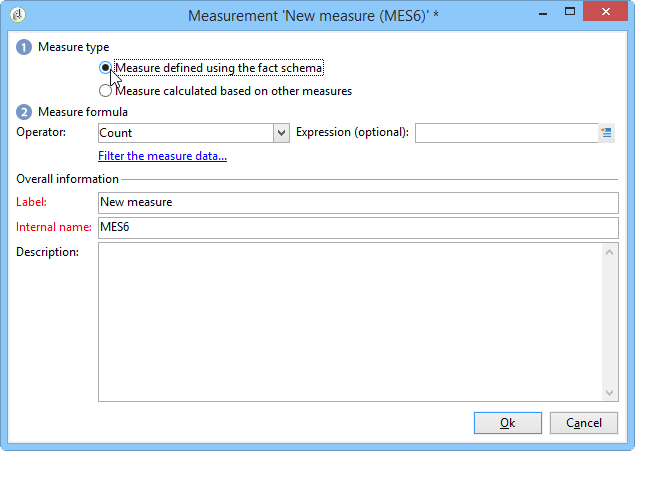

# Creación de indicadores{#creating-indicators}

Para que un sea cubo funcional, se deben identificar las dimensiones y las medidas relevantes y crearlas en el cubo.

Para crear un cubo, siga los pasos siguientes:

1. Seleccione la tabla de trabajo. Consulte [Selección de la tabla de trabajo](#selecting-the-work-table).
1. Defina las dimensiones. Consulte [Definición de dimensiones](#defining-dimensions).
1. Defina las medidas. Consulte [Generación de indicadores](#building-indicators).
1. Cree acumulados (opcional). Consulte [Cálculo y uso de agregados](../../reporting/using/concepts-and-methodology.md#calculating-and-using-aggregates).

Este ejemplo muestra la forma de crear rápidamente un cubo simple en un informe para exportar sus medidas.

Los pasos de implementación se detallan a continuación. Hay disponibles opciones y descripciones exhaustivas en las demás secciones de este capítulo.

## Selección de la tabla de trabajo {#selecting-the-work-table}

Para crear una nueva plantilla, haga clic en el botón **[!UICONTROL New]** situado sobre la lista de cubos.

Seleccione el esquema de hechos, es decir, el esquema que contiene los elementos que desee explorar. En este ejemplo, se busca seleccionar la tabla **Destinatario**.

Haga clic en **[!UICONTROL Save]** para crear el cubo: este aparece en la lista de cubos y se puede configurar a través de las pestañas adecuadas.

Haga clic en el vínculo **[!UICONTROL Filter the source data...]** para aplicar los cálculos de este cubo a una selección de datos de la base de datos.

## Definición de dimensiones {#defining-dimensions}

Las dimensiones coinciden con los ejes de análisis definidos para cada cubo en función del esquema de hechos relacionado. Estas son las dimensiones exploradas en el análisis, como el tiempo (año, mes, fecha, etc.), la clasificación de productos o contratos (familia, referencia, etc.), segmento de población (por ciudad, grupo de edad, estado, etc.).

Estos ejes de análisis se definen en la pestaña **[!UICONTROL Dimension]** del cubo.

Haga clic en el botón **[!UICONTROL Add]** para crear una nueva dimensión y luego, en **[!UICONTROL Expression field]**, haga clic en el icono **[!UICONTROL Edit expression]** para seleccionar el campo que contiene los datos relevantes.

* Comience por seleccionar la **Edad** del destinatario. Para este campo, se puede definir el agrupamiento para reunir las edades y facilitar la lectura de la información. Se recomienda utilizar un agrupamiento cuando exista la probabilidad de que haya varios valores separados.

   Para ello, marque la opción **[!UICONTROL Enable binning]**. Los modos de vínculo se detallan en [Enable binning](../../reporting/using/concepts-and-methodology.md#data-binning).

   

* Añada una dimensión de tipo **Fecha.** Aquí nos interesa mostrar las fechas de creación del perfil de destinatario.

   Para ello, haga clic en **[!UICONTROL Add]** y seleccione el campo **[!UICONTROL Creation date]** en la tabla de destinatarios.

   

   Es posible seleccionar el modo de visualización de la fecha. Para ello, seleccione la jerarquía que se va a utilizar y los niveles que se van a generar:

   

   En este ejemplo, solo se busca mostrar los años, meses y días, ya que no es posible trabajar con semanas y semestres y meses al mismo tiempo: estos niveles no son compatibles.

* Cree otra dimensión para analizar los datos relacionados con la ciudad del destinatario.

   Para ello, añada una nueva dimensión y seleccione la ciudad en el nodo **[!UICONTROL Location]** del esquema de destinatarios.

   

   Puede activar el agrupamiento para facilitar la lectura de la información y vincular los valores a una enumeración.

   

   Seleccione la enumeración en la lista desplegable.

   

   Solo se muestran los valores de la enumeración. Los demás se agrupan con la etiqueta definida en el campo **[!UICONTROL Label of the other values]**.

   Para obtener más información, consulte [Administración dinámica de grupos](../../reporting/using/concepts-and-methodology.md#dynamically-managing-bins).

## Indicadores de creación {#building-indicators}

Una vez definidas las dimensiones, se debe especificar un modo de cálculo para que los valores se muestren en las celdas. Para ello, cree los indicadores coincidentes en la pestaña **[!UICONTROL Measures]**: cree tantas medidas como columnas que se deben mostrar en el informe que usa el cubo.

Para ello, siga los siguientes pasos:

1. Haga clic en el botón **[!UICONTROL Add]**.
1. Seleccione el tipo de medida y la fórmula que desea aplicar. Aquí deseamos contar la cantidad de mujeres entre los destinatarios.

   La medición se basa en el esquema de hechos y utiliza el operador **[!UICONTROL Count]**.

   

   El vínculo **[!UICONTROL Filter the measure data...]** permite seleccionar solo mujeres. Para obtener más información sobre la definición de medidas y las opciones disponibles, consulte [Definir medidas](../../reporting/using/concepts-and-methodology.md#defining-measures).

   

1. Introduzca la etiqueta de la medida y guárdela.

   

1. Guarde el cubo.

## Creación de un informe basado en un cubo {#creating-a-report-based-on-a-cube}

Una vez configurado el cubo, se puede utilizar como plantilla para crear un nuevo informe.

Para ello:

1. En la pestaña **[!UICONTROL Reports]**, haga clic en el botón **[!UICONTROL Create]** y seleccione el cubo recién creado.

   

1. Haga clic en el botón **[!UICONTROL Create]** para confirmar: esto le lleva a la configuración del informe y a la página de visualización.

   De forma predeterminada, las dos primeras dimensiones disponibles se ofrecen en líneas y columnas, pero no se muestra ningún valor en la tabla. Para generar la tabla, haga clic en el icono principal:

   

1. Puede cambiar los ejes de la dimensión, eliminarlos, agregar nuevas medidas, etc. Las operaciones posibles se detallan aquí: [Uso de cubos para explorar datos](../../reporting/using/using-cubes-to-explore-data.md).

   Para ello, utilice los iconos adecuados.

   
