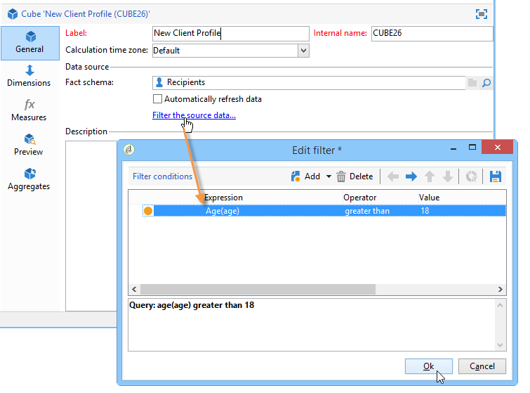

# Creación de indicadores{#creating-indicators}

Para que un sea cubo funcional, se deben identificar las dimensiones y las medidas relevantes y crearlas en el cubo.

Para crear un cubo, siga los pasos siguientes:

1. Seleccione la tabla de trabajo. Consulte [Selección de la tabla](#selecting-the-work-table)de trabajo.
1. Defina las dimensiones. Consulte [Definición de dimensiones](#defining-dimensions).
1. Defina las medidas. Consulte [Generación de indicadores](#building-indicators).
1. Cree acumulados (opcional). Consulte [Cálculo y uso de agregados](../../reporting/using/concepts-and-methodology.md#calculating-and-using-aggregates).

Este ejemplo muestra la forma de crear rápidamente un cubo simple en un informe para exportar sus medidas.

Los pasos de implementación se detallan a continuación. Hay disponibles opciones y descripciones exhaustivas en las demás secciones de este capítulo.

## Selección de la tabla de trabajo {#selecting-the-work-table}

To create a cube, click the **[!UICONTROL New]** button above the list of cubes.

Seleccione el esquema de hechos, es decir, el esquema que contiene los elementos que desee explorar. En este ejemplo, se busca seleccionar la tabla **Destinatario**.

Click **[!UICONTROL Save]** to create the Cube: it will appear on the list of Cubes and may then be configured using the appropriate tabs.

Click the **[!UICONTROL Filter the source data...]** link to apply the calculations of this Cube to a select of data in the database.

## Definición de dimensiones {#defining-dimensions}

Las dimensiones coinciden con los ejes de análisis definidos para cada cubo en función del esquema de hechos relacionado. Estas son las dimensiones exploradas en el análisis, como el tiempo (año, mes, fecha, etc.), la clasificación de productos o contratos (familia, referencia, etc.), segmento de población (por ciudad, grupo de edad, estado, etc.).

These analysis axes are defined in the **[!UICONTROL Dimension]** tab of the Cube.

Click the **[!UICONTROL Add]** button to create a new dimension, then in the **[!UICONTROL Expression field]**, click the **[!UICONTROL Edit expression]** icon to select the field that contains the concerned data.

* Comience por seleccionar la **Edad** del destinatario. Para este campo, se puede definir el agrupamiento para reunir las edades y facilitar la lectura de la información. Se recomienda utilizar un agrupamiento cuando exista la probabilidad de que haya varios valores separados.

   Para ello, marque la **[!UICONTROL Enable binning]** opción. Los modos de enlace se detallan en [Enlace](../../reporting/using/concepts-and-methodology.md#data-binning)de datos.

   

* Añada una dimensión de tipo **Fecha.** Aquí nos interesa mostrar las fechas de creación del perfil de destinatario.

   To do this, click **[!UICONTROL Add]** and select the **[!UICONTROL Creation date]** field in the recipient table.

   

   Es posible seleccionar el modo de visualización de la fecha. Para ello, seleccione la jerarquía que se va a utilizar y los niveles que se van a generar:

   

   En este ejemplo, solo se busca mostrar los años, meses y días, ya que no es posible trabajar con semanas y semestres y meses al mismo tiempo: estos niveles no son compatibles.

* Cree otra dimensión para analizar los datos relacionados con la ciudad del destinatario.

   To do this, add a new dimension and select the city in the **[!UICONTROL Location]** node of the recipient schema.

   

   Puede activar el agrupamiento para facilitar la lectura de la información y vincular los valores a una enumeración.

   

   Seleccione la enumeración en la lista desplegable.

   

   Solo se muestran los valores de la enumeración. The others will be grouped under the label defined in the **[!UICONTROL Label of the other values]** field.

   Para obtener más información sobre esto, consulte Administración [dinámica de bandejas](../../reporting/using/concepts-and-methodology.md#dynamically-managing-bins).

## Indicadores de creación {#building-indicators}

Una vez definidas las dimensiones, se debe especificar un modo de cálculo para que los valores se muestren en las celdas. To do this, create the matching indicators in the **[!UICONTROL Measures]** tab: create as many measures as there are columns to display in the report which will use the cube.

Para ello, siga los siguientes pasos:

1. Haga clic en el botón **[!UICONTROL Add]**.
1. Seleccione el tipo de medida y la fórmula que desea aplicar. Aquí deseamos contar la cantidad de mujeres entre los destinatarios.

   Our measure is based on the fact schema and uses the **[!UICONTROL Count]** operator.

   

   El **[!UICONTROL Filter the measure data...]** vínculo permite seleccionar solo mujeres. For more on defining measures and the available options, refer to [Defining measures](../../reporting/using/concepts-and-methodology.md#defining-measures).

   

1. Introduzca la etiqueta de la medida y guárdela.

   

1. Guarde el cubo.

## Creación de un informe basado en un cubo {#creating-a-report-based-on-a-cube}

Una vez configurado el cubo, se puede utilizar como plantilla para crear un nuevo informe.

Para ello:

1. Click the **[!UICONTROL Create]** button of the **[!UICONTROL Reports]** universe and select the cube you have just created.

   

1. Click the **[!UICONTROL Create]** button to confirm: this will take you to the report configuration and viewing page.

   De forma predeterminada, las dos primeras dimensiones disponibles se ofrecen en líneas y columnas, pero no se muestra ningún valor en la tabla. Para generar la tabla, haga clic en el icono principal:

   

1. Puede cambiar los ejes de la dimensión, eliminarlos, agregar nuevas medidas, etc. Las operaciones posibles se detallan aquí: [Uso de cubos para explorar datos](../../reporting/using/using-cubes-to-explore-data.md).

   Para ello, utilice los iconos adecuados.

   

