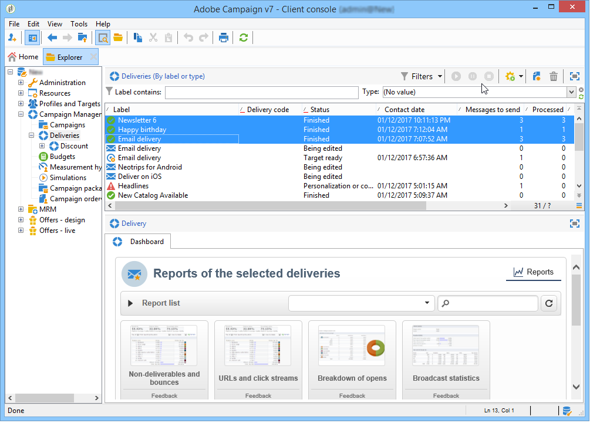

# Informes acumulados {#cumulative-reports}

Se pueden mostrar informes acumulados sobre las entregas. Para ello, seleccione las entregas que desea comparar para obtener la lista de informes para estas entregas.

Para seleccionar entregas no adyacentes de la lista, mantenga pulsada la tecla CTRL mientras realiza la selección.

Para seleccionar entregas guardadas en una carpeta diferente, haga clic en **[!UICONTROL Display sub-levels]** (accesible a través de la barra de herramientas). A continuación, se muestran en la misma lista.

