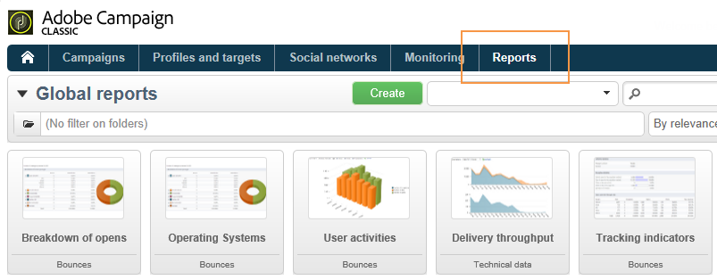
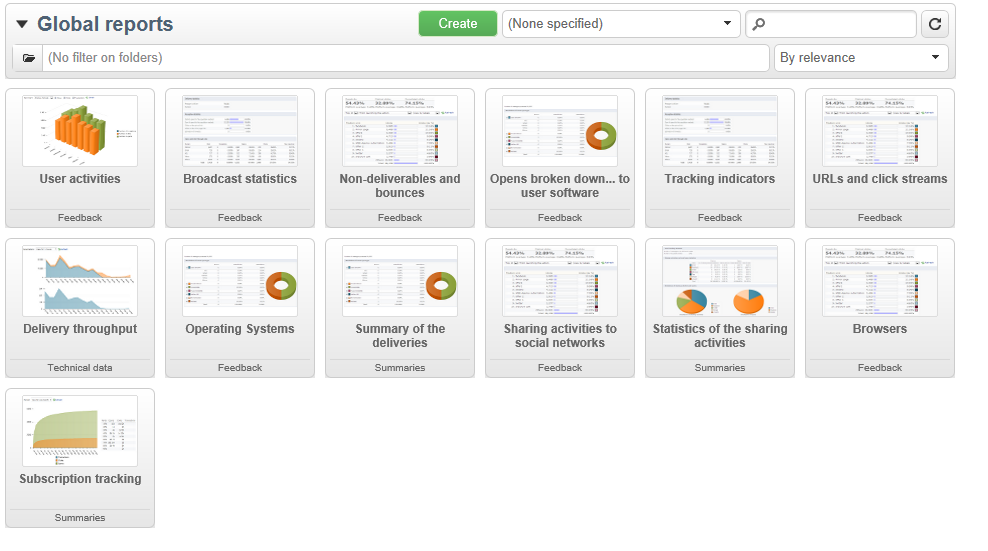
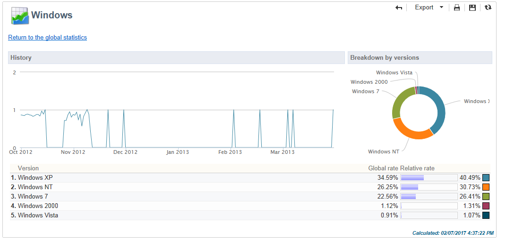

# Informes globales {#global-reports}

Estos informes hacen referencia a la actividad de los datos de toda la base de datos. Para ver el tablero de informes, vaya a la pestaña **[!UICONTROL Reports]**.

Para mostrar los informes, haga clic en el nombre de cada uno. Los siguientes informes están disponibles de forma predeterminada:

>[!NOTE]
>
>Esta sección muestra solamente los informes vinculados a las entregas.

* **[!UICONTROL Delivery throughput]**: consulte [Rendimiento de entrega](#delivery-throughput).
* **[!UICONTROL Browsers]**: consulte [Navegadores](#browsers).
* **[!UICONTROL Sharing to social networks]**: consulte [Uso compartido en redes sociales](#sharing-to-social-networks).
* **[!UICONTROL Statistics on sharing activities]**: consulte [Estadísticas sobre actividades de uso compartido](#statistics-on-sharing-activities).
* **[!UICONTROL Operating systems]**: consulte [Sistemas operativos](#operating-systems).
* **[!UICONTROL URLs and click streams]**: consulte [Direcciones URL y flujos de clics](../../reporting/using/delivery-reports.md#urls-and-click-streams).
* **[!UICONTROL Tracking indicators]**: consulte [Seguimiento de indicadores](../../reporting/using/delivery-reports.md#tracking-indicators).
* **[!UICONTROL Non-deliverables and bounces]**: consulte [No entregables y devoluciones](#non-deliverables-and-bounces).
* **[!UICONTROL User activities]**: consulte [Actividades de usuario](#user-activities).
* **[!UICONTROL Subscription tracking]**: consulte [Seguimiento de suscripciones](#subscription-tracking).
* **[!UICONTROL Delivery summary]**: consulte [Resumen de entregas](../../reporting/using/delivery-reports.md#delivery-summary).
* **[!UICONTROL Delivery statistics]**: consulte las [Estadísticas de entrega](#delivery-statistics).
* **[!UICONTROL Breakdown of opens]**: consulte [Desglose de aperturas](#breakdown-of-opens).

## Rendimiento de entrega {#delivery-throughput}

Este informe contiene información sobre el rendimiento de entrega de toda la plataforma durante un periodo determinado. Para medir la velocidad a la que se envían los mensajes, los criterios son la cantidad de mensajes enviados por hora y el tamaño de los mensajes (en bits por segundo). En el siguiente ejemplo, el primer gráfico muestra las entregas correctas en azul y la cantidad de entregas incorrectas en naranja.

Se pueden configurar los valores que se muestran cambiando la escala temporal: vista de 1 hora, de 3 horas, de 24 horas, etc. Haga clic en **[!UICONTROL Refresh]** para confirmar la selección.

## Actividades del usuario {#user-activities}

Este informe muestra el desglose de aperturas, clics y transacciones por media hora, hora o día, en forma de gráfico.

Estas son las opciones disponibles:

* **[!UICONTROL Opens]**: Cantidad total de mensajes abiertos. No se tienen en cuenta los correos electrónicos en formato de texto. Para obtener más información sobre el seguimiento de las aperturas, consulte [Seguimiento de aperturas](../../reporting/using/indicator-calculation.md#tracking-opens-).
* **[!UICONTROL Clicks]** : Número total de clics en los vínculos de los envíos. No se tienen en cuenta los clics en los vínculos de baja de suscripción ni en las páginas espejo.
* **[!UICONTROL Transactions]** : Número total de transacciones después de recibir un mensaje. Para que se pueda tener en cuenta una transacción, debe insertarse una etiqueta de seguimiento web de tipo de transacción en la página web correspondiente. La configuración de seguimiento web se muestra en [esta sección](../../configuration/using/about-web-tracking.md).

## Rechazos y no entregables {#non-deliverables-and-bounces}

Este informe muestra el desglose de no entregables, así como un desglose de rechazos por dominio de Internet.

**[!UICONTROL Number of messages processed]** representa el número total de mensajes procesados por el servidor de entrega. Este valor es inferior al número de mensajes que se desea enviar cuando se han detenido o pausado algunas entregas (antes de que el servidor los procese).

**[!UICONTROL Breakdown of errors by type]**

>[!NOTE]
>
>Los errores que se muestran en este informe activan el proceso de cuarentena. Para obtener más información sobre la administración de la cuarentena, consulte [Administración de cuarentena](../../delivery/using/understanding-quarantine-management.md).

La primera sección de este informe muestra el desglose de no entregables en forma de tabla de valores y de gráfico.

Para cada tipo de error, se cuenta con:

* el número de mensajes de error de este tipo,
* el porcentaje de mensajes con errores de este tipo comparado con el número total de mensajes con errores,
* el porcentaje de mensajes de error de este tipo comparado con el número total de mensajes procesados.

Se utilizan los siguientes indicadores:

* **[!UICONTROL User unknown]** : Tipo de error generado durante el envío para indicar que la dirección de correo electrónico no es válida.
* **[!UICONTROL Invalid domain]** : Tipo de error generado al realizar un envío para indicar que el dominio de la dirección de correo electrónico es incorrecto o no existe.
* **[!UICONTROL Inbox full]** : Tipo de error generado después de cinco intentos de envío para indicar que la bandeja de entrada de los destinatarios contiene demasiados mensajes.
* **[!UICONTROL Account disabled]** : Tipo de error generado al realizar un envío para indicar que la dirección ya no existe.
* **[!UICONTROL Rejected]** : Tipo de error generado cuando el IAP (Proveedor de acceso a Internet) rechaza una dirección, por ejemplo, al aplicar una regla de seguridad (software contra correo no deseado).
* **[!UICONTROL Unreachable]** : Tipo de error que se produce en la cadena de distribución de mensajes: incidente en la retransmisión SMTP, dominio temporalmente inaccesible, etc.
* **[!UICONTROL Not connected]** : Tipo de error que indica que el teléfono móvil de los destinatarios está apagado o desconectado de la red en el momento del envío.

   >[!NOTE]
   >
   >Este indicador solo incluye las entregas de canales móviles. Para obtener más información, consulte [esta sección](../../delivery/using/sms-channel.md).

   Se pueden abrir todas las líneas de la tabla de valores haciendo clic en el símbolo `[+]`. Para cada tipo de error, se puede mostrar el desglose de mensajes de error por dominio.

   

**[!UICONTROL Breakdown of errors per domain]**

La segunda sección de este informe muestra el desglose de errores por dominio de Internet en forma de tabla de valores y de un gráfico.

Para cada nombre de dominio, se muestra:

* el número de mensajes con errores para este dominio,
* el porcentaje de mensajes con errores para este dominio comparado con el número total de mensajes procesados para este dominio,
* el porcentaje de mensajes de error para este dominio comparado con el número total de mensajes de error.

Se pueden abrir todas las líneas de la tabla de valores haciendo clic en el símbolo [+]. Para cada tipo de dominio, se puede mostrar el desglose de mensajes de error por tipo de error.

>[!NOTE]
>
>Los nombres de dominio mostrados en este informe se definen al nivel de cubo. Para cambiar estos valores, edite el cubo **[!UICONTROL Delivery logs (broadlogrcp)]**. Para obtener más información, consulte [esta sección](../../reporting/using/about-cubes.md). La categoría **[!UICONTROL Others]** incluye nombres de dominio que no pertenecen a una clase específica.

## Navegadores {#browsers}

Este informe muestra el desglose de los navegadores de Internet que utilizan los destinatarios de la entrega durante el periodo correspondiente.

>[!NOTE]
>
>Los valores que se muestran en este informe son estimaciones: solo se tienen en cuenta los destinatarios que han hecho clic en una entrega.

**Estadísticas globales**

Las estadísticas globales de uso del navegador se presentan en forma de una tabla de valores y de un gráfico.

Se utilizan los siguientes indicadores:

* **[!UICONTROL Visitors]** : Número total de destinatarios objetivo (por navegador de Internet) y que han hecho clic en un envío al menos una vez.
* **[!UICONTROL Pages viewed]** : Número total de clics en los vínculos de un envío (por navegador de Internet) para todos los envíos.
* **[!UICONTROL Usage rate]** : Esta tasa representa el desglose de los visitantes (por navegador de Internet) en relación con la cantidad total de visitantes.

**Estadísticas por navegador**

En la tabla de valores de estadísticas globales, se puede hacer clic en el nombre de cada navegador para ver sus estadísticas de uso.

Las estadísticas se presentan en forma de una curva, un gráfico y una tabla de valores.

La curva **[!UICONTROL History]** representa la tasa de asistencia de este explorador por día. La tasa es la relación entre la cantidad de visitantes por día (en este navegador) comparada con el número de visitantes medidos en el día con la tasa de asistencia más alta.

El gráfico **[!UICONTROL Breakdown per version]** representa el desglose de visitantes por versión comparado con la cantidad total de visitantes (en este explorador).

La tabla de valores utiliza los indicadores siguientes:

* **[!UICONTROL Global rate]** : Esta tasa representa el desglose de visitantes por versión comparado con la cantidad total de visitantes (en todos los navegadores).
* **[!UICONTROL Relative rate]** : Esta tasa representa el desglose de visitantes por versión comparado con la cantidad total de visitantes (en este navegador).

### Difusión en redes sociales {#sharing-to-social-networks}

El marketing viral permite que los destinatarios de las entregas compartan información con sus redes de contactos: pueden añadir un vínculo a su perfil (Facebook, Twitter, etc.) o enviar un mensaje a un amigo. Cada difusión y cada acceso a la información compartida se rastrea dentro de la entrega. Para obtener más información sobre marketing viral, consulte [esta sección](../../delivery/using/viral-and-social-marketing.md).

Este informe muestra el desglose de mensajes compartidos y abiertos por red social (Facebook, Twitter, etc.) y por correo electrónico.

**[!UICONTROL Email delivery statistics]**

En las estadísticas de entrega de correo electrónico se muestran dos valores:

* **[!UICONTROL Number of messages to be delivered]** : Número total de mensajes procesados durante el análisis de envío.
* **[!UICONTROL Number of successful deliveries]** : Número de mensajes procesados correctamente.

**[!UICONTROL Sharing activities and mail open statistics]**

La tabla central muestra las estadísticas de correos electrónicos compartidos y abiertos.

En la columna **[!UICONTROL Shares]**, se muestran los siguientes indicadores:

* **[!UICONTROL No. of sharing activities]** : Cantidad total de mensajes compartidos en cada red social. Este valor es igual al número total de clics en el icono del bloque personalizado correspondiente **[!UICONTROL Links for sharing to social networks]**.
* **[!UICONTROL Breakdown]** : Esta tasa representa el desglose de difusiones por red social en relación con el número total de difusiones.
* **[!UICONTROL Sharing rate]** : Esta tasa representa el desglose de difusiones por red social, en relación con el número de mensajes que se desea enviar.

En la columna **[!UICONTROL Opens]**, se muestran los siguientes indicadores:

* **[!UICONTROL No. of opens]** : Número total de mensajes que abrieron las personas a las que se ha reenviado el mensaje (a través del bloque personalizado **[!UICONTROL Links for sharing to social networks]**). Este valor equivale al número de veces que se mostró la página espejo. No se tienen en cuenta las aperturas de los destinatarios de la entrega.
* **[!UICONTROL Breakdown]** : Esta tasa representa el desglose de las aperturas por red social en relación con el número total de aperturas.
* **[!UICONTROL Rate of opens]** : Esta tasa representa el desglose de las aperturas por red social en relación con el número total de difusiones.

**[!UICONTROL Breakdown of sharing activities and opens]**

Esta sección incluye dos gráficos que representan el desglose de actividades de difusión y de aperturas por red social.

## Estadísticas de actividades de difusión {#statistics-on-sharing-activities}

Este informe muestra la evolución de las difusiones en redes sociales (Facebook, Twitter, correo electrónico, etc.) en el tiempo.

Para obtener más información sobre marketing viral, consulte [esta sección](../../delivery/using/viral-and-social-marketing.md).

Las estadísticas se presentan en forma de una tabla de valores y de un gráfico.

Se utilizan los siguientes indicadores:

* **[!UICONTROL New contacts]** : Número de nuevas suscripciones tras la recepción de un mensaje compartido por correo electrónico. Este valor coincide con el número de personas que recibieron un mensaje compartido mediante correo electrónico, hicieron clic en **[!UICONTROL Subscription link]** y rellenaron el formulario de suscripción.
* **[!UICONTROL Opens]** : Número total de mensajes que abrieron las personas a las que se transfirió el mensaje (mediante el bloque personalizado **[!UICONTROL Link for sharing to social networks]**). Este valor equivale al número de veces que se mostró la página espejo. No se tienen en cuenta las aperturas de los destinatarios de la entrega.
* **[!UICONTROL Sharing activities]** : Número total de mensajes compartidos a través de redes sociales. Este valor coincide con el número total de clics en el icono del bloque personalizado **[!UICONTROL Links for sharing to social networks]**.

## Sistemas operativos {#operating-systems}

Este informe muestra el desglose de los sistemas operativos utilizados los destinatarios de la entrega durante el periodo correspondiente.

>[!NOTE]
>
>Los valores que se muestran en este informe son estimaciones: solo se tienen en cuenta los destinatarios que han hecho clic en una entrega.

**Estadísticas globales**

Las estadísticas de uso global de los sistemas operativos se presentan en forma de una tabla de valores y de un gráfico.

Se utilizan los siguientes indicadores:

* **[!UICONTROL Visitors]** : Promedio diario del número total de destinatarios objetivo (por sistema operativo) que hicieron clic en un envío al menos una vez.
* **[!UICONTROL Pages viewed]** : Promedio diario del número total de clics en los vínculos de envío (por sistema operativo) para todos los envíos.
* **[!UICONTROL Rate of use]** : Esta tasa representa el desglose de visitantes (por sistema operativo) en relación con el número total de visitantes.

**Estadísticas por sistema operativo**

En la tabla de valores de estadísticas globales, haga clic en el nombre de cada sistema operativo para ver las estadísticas por sistema operativo.

Las estadísticas se presentan en forma de una curva, un gráfico y una tabla de valores.

La curva **[!UICONTROL History]** representa la tasa de uso de este sistema operativo por día. Esta tasa es la relación entre el número de visitantes por día (en este sistema operativo) en relación con el número de visitantes medidos en el día con la mayor asistencia.

El gráfico **[!UICONTROL Breakdown by version]** representa el desglose de visitantes por versión en relación con la cantidad total de visitantes en este sistema operativo.

La tabla de valores utiliza los indicadores siguientes:

* **[!UICONTROL Global rate]** : Esta tasa representa el desglose de visitantes (por versión) en relación con la cantidad total de visitantes a través de los sistemas operativos.
* **[!UICONTROL Relative rate]** : Esta tasa representa el desglose de visitantes (por versión) en relación con la cantidad total de visitantes para este sistema operativo.

## Seguimiento de suscripciones {#subscription-tracking}

Este informe permite monitorizar las suscripciones a los servicios de información. Muestra las suscripciones y bajas de suscripción.

Se puede visualizar para una suscripción haciendo clic en el nodo **[!UICONTROL Profiles and targets > Services and subscriptions]** de la página principal o del explorador. Seleccione la suscripción deseada y, a continuación, haga clic en la pestaña **[!UICONTROL Reports]**. El informe **[!UICONTROL Subscriptions tracking]** está disponible de forma predeterminada. Permite ver las tendencias de suscripción y de bajas de suscripción y la tasa de fidelidad durante un periodo. Se puede configurar la representación de estos datos a través de la lista desplegable. Haga clic en **[!UICONTROL Refresh]** para validar la configuración seleccionada.

Para obtener más información, consulte [esta página](../../delivery/using/managing-subscriptions.md).

**[!UICONTROL Number subscribed to date]** representa el número total de personas suscritas actualmente.

**[!UICONTROL Overall evolution of subscriptions]**

La tabla de valores utiliza los indicadores siguientes:

* **[!UICONTROL Subscribers]** : Número total de suscriptores durante el periodo correspondiente.
* **[!UICONTROL Subscriptions]** : Número de suscripciones durante el periodo correspondiente.
* **[!UICONTROL Unsubscriptions]** : Número de bajas de suscripción durante el periodo correspondiente.
* **[!UICONTROL Evolution]** : Número de bajas de suscripción menos el número de suscripciones. La tasa se calcula en función del número total de suscriptores.
* **[!UICONTROL Loyalty]** : Tasa de fidelidad de los suscriptores durante el periodo correspondiente.

**[!UICONTROL Subscription evolution curves]**

Este gráfico muestra la evolución de las suscripciones y las bajas de suscripción durante el periodo correspondiente.

## Estadísticas de entrega {#delivery-statistics}

Este informe muestra el desglose por dominio de Internet, de todos los mensajes procesados y enviados, de los rechazos graves o leves, aperturas, clics y bajas de suscripción.

Se utilizan los siguientes indicadores:

* **[!UICONTROL Emails processed]** : Número total de mensajes que procesa el servidor de envío.
* **[!UICONTROL Delivered]** : porcentaje del número de mensajes procesados correctamente comparado con el número total de mensajes procesados.
* **[!UICONTROL Hard bounces]** : porcentaje del número de rechazos “graves” comparado con el número total de mensajes procesados.
* **[!UICONTROL Soft bounces]** : porcentaje del número de rechazos “leves” comparado con el número total de mensajes procesados.

   >[!NOTE]
   >
   >Para obtener más información sobre los rechazos graves y leves, consulte [Administración de cuarentena](../../delivery/using/understanding-quarantine-management.md).

* **[!UICONTROL Opens]** : porcentaje del número de destinatarios objetivo que abrieron un mensaje al menos una vez comparado con el número de mensajes procesados correctamente.
* **[!UICONTROL Clicks]** : porcentaje del número de personas que hizo clic en un envío al menos una vez comparado con el número de mensajes procesados correctamente.
* **[!UICONTROL Unsubscription]** : porcentaje del número de clics en un vínculo de baja de suscripción comparado con el número de mensajes procesados correctamente.

## Desglose de aperturas {#breakdown-of-opens}

Este informe muestra el desglose de aperturas por sistema operativo, dispositivo y navegador durante el periodo correspondiente. Para cada categoría se utilizan dos gráficos. El primero muestra estadísticas relacionadas con las aperturas en un ordenador y en dispositivos móviles. El segundo muestra estadísticas relacionadas únicamente con las aperturas en dispositivos móviles.

El número de aperturas corresponde al número total de mensajes abiertos. No se cuentan los correos electrónicos de formato de texto. Para obtener más información sobre el seguimiento de aperturas, consulte la sección [Seguimiento de aperturas](../../reporting/using/indicator-calculation.md#tracking-opens-).

>[!NOTE]
>
>Los nombres explorador y sistema operativo forman parte de la información que envía el agente de usuario del explorador en el que se ha abierto el mensaje. Adobe Campaign deduce el tipo de dispositivo mediante la información del dispositivo.
