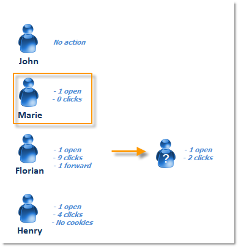
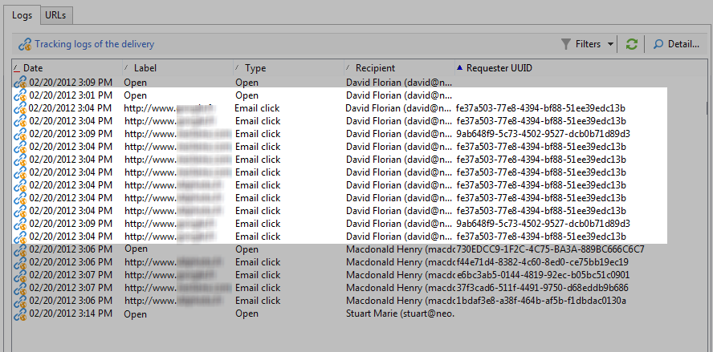
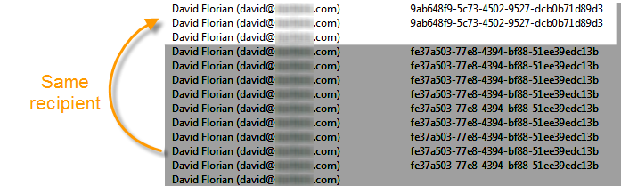

# Personas y destinatarios {#person-people-and-recipients}

Este ejemplo le ayuda a comprender la diferencia entre una persona y un destinatario en Adobe Campaign. Realizamos una entrega a varias personas para resaltar la diferencia entre las personas y los destinatarios, a la vez que detallamos el método de cálculo para los siguientes indicadores:

* **[!UICONTROL Clicks]**
* **[!UICONTROL Distinct clicks for the population reached]**
* **[!UICONTROL Distinct opens for the population reached]**
* **[!UICONTROL Estimation of forwards]**
* **[!UICONTROL Raw reactivity]**

>[!NOTE]
>
>Estos indicadores se utilizan en el informe **[!UICONTROL Tracking indicators]**. Para obtener más información, consulte [Indicadores de seguimiento](../../reporting/using/delivery-reports.md#tracking-indicators).

Se añaden tres vínculos a una entrega. Se envía a 4 destinatarios:

* **[!UICONTROL John Davis]**: este destinatario no abre el correo electrónico (y, por lo tanto, no hace clic en ningún vínculo).
* **[!UICONTROL Marie Stuart]** : abre el correo electrónico, pero no hace clic en ningún vínculo.
* **[!UICONTROL Florian David]**: abre el correo electrónico y hace clic en los vínculos 9 veces. También reenvía el correo electrónico a alguien que lo abre y hace clic dos veces.
* **[!UICONTROL Henry Macdonald]**: este destinatario ha configurado su navegador de Internet para rechazar las cookies. Abre el correo electrónico y hace clic en los vínculos 4 veces.

Se devuelven los siguientes “logs” de seguimiento:

Para obtener una idea más clara de cómo se cuentan las personas y los destinatarios, analicemos los “logs” de cada perfil.

## Paso 1: John {#step-1--john}

**[!UICONTROL John Davis]** no abre el mensaje de correo electrónico (y, por lo tanto, no hace clic en ningún vínculo).

Dado que John no ha abierto ni ha hecho clic en el correo electrónico, no aparece en los “logs”.

**Cálculo intermedio:**

|  | Destinatarios que hicieron clic | Personas que hicieron clic | Destinatarios que lo abrieron |
|---|---|---|---|
| John | - | - | - |
| Total intermedio | 0 | 0 | 0 |

## Paso 2: Marie {#step-2--marie}

**[!UICONTROL Marie Stuart]** abre el correo electrónico, pero no hace clic en ningún vínculo.

La apertura de Marie se muestra en el siguiente “log”:

La apertura se asigna a un destinatario: Marie. Por lo tanto, Adobe Campaign añade un nuevo destinatario al recuento.

**Cálculo intermedio:**

|  | Destinatarios que hicieron clic | Personas que hicieron clic | Destinatarios que lo abrieron |
|---|---|---|---|
| John | - | - | - |
| Marie | - | - | +1 |
| Total intermedio | 0 | 0 | 1 |

## Paso 3: Florian {#step-3--florian}

**[!UICONTROL Florian David]** abre correo electrónico y hace clic en los vínculos 9 veces. También reenvía el correo electrónico a alguien que lo abre y hace clic dos veces.

Las acciones de Florian (1 apertura y 9 clics) aparecen en los siguientes “logs”:

**Recipients**: la apertura y los clics se asignan al mismo destinatario (Florian). Dado que este destinatario es diferente del anterior (Marie), Adobe Campaign añade un nuevo destinatario al recuento.

Debido a que el navegador de este destinatario acepta cookies, podemos ver que el mismo identificador (UUID) se ha asignado a todos los “logs” de clics: **`fe37a503 [...]`**. Adobe Campaign identifica correctamente estos clics como pertenecientes a la misma persona. Se añade una nueva persona al recuento.

**Cálculo intermedio:**

|  | Destinatarios que hicieron clic | Personas que hicieron clic | Destinatarios que lo abrieron |
|---|---|---|---|
| John | - | - | - |
| Marie | - | - | +1 |
| Florian | +1 | +1 | +1 |
| Total intermedio | 1 | 1 | 2 |

Los siguientes “logs” coinciden con la apertura y los dos clics de la persona a la que Florian reenvió el correo electrónico:

**Destinatarios**: la apertura y los clics se asignan al destinatario que ha reenviado el correo electrónico (Florian). Como este destinatario ya se ha contabilizado, el cómputo sigue siendo el mismo.

**Personas**: en cuanto a los clics, se puede apreciar que se asigna el mismo identificador (UUID) a todos los “logs”:**`9ab648f9 [...]`** Este identificador aún no se ha contabilizado. Por lo tanto, se añade una nueva persona al cómputo.

**Cálculo intermedio:**

|  | Destinatarios que hicieron clic | Personas que hicieron clic | Destinatarios que lo abrieron |
|---|---|---|---|
| John | - | - | - |
| Marie | - | - | +1 |
| Florian | +1 | +1 | +1 |
| Persona desconocida | - | +1 | - |
| Total intermedio | 1 | 2 | 2 |

## Paso 4: Henry {#step-4--henry}

**[!UICONTROL Henry Macdonald]** ha configurado su navegador de Internet para rechazar las cookies. Abre el correo electrónico y hace clic en los vínculos 4 veces.

Los apertura y los 4 clics realizados por Henry aparecen en los siguientes “logs” :

**Destinatarios**: la apertura y los clics se asignan al mismo destinatario (Henry). Debido a que este destinatario aún no se ha contabilizado, Adobe Campaign añade un destinatario al recuento.

**Dado que el navegador de Henry no acepta cookies, se genera un identificador nuevo (UUID) para cada clic.** Cada uno de los 4 clics se interpreta como proveniente de una persona diferente. Dado que estos identificadores aún no se han contabilizado, se añaden al recuento.

**Cálculo intermedio:**

|  | Destinatarios que hicieron clic | Personas que hicieron clic | Destinatarios que lo abrieron |
|---|---|---|---|
| John | - | - | - |
| Marie | - | - | +1 |
| Florian | +1 | +1 | +1 |
| Persona desconocida | - | +1 | - |
| Henry | +1 | +4 | +1 |
| Total intermedio | 2 | 6 | 3 |

## Resumen {#summary}

A nivel de envío, tenemos los siguientes resultados:

* **[!UICONTROL Clicks]** (destinatarios que hicieron clic): 2
* **[!UICONTROL Distinct clicks for the population reached]** (personas que hicieron clic): 6
* **[!UICONTROL Distinct opens for the population reached]** (destinatarios que lo abrieron): 3

Las reacciones sin procesar y la estimación de los reenvíos se calculan de la siguiente manera:

* **[!UICONTROL Estimation of forwards]** = **B - A** (por lo tanto 6 - 2 = 4)
* **[!UICONTROL Raw reactivity]** = **A / C** (por lo tanto 2 / 3 = 66,67 %)

>[!NOTE]
>
>En las siguientes fórmulas:
>
>* A representa el indicador **[!UICONTROL Clicks]** (destinatarios que hicieron clic).
>* B representa el indicador **[!UICONTROL Distinct clicks for the population reached]** (personas que hicieron clic).
>* C representa el indicador **[!UICONTROL Distinct opens for the population reached]** (destinatarios que lo abrieron).

