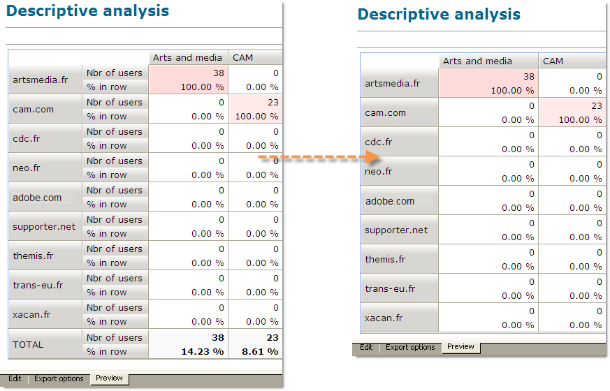
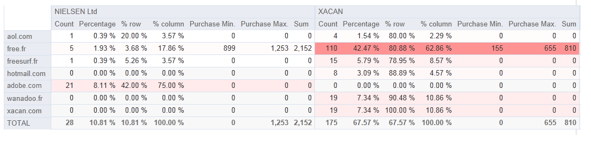
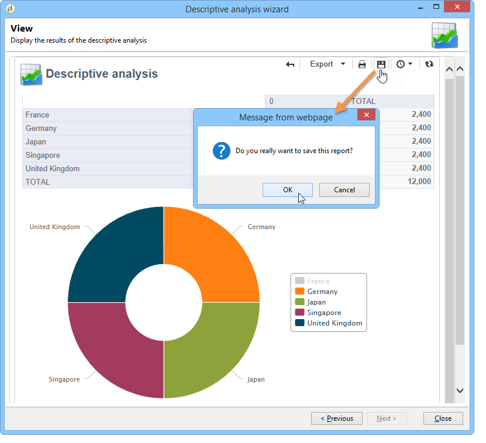

# Uso de un informe de análisis {#processing-a-report}

## Guardado de un informe de análisis {#saving-an-analysis-report}

Si tiene los derechos adecuados, puede guardar un informe de análisis creado a partir de una plantilla o exportarla en formato Excel, PDF u OpenOffice.

Para guardar el informe, haga clic en **[!UICONTROL Save]** y defina una etiqueta para el informe.

Seleccione **[!UICONTROL Also save data]** si desea crear un historial de su informe y ver los valores del informe en el momento de guardarlo. Para obtener más información, consulte [Almacenamiento de informes de análisis](#archiving-analysis-reports).

La opción **[!UICONTROL Share this report]** permite que otros operadores accedan al informe.

Una vez guardado, este informe puede volver a utilizarse para generar otros informes de análisis:

Para realizar cambios en este informe, edite el nodo del árbol de Adobe Campaign **[!UICONTROL Administration > Configuration > Adobe Campaign tree reports]** (o la primera carpeta de tipo “Informes” para la cual el operador tenga los derechos de edición). Para obtener más información, consulte [Configuración del diseño de un informe de análisis descriptivo](#configuring-the-layout-of-a-descriptive-analysis-report).

## Configuración adicional del informe de análisis {#analysis-report-additional-settings}

Una vez que se haya guardado un informe de análisis descriptivo, puede editar sus propiedades y acceder a opciones adicionales.

Estas opciones son las mismas que los informes estándar y se encuentran detalladas en [esta página](../../reporting/using/properties-of-the-report.md).

## Configuración del diseño de un informe de análisis descriptivo {#configuring-the-layout-of-a-descriptive-analysis-report}

Puede personalizar la visualización y el diseño de los datos en los gráficos y tablas del análisis descriptivo. Se accede a todas las opciones a través del árbol de Adobe Campaign, en la pestaña **[!UICONTROL Edit]** de cada informe.

### Modo de visualización del informe del análisis {#analysis-report-display-mode}

Al crear un informe utilizando la plantilla **[!UICONTROL qualitative distribution]**, los modos de visualización de tabla y gráfico se seleccionan de forma predeterminada. Si solo desea un modo de visualización, desmarque la casilla correspondiente. Esto significa que solo está disponible la pestaña del modo de visualización seleccionado.

Para cambiar el esquema del informe, haga clic en **[!UICONTROL Select the link]** y seleccione otra tabla de la base de datos.

### Configuración de la visualización del informe del análisis {#analysis-report-display-settings}

Se pueden ocultar o mostrar las estadísticas y los subtotales, así como elegir la orientación de las estadísticas.

Cuando genere las estadísticas, puede personalizar su etiqueta.

Sus nombres se muestran en el informe.

Sin embargo, si desmarca la etiqueta y la opción de visualizar el subtotal, no se muestran en el informe. El nombre aparece en un globo de texto cuando pasa el cursor sobre una celda de la tabla.

De forma predeterminada, las estadísticas se muestran en línea. Para cambiar la orientación, seleccione la opción adecuada en la lista desplegable.

En el ejemplo siguiente, las estadísticas se muestran en columnas.

### Diseño de los datos del informe del análisis {#analysis-report-data-layout}

Puede personalizar el diseño de datos directamente en las tablas de análisis descriptivo. Para esto, haga clic con el botón derecho en la variable con la que desee trabajar. Seleccione las opciones disponibles en el menú desplegable:

* **[!UICONTROL Pivot]** para cambiar el eje de la variable.
* **[!UICONTROL Up]** / **[!UICONTROL Down]** para intercambiar las variables en líneas.
* **[!UICONTROL Move to the right]** / **[!UICONTROL Move to the left]** para intercambiar las variables en las columnas.
* **[!UICONTROL Turn]** para invertir los ejes de las variables.
* **[!UICONTROL Sort from A to Z]** para ordenar los valores de las variables de menor a mayor.
* **[!UICONTROL Sort from Z to A]** para ordenar los valores de las variables de mayor a menor.

   

Para volver a la visualización inicial, actualice la vista.

### Opciones del gráfico del informe del análisis {#analysis-report-chart-options}

Se puede personalizar la visualización de los datos en el gráfico. Para ello, haga clic en el vínculo **[!UICONTROL Variables...]** disponible durante la fase de selección del tipo de gráfico.

Estas son las opciones disponibles:

* La sección superior de la ventana permite modificar el área de visualización del gráfico.
* Las etiquetas se muestran en el gráfico de forma predeterminada. Puede ocultarlas desmarcando la opción **[!UICONTROL Show values]**.
* La opción **[!UICONTROL Accumulate values]** permite añadir valores de una serie a otra.
* Puede decidir si desea mostrar o no el pie del gráfico: para ocultarlo, desmarque la opción correspondiente. El pie de ilustración se muestra de forma predeterminada fuera del gráfico, en la esquina superior derecha.

   El pie de ilustración también se puede mostrar sobre el gráfico para ahorrar espacio de visualización. Para ello, seleccione la opción **[!UICONTROL Include in the chart]**

   Seleccione la alineación vertical u horizontal en la lista desplegable **[!UICONTROL Caption position]**.

   

## Exportación de un informe de análisis {#exporting-an-analysis-report}

Para exportar los datos de un informe de análisis, haga clic en la lista desplegable y seleccione el formato de salida deseado.

Para obtener más información, consulte [esta página](../../reporting/using/actions-on-reports.md).

## Reutilización de informes y análisis existentes {#re-using-existing-reports-and-analyses}

Puede crear informes de análisis descriptivos sobre los datos utilizando los informes existentes ya almacenados en Adobe Campaign. Este modo es posible tras guardar los análisis o cuando se hubieran creado y configurado informes a través del asistente de análisis descriptivo.

Para saber cómo guardar los análisis descriptivos, consulte [Guardar un informe de análisis](#saving-an-analysis-report).

Para crear informes de análisis descriptivo, el asistente de análisis descriptivo debe ejecutarse mediante una transición de flujo de trabajo o a través del menú **[!UICONTROL Tools > Descriptive analysis]**.

1. Seleccione **[!UICONTROL Existing analyses and reports]** y haga clic en **[!UICONTROL Next]**.
1. Esto le permite acceder a la lista de informes disponibles. Seleccione el informe que desea generar.

   

## Archivado de informes de análisis {#archiving-analysis-reports}

Cuando crea un análisis descriptivo basado en un análisis existente, puede crear archivos para almacenar datos y comparar los resultados de los informes.

Para crear un historial, realice los pasos siguientes:

1. Abra un análisis existente o cree un nuevo asistente de análisis descriptivo.
1. En la página de visualización del informe, haga clic en el botón para crear un historial en la barra de herramientas y, a continuación, confirme como se muestra a continuación:

   

1. Utilice el botón de acceso al archivo para mostrar los análisis anteriores.

   
