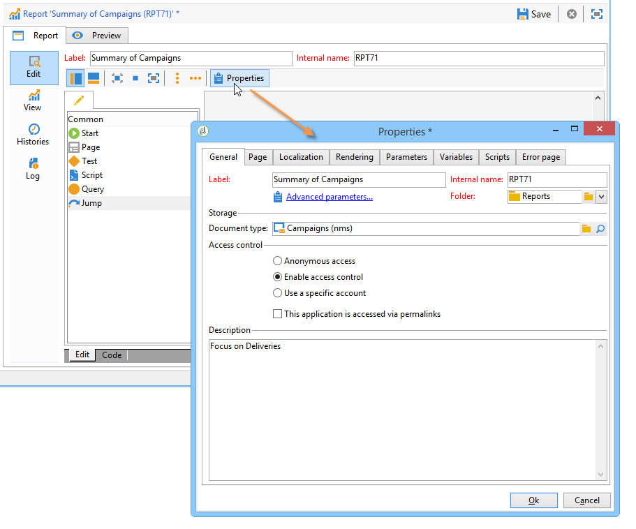

# Propiedades del informe{#properties-of-the-report}

Puede personalizar y configurar el informe según sus necesidades. Para ello, edite sus propiedades. Se accede a las propiedades del informe a través del botón **[!UICONTROL Properties]** situado sobre el gráfico de secuencia de actividades.

A continuación se describen las propiedades generales. Las funciones avanzadas configuradas en las pestañas **[!UICONTROL Parameters]**, **[!UICONTROL Variables]** y **[!UICONTROL Scripts]** se describen [en esta sección](../../reporting/using/advanced-functionalities.md).

## Propiedades generales {#overall-properties}

En la pestaña **[!UICONTROL General]** de las propiedades del informe, puede editar la configuración que se muestra a continuación:

* La Eetiqueta y el nombre interno del informe. Se utiliza el **[!UICONTROL Internal name]** en la dirección URL final del informe. No debe cambiarse después de la creación del informe.

* Se selecciona la **Carpeta** del informe durante la creación del informe. Una práctica recomendada es crear una carpeta dedicada para los informes personalizados, de modo que no se mezclen con los [informes integrados](../../reporting/using/about-campaign-built-in-reports.md).

* Se selecciona **Almacenamiento** al crear el informe. Para cambiar la tabla de datos del informe, haga clic en el icono **[!UICONTROL Select link]** a la derecha del campo **[!UICONTROL Document type]**.

   

* Los ajustes de los parámetros de **Control de acceso** se describen a continuación.

## Control del acceso al informe {#report-accessibility}

Se puede acceder a un informe desde la consola de Adobe Campaign o desde un explorador Web. En este caso, puede ser necesario configurar el control de acceso del informe como se muestra a continuación.

Las opciones posibles son:

* **[!UICONTROL Anonymous access]**: esta opción habilita el acceso al informe sin restricciones. Sin embargo, no es posible realizar ninguna manipulación.

   Los permisos del operador técnico &quot;webapp&quot; se utilizan para mostrar los elementos del informe. Obtenga más información [en esta sección](../../platform/using/access-management-operators.md).

* **[!UICONTROL Access control]**: esta opción permite a los operadores de Adobe Campaign acceder una vez que han iniciado sesión.
* **[!UICONTROL Specific account]**: esta opción permite ejecutar el informe con los derechos del operador seleccionado en el campo **[!UICONTROL Operator]**.

## Administración de la localización de informes {#managing-report-localization}

Puede configurar los idiomas a los que desea traducir el informe. Para ello, haga clic en la pestaña **[!UICONTROL Localization]**.

El idioma de edición es el idioma en el que se escribe. Cuando se añade un idioma, la subpestaña aparece en la página de edición del informe.

>[!NOTE]
>
>Para obtener más información sobre la localización de páginas web en Campaign, consulte [esta sección](../../web/using/translating-a-web-form.md).

## Personalización de la renderización HTML {#personalizing-html-rendering}

En la pestaña **[!UICONTROL Rendering]**, se puede personalizar el modo de visualización de datos de la página. Puede seleccionar:

* Motor de procesamiento de gráficos: de forma predeterminada, el motor de procesamiento es HTML 5.
* El tipo de navegación en el informe es mediante botones o vínculos.
* La posición predeterminada de las etiquetas para los elementos del informe. Esta posición se puede sobrecargar para cada elemento.
* La plantilla o tema utilizado para generar páginas del informe.

## Personalización de la página de error {#personalizing-the-error-page}

La pestaña **[!UICONTROL Error page]** permite configurar el mensaje que aparece en caso de error en la visualización del informe.

Puede definir textos y vincularlos a identificadores específicos para administrar la localización del informe. Para obtener más información, consulte [Adición de un encabezado y un pie de página](../../reporting/using/element-layout.md#adding-a-header-and-a-footer).

