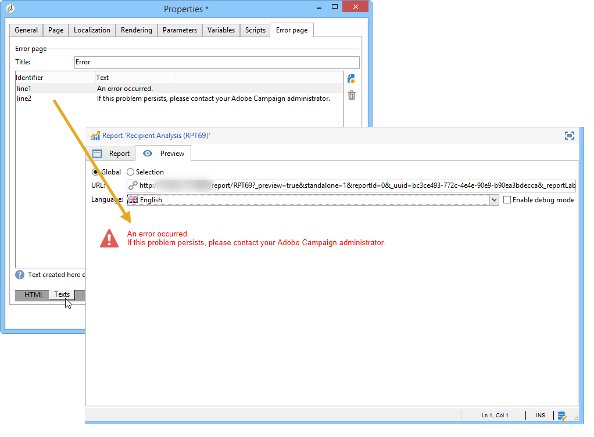

# Propiedades del informe{#properties-of-the-report}

Puede personalizar y configurar el informe según sus necesidades. Para ello, edite sus propiedades. Report properties are accessed via the **[!UICONTROL Properties]** button above the activity sequence chart.

A continuación se describen las propiedades generales. Las funciones avanzadas configuradas en las fichas **[!UICONTROL Parameters]**, **[!UICONTROL Variables]** y **[!UICONTROL Scripts]** se describen [en esta sección](../../reporting/using/advanced-functionalities.md).

## Propiedades generales {#overall-properties}

En la **[!UICONTROL General]** ficha de las propiedades del informe, puede editar la configuración que se muestra a continuación:

* La etiqueta y el nombre interno del informe. El **[!UICONTROL Internal name]** se utiliza en la dirección URL final del informe. No debe cambiarse después de la creación del informe.

* La **carpeta** del informe se selecciona durante la creación del informe. Una práctica recomendada es crear una carpeta dedicada para los informes personalizados de modo que no se mezclen con los informes integrados.

* El **Almacenamiento** se selecciona al crear el informe. To change the data table of the report, click the **[!UICONTROL Select link]** icon to the right of the **[!UICONTROL Document type]** field.

   

* Parámetros de **Control de acceso** . Estos ajustes se describen a continuación.

## Controlling access to the report {#report-accessibility}

Se puede acceder a un informe desde la consola de Adobe Campaign o desde un explorador Web. En este caso, puede ser necesario configurar el control de acceso del informe como se muestra a continuación.

Las opciones posibles son:

* **[!UICONTROL Anonymous access]**:: esta opción habilita el acceso sin restricciones al informe. Sin embargo, no es posible realizar ninguna manipulación.

   Los derechos del operador técnico &#39;webapp&#39; se utilizan para mostrar los elementos del informe. Obtenga más información [en esta sección](../../platform/using/access-management.md#default-operators).

* **[!UICONTROL Access control]**:: esta opción permite a los operadores de Adobe Campaign acceder a ella una vez que inician sesión.
* **[!UICONTROL Specific account]**:: esta opción permite ejecutar el informe con los derechos del operador seleccionado en el **[!UICONTROL Operator]** campo.

## Administración de la localización de informes {#managing-report-localization}

Puede configurar los idiomas a los que desea traducir el informe. Para ello, haga clic en la pestaña **[!UICONTROL Localization]**.

El idioma de edición es el idioma en el que se escribe. Cuando se añade un idioma, la subpestaña aparece en la página de edición del informe.

>[!NOTE]
>
>Para obtener más información sobre la localización de páginas web en Campaña, consulte [esta sección](../../web/using/translating-a-web-form.md).

## Personalización de la renderización HTML {#personalizing-html-rendering}

En la pestaña **[!UICONTROL Rendering]**, se puede personalizar el modo de visualización de datos de la página. Puede seleccionar:

* Motor de renderización de gráficos: Adobe Campaign ofrece dos modos diferentes para generar la renderización de gráficos. De forma predeterminada, el motor de renderización es HTML 5. Si es necesario, puede seleccionar la renderización Flash.
* El tipo de navegación en el informe es mediante botones o vínculos.
* La posición predeterminada de las etiquetas para los elementos del informe. Esta posición se puede sobrecargar para cada elemento.
* La plantilla o tema utilizado para generar páginas del informe.

## Personalización de la página de error {#personalizing-the-error-page}

La pestaña **[!UICONTROL Error page]** permite configurar el mensaje que aparece en caso de error en la visualización del informe.

Puede definir textos y vincularlos a identificadores específicos para administrar la localización del informe. Para obtener más información, consulte [Adición de un encabezado y un pie de página](../../reporting/using/element-layout.md#adding-a-header-and-a-footer).

