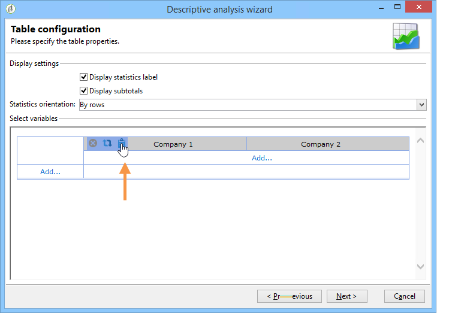
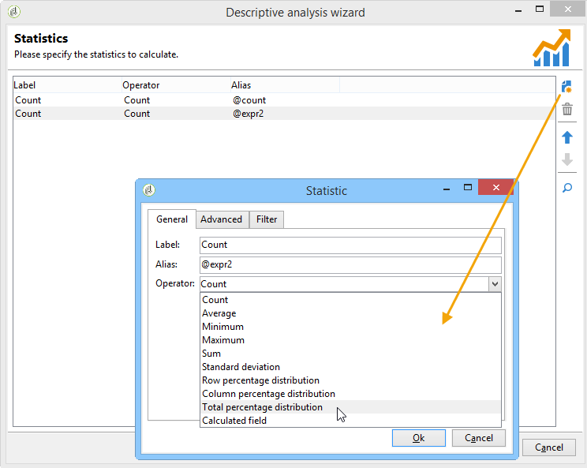
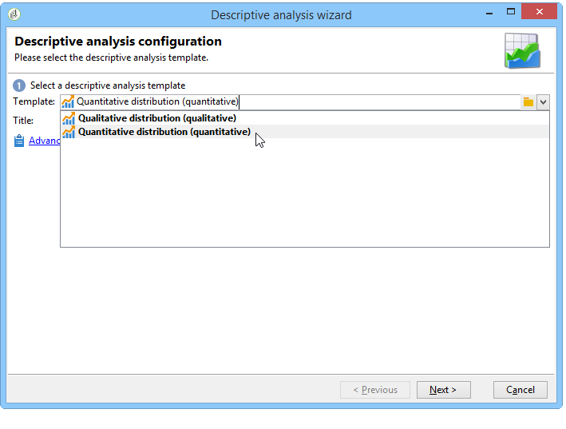
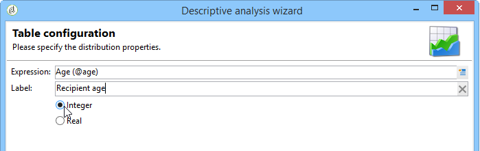

# Ejemplos de uso{#use-cases}

## Análisis de una población {#analyzing-a-population}

El siguiente ejemplo permite explorar la población establecida por un conjunto de boletines mediante el asistente de análisis descriptivo.

Los pasos de implementación se describen a continuación, y puede encontrar una lista exhaustiva de opciones con descripciones en las demás secciones de este capítulo.

### Identificación de la población que se va a analizar {#identifying-the-population-to-analyze}

En este ejemplo, deseamos explorar la población objetivo de los envíos incluidos en la carpeta **Boletines**.

Para ello, seleccione los envíos correspondientes, haga clic con el botón derecho y seleccione **[!UICONTROL Action > Explore the target...]**


### Selección de un tipo de análisis {#selecting-a-type-of-analysis}

En el primer paso del asistente, puede seleccionar la plantilla de análisis descriptivo que desee utilizar. De forma predeterminada, Adobe Campaign ofrece dos plantillas: **[!UICONTROL Qualitative distribution]** y **[!UICONTROL Quantitative distribution]**. Para obtener más información, consulte la sección [Configuración de la plantilla de distribución cualitativa](../../reporting/using/using-the-descriptive-analysis-wizard.md#configuring-the-qualitative-distribution-template). Las distintas renderizaciones se presentan en la sección [Acerca del análisis descriptivo](../../reporting/using/about-descriptive-analysis.md).

Para este ejemplo, seleccione la plantilla **[!UICONTROL Qualitative distribution]** y elija una visualización con un gráfico y una tabla (conjunto). Asigne un nombre al informe (“Análisis descriptivo”) y haga clic en **[!UICONTROL Next]**.


### Selección de las variables que desea muestran {#selecting-the-variables-to-display}

El siguiente paso permite seleccionar los datos que se van a mostrar en la tabla.

Haga clic en el vínculo **[!UICONTROL Add...]** para seleccionar la variable que contiene los datos que se van a mostrar. Aquí deseamos mostrar las ciudades de los destinatarios de nuestra entrega en una línea:


Las columnas muestran el número de compras por empresa. En este ejemplo, las cantidades se acumulan en el campo **compras web**.

En este caso, queremos definir el agrupamiento de resultados para aclarar su visualización. Para ello, seleccione la opción de agrupamiento **[!UICONTROL Manual]** y defina las clases de cálculo de los segmentos que se van a mostrar:


A continuación, haga clic en **[!UICONTROL Ok]** para aprobar la configuración.

Una vez definidas las líneas y las columnas, puede cambiarlas, moverlas o eliminarlas con la barra de herramientas.



### Definición del formato de visualización {#defining-the-display-format}

El siguiente paso del asistente le permite seleccionar el tipo de gráfico que desea generar.

En este caso, seleccione el histograma.


Las posibles configuraciones de los diferentes gráficos se detallan en la sección [Opciones del gráfico de informes de análisis](../../reporting/using/processing-a-report.md#analysis-report-chart-options).

### Configuración de la estadística para calcular {#configuring-the-statistic-to-calculate}

A continuación, especifique los cálculos que se van a aplicar a los datos recopilados. De forma predeterminada, el asistente de análisis descriptivo realiza un recuento sencillo de los valores.

Esta ventana permite definir la lista de estadísticas que se van a calcular.


Para crear una estadística nueva, haga clic en el botón **[!UICONTROL Add]**. Para obtener más información, consulte [Cálculo de estadísticas](../../reporting/using/using-the-descriptive-analysis-wizard.md#statistics-calculation).

### Visualización y uso del informe {#viewing-and-using-the-report}

El último paso del asistente muestra la tabla y el gráfico.

Puede almacenar, exportar e imprimir datos utilizando la barra de herramientas sobre la tabla. Para obtener más información, consulte [Procesamiento de un informe](../../reporting/using/processing-a-report.md).


## Análisis de datos cualitativo {#qualitative-data-analysis}

### Ejemplo de visualización de un gráfico {#example-of-a-chart-display}

**Objetivo**: genera un informe de análisis sobre la ubicación de los clientes o los posibles clientes.

1. Abra el asistente de análisis descriptivo y seleccione únicamente **[!UICONTROL Chart]**.

   

   Haga clic en **[!UICONTROL Next]** para aprobar este paso.

1. Luego, seleccione la opción **[!UICONTROL 2 variables]** y especifique que **[!UICONTROL First variable (abscissa)]** hace referencia al estado del destinatario (clientes o posibles clientes) y la segunda variable hace referencia al país.
1. Seleccione **[!UICONTROL Cylinders]** como tipo.

   

1. Haga clic en **[!UICONTROL Next]** y deje la estadística predeterminada **[!UICONTROL Simple count]**.
1. Haga clic en **[!UICONTROL Next]** para mostrar el informe.

   

   Pase el puntero por encima de una barra para ver el número exacto de clientes o posibles clientes de ese país.

1. Active o desactive la visualización de uno de los países según el pie de ilustración.

   

### Ejemplo de visualización de una tabla {#example-of-a-table-display}

**Objetivo**: analice los dominios de correo electrónico de la empresa.

1. Abra el asistente de análisis descriptivo y seleccione solo el modo de visualización **[!UICONTROL Array]**.

   

   Haga clic en el botón **[!UICONTROL Next]** para aprobar este paso.

1. Seleccione la variable **[!UICONTROL Company]** como una columna y la variable **[!UICONTROL Email domain]** como una fila.
1. Mantenga la opción **[!UICONTROL By rows]** como orientación de las estadísticas: el cálculo de las estadísticas se muestra a la derecha de la variable **[!UICONTROL Email domain]**.

   

   Haga clic en **[!UICONTROL Next]** para aprobar este paso.

1. A continuación, introduzca las estadísticas que desea calcular: mantenga el recuento predeterminado y cree una nueva estadística. Para ello, haga clic en **[!UICONTROL Add]** y seleccione **[!UICONTROL Total percentage distribution]** como operador.

   

1. Introduzca una etiqueta para la estadística de modo que no quede un campo en blanco cuando se muestre el informe.

   

1. Haga clic en **[!UICONTROL Next]** para mostrar el informe.

   

1. Una vez generado el informe de análisis, puede ajustar la visualización para adaptarla a sus necesidades sin cambiar la configuración. Por ejemplo, puede cambiar los ejes: haga clic con el botón derecho del ratón en los nombres de dominio y seleccione **[!UICONTROL Turn]** en el menú de acceso directo.

   

   La tabla muestra la información de la siguiente manera:

   

## Análisis de datos cuantitativo {#quantitative-data-analysis}

**Objetivos**: para generar un informe de análisis cuantitativo sobre la edad de los destinatarios.

1. Abra el asistente de análisis descriptivo y seleccione **[!UICONTROL Quantitative distribution]** en la lista desplegable.

   

   Haga clic en el botón **[!UICONTROL Next]** para aprobar este paso.

1. Seleccione la variable **[!UICONTROL Age]** e introduzca su etiqueta. Especifique si es o no un número entero y haga clic en **[!UICONTROL Next]**.

   

1. Elimine las estadísticas **[!UICONTROL Deciles]**, **[!UICONTROL Distribution]** y **[!UICONTROL Sum]**, no son necesarias aquí.

   

1. Haga clic en **[!UICONTROL Next]** para mostrar el informe.

   

## Análisis de un objetivo de transición en un flujo de trabajo {#analyzing-a-transition-target-in-a-workflow}

**Objetivo**: generar informes sobre la población de un flujo de trabajo de objetivos.

1. Abra el flujo de trabajo de objetivos deseado.
1. Haga clic con el botón derecho en una transición que señale a la tabla de destinatarios.
1. En el menú desplegable, seleccione **[!UICONTROL Analyze target]** para abrir la ventana de análisis descriptivo.

   

1. En este momento puede seleccionar la opción **[!UICONTROL Existing analyses and reports]** y utilizar los informes creados previamente (consulte [Reutilización de informes y análisis existentes](../../reporting/using/processing-a-report.md#re-using-existing-reports-and-analyses)) o crear un nuevo análisis descriptivo. Para ello, deje seleccionada la opción **[!UICONTROL New descriptive analysis from a template]** de forma predeterminada.

   El resto de la configuración es igual que para todos los análisis descriptivos.

### Recomendaciones para el análisis de objetivos {#target-analyze-recommendations}

El análisis de una población en un flujo de trabajo requiere que la población siga presente en la transición. Si se inicia el flujo de trabajo, es posible que el resultado relativo a la población se depure de la transición. Para ejecutar un análisis, puede hacer lo siguiente:

* Desvincular la transición de su actividad de destino e iniciar el flujo de trabajo para activarla. Una vez que la transición comience a parpadear, inicie el asistente de la forma habitual.

   

* Modifique las propiedades del flujo de trabajo seleccionando la opción **[!UICONTROL Keep the result of interim populations between two executions]**. Esto permite iniciar un análisis de la transición que elija, incluso si el flujo de trabajo ha finalizado.

   

   Si la población se ha purgado de la transición, un mensaje de error le pide que seleccione la opción correspondiente antes de iniciar el asistente de análisis descriptivo.

   

>[!CAUTION]
>
>La opción **[!UICONTROL Keep the result of interim populations between two executions]** solo debe utilizarse en fases de desarrollo, nunca para un entorno en producción.\
>Las poblaciones provisionales se purgan automáticamente una vez que alcanzan su fecha límite de retención. Esta fecha límite se especifica en la pestaña de propiedades **[!UICONTROL Execution]** del flujo de trabajo.

## Análisis de los “logs” de seguimiento de los destinatarios {#analyzing-recipient-tracking-logs}

El asistente de análisis descriptivo puede generar informes sobre otras tablas de trabajo. Esto significa que puede analizar los “logs” de entrega mediante la creación de un informe dedicado.

En este ejemplo, deseamos analizar la tasa de reacción de los destinatarios del boletín.

Para ello, siga los siguientes pasos:

1. Abra el asistente de análisis descriptivo mediante el menú **[!UICONTROL Tools > Descriptive analysis]** y cambie la tabla de trabajo predeterminada. Seleccione **[!UICONTROL Recipient tracking log]** y añada un filtro para excluir las pruebas e incluir los boletines.

   

   Seleccione la visualización de la tabla y haga clic en **[!UICONTROL Next]**.

1. En la siguiente ventana, especifique que los análisis corresponden a los envíos.

   

   En este caso, las etiquetas de entrega se muestran en la primera columna.

1. Elimine el recuento predeterminado y cree tres estadísticas para configurar las estadísticas que desea mostrar en la tabla.

   Aquí, para cada boletín, la tabla muestra el número de aperturas, el número de clics, la tasa de reacción (como porcentaje).

1. Añada una estadística para contar el número de clics: defina el filtro correspondiente en la pestaña **[!UICONTROL Filter]**.

   

1. Luego, haga clic en la pestaña **[!UICONTROL General]** para cambiar el nombre de la etiqueta y el alias de las estadísticas:

   

1. Añada una segunda estadística para contar el número de aperturas:

   

1. Luego, haga clic en la pestaña **[!UICONTROL General]** para cambiar el nombre de la etiqueta de la estadística y su alias:

   

1. Añada la tercera estadística y seleccione el operador **[!UICONTROL Calculated field]** para medir la tasa de reacción.

   

   Vaya al campo **[!UICONTROL User function]** e introduzca la fórmula siguiente:

   ```
   @clic / @open * 100
   ```

   Adaptar la etiqueta estadística como se muestra a continuación:

   

   Por último, especifique si los valores se muestran como un porcentaje: para hacerlo, en la pestaña **[!UICONTROL Default formatting]**, desmarque la opción **[!UICONTROL Advanced]** y seleccione **[!UICONTROL Percentage]** sin punto decimal.

   

1. Haga clic en **[!UICONTROL Next]** para mostrar el informe.

   

## Análisis de los “logs” de exclusión de entrega {#analyzing-delivery-exclusion-logs}

Si el análisis corresponde a una entrega, puede analizar la población excluida. Para ello, seleccione los envíos que desea analizar y haga clic con el botón derecho del ratón para acceder al menú **[!UICONTROL Action > Explore exclusions]**.


Esto abre al asistente de análisis descriptivo, y el análisis corresponde a los “logs” de exclusión de destinatarios.

Por ejemplo, puede mostrar los dominios de todas las direcciones excluidas y ordenarlos por fecha de exclusión.


Esto genera el siguiente tipo de informe:


